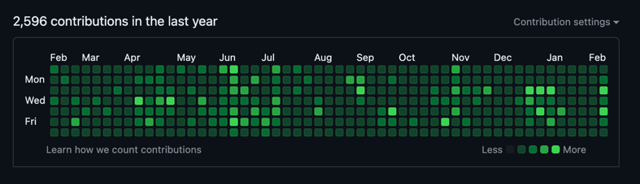
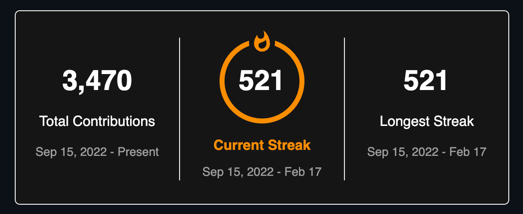
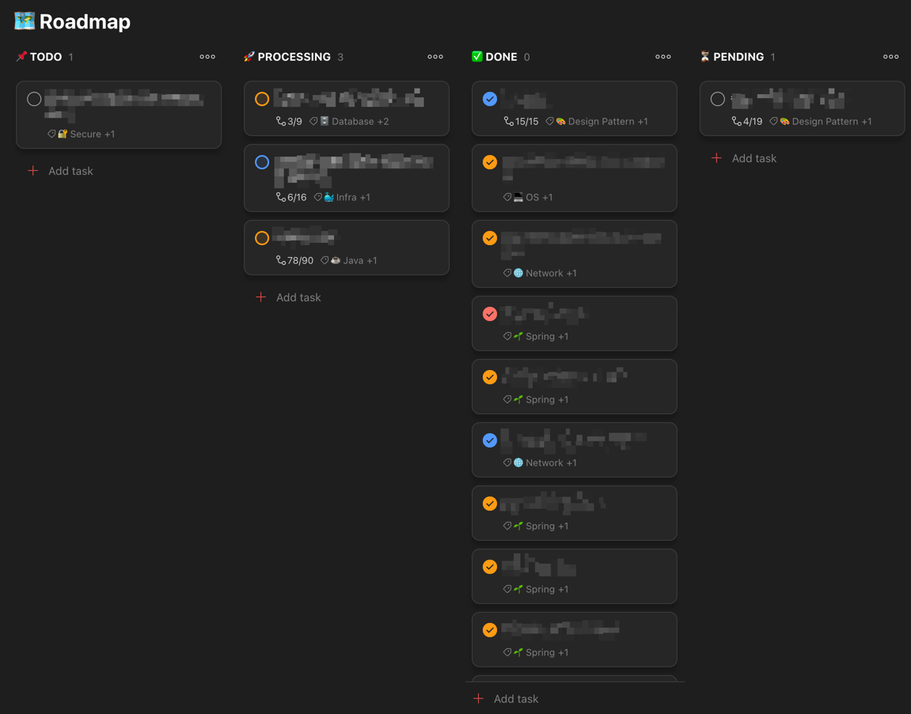

1일 1커밋을 시작한 지 1년 반이 지났고, [solved.ac 알고리즘 풀이](https://solved.ac) 스트릭도 15개월 정도 되었다.(24/02/17 기준)  
사실 이제는 어떠한 장/단점을 떠나 단순 재미로 유지하고 있긴 하지만, 처음 시작했던 계기와 장/단점 그리고 후기를 적어보려고 한다.

## 시작 동기

일과 병행하면서 열심히 하는 일부 동료 개발자들을 보며 공부해야겠다는 필요성을 느꼈고,
아예 안 한 것은 아니지만 이전에는 꾸준히 하지 못했던 공부를 체계적으로 이어가야겠다고 결심하게 되었다.

이전에 42 Seoul에서 경험했던 게이미피케이션(Gamification)이 효과적이었던 것 같아서,
눈에 보이는 결과를 얻을 수 있는 방법은 없을까? 라는 생각을 하고 1일 1커밋을 시작하게 되었다.

그래도 한 번 하기 시작하면, 지속해서 유지하는 성향이 있기 때문에 지금까지도 꾸준히 할 수 있지 않았나 싶다.

## 커밋 내용

사람들과 이야기 하다보면 간혹 "1일 1커밋을 어떤 걸로 채우나?" 라는 질문을 받을 때가 있다.
사실 모든 사람이 다 비슷비슷할 것이라고는 생각하지만, 주로 아래의 것들로 커밋을 채워나갔다.

- [알고리즘 문제 풀이](https://github.com/hyoguoo/algorithm-problem-solving)
- [공부한 내용 Document 형식으로 정리](https://github.com/hyoguoo/docs)
- [강의 내용 클론](https://github.com/hyoguoo/study-projects-archive)
- 프로젝트 진행

사실상 공부를 포함한 개발 관련된 모든 것이 커밋의 대상이었기 때문에, 커밋을 채우는 것은 어렵지 않았다.
매일 프로젝트를 진행하기는 쉽지 않기 때문에, 알고리즘 문제 풀이와 공부한 내용을 정리하는 부분이 상당 수 차지했던 것 같다.

## 장단점

### 장점

1. 꾸준한 인상
2. 습관화

사실 1번은 사람마다 다르고, 심지어 부정적으로 바라보는 시각도 있기 때문에 장점이라 보기 어려울 수도 있다고 생각한다.(사실 아예 관심 없는 사람이 더 많다.)

개인적으론 2번이 가장 큰 장점이라고 생각하는데, 많은 사람들이 말하는 작은 것이 누적되어 결국에는 큰 성과로 이어지는 점도 있겠지만,
어떤 일이든 멈추게 되면 다시 시작하기 어려운 경우가 많은데, 이를 방지하는 스스로의 약속 혹은 시스템을 만들어 준다는 점에서 장점이라고 생각한다.

그 외에 다른 개발자들과 아이스 브레이킹 할 때 관련해서 한두 마디 더 나눌 수 있다는 것도 장점이라면 장점인 것 같다.

### 단점

1. 의미 없는 커밋(편법)으로 유지
2. 일부 부정적인 시각

1일 1커밋에 대해 부정적인 의견으로 1번의 단점을 말하는 경우가 많다.
실제로 지금까지 진행하면서 쉬운 알고리즘 풀이를 통해 커밋하는 경우도 있었는데,
그러한 시도조차 결국엔 지금까지 멈추지 않고 꾸준히 학습을 유지할 수 있게 해준 원동력이라고 생각한다.

결국엔 채용 담당자가 2번처럼 부정적으로 보는 것이 아니라면 실질적인 단점은 없는 것이 아닐까 싶다.
제일 중요한건 스스로 보여주기 식이 아닌, 스스로의 성장을 위한 시스템으로 인식하고 행동하면 프로필에서 그 행동들이 다 드러나기 때문에 이러한 단점도 없을 것이라고 생각한다.

## 후기 및 결론

당연히 커밋 스트릭이 그 사람의 성실도나 개발 실력의 지표를 보여주지는 않는다.
하지만 1일 1커밋은 스스로에게 지속할 수 있는 시스템을 만들어 주고, 그 결과를 시각적으로 만들어주어 원동력을 주는 것이라고 생각한다.

무엇이든 결과나 진행 상황을 시각적으로 보여주는 것은 그 결과를 더욱 더 향상시키는데 도움을 줄 것이라 생각하고, 나는 아마 계속해서 1일 1커밋을 유지할 것 같다.

