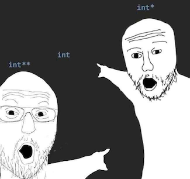
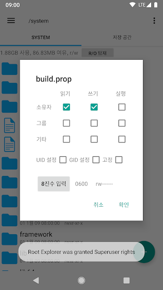
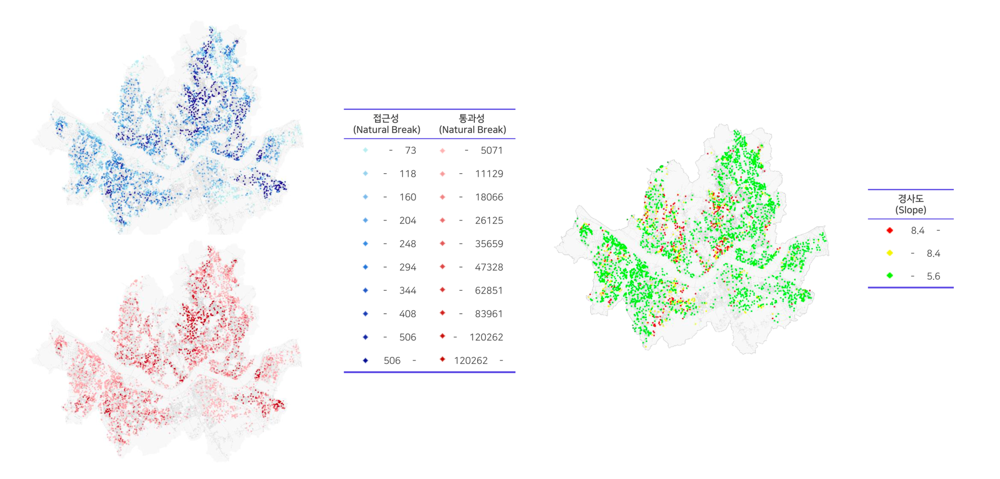
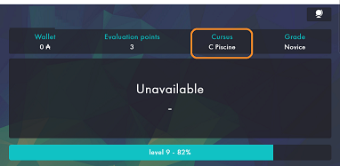
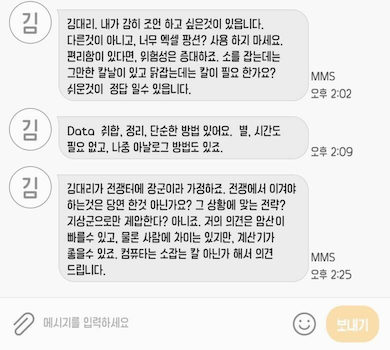

신입 ~ 주니어 레벨의 자기소개서 질문 항목 혹은 인터뷰를 진행하다 보면 아래와 같은 질문을 받게 된다.

- 개발자가 되기로 한 계기는 무엇인가?
- (기존 전공을 포기하고) 왜 IT로 진로를 변경하게 되었는가?
- 개발자 중 웹 백엔드 개발자가 되기로 한 이유는 무엇인가?
- 어떤 개발자가 되고 싶은가?
- ...

이러한 질문의 의도는 지원자가 단순 취업을 위해 개발자가 되기로 한 것인지, 열정과 흥미를 느끼고 개발자가 되기로 한 것인지를 알아보기 위함이 아닐까 생각된다.
특히 코로나 시대 이후 관련 전공자뿐만 아니라 비전공자들도 개발자로 전향하려는 시도가 많아지고 공급이 늘어나면서, 이 질문의 가치는 더 높아지지 않을까 한다.

사실 개발자가 왜 되고 싶은지에 대해 스스로 정의해 본 적은 없는 것 같다.
때문에 이번 포스팅에선 특정 어떠한 계기로 개발자가 되겠다고 마음먹은 것을 서술하는 것이 아닌, 다양한 경험을 하게 되면서 개발자가 되고 싶어졌던 계기와 그 경험들을 서술해 보려고 한다.

## 고등학교 시절

처음 프로그래밍이라는 것을 접한 것은 고등학교 시절 C언어를 조금 접해 본 것인데, 그 당시에는 그 이상의 관심이 생기거나 어떠한 계기가 되진 않았던 것 같다.
그저 이중 포문으로 별을 찍어보기도 하고, 포인터라는 개념은 굉장히 난해해서 이해하기에 어려웠던 기억이 난다.

개발이나 프로그래밍과는 별개로 당시에 안드로이드 스마트폰을 튜닝하거나 커스텀 롬을 올리는 것에 관심이 많았는데,
당시 커스텀 롬은 stable 하지 않은 버전이 많아서 올리면 네트워크가 안 되거나 벽돌(고장)이 되어버리는 심각한 버그들도 많았지만, 계속 설정을 바꿔가면서 시도해 본 기억들이 있다.
그 과정 속에서 644(rw-r--r--)이나 755(rwxr-xr-x) 당시에는 알 수 없는 숫자들로 변경하곤 했는데, 이 경험은 기억에 남아 파일 접근 권한 설정을 할 때면 아직도 이때의 경험이 떠오르기도 한다.

## 군 복무

그렇게 대입 시기가 됐을 때 컴퓨터 공학과를 지원해 볼까? 라는 생각은 했지만, 결국 도시공학과를 지원하여 입학하게 되었고, 어영부영 1학년을 보내고 입대를 하여 행정병으로 복무하게 되었다.
보직 특성 상 엑셀이나 문서 작성을 많이 했는데, 반복적인 업무가 굉장히 많았고 같은 값으로 넣어야 할 값들을 다르게 입력하는 실수가 굉장히 많이 발생했었다.

이러한 반복적인 업무를 자동화하고 실수를 최소화하기 위해 엑셀 함수를 이용해 필요한 정보를 하나의 시트에만 입력받아 자동으로 서류들이 작성되도록 만들기도 하였고,
그 외에 남는 시간엔 취미로 엑셀 함수를 이용해 실근무일/휴가일 계산기를 만들기도 하고, 부대에서 유용하게 사용할 수 있는 엑셀 파일을 만들어 보기도 했다.
또한 업무 방법에 대한 방법을 문서화하여 업무를 배우기 쉽게 만들어 보기도 했다.

비록 프로그래밍 언어를 사용하여 애플리케이션을 만들어 본 것이 아닌 단순한 엑셀 파일이었지만,
유용한 프로그램으로 일을 더 효율적으로 하거나, 다른 사람들에게 도움이 되는 프로그램을 만들었을 때 굉장히 뿌듯하고 재미있었던 것 같다.

## 대학교

복학 후 들은 수업 중에 "GIS 도시공간분석" 중에 데이터를 분석하고 시각화하는 과정에서 R이나 SQL을 통해 데이터를 분석하고 시각화하는 경험을 할 수 있었다.
이때 처음으로, 프로그래밍이 개발자들만 사용하는 게 아니라 산업 전반적으로 유용하게 사용되는 것을 알게 되었고 프로그래밍에 대한 흥미가 생기게 되었다.

그때부터 컴퓨터공학과 수업이나 데이터 수업도 하나둘 듣기 시작했고, 빅데이터 관련 공모전에도 나가면서 프로그래밍을 할 줄 아는 도시공학도가 되자는 목표를 가지게 되었다.
하지만 시간이 흐르면서 점점 프로그래밍에 대한 흥미가 커지게 되면서 목표는 개발자가 되는 것으로 바뀌게 되었다.
결국 졸업을 위한 논문도 R을 통한 데이터 전처리를 위한 프로그래밍을 하게 되면서 학교를 졸업하게 되었다.

## 졸업 후

본격적으로 개발자가 되고자 마음먹은 후에는 교육 기관에서 공부하면 좋겠다고 생각하여, 42 Seoul을 시작하게 되었다.

그중 2차 과정인 La Piscine은 1개월간 C언어를 사용하여 과제와 테스트를 보는 과정인데, 동료 평가와 레벨 시스템을 통한 학습 방법이 굉장히 흥미로웠다.
당시 밤을 새우면서까지 과정에 참여했었는데, 그 과정 자체가 좋았고 가장 재밌게 공부했던 시기 중 하나였던 것 같다.

그 후 2차 과정을 마무리하여 합격하여 본 과정에 합격하게 되었고, 취업하기 위해 웹 백엔드 공부를 시작하게 되었다.
계속해서 필요한 지식을 공부하면서 웹 백엔드 개발자로 취업하여 한 명의 개발자로서 일을 할 수 있게 되었다.

## 현재

현재까지의 경험을 돌아보면, 개발자가 되고 싶은 이유는 업무를 하는 동안 흥미로운 문제를 다루고 싶어서이며,
그 과정에서 만든 결과물이 다른 사람들에게 도움이 될 수 있다는 점도 큰 동기였다.
짧은 경력이지만 실제로 개발자로서 일하면서 문제를 파악하고, 현실적인 해결책을 찾아가는 과정이 재미있었던 순간들이 있었고,
작은 기능 하나를 만들어 동료 개발자에게 실질적인 도움이 되었을 때는 성취감도 분명히 있었다.

## 내가 되고 싶은 개발자

이제는 왜 개발자가 되고 싶었는지 뿐만 아니라 어떤 개발자가 되고 싶은지에 대해서도 생각해보면 좋을 것 같다.
사실 되고 싶은 개발자라고 하면 굉장히 많은 것들이 떠오르고, 실제로 본받고 싶었던 개발자 분들은 아래와 같은 장점을 가지고 계셨던 것 같다.

- 커뮤니케이션 능력
- 정확하고 빠른 구현 능력
- 탄탄한 기본기
- 기술을 빠르게 학습하고 적용하는 능력
- ...

위 요소들은 개발 및 업무를 진행할 때 중요한 역할을 하고 있으며, 저 요소들을 갖추기 위해 나를 포함한 많은 사람들이 노력하고 있다.
하지만 문제를 잘 해결하기 위해서 선행되야 하는 것은 문제를 정확히 이해하고 정의하고 최적의 해결책을 제시하는 것이 아닐까 생각된다.

실제로 문제를 정확히 정의하지 않은 상태에서 개발을 진행하여 불필요한 기능을 추가한 적도 있었고,
수단이 목적이 되어버리거나, 더 중요하지 않은 것에 초점이 맞춰져 우선시 해야 할 목적을 잊고 개발이 진행됐던 경우도 있었던 것 같다.

만약 문제를 정확히 파악하고 정의했다면 위와 같은 상황은 최소화 될 수 있었을 것이라고 생각한다.

### 문제를 해결하는 개발자

프로그래머나 코더가 아닌 문제를 해결하는 개발자가 되어야 한다는 말은 이제 꽤나 유명해진 말이다.
문제를 해결하기 위해선 스킬의 레벨도 중요하지만, 문제를 정확히 정의하고 해결책을 제시하는 것이 더 중요하다고 생각한다.
당연히 특정 분야의 스페셜리스트가 되어 깊이 있는 지식을 가진 개발자도 되는 것도 중요하지만, 문제를 정확히 인지하고 비즈니스 로직을 효율적으로 풀어내기 위한 적절한 구현 방식을 항상 고민하는 개발자가 되고 싶다.

### 더 나아가 사용자에게 가치를 제공하는 개발자

사실 개발자로서 문제를 해결하는 것도 중요하지만, 그것은 수단일 뿐이고, 그 해결책이 사용자에게 어떤 가치를 제공하는 것이 최종 목표라고 생각한다.
개발자로서 내가 만든 기능과 시스템이 사용자에게 직접적인 이익과 편리함을 주어, 단순히 기술적인 성취를 넘어, 많은 사용자에게 실질적인 가치를 전달하는 개발자가 되고 싶다.

많은 사람들에게 가치를 전달하는 시스템을 구축하는 것이 나의 궁극적인 목표인데, 이 가치는 단순히 제품의 고객에게만 전달되는 것이 아니라,
함께 일하는 동료들과 다른 개발자들, 나아가 나 자신에게도 긍정적인 영향을 미치는 시스템으로 만들어 나가고 싶다.
