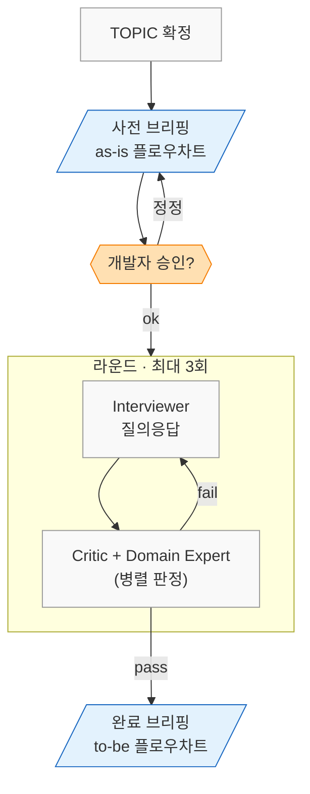
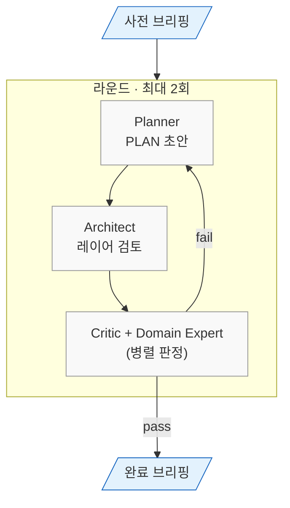
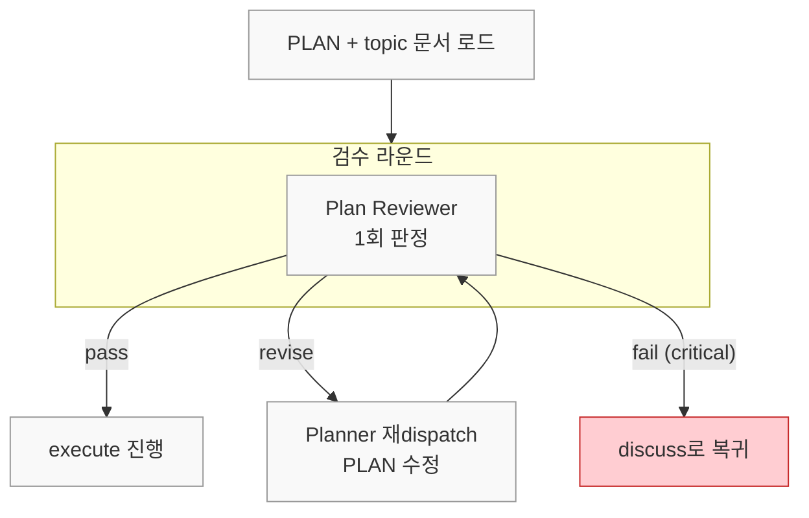
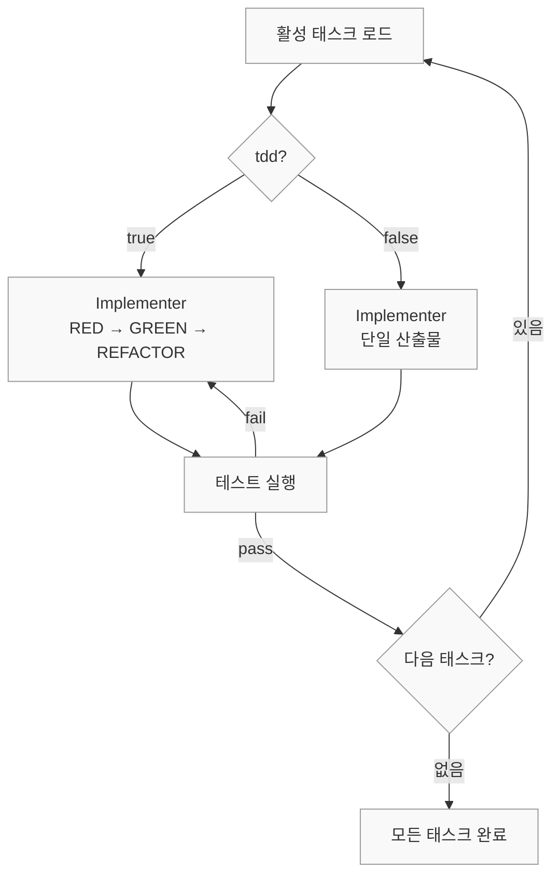
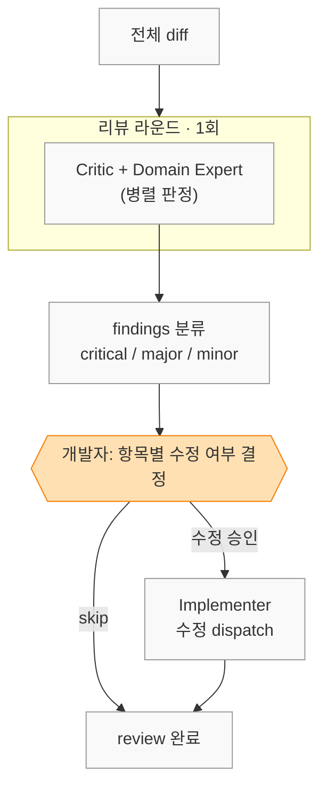
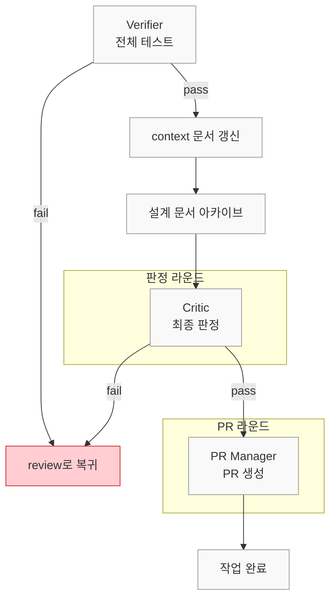

### 문제 — AI 자기 검증의 한계

AI가 코드를 작성하는 환경에서 개발의 성패는 생성된 코드를 얼마나 정밀하게 검증하고 통제하느냐에 달려 있다.

- AI는 신속하게 작업을 수행하지만 주변 시스템과의 정합성을 깨뜨릴 위험이 있으며, 문제 발생 지점 추적의 어려움 존재
- 같은 세션이 코드를 작성하고 스스로 리뷰하면, 자신의 결정을 정당화하는 방향으로 판정이 흐르기 때문에 자기 검증의 신뢰도가 보장되지 않음

### 하네스 엔지니어링

이러한 문제를 해결하기 위한 접근으로 하네스 엔지니어링이라는 분야가 부상하고 있다.

- "Agent = Model + Harness"라는 정의 아래, 모델 외의 모든 통제 체계를 설계하는 분야
- 가이드(사전 제어)·센서(사후 검증)·인간 개입 체크포인트 등으로 구성

### 이 글의 접근

이 글에서 소개하는 워크플로우는 하네스 엔지니어링의 완전한 구현이 아니라, 그 문제의식에서 출발한 프롬프트 기반의 실험적 시도다.

- 린터나 정적 분석 같은 결정론적 센서 없이, 서브에이전트 간 교차 검증에 의존하는 구조
- AI 코드 생성의 구조적 한계를 직접 부딪히며 이해하고 싶었음
- 각 단계의 세밀한 흐름을 직접 핸들링하며 프로젝트 특성에 맞는 통제 수준을 찾고 싶었음
- 전문성 분리와 교차 검증만으로 자기 검증의 한계를 어디까지 보완할 수 있는지 실험해 보고 싶었음

### 단일 페르소나에서 서브에이전트로

초기에는 하나의 AI 세션이 설계부터 구현, 검증까지 모두 담당하는 단일 페르소나 방식으로 운영했다.

- 단계별로 요구되는 전문성이 충분히 발휘되지 못함
- 작성자와 검증자가 동일하여, 자기 검증이 형식적으로 흐름

이를 해결하기 위해 각 단계에 전문 페르소나를 가진 서브에이전트를 배치하고, 각 단계별로 확인이 용이하도록 구성했다.

---

## 워크플로우 6단계 구조

요구사항 분석부터 PR 생성까지 전체 작업을 6단계로 분리한다.

```mermaid
flowchart TB
    IDLE([idle])
    IDLE --> DISCUSS

    subgraph DISCUSS ["1. Discuss"]
        direction TB
        D_PRE[/"사전 브리핑\n(as-is 플로우차트)"/]
        D_USER1{{개발자 승인 / 정정}}
        D_PRE --> D_USER1
        D_USER1 -->|정정| D_PRE

        subgraph D_ROUND ["라운드 · 최대 3회"]
            D_INTERVIEW[Interviewer\n질의응답]
            D_JUDGE["Critic + Domain Expert\n(병렬 판정)"]
            D_INTERVIEW --> D_JUDGE
        end

        D_USER1 -->|ok| D_INTERVIEW
        D_JUDGE -->|fail| D_INTERVIEW
        D_POST[/"완료 브리핑\n(to-be 플로우차트)"/]
        D_JUDGE -->|pass| D_POST
    end

    D_STOP{{개발자 확인}}
    D_POST --> D_STOP
    D_STOP --> PLAN

    subgraph PLAN ["2. Plan"]
        direction TB
        P_PRE[/"사전 브리핑"/]

        subgraph P_ROUND ["라운드 · 최대 2회"]
            P_PLANNER[Planner\nPLAN 초안]
            P_ARCH[Architect\n레이어 검토]
            P_JUDGE["Critic + Domain Expert\n(병렬 판정)"]
            P_PLANNER --> P_ARCH --> P_JUDGE
        end

        P_PRE --> P_PLANNER
        P_JUDGE -->|fail| P_PLANNER
        P_POST[/"완료 브리핑"/]
        P_JUDGE -->|pass| P_POST
    end

    P_STOP{{개발자 확인}}
    P_POST --> P_STOP
    P_STOP --> PLAN_REVIEW

    subgraph PLAN_REVIEW ["3. Plan Review"]
        direction TB
        PR_LOAD[PLAN + topic 문서 로드]

        subgraph PR_ROUND ["검수 라운드"]
            PR_REVIEWER[Plan Reviewer\n1회 판정]
        end

        PR_LOAD --> PR_REVIEWER
        PR_FIX[Planner 재dispatch\nPLAN 수정]
        PR_REVIEWER -->|revise| PR_FIX --> PR_REVIEWER
        PR_PASS[pass]
        PR_REVIEWER -->|pass| PR_PASS
        PR_FAIL["fail → discuss로 복귀"]
        PR_REVIEWER -->|" fail (critical) "| PR_FAIL
    end

    PR_STOP{{개발자 확인}}
    PR_PASS --> PR_STOP
    PR_STOP --> EXECUTE

    subgraph EXECUTE ["4. Execute"]
        direction TB
        E_LOAD[활성 태스크 로드]

        subgraph E_ROUND ["태스크 루프 · 태스크당 1회"]
            E_TDD{tdd?}
            E_IMP_TDD["Implementer\nRED → GREEN → REFACTOR"]
            E_IMP_PLAIN[Implementer\n단일 산출물]
            E_TEST["테스트 실행"]
            E_TDD -->|true| E_IMP_TDD --> E_TEST
            E_TDD -->|false| E_IMP_PLAIN --> E_TEST
        end

        E_LOAD --> E_TDD
        E_TEST -->|fail| E_IMP_TDD
        E_NEXT{다음 태스크?}
        E_TEST -->|pass| E_NEXT
        E_NEXT -->|있음| E_LOAD
        E_DONE[모든 태스크 완료]
        E_NEXT -->|없음| E_DONE
    end

    E_STOP{{개발자 확인}}
    E_DONE --> E_STOP
    E_STOP --> REVIEW

    subgraph REVIEW ["5. Review"]
        direction TB
        R_DIFF["전체 diff"]

        subgraph R_ROUND ["리뷰 라운드 · 1회"]
            R_JUDGE["Critic + Domain Expert\n(병렬 판정)"]
        end

        R_DIFF --> R_JUDGE
        R_LIST[findings 분류\ncritical / major / minor]
        R_JUDGE --> R_LIST
        R_USER{{개발자: 항목별 수정 여부 결정}}
        R_LIST --> R_USER
        R_FIX[Implementer\n수정 dispatch]
        R_USER -->|수정 승인| R_FIX
        R_USER -->|skip| R_DONE[review 완료]
        R_FIX --> R_DONE
    end

    R_STOP{{개발자 확인}}
    R_DONE --> R_STOP
    R_STOP --> VERIFY

    subgraph VERIFY ["6. Verify"]
        direction TB
        V_VERIFIER["Verifier\n전체 테스트"]
        V_FAIL["fail → review로 복귀"]
        V_VERIFIER -->|fail| V_FAIL
        V_CTX["context 문서 갱신"]
        V_ARCHIVE["설계 문서 아카이브"]
        V_VERIFIER -->|pass| V_CTX --> V_ARCHIVE

        subgraph V_ROUND1 ["판정 라운드"]
            V_CRITIC["Critic\n최종 판정"]
        end

        V_ARCHIVE --> V_CRITIC
        V_CRITIC -->|fail| V_FAIL

        subgraph V_ROUND2 ["PR 라운드"]
            V_PR[PR Manager\nPR 생성]
        end

        V_CRITIC -->|pass| V_PR
        V_FINAL["작업 완료"]
        V_PR --> V_FINAL
    end

    classDef default fill: #f9f9f9, stroke: #999, color: #333
    style D_USER1 fill: #FFE0B2, stroke: #F57C00, color: #333
    style D_STOP fill: #FFE0B2, stroke: #F57C00, color: #333
    style P_STOP fill: #FFE0B2, stroke: #F57C00, color: #333
    style PR_STOP fill: #FFE0B2, stroke: #F57C00, color: #333
    style E_STOP fill: #FFE0B2, stroke: #F57C00, color: #333
    style R_USER fill: #FFE0B2, stroke: #F57C00, color: #333
    style R_STOP fill: #FFE0B2, stroke: #F57C00, color: #333
    style D_PRE fill: #E3F2FD, stroke: #1565C0, color: #333
    style D_POST fill: #E3F2FD, stroke: #1565C0, color: #333
    style P_PRE fill: #E3F2FD, stroke: #1565C0, color: #333
    style P_POST fill: #E3F2FD, stroke: #1565C0, color: #333
    style PR_FAIL fill: #FFCDD2, stroke: #C62828, color: #333
    style V_FAIL fill: #FFCDD2, stroke: #C62828, color: #333
```



|     단계      |           목적           |                   주요 페르소나                    |
|:-----------:|:----------------------:|:--------------------------------------------:|
|   Discuss   | 도메인 지식 동기화 및 설계 방향 합의  |     Interviewer · Critic · Domain Expert     |
|    Plan     |   설계를 실행 가능한 태스크로 분해   | Planner · Architect · Critic · Domain Expert |
| Plan Review |    구현 계획의 정합성 경량 검수    |                Plan Reviewer                 |
|   Execute   |     TDD 기반 점진적 구현      |                 Implementer                  |
|   Review    |     전체 diff 교차 리뷰      |     Critic · Domain Expert · Implementer     |
|   Verify    | 최종 테스트 · 문서 정리 · PR 생성 |        Verifier · Critic · PR Manager        |

---

## 핵심 설계 원칙

### 서브에이전트 격리

모든 판정과 구현은 전문 페르소나를 가진 서브에이전트가 수행한다.

- 메인 오케스트레이터는 상태 관리와 라우팅만 담당하고, 직접 코드를 작성하거나 체크리스트를 판정하지 않음
- 같은 세션이 코드를 작성하고 스스로 리뷰하면 자신의 결정을 정당화하는 방향으로 판정이 흐름
- 작성자와 검증자를 물리적으로 분리해야 교차 검증이 실질적으로 작동

### 병렬 판정

Critic과 Domain Expert는 같은 라운드에서 동시에 호출하여 독립적 판정을 유지한다.

- Critic: 코드 품질, 아키텍처 규칙, 테스트 커버리지 관점
- Domain Expert: 도메인 리스크, 상태 전이 정합성, 멱등성 관점

### 브리핑과 개발자 개입

서브에이전트 라운드 진입 전과 통과 후, 오케스트레이터가 개발자에게 브리핑을 제시한다.

- 사전 브리핑: 현재 이해한 문제, as-is 플로우차트, 이번 단계에서 결정할 것, 열린 질문
- 완료 브리핑: 결정된 접근, to-be 플로우차트, 핵심 결정 사항, 트레이드오프
- 메서드명이나 클래스명 대신 "결제 승인 확정", "재시도 한도 소진" 같은 도메인 용어와 Mermaid 플로우차트를 포함하여, 개발자가 비즈니스 흐름 수준에서 방향을 판단할 수 있도록 구성

### 단계 완료 후 정지

각 단계가 끝나면 반드시 멈추고 개발자의 명시적 확인을 기다린다.

- AI가 다음 단계로 자동 진행하는 것을 차단
- 이 정지 지점이 개발자가 전체 프로세스의 주도권을 유지하는 핵심 장치

---

## 단계별 상세

이하 각 단계의 적용 사례는 결제 승인 요청을 비동기로 처리하는 백엔드 서비스의 성능 개선 작업을 기준으로 한다.

### 1. Discuss — 설계 논의

구현 전에 도메인 문제를 정의하고 접근 방향을 합의하는 단계다.



Interviewer가 개발자와 직접 질의응답하며 설계 문서를 작성한다.

- 유일하게 메인 스레드에서 실행되는 페르소나로, 실시간 상호작용이 필요하기 때문
- 라운드 완료 후 Critic과 Domain Expert가 병렬로 설계의 완성도를 판정

```markdown
## 벤치마크 결과 (발췌)

| 케이스 | TPS | HTTP med | E2E med | Dropped |
|:---:|:---:|:---:|:---:|:---:|
| sync-low | 118.2 | 3,176ms | 251ms | 6,390 |
| outbox-parallel-c100-high | 22.4 | 1,636ms | 1,356ms | 11,152 |

### Root Cause — Spring Throttling 메커니즘

동시 실행 수가 극한에 도달하면 호출 스레드를 throttleLock.wait()으로 무기한 블로킹한다.
결국 k6 VU(가상 사용자)가 응답만 대기하다 Dropped 현상으로 이어진다.
```

### 2. Plan — 태스크 분해

discuss에서 합의된 설계를 구체적인 구현 태스크로 분해한다.

- 각 태스크에 tdd 플래그(테스트 선행 여부)와 domain_risk 플래그(도메인 리스크 존재 여부)를 부여



각 페르소나의 역할은 다음과 같다.

- Planner: 초안 작성
- Architect: 레이어 규칙과 모듈 경계 검토
- Critic + Domain Expert: 태스크의 완전성과 도메인 리스크 병렬 판정

2회 연속 fail 시에는 Unstuck 메커니즘(교착 상태에 빠진 라운드에 외부 관점을 주입하여 돌파하는 장치)이 작동한다.

```markdown
## 목표

LinkedBlockingQueue + Worker 가상 스레드로 즉시 처리 경로를 재구성하여,
HTTP 스레드 블로킹을 완전히 제거하고 Spring Boot 3.4.x로 업그레이드한다.

## 진행 상황

- [x] Task 1: Spring Boot 3.4.x 업그레이드
- [x] Task 2: PaymentConfirmChannel 구현
- [x] Task 3: OutboxProcessingService 추출
  ...

### Task 2: PaymentConfirmChannel 구현 [tdd=false]

- LinkedBlockingQueue<String> 래퍼 (orderId를 큐 요소로 사용)
- offer(String orderId): boolean — 논블로킹, 큐 가득 차면 false 즉시 반환
- take(): String — Worker가 호출, 큐 비면 가상 스레드(VT) unmount 대기
```

### 3. Plan Review — 문서 정합성 검수

plan과 execute 사이에서 PLAN 문서가 discuss의 결정 사항을 빠짐없이 반영하는지 확인을 수행한다.



Plan Reviewer가 구조 완전성, traceability, 의존 순서를 1회 판정하고 세 갈래로 분기한다.

- pass: execute 단계로 진행
- revise: Planner가 PLAN을 수정한 뒤 재판정
- fail (critical): discuss 단계로 복귀하여 설계부터 재논의

### 4. Execute — TDD 구현

PLAN의 태스크를 순서대로 구현하며, 태스크당 Implementer 서브에이전트를 1회 dispatch한다.



tdd 플래그에 따라 구현 방식이 달라진다.

- tdd=true: TDD(Test-Driven Development) 사이클을 따름. 실패하는 테스트 작성(RED) → 구현하여 통과(GREEN) → 코드 정리(REFACTOR)
- tdd=false: 설정 파일 변경 등 테스트 선행이 불필요한 작업

execute 단계에서 Critic이나 Domain Expert를 호출하지 않는 것은 의도적인 설계다.

- 태스크 단위로 매번 판정하면 오버헤드가 큼
- 전체 diff를 한 번에 보는 review 단계에서 일괄 판정하는 것이 더 효과적

```markdown
### Task 5: OutboxImmediateWorker 구현 [tdd=true]

- 테스트 (RED): 이벤트를채널에제출하면_OutboxProcessingService가호출된다
- 구현 (GREEN): worker.start() → channel.offer("order-1") 루프 동작 처리 완성

완료 결과: OutboxImmediateWorker 신규 생성 (SmartLifecycle).
start()에서 VT worker N개 기동, stop(Runnable)에서 interrupt + join(5s) 후 callback 호출.
```

### 5. Review — 코드 리뷰

execute의 전체 diff를 대상으로 Critic과 Domain Expert가 1라운드 교차 리뷰하고, 발견 항목은 개발자가 개별 판단한다.



findings는 severity별로 처리 방식이 다르다.

- critical: 항목마다 개별 확인, 수정 필수
- major: 일괄 확인 후 수정 여부 결정
- minor: 일괄 skip 가능

실제 코드 수정은 메인 오케스트레이터가 아닌 Implementer 서브에이전트가 담당한다.

- 메인이 직접 수정하면 TDD 사이클과 커밋 규칙의 격리가 깨짐

### 6. Verify — 최종 검증·PR

전체 테스트 통과 확인, 문서 정리, PR 생성으로 작업을 마무리하는 단계다.



verify 단계는 판정과 파일 수정을 진행하므로 책임을 명확히 분리한다.

|      작업       |       수행 주체       | 순서 |
|:-------------:|:-----------------:|:--:|
|   전체 테스트 실행   |  Verifier 서브에이전트  | 1  |
| context 문서 갱신 |      오케스트레이터      | 2  |
|  설계 문서 아카이브   |      오케스트레이터      | 3  |
|  체크리스트 최종 판정  |   Critic 서브에이전트   | 4  |
|     PR 생성     | PR Manager 서브에이전트 | 5  |

- 테스트나 판정에 실패하면 review 단계로 복귀
- 문서 이동이나 커밋처럼 창의성이 필요 없는 결정론적 작업은 오케스트레이터가 직접 수행

---

## 결론

이 워크플로우의 핵심은 AI의 생산성을 활용하되, 개발자가 전체 프로세스의 주도권을 놓지 않는 구조에 있다.

- 서브에이전트 격리로 자기 검증의 한계를 해소하고, 각 단계에 전문성 집중
- 병렬 판정으로 독립적이고 편향 없는 다각도 검증 확보
- 브리핑 체계로 개발자가 도메인 수준에서 방향을 교정할 수 있는 게이트 보장
- 단계 정지 원칙으로 AI의 임의적 범위 확장 차단

각 단계의 전문 페르소나가 자신의 역할에만 집중하고, 개발자는 단계 사이의 게이트에서 전체 방향을 통제한다.
