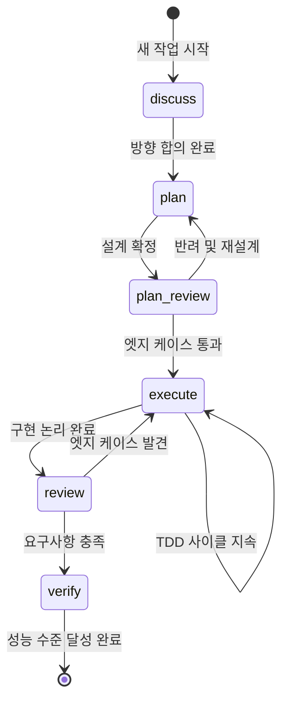

AI가 코드를 작성하는 환경에서 개발의 성패는 생성된 코드를 얼마나 정밀하게 검증하고 통제하느냐에 달려 있다.

- AI는 신속하게 작업을 수행하지만 주변 시스템과의 정합성을 깨뜨릴 위험이 있으며, 문제 발생 지점의 추적의 어려움 존재
- 높은 생산성을 유지하면서 작업 범위를 제한하고 구조적 결함을 방지하기 위해 상태 기반 6단계 워크플로우를 도입

이러한 워크플로우 조정을 지원하는 다양한 플러그인과 스킬들이 존재하나, 상세한 제어와 프로세스 체득을 위해 직접 플로우를 설계하고 구현했다.

## 워크플로우 6단계 구조

요구사항 분석부터 검증까지 전체 작업을 세부 단계로 분리한다.



워크플로우 진입 전 작업 내용에 대해 사전 논의 등을 통해 컨텍스트 문서를 생성하며, 이를 기반으로 후속 작업을 진행한다.

|     단계      |           목적            |
|:-----------:|:-----------------------:|
|   discuss   |   도메인 지식 동기화 및 원인 논의    |
|    plan     | 아키텍처 목표 달성을 위한 세부 작업 분할 |
| plan-review | 구현 계획의 한계점 및 엣지 케이스 점검  |
|   execute   | TDD 기반 점진적 구현 및 테스트 검증  |
|   review    | 로직의 단점 및 요구사항 만족 여부 검토  |
|   verify    | 부하 테스트를 통한 성능 지표 최종 검수  |

각 단계 완료 시 다음 단계로 자동 진행되는 것을 차단하고 개발자의 검토와 승인을 필수로 규정했다.

---

## 업무 적용 사례 - 비동기 결제 프로세스

단순 구현 위임 대신 워크플로우를 통해 구현 방향을 제약하고 엣지 케이스에 대응한 구체적인 과정은 다음과 같다.

### 1. 문제 원인 분석 (Discuss)

워크플로우 시작 전 수집 된 부하 테스트 데이터와 사전 컨텍스트 문서로 AI와 논의하여 뼈대를 구축했다.

```markdown
# ASYNC-CHANNEL-CONTEXT.md

## 2. 벤치마크 Round 2 결과 (발췌)

|:---:|:---:|:---:|:---:|:---:|
| 케이스 | TPS | HTTP med | E2E med | Dropped |
|:---:|:---:|:---:|:---:|:---:|
| sync-low | 118.2 | 3,176ms | 251ms | 6,390 |
| outbox-parallel-c100-high | 22.4 | 1,636ms | 1,356ms | 11,152 |

### Root Cause 1 — Spring Throttling 메커니즘

동시 실행 수가 극한에 도달하면 호출 스레드를 throttleLock.wait()으로 무기한 블로킹한다.
결국 k6 VU가 응답만 대기하다 Dropped 현상으로 이어진다.
```

정식 Discuss 단계에서는 이 문서들을 주입하여 기존 아키텍처의 한계를 수치로 파악하고 근본 원인을 심층 분석을 진행했다.

### 2. 목표 및 제약 조건 설정 (Plan)

방향 설정 완료 후 코드 작성 전 개발 단계를 구체화한 계획 문서를 작성하여, 구현 과정에서 AI가 불필요하게 범위를 확장하는 것을 방지했다.

```markdown
# ASYNC-CHANNEL-PLAN.md

## 목표

`LinkedBlockingQueue` + Worker 가상 스레드로 Outbox 즉시 처리 경로를 재구성하여,
HTTP 스레드 블로킹을 완전히 제거하고 Spring Boot 3.4.x로 업그레이드한다.

## 컨텍스트

- 설계 문서: [docs/topics/ASYNC-CHANNEL-DISCUSS.md](../topics/ASYNC-CHANNEL-DISCUSS.md)
- 주요 변경 파일:
    - `build.gradle`
    - `core/config/AsyncConfig.java`, `core/channel/PaymentConfirmChannel.java` (신규)
    - `payment/scheduler/OutboxWorker.java`, `OutboxProcessingService.java` (신규), `OutboxImmediateWorker.java` (신규)
    - `payment/listener/OutboxImmediateEventHandler.java`
    - `application-benchmark.yml`, `run-benchmark.sh`

---

## 진행 상황

<!-- execute 단계에서 각 태스크 완료 시 체크 -->

- [x] Task 1: Spring Boot 3.4.x 업그레이드
- [x] Task 2: PaymentConfirmChannel 구현
- [x] Task 3: OutboxProcessingService 추출 (OutboxWorker 공통 로직)

...

### Task 2: PaymentConfirmChannel 구현 [tdd=false]

**구현**

- `src/main/java/com/hyoguoo/paymentplatform/core/channel/PaymentConfirmChannel.java` (신규)
    - `LinkedBlockingQueue<String>` 래퍼 (orderId를 큐 요소로 사용)
    - `offer(String orderId): boolean` — 논블로킹, 큐 가득 차면 false 즉시 반환
    - `take(): String` — Worker가 호출, 큐 비면 VT unmount 대기
    - `@Value("${outbox.channel.capacity:2000}")` 로 큐 용량 주입
    - `@Component`로 등록

**완료 기준**

- 컴파일 오류 없음
- `./gradlew test` 회귀 없음

...
```

### 3. 아키텍처 설계 검토 (Plan Review)

아키텍처의 타당성을 검증하는 핵심 단계로, 구현 전에 잠재적 문제와 엣지 케이스를 점검하여 불필요한 코드 변경과 재작업을 방지한다.

- 문서 내 의사 결정 테이블을 작성하여 구현 전 합의된 명세 고정
- 사소한 코드 변경으로도 전체 방향이 흔들리지 않도록 제약 조건을 명확하게 결정

```markdown
# ASYNC-CHANNEL-CONTEXT.md

...

## 8. 결정 사항

|:---:|:---:|:---:|
| 항목 | 결정 | 이유 |
|:---:|:---:|:---:|
...
// 추가된 결정 사항
| Worker 수 상한 | DB 커넥션 풀(300)보다 적게 설정 | DB 자원 Starvation 방지 |
| JDBC 드라이버 | Spring Boot 3.4.x 업그레이드 | Connector/J VT pinning 회피 |
```

### 4. 제한적 구현 (Execute)

실패하는 테스트 코드를 선제적으로 작성하도록 강제하고, 테스트 기준을 통과한 로직만 생산하도록 TDD 사이클을 엄격히 적용하여 구현한다.

```markdown
# ASYNC-CHANNEL-PLAN.md

### Task 5: OutboxImmediateWorker 구현 [tdd=true]

- 테스트 (RED): 이벤트를채널에제출하면_OutboxProcessingService가호출된다 작성
- 구현 (GREEN): worker.start() → channel.offer("order-1") 루프 동작 처리 완성

완료 결과: OutboxImmediateWorker 신규 생성 (SmartLifecycle). start()에서 VT worker N개 기동,
stop(Runnable)에서 interrupt + join(5s) 후 callback 호출.
```

### 5. 전체 로직 통합 검토 (Review)

개별 구현 종료 후 전체 파이프라인 흐름에서 초기 제약 조건 준수 여부를 교차 점검한 뒤, 문제 될 수 있는 부분을 수정 작업을 다시 Execute 하며 개선한다.

```text
refactor: 코드 리뷰 피드백 반영 — null 제거, PII 로그, @Setter 제거, 벤치마크 시나리오 개선

- OutboxProcessingService: loadPaymentEvent() null → Optional 반환, catch 의도 주석 추가
- OutboxImmediateEventHandler: warn 로그에서 orderId(PII) 제거
- OutboxImmediateWorker: @Setter 제거(ReflectionTestUtils로 교체), raw log → LogFmt
- 벤치마크 스크립트: 의미있는 시나리오 재구성 (고지연/저지연, W200/W100/Capacity 비교)
```

### 6. 최종 검증 (Verify)

최종 목적이 달성되면 verify하여 다음과 같은 작업을 수행하도록 하고, 마무리한다.

- 테스트 수행: 모든 코드 변경이 의도한 대로작동하는지 확인
- 문서화: 변경된 아키텍처와 구현에 대한 문서 업데이트
- Pull Request 생성: 변경 사항에 대한 설명과 함께 PR을 생성

---

## 향후 개선 방안

현재 워크플로우는 인간의 개입을 통해 시스템 안정성을 확보하고 있지만, 다음과 같은 문제가 있다.

- 대화 누적에 따른 컨텍스트 희석 문제 발생 가능
- 각 단계가 모두 같은 페르소나로 진행되어, 단계별로 요구되는 전문성이 충분히 발휘되지 못할 수 있음

이를 개선하기 위해 전문화된 페르소나를 부여한 에이전트를 배치하여 각 단계에서 요구되는 전문성을 극대화하고, 단계별로 독립적인 검증 사이클을 구축할 수 있을 것으로 보인다.

- 컨텍스트 오염 차단: 에이전트별 데이터 읽기 범위를 제한하여 지침 망각 및 환각 방지
- 독립적 검증 사이클 구성: 에이전트 간 교차 피드백을 통한 검증 강화 및 단계별 전문성 극대화
