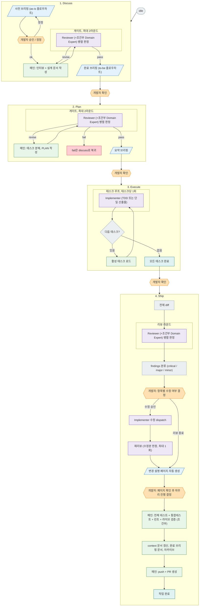
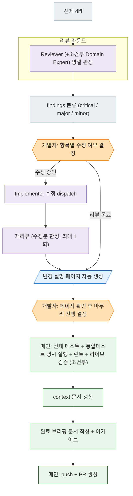

### 문제 — AI 자기 검증의 한계

AI가 코드를 작성하는 환경에서는, 생성된 코드를 검증하고 통제하는 과정이 중요하다.

- AI는 작업이 빠르지만 주변 시스템과의 정합성을 깨뜨릴 위험이 있고, 문제 발생 지점 추적도 어려움
- 같은 세션이 코드를 작성하고 스스로 리뷰하면, 자기 결정을 정당화하는 쪽으로 판정이 기울어 자기 검증을 믿을 수 없음

### 하네스 엔지니어링

이 문제를 다루는 접근을 하네스 엔지니어링이라 부른다.

- "Agent = Model + Harness"라는 정의 아래, 모델 외의 모든 통제 체계를 설계하는 분야
- 가이드(사전 제어)·센서(사후 검증)·인간 개입 체크포인트 등으로 구성

### 접근 방식

현재 구축한 워크플로우는 하네스 엔지니어링의 완전한 구현이 아니라, 같은 문제에서 출발한 프롬프트 기반 통제 체계다.

- 1세대(2026-04 도입): 9개 페르소나 + 6단계 — 격리를 최대로 넓힌 실험
- 현 체계(2026-06 개편): 4단계 + 3에이전트 — 실사용 중 발생한 격리 비용을 반영해 축소
- 지속적인 보강 및 개선 진행 중

---

## 1세대 — 6단계, 9개 페르소나

초기 체계는 요구사항 분석부터 PR 생성까지를 6단계(Discuss → Plan → Plan Review → Execute → Review → Verify)로 나누고, 단계마다 전문 페르소나를 배치했다.

- 질의응답·태스크 분해·레이어 검토는 각각 Interviewer·Planner·Architect 담당, 판정은 Critic·Plan Reviewer·Domain Expert가 단계별로 수행
- 구현·최종 테스트·PR 생성은 각각 Implementer·Verifier·PR Manager 담당
- 메인 오케스트레이터는 상태 관리와 라우팅만 담당 — 직접 만들지도, 판정하지도 않음
- 판정은 5차원 점수와 JSON 스키마 파일로 기록

작성자와 검증자를 분리한 원칙은 유효했지만, 분리 범위가 지나치게 넓었다.

## 격리 비용

|  1세대의 비용   |                         구체적 증상                          |
|:----------:|:-------------------------------------------------------:|
|   토큰 소모    | 단계·라운드마다 새 서브에이전트 세션을 실행, 세션마다 같은 프로젝트 컨텍스트를 처음부터 다시 로드 |
|  정의의 이중화   |          에이전트 정의와 페르소나 문서가 같은 내용을 두 곳에서 중복 유지           |
| 판정 형식의 과잉  |      판정에 영향 없는 5차원 점수와 JSON 스키마, 라운드 판정 파일 126개 누적      |
| 저지능 모델의 대행 |        설계와 태스크 분해를 메인보다 낮은 지능의 서브에이전트가 수행해 품질 하락        |
|  프로세스 부산물  |            상태 문서에 완료 이력이 누적되고, 브리핑 파일 3종 분산             |

- 격리 자체가 목적이 되면서, 독립 시각이 필요 없는 곳까지 서브에이전트가 대행
- 설계를 저지능 서브에이전트에 위임한 결과물은 고지능 메인이 직접 쓴 것보다 품질이 낮아짐

---

## 현 체계 — 4단계, 3에이전트

요구사항 분석부터 PR 생성까지를 4단계로 분리하고, 게이트 전후의 사전 브리핑(as-is)과 완료 브리핑(to-be)으로 개발자에게 판단 근거를 제공한다.


```mermaid
flowchart TB
    IDLE([idle])
    IDLE --> DISCUSS

    subgraph DISCUSS ["1. Discuss"]
        direction TB
        D_PRE[/"사전 브리핑 (as-is 플로우차트)"/]
        D_USER1{{개발자 승인 / 정정}}
        D_PRE --> D_USER1
        D_USER1 -->|정정| D_PRE
        D_MAIN["메인: 인터뷰 + 설계 문서 작성"]
        D_USER1 -->|ok| D_MAIN

        subgraph D_GATE ["게이트, 최대 2라운드"]
            D_JUDGE["Reviewer (+조건부 Domain Expert) 병렬 판정"]
        end

        D_MAIN --> D_JUDGE
        D_JUDGE -->|revise| D_MAIN
        D_POST[/"완료 브리핑 (to-be 플로우차트)"/]
        D_JUDGE -->|pass| D_POST
    end

    D_STOP{{개발자 확인}}
    D_POST --> D_STOP
    D_STOP --> PLAN

    subgraph PLAN ["2. Plan"]
        direction TB
        P_MAIN["메인: 태스크 분해, PLAN 작성"]

        subgraph P_GATE ["게이트, 최대 2라운드"]
            P_JUDGE["Reviewer (+조건부 Domain Expert) 병렬 판정"]
        end

        P_MAIN --> P_JUDGE
        P_JUDGE -->|revise| P_MAIN
        P_FAIL["fail은 discuss로 복귀"]
        P_JUDGE -->|fail| P_FAIL
        P_POST[/"요약 브리핑"/]
        P_JUDGE -->|pass| P_POST
    end

    P_STOP{{개발자 확인}}
    P_POST --> P_STOP
    P_STOP --> EXECUTE

    subgraph EXECUTE ["3. Execute"]
        direction TB
        E_LOAD[활성 태스크 로드]

        subgraph E_ROUND ["태스크 루프, 태스크당 1회"]
            E_IMP["Implementer (TDD 또는 단일 산출물)"]
        end

        E_LOAD --> E_IMP
        E_NEXT{다음 태스크?}
        E_IMP --> E_NEXT
        E_NEXT -->|있음| E_LOAD
        E_DONE[모든 태스크 완료]
        E_NEXT -->|없음| E_DONE
    end

    E_STOP{{개발자 확인}}
    E_DONE --> E_STOP
    E_STOP --> SHIP

    subgraph SHIP ["4. Ship"]
        direction TB
        S_DIFF["전체 diff"]

        subgraph S_ROUND ["리뷰 라운드"]
            S_JUDGE["Reviewer (+조건부 Domain Expert) 병렬 판정"]
        end

        S_DIFF --> S_JUDGE
        S_LIST["findings 분류 (critical / major / minor)"]
        S_JUDGE --> S_LIST
        S_USER{{개발자: 항목별 수정 여부 결정}}
        S_LIST --> S_USER
        S_FIX["Implementer 수정 dispatch"]
        S_USER -->|수정 승인| S_FIX
        S_RE["재리뷰 (수정분 한정, 최대 1회)"]
        S_FIX --> S_RE
        S_PAGE[/"변경 설명 페이지 자동 생성"/]
        S_RE --> S_PAGE
        S_USER -->|리뷰 종료| S_PAGE
        S_GATE{{개발자: 페이지 확인 후 마무리 진행 결정}}
        S_PAGE --> S_GATE
        S_VERIFY["메인: 전체 테스트 + 통합테스트 + 린트 + 라이브 검증 (조건부)"]
        S_GATE --> S_VERIFY
        S_DOCS["context 문서 갱신, 완료 브리핑 문서, 아카이브"]
        S_VERIFY --> S_DOCS
        S_PR["메인: push + PR 생성"]
        S_DOCS --> S_PR
        S_FINAL["작업 완료"]
        S_PR --> S_FINAL
    end

    classDef default fill: #ECEFF1,stroke: #78909C,color: #333
    classDef main fill: #E8F5E9,stroke: #2E7D32,color: #333
    classDef agent fill: #EDE7F6,stroke: #5E35B1,color: #333
    classDef gate fill: #FFE0B2,stroke: #F57C00,color: #333
    classDef brief fill: #E3F2FD,stroke: #1565C0,color: #333
    classDef fail fill: #FFCDD2,stroke: #C62828,color: #333
    classDef done fill: #E0F2F1,stroke: #00695C,color: #333
    class D_MAIN,P_MAIN,E_LOAD,S_VERIFY,S_DOCS,S_PR main
    class D_JUDGE,P_JUDGE,E_IMP,S_JUDGE,S_FIX,S_RE agent
    class D_USER1,D_STOP,P_STOP,E_STOP,S_USER,S_GATE gate
    class D_PRE,D_POST,P_POST,S_PAGE brief
    class P_FAIL fail
    class E_DONE,S_FINAL done
```

|   단계    |                   목적                   |    메인 에이전트 수행 항목    |                  서브에이전트                   |
|:-------:|:--------------------------------------:|:-------------------:|:-----------------------------------------:|
| Discuss |           도메인 지식 동기화 및 설계 합의           |    인터뷰, 설계 문서 작성    |       Reviewer (조건부 Domain Expert)        |
|  Plan   |           설계를 실행 가능한 태스크로 분해           |   태스크 분해, PLAN 작성   |       Reviewer (조건부 Domain Expert)        |
| Execute | TDD(Test-Driven Development) 기반 점진적 구현 |       오케스트레이션       |                Implementer                |
|  Ship   |       코드 리뷰, 최종 검증, 문서 정리, PR 생성       | 설명 페이지, 테스트, 문서, PR | Reviewer (조건부 Domain Expert), Implementer |

서브에이전트는 3종으로 줄이고, 모델과 추론 강도를 역할의 빈도와 영향도에 따라 차등 배치했다.

|     에이전트      |  지능  |                        역할                         |
|:-------------:|:----:|:-------------------------------------------------:|
|   Reviewer    | 고지능  |      단계별 체크리스트 + 일반 품질 검토, 실패 근거를 찾는 쪽으로 편향       |
| Domain Expert | 최고지능 | 결제 도메인 리스크 전담 — 돈이 새는 경로, 상태 전이, 멱등성, race window |
|  Implementer  | 중간지능 |         PLAN 단일 태스크의 TDD 실행과 리뷰 수정, 커밋 생성         |

검토 에이전트의 판정은 재량이 아니라 규칙을 따르도록 했다.

- 판정(pass / revise / fail)과 findings를 에이전트의 최종 메시지로 반환 — finding 하나는 심각도(critical / major / minor), 위치, 문제, 근거, 제안으로 구성
- critical이 1건이라도 있으면 fail, major만 있으면 revise, minor뿐이면 pass — 체크리스트 항목의 no는 최소 major로 취급해, no가 남은 채 pass가 나올 수 없음
- Implementer는 첫 줄이 `결과: 성공 | 실패 | 에스컬레이션`인 고정 템플릿으로 반환 — 오케스트레이터가 다음 진행 여부를 해석 없이 판정

---

## 핵심 설계 원칙

### 선택적 격리

격리 지점을 꼭 필요한 부분으로 나누었다.

- 게이트 판정과 코드 리뷰는 반드시 격리 — 메인이 만든 산출물을 메인이 판정하면 자기 승인이 됨
- 인터뷰·설계·태스크 분해는 고지능 에이전트가 수행 — 저지능 서브에이전트에 위임하면 품질이 하락
- 테스트 실행·PR 생성처럼 창의성이 없는 결정론적 작업도 메인이 직접 — 격리 이득 없음
- Domain Expert 조건부 사용 — 소스나 런타임 설정을 바꾸거나, 결제 도메인 동작을 서술·정정하는 토픽에만 포함

### 병렬 판정

Reviewer와 Domain Expert는 같은 라운드에서 단일 메시지로 동시에 호출한다.

- Reviewer: 코드 품질, 아키텍처 규칙, 테스트 커버리지 관점
- Domain Expert: 도메인 리스크, 상태 전이 정합성, 멱등성 관점
- 동시에 호출하고, 서로의 출력도 참조하지 않음 — 한쪽이 다른 쪽의 의견에 영향을 주지 않도록 격리

### 브리핑과 개발자 개입

게이트 라운드 진입 전과 통과 후, 메인 스레드가 개발자에게 브리핑을 제시한다.

- 사전 브리핑: 현재 이해한 문제, as-is 플로우차트, 이번 단계에서 결정할 것, 그 외 질문
- 완료 브리핑: 결정된 접근, to-be 플로우차트, 핵심 결정 사항, 트레이드오프
- 메서드명 대신 "결제 승인 확정", "재시도 한도 소진" 같은 도메인 용어와 Mermaid 플로우차트로 구성해, 개발자가 비즈니스 흐름 수준에서 방향을 판단

### 단계 완료 후 정지

각 단계가 끝나면 반드시 멈추고 개발자의 명시적 확인을 기다린다.

- AI의 단계 자동 진행을 차단
- 승인 질문이 응답 없이 타임아웃돼도 진행하지 않음
- 개발자는 이 정지 지점에서 전체 프로세스의 주도권을 유지

---

## 단계별 흐름

### 1. Discuss — 설계 논의

구현 전에 도메인 문제를 정의하고 접근 방향을 합의한다.

- 메인이 개발자와 직접 질의응답 — 범위·제약·산출물·검증의 4트랙이 모두 해소될 때까지 인터뷰
- 설계 문서에는 결정 사항마다 근거와 기각된 대안을 함께 기록
- 게이트에서 Reviewer는 설계 완성도를, Domain Expert는 멱등성 전략과 장애 시나리오 대응을 판정

아래는 실제 설계 문서로, 부하 테스트 수치로 확인하고, 원인을 Spring의 비동기 실행 제한(Throttling) 동작까지 추적해 기록한 대목이다.

```markdown
## 벤치마크 결과 (발췌)

|            케이스            |  TPS  | HTTP med | E2E med | Dropped |
|:-------------------------:|:-----:|:--------:|:-------:|:-------:|
|         sync-low          | 118.2 | 3,176ms  |  251ms  |  6,390  |
| outbox-parallel-c100-high | 22.4  | 1,636ms  | 1,356ms | 11,152  |

### Root Cause — Spring Throttling 메커니즘

동시 실행 수가 극한에 도달하면 호출 스레드를 throttleLock.wait()으로 무기한 블로킹한다.
결국 k6 VU(가상 사용자)가 응답만 대기하다 Dropped 현상으로 이어진다.
```

결정 근거는 수치와 함께 설계 문서에 남아, 게이트 판정의 입력과 다음 토픽의 참고 자료로 재사용된다.

### 2. Plan — 태스크 분해

discuss에서 합의된 설계를 구현 태스크로 분해하고, 같은 단계 안에서 정합성 게이트까지 통과시킨다.

- 각 태스크에 tdd 플래그(테스트 선행 여부)와 domain_risk 플래그(도메인 리스크 존재 여부)를 부여
- 레이어 의존 순서 정렬, 한 태스크는 한 커밋 단위로 구현되도록 설계
- 모든 태스크가 설계 결정에 매핑되고, 태스크 없이 증발한 결정도 없어야 함

아래는 실제 PLAN의 태스크 항목으로, Implementer가 이 명세만 보고 구현할 수 있도록, 구현 대상과 동작 계약을 시그니처 수준까지 적시했다.

```markdown
### Task 2: PaymentConfirmChannel 구현 [tdd=false]

- LinkedBlockingQueue<String> 래퍼 (orderId를 큐 요소로 사용)
- offer(String orderId): boolean — 논블로킹, 큐 가득 차면 false 즉시 반환
- take(): String — Worker가 호출, 큐 비면 가상 스레드(VT) unmount 대기
```

### 3. Execute — TDD 구현

PLAN의 태스크를 순서대로 구현하며, 태스크당 Implementer 서브에이전트를 1회 dispatch한다.

- tdd=true: 실패하는 테스트 작성(RED) → 구현하여 통과(GREEN) → 코드 정리(REFACTOR)
- tdd=false: 설정 파일 변경 등 테스트 선행이 불필요한 작업
- execute 중에는 리뷰 판정을 하지 않음 — 태스크마다 판정하면 오버헤드가 크고, 전체 diff를 한 번에 보는 ship 리뷰가 더 효과적이라 판단
- 예상 밖 상황은 두 규칙으로 처리 — 명백한 문제는 자동 수정 후 커밋에 기재, DB 스키마·레이어 경계·빌드 의존성 변경은 즉시 중단 보고

### 4. Ship — 리뷰와 마무리

전체 diff 교차 리뷰와 최종 검증, 문서 정리, PR 생성을 하나의 단계로 처리한다.


```mermaid
flowchart TB
    A["전체 diff"]

    subgraph B ["리뷰 라운드"]
        B1["Reviewer (+조건부 Domain Expert) 병렬 판정"]
    end

    A --> B1
    B1 --> C["findings 분류 (critical / major / minor)"]
    C --> D{{개발자: 항목별 수정 여부 결정}}
    D -->|수정 승인| E["Implementer 수정 dispatch"]
    E --> E2["재리뷰 (수정분 한정, 최대 1회)"]
    E2 --> P[/"변경 설명 페이지 자동 생성"/]
    D -->|리뷰 종료| P
    P --> F{{개발자: 페이지 확인 후 마무리 진행 결정}}
    F --> G["메인: 전체 테스트 + 통합테스트 명시 실행 + 린트 + 라이브 검증 (조건부)"]
    G --> H["context 문서 갱신"]
    H --> I["완료 브리핑 문서 작성 + 아카이브"]
    I --> J["메인: push + PR 생성"]
    classDef default fill: #ECEFF1,stroke: #78909C,color: #333
    classDef main fill: #E8F5E9,stroke: #2E7D32,color: #333
    classDef agent fill: #EDE7F6,stroke: #5E35B1,color: #333
    classDef gate fill: #FFE0B2,stroke: #F57C00,color: #333
    classDef brief fill: #E3F2FD,stroke: #1565C0,color: #333
    class G,H,I,J main
    class B1,E,E2 agent
    class D,F gate
    class P brief
```

리뷰 통과 직후에는 변경 설명 페이지를 자동 생성한다.

- 배경–직관–코드–퀴즈 4섹션의 HTML — 이번 변경 사항에 대해 퀴즈로 스스로 점검 가능
- 개발자는 마무리 게이트에서 이 페이지를 읽고 최종 진행 여부를 판단 — PR 전에 코드가 다시 바뀌면 같은 파일로 재생성
- findings의 채택 / 스킵 결정과 사유는 PLAN의 리뷰 처리 섹션에 기록되어 세션이 끊겨도 유실되지 않음

---

## 루프 엔지니어링 — 반복 상한과 종료 조건

AI 루프는 상한이 없으면 끝나지 않을 수 있고, 같은 시도를 반복하며 시간과 토큰을 과다하게 소모할 수 있다.

- 게이트 최대 2라운드 — 소진 시 관점을 전환해 재검토하고, 라운드 경과 요약과 함께 개발자에게 보고 (계속 / 방향 수정 / 중단)
- ship 재리뷰 최대 1회 — 대상은 수정분과 원 findings 해소 여부로 한정, 새 critical이 나오면 반복 없이 에스컬레이션
- 수렁 가드 — Implementer가 같은 실패에 수정 시도 3회를 초과하면 중단하고 시도 이력과 함께 보고
    - 4번째 시도가 필요하다면 접근 자체가 틀렸다는 신호로 판단
- 연속 진행 종료 조건 — 연속 dispatch를 즉시 중단하고 상태 요약 후 개발자 확인

## 위반 사례가 규칙으로 쌓인다

정기 점검과 실제 사용 중에 발견된 위반 사례를 체크리스트와 에이전트 정의에 반영해, 다음 작업에서 되풀이하지 않도록 축적한다.

- 정기적으로 점검하여, 체크리스트와 에이전트 정의를 업데이트
- 한 번 겪은 실수는 체크리스트와 에이전트 정의에 반영해, 다음 작업에서 되풀이하지 않도록 축적

---

## 결론

이 워크플로우는 AI의 생산성을 활용하되, 전체 프로세스의 주도권은 개발자가 유지하는 구조를 목표로 했다.

- 격리는 독립 시각이 가치를 내는 곳(검토·구현)에만 — 나머지는 고지능 메인이 직접 수행
- 브리핑 체계로 개발자가 도메인 수준에서 방향을 교정할 수 있는 게이트 보장
- 모든 루프에 상한과 종료 조건을 내장해, AI의 임의 확장과 무한 반복을 함께 차단
- 지침을 지속적으로 보강해, 점점 더 안전하고 효율적인 워크플로우로 진화
