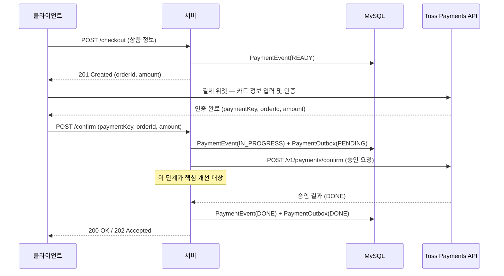
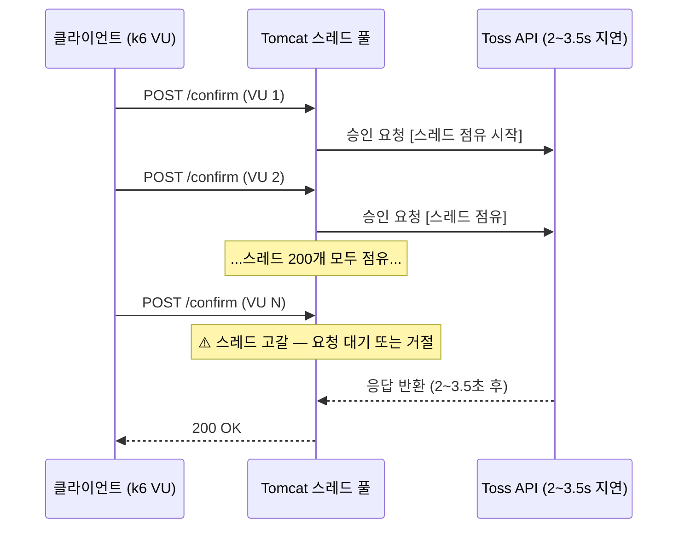
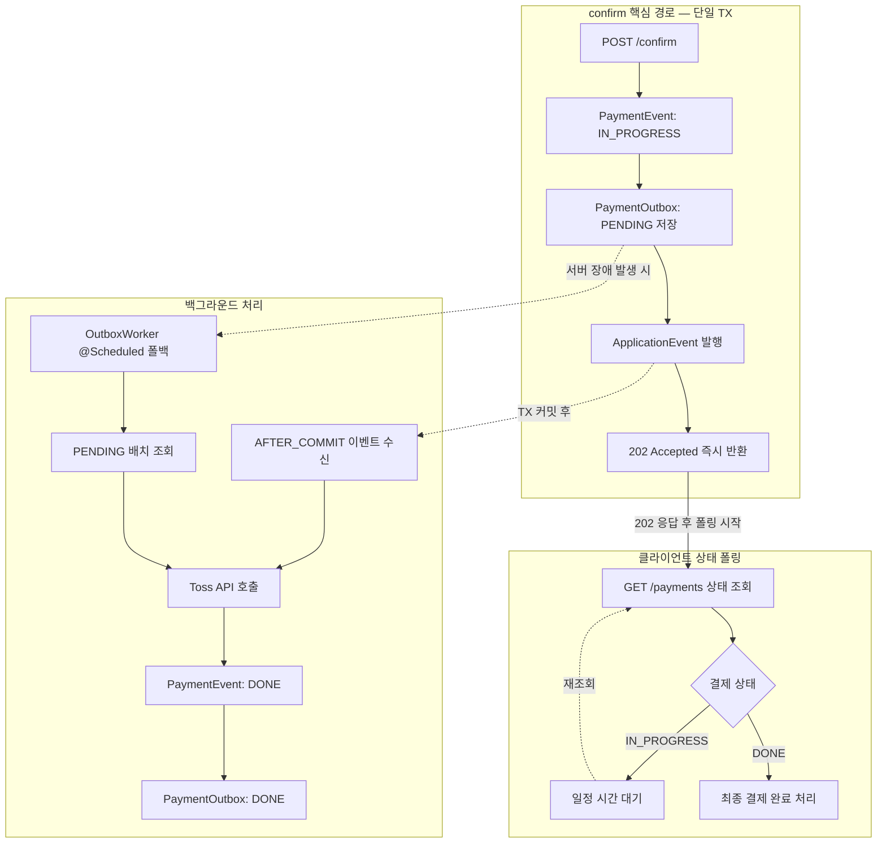
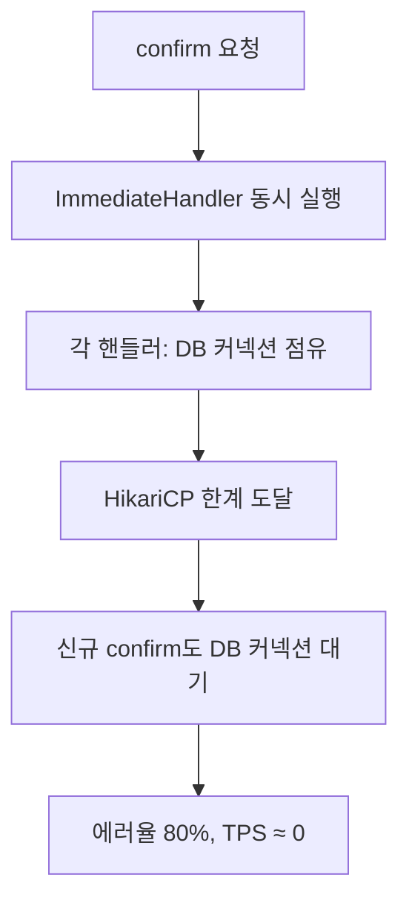
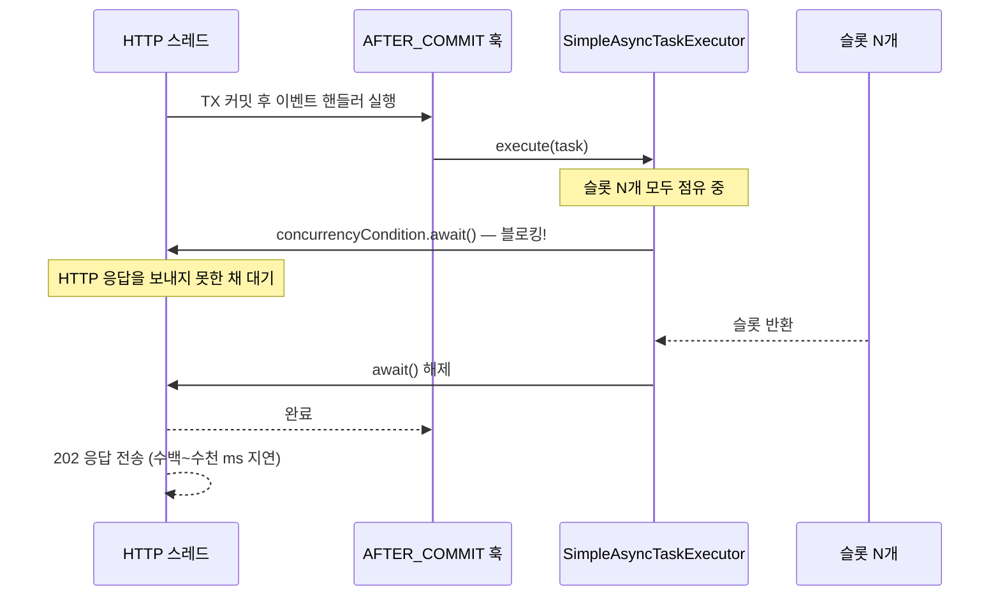
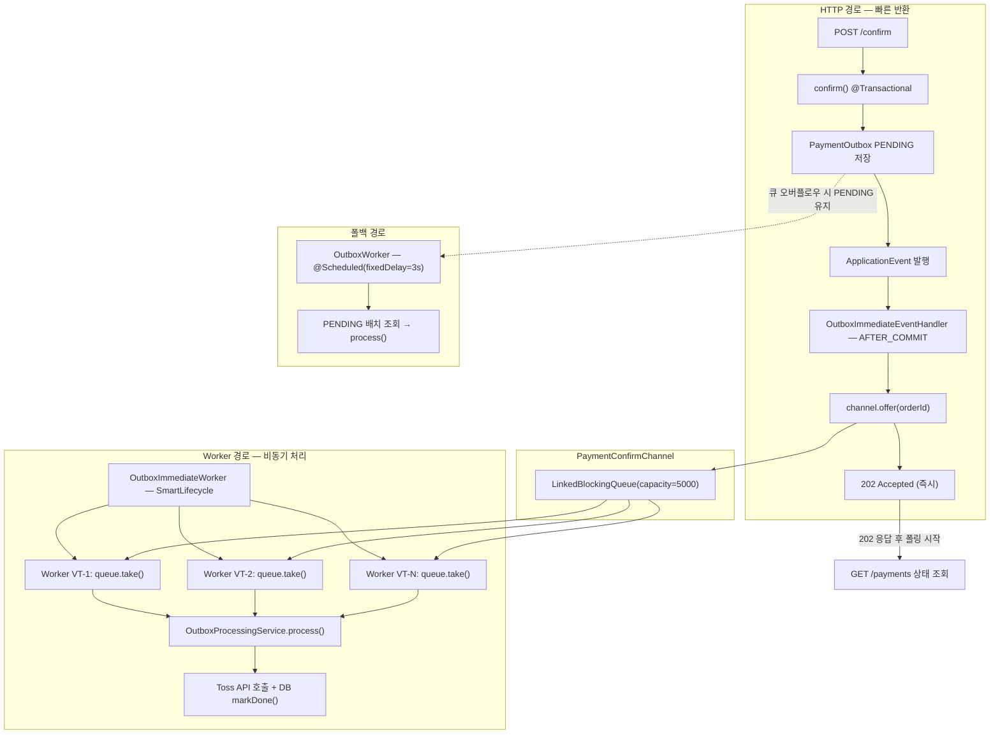
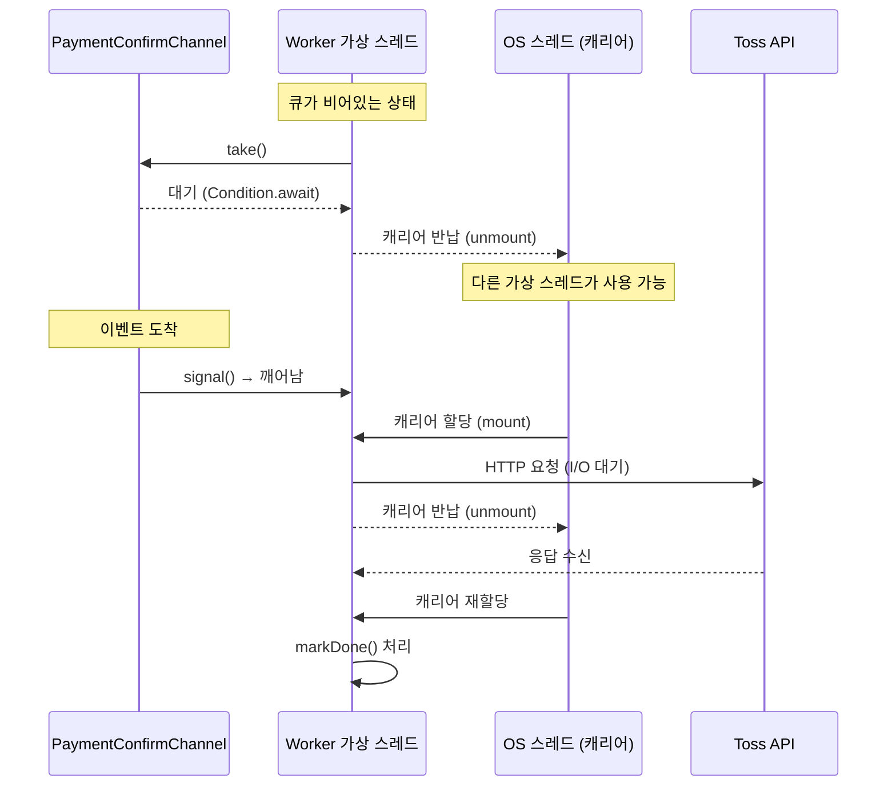
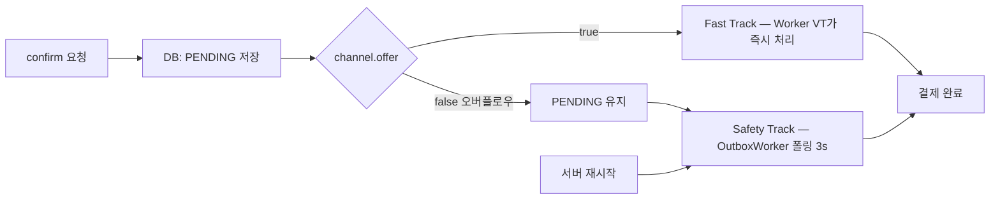

> 실행 환경: Java 21, Spring Boot 3.4.4, MySQL 8.0, k6

## 배경

지금까지 Payment Platform 시리즈에서 결제 시스템을 단계별로 개선해왔다.

- [토스 결제 연동](/blog/payment-system-with-toss/): 결제 위젯과 서버 검증 연동
- [트랜잭션 범위 최소화](/blog/minimize-transaction-scope/): 외부 API를 트랜잭션 밖으로 분리
- [결제 복구 시스템](/blog/payment-status-with-retry/): UNKNOWN 상태와 재시도 로직으로 장애 복구
- [보상 트랜잭션 실패 대응](/blog/payment-compensation-transaction/): 작업 테이블로 최종적 일관성 확보
- [PG 독립 아키텍처](/blog/payment-gateway-strategy-pattern/): 전략 패턴으로 PG 교체 가능 구조
- [결제 이력 추적](/blog/payment-history-and-metrics/): 상태 변경 이력과 운영 지표 모니터링
- [Checkout 멱등성](/blog/checkout-idempotency/): 중복 결제 이벤트 생성 방지

이전 [트랜잭션 범위 최소화](/blog/minimize-transaction-scope/)에서 외부 API 호출을 트랜잭션 밖으로 분리했지만, confirm 단계의 HTTP 스레드 점유 문제는 여전히 남아 있었다.

1. 외부 API 응답이 지연 시 그 시간만큼 Tomcat 스레드가 묶임
2. 요청이 몰리면서 스레드 풀 고갈

이 글은 그 문제를 비동기로 풀어보려 한 시도, 그리고 그 과정에서 마주친 실패와 재설계를 기록한다.

---

## 전체 결제 플로우

비동기 플로우를 이해하려면 먼저 전체 결제 흐름을 파악해야 한다.



- 결제 플로우는 checkout → 인증 → confirm 세 단계
- confirm 단계는 서버 로직 내에서 직접 호출하면서 승인 완료하는 구조

승인 API 응답 시간은 외부 서비스에 달려 있고, 네트워크 지연 상황이 발생한다면 동기 방식에서 이 지연은 HTTP 스레드가 그대로 묶이게 된다.

---

## 실험 환경 및 핵심 용어 정의

본문에서 진행하는 벤치마크는 더욱 입체적인 분석을 위해 k6 상에서 두 가지 시나리오를 동시(Concurrent)에 실행하도록 구성되었다.

### 1. 테스트 환경의 두 가지 시나리오

- Throughput 시나리오 (TPS 측정용): 단계적으로 요청량을 늘려가며(Ramping Arrival Rate) 서버가 처리할 수 있는 최대 초당 요청 처리량(TPS) 측정
    - 동기 방식 측정: `/confirm` 요청 후 `200 OK`를 받을 때까지 대기
    - 비동기 방식 측정: `/confirm` 요청 후 `202 Accepted` 응답을 수신 시 (순수하게 서버의 HTTP 수용 능력을 측정)
- E2E(End-to-End) 시나리오 (결제 완료 시간 측정용): 메인 서버가 극심한 부하를 받는 와중에 개별 사용자가 겪는 실제 결제 체감 대기 시간 측정
    - 비동기 환경 테스트 시 이 시나리오에서는 결제가 단순 202 수신으로 끝내지 않음
    - 실제 상태가 `DONE`이 될 때까지 `GET /payments/{orderId}` API를 지속적으로 폴링(Polling)하며 대기 후 측정

### 2. 핵심 지표 정의 (TPS vs E2E Latency)

- TPS (Transactions Per Second): Throughput 시나리오에서 성공적으로 처리한 초당 HTTP 응답 건 수
    - 비동기 환경에서는 서버가 클라이언트 요청을 거절하지 않고 인메모리 큐에 적재하여 '202 수락' 처리를 완료한 초당 건수 의미
- 결제 완료 시간 (E2E Latency): 별도의 E2E 시나리오에서 수집된 지표
    - 최초 `/confirm`부터 최종적으로 `DONE` 상태를 받아볼 때까지 폴링에 소모된 모든 대기 시간과 네트워크 오버헤드를 완전히 포함한 물리적(체감) 소요 시간

### 3. 지연 환경 (Latency Environment)

결제 승인(Confirm) 시 호출하는 PG API(Toss Payments)의 특성에 맞추어 두 가지 시나리오로 나누어 테스트했다.

- 저지연(Low Latency): API 승인 응답이 100~300ms 내외로 즉시 반환되는 쾌적한 평상시 환경
- 고지연(High Latency): 트래픽 스파이크 또는 외부 시스템(카드/VAN사) 장애로 승인 응답이 2,000~3,500ms로 극심하게 지연되는 환경

---

## 동기 방식의 한계

동기 confirm 플로우를 시각화하면 다음과 같다.



- Tomcat 기본 스레드 풀은 200개
- Toss API 평균 응답이 2.75초 가정
    - 스레드 하나가 2.75초씩 묶임 → 동시 처리 가능한 요청 수가 스레드 수에 영향

100 req/s 목표에서 TPS는 53에 그치고, Confirm(결제 승인 요청) p95는 36초에 달했다.

|          케이스          | TPS  | API 응답 med | API 응답 p95 | 처리 불가 요청 |
|:---------------------:|:----:|:----------:|:----------:|:--------:|
| sync-high (2~3.5s 지연) | 53.0 |  10,199ms  |  36,079ms  |  6,575   |

1. 100 req/s가 들어오면 1초 동안 100개의 스레드가 Toss API 대기 상태 진입 후 각 스레드가 평균 2.75초를 점유
2. 2~3초 뒤에는 동시에 200개 이상의 요청이 스레드를 점유하게 되어, Tomcat 스레드 풀(200개) 포화
3. 이 시점 이후 도착하는 요청은 빈 스레드가 생길 때까지 대기하거나 거절

---

## Async + Outbox 패턴 도입

해결책은 confirm 요청이 들어오면 Toss API 호출 없이 즉시 202를 반환하고, 백그라운드에서 실제 승인을 처리하는 구조다.

- `@Async`로 비동기 시 인메모리 이벤트 한계로 서버 재시작이나 처리 실패 시 이벤트가 유실될 위험 존재
- 결제 데이터는 한 건도 빠져서는 안 되므로, DB에 PENDING 레코드를 남겨 안전망을 확보하는 Outbox 패턴 함께 도입



Outbox 패턴은 두 가지 처리 경로를 만든다.

- Fast Path: TX 커밋 직후 ApplicationEvent가 발행되어 즉시 처리
- Safety Track: OutboxWorker가 주기적으로 PENDING 레코드를 폴링하여 누락 건 처리

OutboxWorker(폴링)가 안전망 역할을 맡기 때문에, Fast Path가 실패해도 결제 데이터는 유실되지 않고, PENDING 레코드가 DB에 남아 있는 한 최종 처리가 보장된다.

---

## 1차 구현 - @Async + 동시 실행 제한 없음

Fast Path의 첫 번째 구현은 `@Async`와 `@TransactionalEventListener`의 조합이었다.

```java
// OutboxImmediateEventHandler.java (1차)
@TransactionalEventListener(phase = TransactionPhase.AFTER_COMMIT)
@Async
public void handle(PaymentConfirmEvent event) {
    outboxProcessingService.process(event.getOrderId());
}
```

- `@TransactionalEventListener(AFTER_COMMIT)`은 TX가 커밋된 이후에만 이벤트를 처리해, 미커밋 PENDING 레코드를 Worker가 조회하는 경쟁 조건을 방지
- `@Async`는 처리를 별도 스레드로 위임해 HTTP 스레드 해제

첫 구현에는 동시 실행 제한(concurrencyLimit)은 설정하지 않고 진행했다.

### HikariCP 커넥션 풀 고갈

제한 없이 벤치마크를 돌리자 정상 처리가 불가능한 상태에 빠졌다.



원인은 Backpressure 부재였다.

1. 202를 빠르게 반환하는 만큼 ImmediateHandler 동시 실행 수가 폭발적으로 증가
2. 각 핸들러가 Toss API 호출 중 DB 커넥션을 점유하면서 HikariCP 고갈
3. 커넥션이 바닥나면서 confirm 요청 TX 자체도 커넥션을 확보하지 못해 연쇄 실패

HTTP 스레드가 빠르게 이벤트를 쏟아내는 반면 Toss API 호출이 느려 소비가 따라가지 못하면서, 동시 실행 수를 제한하지 않은 구조에서 공유 자원(DB 커넥션)이 순식간에 바닥난 것이다.

---

## 2차 구현 - setConcurrencyLimit 추가

HikariCP 고갈을 막기 위해 `SimpleAsyncTaskExecutor`에 동시 실행 상한을 설정했다.

```java
// AsyncConfig.java (2차)
@Bean
public AsyncTaskExecutor immediateHandlerExecutor(
        @Value("${outbox.immediate.concurrency-limit:200}") int concurrencyLimit,
        @Value("${outbox.immediate.virtual-threads:true}") boolean virtualThreadsEnabled) {
    SimpleAsyncTaskExecutor executor = new SimpleAsyncTaskExecutor("outbox-immediate-");
    executor.setVirtualThreads(true);
    executor.setConcurrencyLimit(concurrencyLimit);  // N = 10, 50, 100, 200, 250으로 실험
    return executor;
}
```

N(동시 실행 상한)을 다양하게 바꿔가며 벤치마크를 돌렸을 때, 예상과 다른 결과가 나왔다.

|       케이스       | TPS  | 처리 불가 요청 |
|:---------------:|:----:|:--------:|
| 동시 제한 10 / 저지연  | 8.1  |  11,022  |
| 동시 제한 100 / 저지연 | 23.8 |  10,472  |
| 동시 제한 200 / 저지연 | 26.7 |  10,096  |
| 동시 제한 200 / 고지연 | 24.0 |  10,434  |

동시 제한을 걸었을 때 처리 불가 요청이 폭발적으로 늘어나면서, 비동기로 전환했는데 기대한 성능이 나오지 않는 상황이 발생했다.

### 원인 분석 - ConcurrencyThrottleSupport

`SimpleAsyncTaskExecutor`는 `ConcurrencyThrottleSupport`를 상속하며, `setConcurrencyLimit(N)`을 설정하면 내부에서 다음 로직이 실행된다.

```java
// Spring ConcurrencyThrottleSupport 내부 (Spring Framework 6.2.x)
private final Lock concurrencyLock = new ReentrantLock();
private final Condition concurrencyCondition = this.concurrencyLock.newCondition();

protected void beforeAccess() {
    if (this.concurrencyLimit > 0) {
        this.concurrencyLock.lock();
        try {
            while (this.concurrencyCount >= this.concurrencyLimit) {
                this.concurrencyCondition.await();  // ← 호출 스레드가 여기서 블로킹
            }
            this.concurrencyCount++;
        } finally {
            this.concurrencyLock.unlock();
        }
    }
}
```

슬롯이 없으면 호출 스레드 자체를 `await()`으로 블로킹하여, 큐에 적재하고 즉시 반환하는 것이 아니라, 빈 슬롯이 생길 때까지 호출자를 직접 잠그는 방식으로 동작한다.



- `executor.execute(task)`를 호출한 쪽, 즉 AFTER_COMMIT 훅을 실행 중인 HTTP 플랫폼 스레드 블로킹
- Tomcat의 HTTP 스레드(플랫폼 스레드, max=200)가 슬롯 대기에 묶이므로, Executor 내부에서 가상 스레드를 사용하더라도 HTTP 응답 지연 문제 발생

클라이언트 입장에서는 confirm 요청을 보낸 후 응답을 받지 못한 채 대기하게 되고, 요청 적체 → 처리 불가 요청 폭발로 이어진다.

### 요약 - 1차/2차 구현의 문제점

|             구현              |                    문제                    |
|:---------------------------:|:----------------------------------------:|
|         제한 없음 (1차)          | Backpressure 부재 → HikariCP 고갈 → 에러율 80%  |
| setConcurrencyLimit(N) (2차) | 호출 스레드 직접 블로킹 → HTTP 응답 지연 → 처리 불가 요청 폭발 |

N(동시 처리 수)을 아무리 키워도 구조적 한계가 있었으며, 고지연 환경에서는 동시에 처리해야 할 요청 수가 N을 쉽게 넘어서고, N을 무한히 키우면 1차와 같은 자원 고갈이 재현된다.

---

## 개선 방향 탐색

문제는 작업을 위임하는 과정에서 HTTP 스레드가 자유롭지 못하다는 것이다.

- 1차: 동시 실행 수를 제한하지 않아 DB 커넥션이 고갈
- 2차: 동시 실행 수를 제한하자 슬롯 대기가 HTTP 스레드를 묶음

이 전제를 깨기 위해, AFTER_COMMIT 훅이 하는 일을 극도로 가볍게 만들어 큐에 넣는 방식으로 재설계하는 방향을 탐색했다.

## 최종 해결 - LinkedBlockingQueue + Worker 가상 스레드

### 핵심 아이디어

API 요청을 받은 HTTP 톰캣 스레드는 이벤트를 큐에 넣은 후 즉시 결과를 반환하고, 별도 Worker 가상 스레드들이 큐에서 이벤트를 꺼내 처리한다.

```
Before: HTTP 스레드 → execute(task) → await() → [블로킹] → 응답 지연
After:  HTTP 스레드 → queue.offer(orderId) → [즉시 반환] → 202 응답
                                ↓
                         Worker VT-1 → queue.take() → Toss API → markDone()
                         Worker VT-2 → queue.take() → Toss API → markDone()
                         Worker VT-N → queue.take() → (큐 Empty → 대기)
```

### 아키텍처



### PaymentConfirmChannel

```java
public class PaymentConfirmChannel {

    private final LinkedBlockingQueue<String> queue;

    public boolean offer(String orderId) {
        return queue.offer(orderId);  // 비차단: 큐 가득 차면 false 즉시 반환
    }

    // ...
}
```

`offer()`는 큐가 가득 찼을 때 false를 반환하면서, HTTP 스레드는 블로킹되지 않게 된다.

### OutboxImmediateEventHandler — 단순화

1차 / 2차에서 `@Async + OutboxProcessingService.process()` 호출이었던 핸들러가 `channel.offer()` 한 줄로 단순화됐다.

```java

@TransactionalEventListener(phase = TransactionPhase.AFTER_COMMIT)
public void handle(PaymentConfirmEvent event) {
    boolean offered = channel.offer(event.getOrderId());
    if (!offered) {
        log.warn("PaymentConfirmChannel 오버플로우 — OutboxWorker가 처리 예정");
    }
}
```

`@Async`가 제거되고, `offer()`는 비차단이므로 AFTER_COMMIT 훅 안에서 호출해도 HTTP 스레드가 블로킹되지 않는다.

#### `@TransactionalEventListener(AFTER_COMMIT)` 유지 이유

- TX 커밋 전에 Worker가 `queue.take()`로 PENDING 레코드를 조회하면 미커밋 상태의 레코드를 보게 되는 경쟁 조건 발생
- AFTER_COMMIT을 보장함으로써 Worker가 조회하는 시점에 PENDING 레코드가 DB에 확실히 존재 보장

### OutboxImmediateWorker

Worker의 핵심은 `SmartLifecycle`을 구현해 Spring 컨테이너의 start/stop 훅에 연동하고, 고정 수의 가상 스레드가 `take() → process()` 루프를 돌리게 된다.

```java

@Component
@RequiredArgsConstructor
public class OutboxImmediateWorker implements SmartLifecycle {

    private final PaymentConfirmChannel channel;
    private final OutboxProcessingService outboxProcessingService;

    @Value("${outbox.channel.worker-count:200}")
    private int workerCount;

    // ...

    // start()에서 workerCount개의 가상 스레드 기동
    // 각 스레드는 아래 루프를 실행
    private void workerLoop() {
        while (!Thread.currentThread().isInterrupted()) {
            try {
                String orderId = channel.take();
                outboxProcessingService.process(orderId);
            } catch (InterruptedException e) {
                Thread.currentThread().interrupt();
            }
        }
    }
}
```

- Spring 컨테이너가 종료될 때 `stop()` 훅이 호출되면, 진행 중인 작업을 마무리한 뒤 Worker 스레드를 interrupt로 정리하는 Graceful Shutdown 수행
- 강제 종료 등 시나리오: 큐에 남아있던 이벤트는 DB에 PENDING 레코드로 이미 저장되어 있으므로 OutboxWorker 폴링이 재시작 후 이어서 처리
    - 재요청 되더라도 멱등키를 포함한 confirm 요청으로, 중복 결제 방지

### Worker 가상 스레드 적용 이점

가상 스레드는 아래 두 가지 구간 모두 캐리어 스레드(OS 스레드)를 반납하고 unmount된다.

1. 큐가 비었을 때 `queue.take()` 대기
2. Toss API 호출 시 HTTP I/O 대기

플랫폼 스레드였다면 300개의 Worker가 각각 OS 스레드를 점유하지만, 가상 스레드는 실제 작업 중인 소수만 OS 스레드를 사용한다.



### JDBC Pinning 문제와 해결

Worker가 DB 작업(claimToInFlight, markDone)을 수행할 때 한 가지 문제점이 존재했다.

- 문제: MySQL Connector/J 8.x는 JDBC 처리 경로에 `synchronized` 블록을 사용하여, 가상 스레드가 캐리어 스레드 고정(Pinning)
- 영향: 가상 스레드의 확장성 이점이 DB 작업 구간에서 무력화
- 해결: Spring Boot를 3.3.3에서 3.4.4로 업그레이드 → Connector/J 9.1.0이 자동 포함되며, `synchronized`가 `ReentrantLock`으로 교체되어 Pinning 해소

### 안전망 - 이중 트랙 구조

ConfirmImmediateWorker 하나로 처리하는 것이 아니라, OutboxWorker라는 폴백 경로를 두어, 이상 상황에서도 PENDING 레코드가 남아 있는 한 최종 처리가 보장되는 구조로 설계했다.



- OutboxImmediateWorker(Fast Track): 메모리 채널(LinkedBlockingQueue)에서 이벤트를 꺼내 즉시 처리하는 성능 가속기(정상 상황에서 대부분의 이벤트에 해당)
- OutboxWorker(Safety Track): DB에 남아있는 PENDING 레코드를 3초 간격으로 폴링하여 처리하는 최후 방어선
    - 큐 오버플로우, 서버 재시작, Worker 처리 실패 등 이상 상황에서의 결제 데이터 유실을 방지

Fast Track 인메모리 큐의 서버 종료 시 소실된다는 단점을 Safety Track으로 결제 데이터의 최종 처리를 보장하는 이중 트랙 구조로 보완했다.

---

## 벤치마크 — 아키텍처 성능 검증 및 최적화

아홉 차례 이상의 실험을 통해 초기 아키텍처의 한계를 진단하고, 시스템 경합 상황을 거쳐 최종적인 성능 최적화 수치를 도출하는 과정을 4단계로 정리하면 다음과 같다.

[전체 벤치마크 리포트](https://github.com/hyoguoo/payment-platform/wiki/Benchmark-Report)

### 1단계: 초기 @Async 방식의 구조적 한계

LinkedBlockingQueue 도입 전, @Async와 ConcurrencyThrottleSupport 조합의 한계를 확인했다.

- 자원 고갈: 동시 실행 제한이 없을 경우 HikariCP 커넥션 풀이 즉각 고갈되어 에러율 80%
- 응답 지연: 동시 실행 제한(N) 적용 시 호출 스레드 자체가 블로킹되어 HTTP 응답 시간이 Toss API 지연 시간과 동기화됨
- 결론: 큐 적체 기능이 없는 단순 비동기 처리는 고부하 상황에서 안전장치 역할을 수행할 수 없음

### 2단계: LBQ + Worker 아키텍처 기본 성능 검증

LinkedBlockingQueue와 가상 스레드 Worker를 도입한 뒤, 백그라운드 프로세스가 없는 클린 환경에서 기준 성능을 측정했다.

|     지연 환경      | 케이스 |  TPS  | API 응답 med | 결제 완료 med | 처리 불가 요청 |
|:--------------:|:---:|:-----:|:----------:|:---------:|:--------:|
| 고지연 (2.0~3.5s) | 동기  | 54.3  |  6,118ms   |  3,221ms  |  1,934   |
| 고지연 (2.0~3.5s) | 비동기 | 71.2  |    7ms     |  2,872ms  |    0     |
| 저지연 (0.1~0.3s) | 동기  | 107.3 |   212ms    |   213ms   |    0     |
| 저지연 (0.1~0.3s) | 비동기 | 84.1  |    8ms     |   308ms   |    0     |

- 가용성 확보: 외부 지연 상황에서도 비동기 방식은 7ms 내외의 응답 속도를 유지하며 유실 0건 달성
- 비동기 우위 확인: 고지연 환경에서 동기 방식 대비 우수한 처리량과 가용성 입증

### 3단계: 연속 부하 및 시스템 경합 상황의 가변성

부하 테스트 파라미터(MAX_VUS 1000, Capacity 5000) 상향 후 반복 측정을 통해 시스템 가변성을 확인했다.

| 지연 환경 | 케이스 | TPS  | API 응답 med |    비고    |
|:-----:|:---:|:----:|:----------:|:--------:|
|  고지연  | 동기  | 39.8 |  9,075ms   | 성능 저하 발생 |
|  고지연  | 비동기 | 63.4 |   153ms    | 응답 시간 급등 |
|  저지연  | 동기  | 82.2 |  1,646ms   | 지연 시간 폭증 |
|  저지연  | 비동기 | 74.3 |  1,091ms   | 자원 경합 심화 |

- 성능 변동성: 반복되는 테스트로 인한 Docker VM 자원 경합 및 CPU 온도 상승이 지표에 반영
- 인프라 영향력: 애플리케이션 아키텍처뿐만 아니라 실행 환경의 물리적 컨디션이 임계 성능에 지대한 영향을 미침을 확인

### 4단계: 최종 최적화 및 임계 성능 도출

시스템 안정화와 성능 극대화를 위한 이상적 파라미터(Golden Ratio)를 적용하여 최종 성능을 확정했다.

|     지연 환경      |     케이스     |   TPS   | API 응답 med | 결제 완료 med | 결제 완료 p95 | 처리 불가 요청 |
|:--------------:|:-----------:|:-------:|:----------:|:---------:|:---------:|:--------:|
| 고지연 (2.0~3.5s) |  sync-high  | 54.1/s  |  6,157ms   |  3,190ms  |  9,343ms  |  1,945   |
| 고지연 (2.0~3.5s) | outbox-high | 79.8/s  |   5.3ms    |  2,820ms  |  3,423ms  |    0     |
| 저지연 (0.1~0.3s) |  sync-low   | 106.4/s |   210ms    |   211ms   |   299ms   |    0     |
| 저지연 (0.1~0.3s) | outbox-low  | 93.5/s  |   6.3ms    |   305ms   |   321ms   |    0     |

HikariCP 30, Worker 300, Batch Size 100 설정을 기준으로 진행했다.

- 성능 혁신: 고지연 환경에서 동기 전략 대비 약 47.5%의 압도적인 TPS 향상 달성
- 자원 효율성: 커넥션 풀을 30으로 최적화하여 컨텐션 비용을 줄이고 시스템 안정성을 강화
- 고가용성: 기존 다수의 처리 불가 요청을 0건으로 유지

## 결론

단순한 동기 confirm 플로우에서 안전한 비동기 Outbox 패턴으로 아키텍처를 진화시키며, 다음 세 가지 인사이트를 얻을 수 있었다.

### 1. 비동기 아키텍처에서의 Backpressure 중요성

- 동시 실행 제한 없이 @Async 적용 시 HikariCP 고갈(에러율 80%) 발생 및 제한 시 HTTP 스레드 블로킹(처리 불가 요청 10,000건 이상) 유발
- LinkedBlockingQueue 용량 상한과 Worker 수를 통해 생산 및 소비 속도의 균형을 맞추는 구조 필요

### 2. 인메모리 채널 기반 메시지 발행의 위험성

- 서버 재시작, 큐 오버플로우, Worker 처리 실패 등 메시지 유실 가능성이라는 단점 존재
- OutboxImmediateWorker(Fast Track)가 성능 / OutboxWorker(Safety Track)가 안전을 담당하는 이중 트랙 구조로 보완

### 3. 비동기 결제 패턴의 핵심 가치 - 시스템 가용성 확보

외부 API 지연이 스레드 고갈로 전파되는 것을 격리하는 역할이며, 클린 환경 최종 검증에서 이를 확인했다.

|          핵심 지표           |    동기 방식     |  비동기(Outbox)  |
|:------------------------:|:------------:|:-------------:|
|       고지연 처리 불가 요청       |  1,945건 유실   | 0건 유실 (-100%) |
| 고지연 결제 응답성 (Confirm med) | 6,157ms (마비) |      7ms      |
|     고지연 전체 처리량 (TPS)     |     54.1     |  79.8 (+47%)  |
|       상시 저지연 처리 속도       |  213ms (우위)  |     308ms     |

- 아키텍처 트레이드오프: 저지연 환경에서 Sync가 유리한 것은 자연스러운 결과
- 안전장치로서의 가치: Outbox 패턴은 외부 API 장애 시 시스템이 무너지지 않도록 지탱하는 가치를 데이터로 입증
