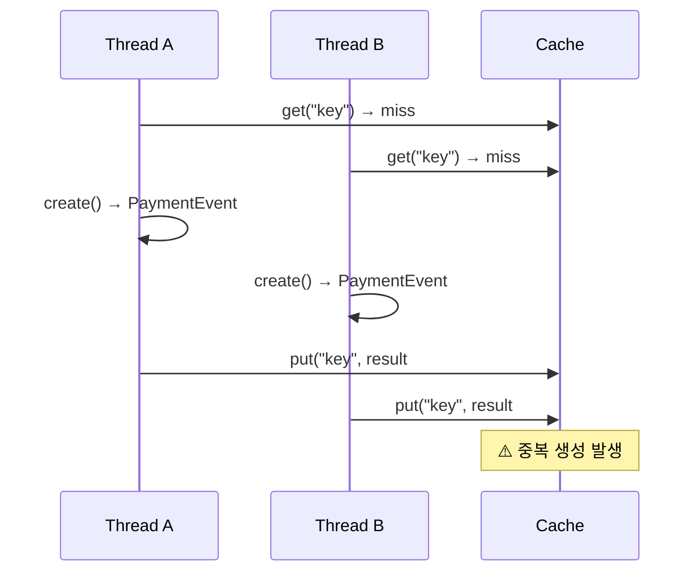
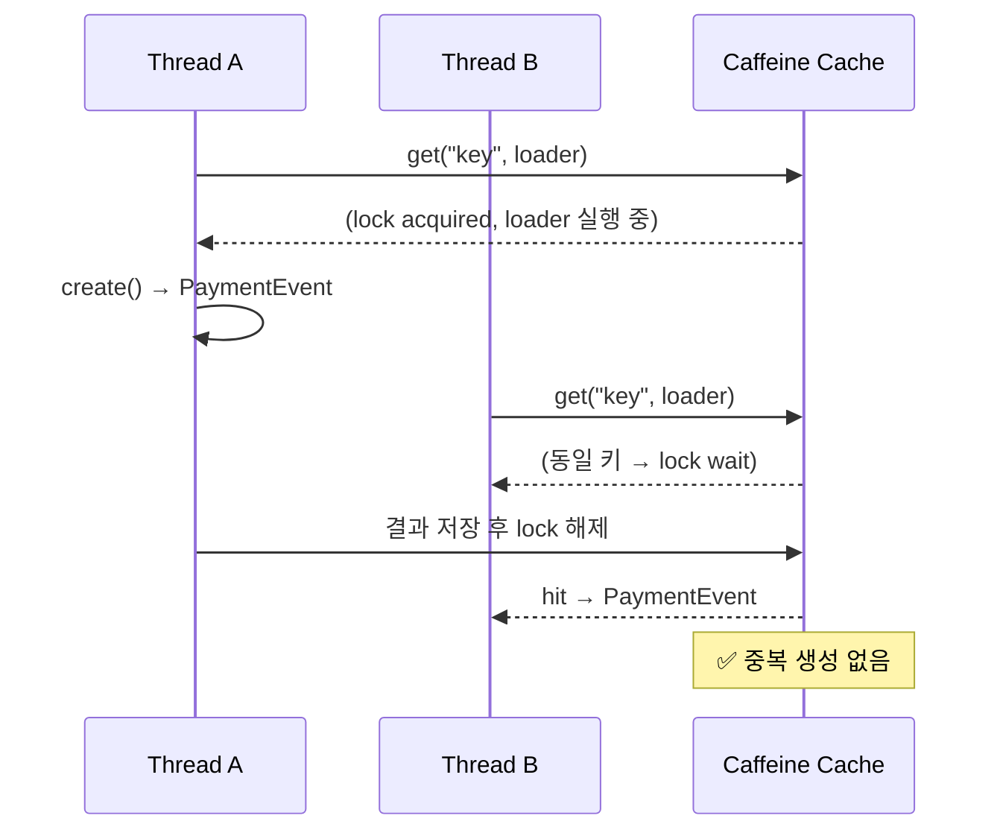

> 실행 환경: Java 21, Spring Boot 3.4.x, MySQL 8.0

## 배경

결제 플랫폼의 `POST /checkout` API는 호출마다 새 orderId를 발급하고 `PaymentEvent`를 생성한다.
UI 중복 클릭, 클라이언트 네트워크 재시도, 버그로 인한 반복 호출이 발생하면 각 요청이 독립적인 `PaymentEvent`를 생성해 DB에 READY 상태의 유효하지 않은 주문이 누적된다.

## 설계 고민

### 멱등성 구현 방식 선택

프로젝트는 단일 서버 벤치마크 환경이므로 별도 인프라 없이 구현 가능한 Caffeine을 선택했다.

|          방식          |             장점             |           단점           |
|:--------------------:|:--------------------------:|:----------------------:|
|     클라이언트 멱등성 키      |   Stripe 등 표준 패턴, 의미 명확    |      클라이언트 협력 필요       |
| DB Unique Constraint |  추가 인프라 불필요, 트랜잭션 정합성 보장   |  예외 흐름 제어, TTL 관리 필요   |
|    Redis SETNX EX    |   원자적, TTL 자동, 다중 서버 지원    |      Redis 인프라 필요      |
|   Caffeine 인메모리 캐시   | 인프라 불필요, 구현 단순, 원자적 API 지원 | 서버 재시작 시 소실, 단일 서버만 가능 |

단, 추후 Redis로 교체할 수 있도록 `IdempotencyStore`를 outbound port 인터페이스로 추상화해 구현체를 분리했다.

### 멱등키 전략

키 전략은 두 가지 방식을 모두 지원하도록 설계했다.

- 클라이언트가 `Idempotency-Key` 헤더를 제공하면 해당 값을 우선 사용
- 헤더가 없으면 서버가 `SHA-256(userId + sortedProductIds + quantities)`로 body hash를 자동 파생
    - productId 기준 정렬을 적용한 이유: 상품 순서가 달라도 동일 요청으로 판단

HTTP 응답은 최초 생성 시 `201 Created`, 중복 요청 시 `200 OK`로 구분해 클라이언트가 신규/기존 여부를 판단할 수 있도록 했다.

## 1단계 구현 — getIfPresent + put

포트 인터페이스를 먼저 정의하고 구현체를 infrastructure 레이어에 두는 포트-어댑터 패턴을 적용했다.

```java
public interface IdempotencyStore {

    Optional<CheckoutResult> getIfPresent(String key);

    void put(String key, CheckoutResult result);
}
```

- 서비스는 캐시 적중 여부를 확인 후 없으면 생성, 있으면 `isDuplicate=true`를 붙여 반환하는 흐름으로 구현
- 단위 테스트용 `FakeIdempotencyStore`는 `HashMap` 기반으로 구현

## 코드 리뷰에서 발견된 문제 — TOCTOU 경쟁 조건

구현 후 코드 리뷰를 진행하면서 근본적인 문제가 발견되었다.



- `getIfPresent`와 `put` 사이에 원자성이 보장되지 않음
- 두 스레드가 동시에 miss를 확인하면 둘 다 `PaymentEvent`를 생성하는 TOCTOU(Time-Of-Check-Time-Of-Use) 경쟁 조건이 발생

단일 스레드로 실행되는 단위 테스트는 `HashMap` 기반 Fake로 문제없이 통과하면서, 테스트가 구현 결함을 검증하고 못하고 있었다.

## 2차 개선 — getOrCreate 원자적 패턴으로 재설계

TOCTOU를 해결하는 세 가지 방식을 검토했고, 이 중 `getOrCreate` 방식을 선택했다.

|             옵션             |            장점            |            단점             |
|:--------------------------:|:------------------------:|:-------------------------:|
| getOrCreate(key, supplier) | 포트 계약이 원자성 표현, 구현체 교체 용이 |  동일 키 동시 요청에서 후발 스레드 블록   |
|    DB Unique Constraint    |     영구 저장, 분산 환경 안전      |    스키마 변경 필요, 예외 흐름 제어    |
|      Fail-fast (409)       |          블로킹 없음          | 클라이언트 retry 복잡도 증가, UX 저하 |

### 블로킹 트레이드오프

`getOrCreate`의 단점은 동일 키 동시 요청에서 후발 스레드가 블로킹 되지만, 큰 리스크가 없다고 판단했다.

- 블로킹은 동일 키를 가진 요청 사이에만 발생하여 다른 키를 가진 요청은 영향을 받지 않음
- 클라이언트에서 두 번의 요청(따닥)이 연속해서 오고, 실패 처리를 하게 되면 아예 재요청해야하는 것보다 이미 생성된 값을 주는 것이 낫다고 판단



### 인터페이스 재설계

단순히 구현체만 바꾸는 것이 아니라 포트 인터페이스 시그니처도 변경했다.

```java
IdempotencyResult<CheckoutResult> getOrCreate(String key, Supplier<CheckoutResult> creator);
```

- 기존: `getIfPresent + put` 구조에서 포트는 두 메서드를 노출하고, 원자성을 어떻게 보장할지 호출자에게 책임 발생
- 개선: `getOrCreate`로 변경하면 포트 계약 자체가 원자적 수행 표현하여, 호출자는 원자성 구현 방식을 알 필요 없이 구현체만 교체 가능

## 테스트

### 동시성 E2E 통합 테스트 — PaymentCheckoutConcurrencyIntegrationTest

단위 테스트만으로는 실제 경쟁 조건을 재현하기 어렵다고 판단하여, MySQL + MockMvc 환경의 멀티 스레드 테스트를 진행했다.

|        시나리오        |                    검증 내용                     |
|:------------------:|:--------------------------------------------:|
| 동일 키, N개 스레드 동시 요청 |      `payment_event` 1개만 생성, 모든 요청 2xx       |
|   동일 키, 순차 2회 요청   | 첫 번째 `201 Created`, 두 번째 `200 OK`, DB 레코드 1개 |
| 서로 다른 키, N개 동시 요청  |  `payment_event` N개 독립 생성, 모두 `201 Created`  |

## 결론

`getIfPresent + put` 구조는 TOCTOU 경쟁 조건을 내포하는 것에서, `getOrCreate` 단일 원자적 메서드로 포트 계약을 재설계해 문제를 해결했다.

|            구현체             |                   원자성 방법                   |  적합 환경  |
|:--------------------------:|:------------------------------------------:|:-------:|
|    IdempotencyStoreImpl    | `Cache.get(key, loader)` — loader 1회 실행 보장 | 단일 JVM  |
| RedisIdempotencyStore (미래) |           SETNX 선예약 → 실행 → 결과 저장           | 다중 인스턴스 |
| FakeIdempotencyStore (테스트) |    `ConcurrentHashMap.computeIfAbsent`     | 테스트 환경  |

## 한계 및 향후 개선

- 서버 재시작 시 Caffeine 캐시 휘발 문제 존재
- 프로덕션 전환 시 다음 중 하나 고려
    - DB Unique Constraint: `idempotency_key` 유니크 제약으로 최후 제약 조건 추가
    - Redis 구현체: `SETNX` 기반 분산 원자적 처리로 포트 교체
