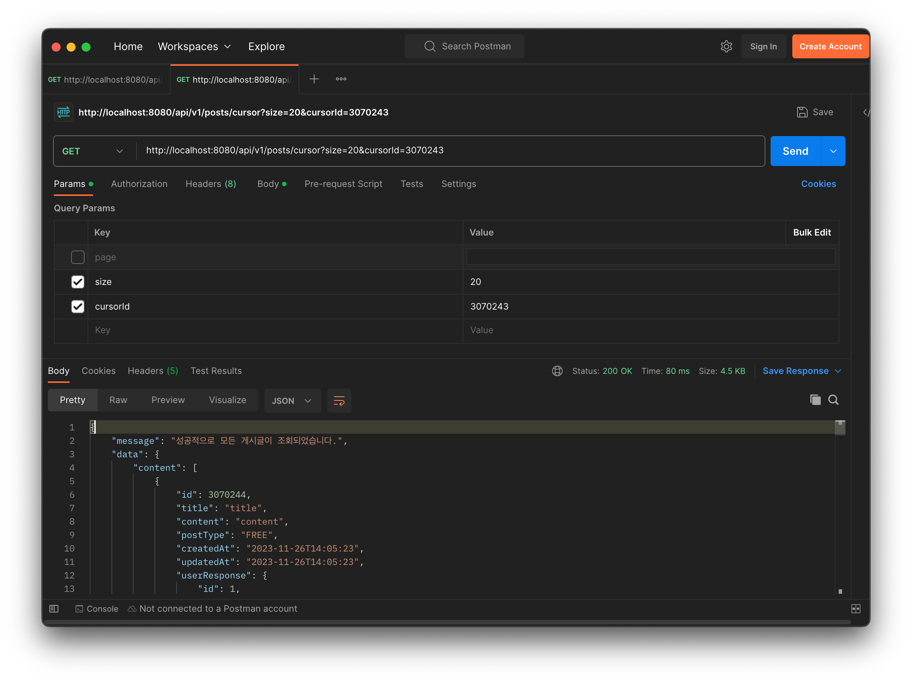
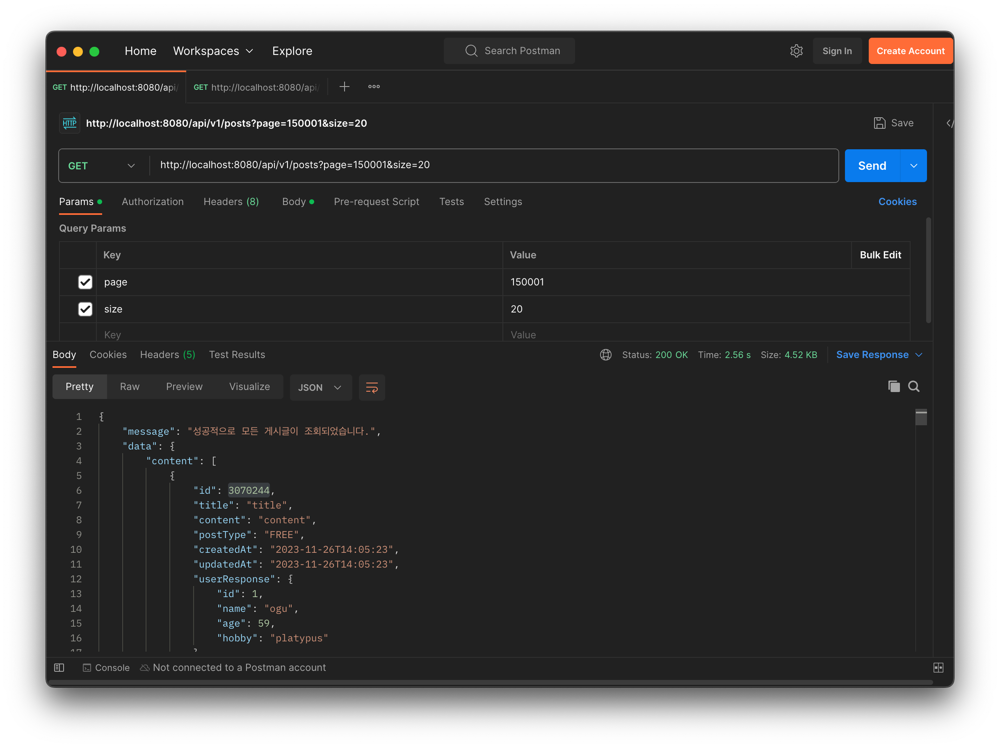
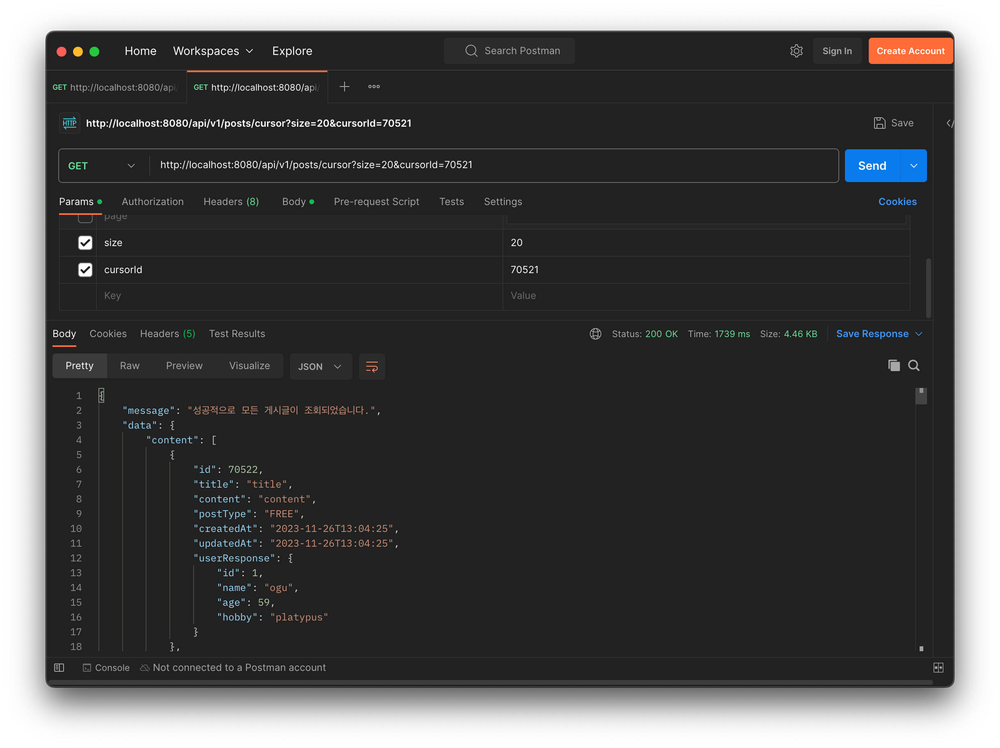
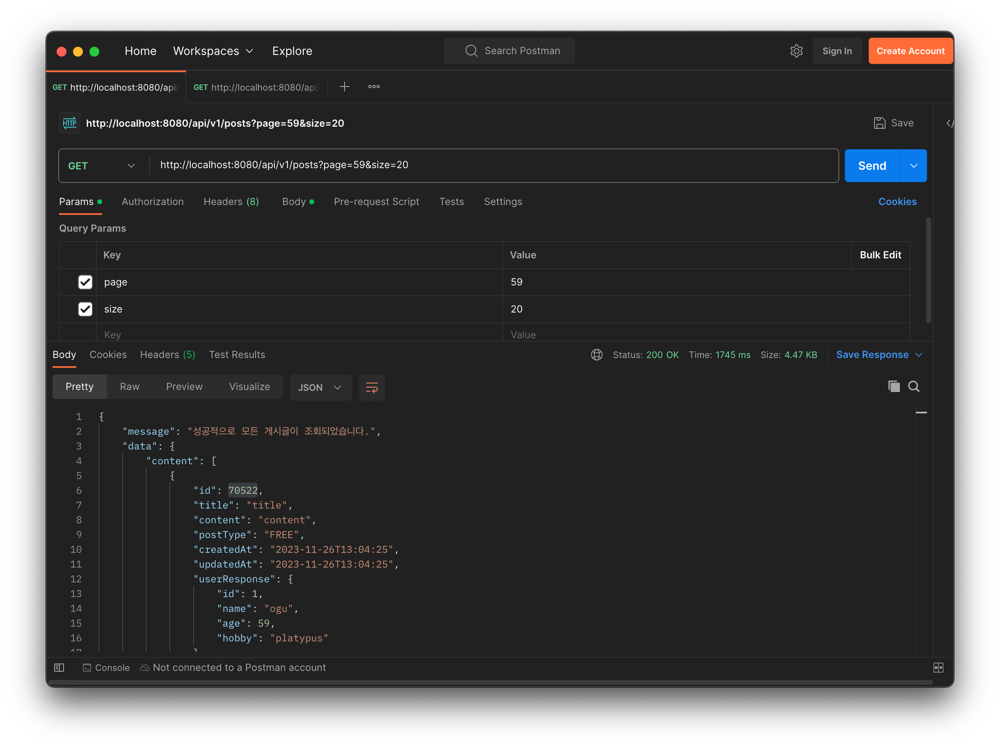
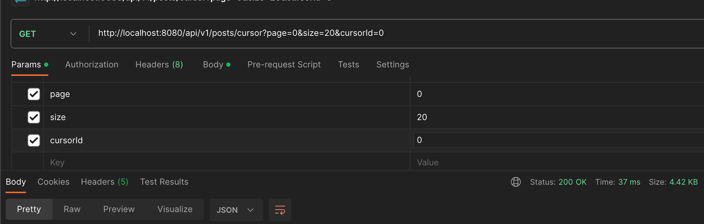
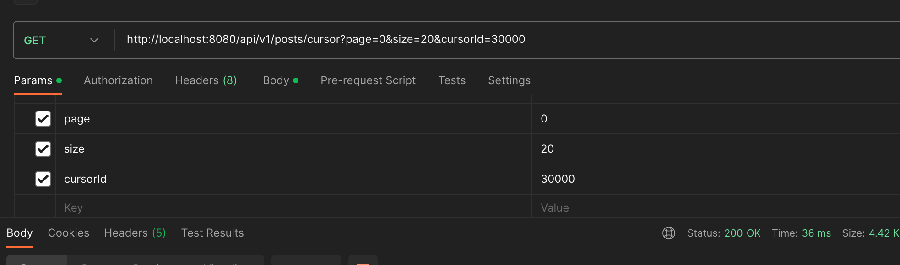

> 실행 환경: Java 17, Spring Boot 3.1.5, MySQL 8.0.33

Offset이 아닌 Cursor 기반으로 페이징 처리를 하면 성능이 향상된다는 이야기는 들었으나, 실제로 적용해볼 기회가 없어 이번 기회에 적용해보았다.  
기존 단순 Offset 기반으로 페이징 처리된 코드와 Cursor 기반으로 페이징 처리된 코드와 성능을 비교해보고자 했는데,  
그 과정에서 의도대로 동작하지 않는 부분이 있어 이에 대한 원인과 해결 방법을 포스팅하게 되었다.

## Pagination

만약 한 번에 100만개의 데이터를 가져온다고 가정하면, 서버는 모든 100만개의 데이터를 메모리에 올리게 되고, 이를 클라이언트에게 전달하게 된다.  
이렇게 되면 통신 비용이 많이 들고, 서버의 메모리를 많이 사용하게 되어 성능 저하나 메모리로 인한 서버 다운 등의 문제가 발생할 수 있다.

때문에 특정 개수만큼 가져오는 페이지네이션이라는 기법을 사용하고 있으며, 이를 구현하는 방법은 크게 두 가지가 있다.

- Offset 기반: MySQL의 `LIMIT`과 `OFFSET`을 사용하여 구현
- Cursor 기반: MySQL의 `LIMIT`과 `WHERE`을 사용하여 구현

이 방식들의 자세한 설명과 장단점은 아래와 같이 정리할 수 있다.

### Offset

SQL의 `LIMIT`과 `OFFSET`을 사용하여 구현하는 방식으로, 간단하고 쉽게 구현할 수 있으며 Cursor에 비해 여러 기능을 구현하기 쉽다.

```sql
SELECT *
FROM table
LIMIT 10 OFFSET 10; -- 11번째부터 10개의 데이터를 가져온다.
```

구현하기 쉽다는 장점이 있지만, 단점도 존재한다.

1. 조회한 데이터가 많고, 건너 뛰는(OFFSET) 데이터가 많을 경우 성능이 저하된다.
2. 데이터가 삭제되거나 추가되면 페이지네이션의 결과가 달라질 수 있다.(2번 페이지에서 확인한 데이터가 다음 페이지에서 다시 노출될 수 있음)

### Cursor

SQL의 `LIMIT`과 `WHERE`을 사용하여 구현하는 방식으로, `LIMIT`과 `OFFSET` 방식의 단점을 보완할 수 있다.

```sql
SELECT *
FROM table
WHERE id > 10 -- id가 10보다 큰 데이터를 가져온다.(OFFSET 기능을 수행)
LIMIT 10; -- 10개의 데이터를 가져온다.
```

이렇게 되면 건너 뛰는 데이터를 WHERE 절에서 처리하기 때문에 성능이 저하되지 않지만, 이 방식에도 단점이 존재한다.

1. WHERE 절에 사용되는 컬럼은 중복이 없고(UNIQUE), 인덱스가 존재해야 한다.(적용할 순 있으나 성능이 저하될 수 있음)
2. 1페이지에서 5페이지 데이터를 바로 조회하는 기능(정확한 데이터 개수만큼 건너 뛰어서 조회하는 기능)을 구현하기 어렵다.

때문에 Cursor 기반으로 페이징 처리가 가능한 기능이면 Cursor 기반으로 페이징 처리를 하고, 그 외의 경우에는 다른 방법(커버링 인덱스 등)을 고려해보는 것이 좋다.

### 성능 비교

각 방법의 성능 차이는 건너 뛰는 개수가 커질 수록 성능 차이가 커지는 것을 확인할 수 있었다.(데이터 3,260,000개 기준, 5회 측정)  
우선 Offset 기반으로 페이징 처리를 한 경우의 성능은 아래와 같다.

```sql
SELECT *
FROM posts
LIMIT 0, 20; # 40~80ms

SELECT *
FROM posts
LIMIT 1000000, 20; # 40~80ms

SELECT *
FROM posts
LIMIT 2000000, 20; # 500ms~600ms

SELECT *
FROM posts
LIMIT 3000000, 20; # 800ms~900ms
```

Offset 기반은 건너 뛰는 개수에 따라 쿼리 속도가 선형적으로 증가하는 것을 확인할 수 있다.  
반면 Cursor 기반으로 페이징 처리를 한 경우의 성능은 아래와 같다.

```sql
SELECT *
FROM posts
WHERE id > 0 # 50~70ms
LIMIT 20;

SELECT *
FROM posts
WHERE id > 1000000 # 50~70ms
LIMIT 20;

SELECT *
FROM posts
WHERE id > 2000000 # 50~70ms
LIMIT 20;

SELECT *
FROM posts
WHERE id > 3000000 # 50~70ms
LIMIT 20;
```

Cursor 기반은 건너 뛰는 개수에 따라 쿼리 속도가 일정하고 최대 약 20배 정도 빠른 것을 확인할 수 있다.

## Spring Data JPA에서 Cursor 기반 페이징 처리

MySQL에서 유의미한 차이를 확인한 뒤 Spring Data JPA에서 Cursor 기반으로 페이징 처리를 하기 위해 아래와 같이 코드를 작성했다.

```java
public interface PostRepository extends JpaRepository<Post, Long> {

    // Offset 기반 페이징 처리
    @Query("select p from Post p join fetch p.user")
    Page<Post> findAllWithUser(Pageable pageable);

    // Cursor 기반 페이징 처리(새롭게 추가한 코드)
    @Query("select p from Post p join fetch p.user where p.id > :cursorId")
    Page<Post> findAllWithUserByCursor(Long cursorId, Pageable pageable);
}
```

그 후 Postman을 통해 테스트를 진행했으나 의도와는 다르게 동작하는 것을 확인할 수 있었다.  
우선 의도대로 동작한 케이스를 확인해보자.

- 의도대로 동작한 Cursor 기반 조회



- 의도대로 동작한 Offset 기반 조회



건너 뛰는 것이 많은 케이스일 땐(page 150000, 약 3,000,000개) 우리가 원하는, 그리고 위에서 확인한 성능 차이가 나는 것을 확인할 수 있었다.  
하지만 건너 뛰는 것이 적은 케이스일 땐(page 59, 약 1,200개) 성능 차이가 거의 없는 것을 확인할 수 있었다.

- 의도하지 않은 결과 Cursor 기반 조회



- 의도하지 않은 결과 Offset 기반 조회



### 원인

결론부터 말하자면 위 구현 코드에서 `Page` 타입으로 반환하고 있기 때문이다.(`Page` 타입 반환은 내용 뿐만 아니라 개수에 대한 정보도 같이 반환한다.)

```json
{
  "message": "성공적으로 모든 게시글이 조회되었습니다.",
  "data": {
    "content": [
      ...
    ],
    "pageable": {
      ...
    },
    "totalPages": 6300,
    "totalElements": 126000,
    ...
  }
}
```

이런 정보를 반환하기 위해 `COUNT` 쿼리를 실행하고 있기 때문인데, 결국에 요청하는 쿼리는 아래와 같이 된다.

- Offset 기반 조회: WHERE 조건 없이 전체 데이터에 대한 OFFSET + 데이터 전체 건 수 COUNT
- Cursor 기반 조회: WHERE 조건에 맞는 데이터에 대한 OFFSET + WHERE 조건에 맞는 데이터 전체 건 수 COUNT

그럼 COUNT 쿼리가 성능에 어떤 영향을 주었길래 이렇게 성능 차이가 발생했을까?  
이유엔 크게 아래 세 가지 요인이 있다.

- offset 특성 상 건너 뛰는 데이터가 적을 땐 성능 저하가 적음
- 조건 없는 COUNT 쿼리 요청 시 많은 건을 조회하는 WHERE 보다 빠르게 조회됨
  ([참고](/blog/how-count-query-work/))
- 조건에 잡힌 데이터가 많을 수록 COUNT 쿼리의 속도 저하가 커짐

```sql
-- 전체 데이터에 대한 COUNT 쿼리
SELECT COUNT(*)
FROM posts;
-- 300ms

-- 조건에 잡힌 데이터가 적은 경우 COUNT 쿼리
SELECT COUNT(*)
FROM posts
WHERE id > 3000000;
-- 50~100ms

-- 조건에 잡힌 데이터가 많은 경우 COUNT 쿼리
SELECT COUNT(*)
FROM posts
WHERE id > 50000;
-- 500~700ms
```

때문에 결과적으로 아래와 같은 결과가 나오게 된다.

- Offset 기반 쿼리: 건너 뛰는 데이터가 적음(성능 저하가 적음) + WHERE 조건 없이 COUNT 쿼리 요청(성능 저하가 적음)
- Cursor 기반 쿼리: 건너 뛰는 데이터가 많음(성능 동일) + WHERE 조건에 잡힌 데이터가 많은 COUNT 쿼리 요청(성능 저하가 큼)

결국 Offset 기반 쿼리는 성능 저하가 적은 쿼리가 실행되고, Cursor 기반 쿼리는 성능 저하가 큰 쿼리가 실행되어 성능이 서로 거의 비슷해지는 상황이 발생하게 된 것이다.

### 해결 방법

Cursor 기반 페이징의 경우 전체 데이터 건 수를 꼭 가져올 필요가 없기 때문에 Count 쿼리를 실행하지 않도록 수정하면 된다.   
`Page` 타입이 아닌 `Slice` 타입으로 반환하도록 수정하면 Count 쿼리가 실행되지 않게 된다.

```java
// Page.java, Page는 Slice를 상속받으면서 개수에 대한 정보만 추가로 가지고 있다.
public interface Page<T> extends Slice<T> {

    static <T> Page<T> empty() {
        return empty(Pageable.unpaged());
    }

    static <T> Page<T> empty(Pageable pageable) {
        return new PageImpl<>(Collections.emptyList(), pageable, 0);
    }

    int getTotalPages();

    long getTotalElements();

    <U> Page<U> map(Function<? super T, ? extends U> converter);
}
```

```java
public interface PostRepository extends JpaRepository<Post, Long> {

    // Page -> Slice로 수정
    @Query("select p from Post p join fetch p.user where p.id > :cursorId")
    Slice<Post> findAllWithUserByCursor(Long cursorId, Pageable pageable);
}
```

이렇게 `Slice` 타입으로 반환하면 Count 쿼리가 실행되지 않기 때문에 기존에 구현했던 Cursor 기반 쿼리의 성능이 향상되면서 일정한 성능을 유지할 수 있게 된다.




