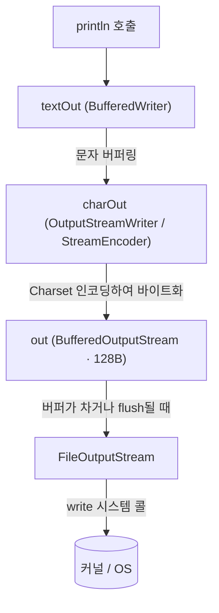
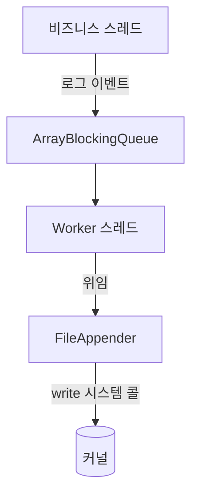

> 측정 환경: Corretto JDK 24 (macOS), 인용 코드는 JDK 24의 `java.base` 소스 기준

`System.out.println()` 한 줄은, 반복문이나 다중 스레드 환경에서 애플리케이션의 처리량을 끌어내리는 병목이 되기도 한다.

- `System.out.println()`은 한 줄을 출력하기 위해 내부에서 무슨 일을 하는가
- 그 과정의 어떤 비용이 성능을 떨어뜨리는가
- 어떻게 개선할 수 있으며, 로깅 프레임워크는 무엇이 다른가

`PrintStream` 클래스는 `OutputStream`을 상속받아 출력 스트림을 구현하며, 다양한 타입의 데이터를 출력할 수 있는 메서드를 제공한다.

```java
void main() {
    System.out.println("Hello, World!");
}
```

`System.out`은 `PrintStream` 타입의 static 객체이며, `println()`을 포함한 다양한 출력 메서드를 제공하여 간편하게 콘솔에 데이터를 출력할 수 있다.

## `System.out`의 초기화 과정과 `PrintStream` 인스턴스 생성

`PrintStream`을 import하거나 인스턴스를 생성 없이 `System.out.println()`을 바로 사용할 수 있는데, 그 이유는 다음과 같다.

- `System` 클래스는 `java.lang` 패키지에 포함되어 있으며, 기본적으로 import되는 패키지이기 때문에 별도 import 없이 사용 가능
- `System` 클래스 내부에 `PrintStream` 타입의 static 필드 `out`이 정의

```java

public final class System {

    /* Register the natives via the static initializer.
     *
     * The VM will invoke the initPhase1 method to complete the initialization
     * of this class separate from <clinit>.
     */
    private static native void registerNatives();

    static {
        registerNatives();
    }

    private System() {
    }

    public static final PrintStream out = null;

    // ...
}
```

`out`은 처음에는 `null`로 선언되어 있지만, JVM이 초기화 과정에서 실제 `PrintStream` 객체로 할당하게 된다.

1. `System.out`은 Java 코드 상으로는 `null`로 선언되어 있으나, 이는 컴파일 시점 값
2. `registerNatives()`라는 native 메서드가 `System` 클래스 초기화 블록에서 호출
3. JVM의 `initPhase1()`에서 입출력 스트림을 직접 설정

이 작업은 Java 코드가 아닌 JVM 내부 native 코드에서 수행되며, 실제로는 메모리 상의 `System.out` 필드에 객체가 강제로 할당된다.

이때 `initPhase1()`이 만들어 주는 `System.out`의 실제 구성은 다음과 같다.

```java
// java.lang.System
private static PrintStream newPrintStream(OutputStream out, String enc) {
    if (enc != null) {
        return new PrintStream(new BufferedOutputStream(out, 128), true,
                Charset.forName(enc, UTF_8.INSTANCE));
    }
    return new PrintStream(new BufferedOutputStream(out, 128), true);
}
```

- 최하위 스트림은 표준 출력(stdout)에 연결된 `FileOutputStream`이며, 그 위를 128바이트 `BufferedOutputStream`이 래핑
- `PrintStream`은 `autoFlush=true`로 생성되며, 이 설정값이 뒤에서 다룰 성능 이슈의 핵심 원인이 됨

## PrintStream의 스트림 계층 구조

`println()`이 호출한 문자열은 곧바로 OS로 나가지 않고, `PrintStream` 내부의 여러 계층을 거쳐 전달된다.

```java
private PrintStream(boolean autoFlush, OutputStream out) {
    super(out);
    // ...
    this.charOut = new OutputStreamWriter(this, charset);
    this.textOut = new BufferedWriter(charOut);
    // ...
}
```

`PrintStream`은 생성 시 다음과 같이 중간 계층을 구성하며, 각 계층의 역할은 다음과 같이 구분된다.

|    계층     |           타입           |               역할                |
|:---------:|:----------------------:|:-------------------------------:|
| `textOut` |    `BufferedWriter`    |         문자(char) 단위 버퍼링         |
| `charOut` |  `OutputStreamWriter`  | 내부 `StreamEncoder`로 Charset 인코딩 |
|   `out`   | `BufferedOutputStream` |     인코딩된 바이트를 모았다가 하위로 내보냄      |



1. 문자열은 `textOut`에서 문자 버퍼에 저장
2. `charOut`에서 바이트로 인코딩
3. `out`의 바이트 버퍼를 거쳐 최종적으로 `FileOutputStream`이 `write` 시스템 콜을 통해 커널로 전달

## `System.out.println()` 내부 구현 코드 분석

`System.out.println("Hello, World!")`처럼 문자열을 출력하면 `println(String x)`가 호출되며, 그 흐름은 다음과 같다.

```java
public void println(String x) {
    if (getClass() == PrintStream.class) {
        writeln(String.valueOf(x));
    } else {
        // 하위 클래스 확장 시의 예외적 경로
        synchronized (this) {
            print(x);
            newLine();
        }
    }
}
```

`getClass() == PrintStream.class` 분기는 `PrintStream`을 그대로 쓰는 경우와 상속받아 오버라이드한 경우를 가르는 최적화 장치다.

- `System.out`은 JVM이 직접 생성한 순수 `PrintStream` 인스턴스이므로 항상 `writeln()` 경로로 실행
- 하위 클래스라면 오버라이드된 `print()`/`newLine()`이 호출되어야 하므로 별도 경로로 분기
- `println(Object)` 등 다른 오버로드도 동일한 구조로 `writeln()`을 호출

`writeln(String s)`의 상세 구현을 살펴보면 다음과 같다.

```java
private void writeln(String s) {
    try {
        synchronized (this) {
            ensureOpen();
            textOut.write(s);
            textOut.newLine();
            textOut.flushBuffer();
            charOut.flushBuffer();
            if (autoFlush)
                out.flush();
        }
    } catch (InterruptedIOException x) {
        Thread.currentThread().interrupt();
    } catch (IOException x) {
        trouble = true;
    }
}
```

1. ensureOpen()
    - 스트림이 닫히지 않았는지 확인
    - 닫힌 경우 `IOException` 발생시켜 출력 중단
2. textOut.write(s) / textOut.newLine()
    - 문자열 및 줄바꿈 문자를 내부 문자 버퍼(`BufferedWriter`)에 쓰기 수행
    - 개행은 플랫폼에 맞는 \n, \r\n 등 줄바꿈 문자로 추가
    - 실제 출력은 하지 않고, 버퍼에만 저장
3. textOut.flushBuffer()
    - 문자 버퍼에 저장된 내용을 `charOut`으로 흘려보내 지정된 Charset으로 인코딩
    - 인코딩된 바이트 배열 데이터를 `StreamEncoder` 내부에 저장
4. charOut.flushBuffer()
    - `StreamEncoder`에 저장된 바이트 데이터를 최하위 출력 스트림 `out`으로 전달
    - 이 단계까지는 `out`의 바이트 버퍼에 쌓일 뿐, OS로 나가지는 않음
5. if (autoFlush) out.flush()
    - `System.out`은 `autoFlush=true`이므로 매 호출마다 `out.flush()`를 수행
    - 버퍼에 남은 데이터까지 강제로 비워 즉시 출력되도록 보장하며, 이때 native 메서드를 통해 실제 `write` 시스템 콜이 발생

## 성능 저하의 원인

`println()` 한 번의 호출은 동기화·인코딩·시스템 콜을 모두 포함하는 복잡한 경로를 거치면서, 서로 다른 비용이 한 줄마다 동시에 발생하기 때문에 매우 비싼 작업이 된다.

### autoFlush=true: 한 줄마다 시스템 콜

`System.out`의 최하위 스트림은 128바이트 `BufferedOutputStream`이지만, `autoFlush=true` 때문에 이 버퍼는 사실상 무효화된다.

- `autoFlush=true`는 매 `println()`마다 `out.flush()`를 호출하여, 버퍼가 채워지기도 전에 비우도록 강제
- 결국 줄 단위로 `write` 시스템 콜이 발생하여, 출력 라인 수만큼 시스템 콜도 반복
- 시스템 콜마다 사용자 모드에서 커널 모드로 전환하는 Mode Switch 비용이 누적

### synchronized(this): 단일 인스턴스 전역 락

`writeln()` 전체가 `synchronized (this)` 블록으로 감싸져 있으며, 여기서 `this`는 애플리케이션 전체가 공유하는 단 하나의 `System.out` 인스턴스다.

- 모든 스레드가 동일한 객체 모니터를 두고 경쟁하므로, 출력 구간이 사실상 직렬화됨
- 한 스레드가 락을 쥔 채 IO를 수행하는 동안 나머지 스레드는 모니터 진입을 위해 대기
- 출력 순서는 보장되지만, 그 대가로 처리량이 저하

### 블로킹 IO: 출력 완료까지 스레드 대기

최하위 스트림의 `write`는 블로킹 IO이므로, 시스템 콜이 반환될 때까지 호출 스레드가 멈춰 있다.

- 콘솔/디스크 IO 속도는 CPU 연산보다 수십~수백 배 느림
- 락을 쥔 스레드가 블로킹된 동안 대기 중인 스레드들도 함께 멈추는 연쇄 지연 발생
- 톰캣처럼 다수의 요청 스레드가 동시에 출력을 시도하는 환경에서는 락 경합과 블로킹이 겹쳐 처리량이 급격히 저하

### 실측 - 출력 방식별 처리량 비교

세 비용이 만드는 실제 차이를 확인하기 위해, 100만 줄을 출력하는 벤치마크를 수행했다.

- 출력 대상을 `/dev/null`로 통일해 콘솔·디스크 렌더링 속도의 영향 제거
- autoFlush 여부와 스레드 수만 변수로 두고 나머지 조건은 동일하게 유지
- Corretto JDK 24, 측정 전 JIT 워밍업 수행

비교 대상은 autoFlush 설정만 다른 두 가지 출력 구성이다.

- `sysoutLike`: `System.out`과 동일한 128바이트 버퍼 + `autoFlush=true`
- `buffered`: 버퍼를 8KB로 키우고 `autoFlush=false`

각 구성을 두 가지 부하로 측정을 수행했다.

- 단일 스레드: 한 스레드가 100만 줄을 순차로 출력 (순수 출력 경로의 비용)
- 8 스레드 환경: 8개 스레드가 같은 스트림에 동시에 출력 (`synchronized (this)` 락을 두고 벌이는 경쟁 비용까지 포함)

```java

public class PrintBenchmark {

    static final int TOTAL_LINES = 1_000_000;
    static final String LINE = "log line";

    public static void main(String[] args) throws Exception {
        // System.out과 동일한 구성: 128바이트 버퍼 + autoFlush=true
        PrintStream sysoutLike = new PrintStream(
                new BufferedOutputStream(new FileOutputStream("/dev/null"), 128), true);
        // 버퍼를 8KB로 키우고 autoFlush=false
        PrintStream buffered = new PrintStream(
                new BufferedOutputStream(new FileOutputStream("/dev/null"), 8192), false);

        warmUp(sysoutLike, buffered); // 측정 전 JIT 컴파일 유도

        report("PrintStream(128B + autoFlush)", sysoutLike);
        report("PrintStream(8KB)", buffered);
    }

    static void report(String name, PrintStream ps) {
        System.err.printf("%-30s 1T=%4dms  8T=%4dms%n", name, measure(1, ps), measure(8, ps));
    }

    // threads개의 스레드가 TOTAL_LINES를 나눠 출력하고, 전체 소요 시간(ms)을 반환
    static long measure(int threads, PrintStream ps) {
        int perThread = TOTAL_LINES / threads;

        long start = System.nanoTime();
        try (ExecutorService pool = Executors.newFixedThreadPool(threads)) {
            for (int t = 0; t < threads; t++) {
                pool.submit(() -> {
                    for (int i = 0; i < perThread; i++) {
                        ps.println(LINE);
                    }
                });
            }
        } // try 블록을 벗어날 때 close()가 모든 작업이 끝날 때까지 대기
        return (System.nanoTime() - start) / 1_000_000;
    }

    static void warmUp(PrintStream... streams) {
        for (int i = 0; i < 3; i++) {
            for (PrintStream ps : streams) {
                measure(1, ps);
            }
        }
    }
}
```

|                          방식                          | 단일 스레드  | 8 스레드 경합 |
|:----------------------------------------------------:|:-------:|:--------:|
| `PrintStream`(buffer 128 + autoFlush, System.out 유사) | 약 710ms | 약 1060ms |
|     `PrintStream`(buffer 8KB + autoFlush=false)      | 약 70ms  | 약 120ms  |

두 수치 모두 앞서 분석한 비용과 그대로 대응하는 결과를 보여준다.

- `sysoutLike` (710ms): autoFlush가 매 줄 `out.flush()`를 호출하면서, 출력 라인 수만큼 `write` 시스템 콜 발생
- `buffered` (70ms): autoFlush를 끄면 8KB 버퍼가 찰 때만 flush되어 시스템 콜 횟수 대폭 감소로, 단일 스레드 기준 약 10배 빠른 처리량 달성
- 8 스레드 경합: 두 구성 모두 느려지는데(710 → 1060, 70 → 120), 이는 `synchronized (this)` 락을 두고 벌이는 경쟁 비용과 블로킹 IO로 인한 연쇄 지연이 추가되기 때문

## 로깅 프레임워크에 위임

운영 환경에서는 버퍼링과 비동기 처리를 직접 구현하는 대신 Logback 같은 로깅 프레임워크를 사용한다.

|   항목   |       `System.out.println`        |    `FileAppender`(immediateFlush=true)     |
|:------:|:---------------------------------:|:------------------------------------------:|
| flush  |      autoFlush로 줄마다 syscall       |          동일(immediateFlush=true)           |
|   락    | JVM에 하나뿐인 인스턴스의 전역 `synchronized` |       어펜더별 `ReentrantLock`(격리·분리 가능)       |
| 출력 대상  |    FD 1(stdout) — 터미널·공유 파일 고정    |              지정 파일(분리·롤링 가능)               |
| 레벨·라우팅 |            없음 (항상 출력)             |               레벨·필터·로거별 라우팅                |
|   튜닝   |           autoFlush 고정            | `immediateFlush=false`·`AsyncAppender`로 전환 |

성능을 좌우하는 두 어펜더는 다음과 같다.

- `FileAppender`: 8KB `BufferedOutputStream`으로 버퍼링 (`immediateFlush=false`면 줄마다 flush하지 않음)
- `AsyncAppender`: 로그 이벤트를 큐에 넣어 워커 스레드가 실제 IO를 처리하도록 비즈니스 스레드와 분리



위 두 가지를 사용하는 Logback 설정 예시는 다음과 같다.

```xml

<configuration>
  <!-- 디스크로 쓰는 FileAppender: 내부적으로 8KB BufferedOutputStream에 버퍼링 -->
  <appender name="FILE" class="ch.qos.logback.core.FileAppender">
    <file>app.log</file>
    <!-- false면 버퍼가 찰 때까지 flush를 미뤄 시스템 콜을 줄임 (처리량 우선) -->
    <immediateFlush>false</immediateFlush>
    <encoder>
      <pattern>%d{HH:mm:ss.SSS} [%thread] %-5level %logger - %msg%n</pattern>
    </encoder>
  </appender>

  <!-- FileAppender를 비동기로 감싸 실제 IO를 워커 스레드로 분리 -->
  <appender name="ASYNC" class="ch.qos.logback.classic.AsyncAppender">
    <appender-ref ref="FILE"/>
    <queueSize>8192</queueSize>                   <!-- 로그 이벤트 큐 크기 -->
    <discardingThreshold>0</discardingThreshold>  <!-- 큐가 차도 어떤 레벨도 버리지 않음 -->
    <neverBlock>false</neverBlock>                <!-- 큐가 가득 차면 블로킹하여 이벤트 유실 방지 -->
  </appender>

  <root level="INFO">
    <appender-ref ref="ASYNC"/>
  </root>
</configuration>
```

- `immediateFlush=false`: 버퍼가 찰 때까지 flush를 미뤄 시스템 콜을 줄임(기본값 `true`는 비정상 종료 시 유실 방지를 우선)
- `queueSize`·`neverBlock`: 백프레셔(Backpressure)를 통제 — 큐가 가득 차면 블로킹(`false`)할지 이벤트를 버릴지(`true`) 선택
- `discardingThreshold=0`: 큐가 차도 `INFO` 이하 로그까지 보존(기본값 `queueSize/5`는 일부 drop)

### 실측 - 실제 서비스 환경의 응답 시간

앞의 간단한 벤치마크는 단일 프로세스의 출력 경로 비용만 봤으므로, 이제 실제 웹 애플리케이션에서 로깅 프레임워크로 해결했을 때 동시 요청의 응답 시간이 어떻게 달라지는지 측정했다.

- Spring Boot + Tomcat에서 `GET /log/{mode}?lines=200`이 요청당 로그 200줄을 남기도록 구성
- 동시 100개 요청을 12초간 반복하며 요청 응답 시간 분포(p99)와 처리량(RPS)을 측정
- 기동 시 각 출력기를 미리 호출해 JIT를 워밍업한 뒤 측정
- `immediateFlush=false`는 버퍼 크기를 256B·8KB·64KB 세 가지로 나눠 비교
- 동일 인코더(타임스탬프·레벨·스레드 포함)로 같은 로그를 남겨, 버퍼·flush·async 등 출력 메커니즘만 변수로 둠
- `System.out` 구성은 128B 버퍼 + 매 이벤트 flush(autoFlush와 동일 동작)로 구성

```java

@GetMapping("/log/{mode}")
public String log(@PathVariable String mode, @RequestParam(defaultValue = "200") int lines) {
    // 모드별 로거는 출력 메커니즘만 다르고 인코더(로그 포맷)는 동일
    /*
    sysout(128B+flush) / 
    sync-true(8KB+flush) / 
    sync-false-256·8k·64k / 
    async 
     */
    Logger lg = LOGGERS.get(mode);
    for (int i = 0; i < lines; i++) {
        lg.info("order processed id={} user={} amount={} status={}", i, "user-" + (i % 100), i * 13, "OK");
    }
    return "ok";
}
```

|                모드                 |  RPS  |  p50   |  p99   |
|:---------------------------------:|:-----:|:------:|:------:|
| `System.out` 구성(128B + autoFlush) | ~900  | ~105ms | ~190ms |
|  `FileAppender`(flush=true, 8KB)  | ~930  | ~105ms | ~180ms |
| `FileAppender`(flush=false, 256B) | ~1360 | ~72ms  | ~145ms |
| `FileAppender`(flush=false, 8KB)  | ~4100 | ~23ms  | ~50ms  |
| `FileAppender`(flush=false, 64KB) | ~4300 | ~22ms  | ~45ms  |
| `AsyncAppender`(flush=false, 8KB) | ~4900 | ~20ms  | ~39ms  |

- 줄마다 flush하는 두 구성(`System.out` 구성, `immediateFlush=true`)이 가장 느리고 서로 거의 동일(~1000 RPS)
    - 트리거는 다르지만(autoFlush는 개행, `immediateFlush`는 매 이벤트) 둘 다 라인당 flush를 일으켜 `write` 시스템 콜이 라인 수만큼 발생한다는 비용 구조가 유사
    - 줄마다 강제로 flush되면 버퍼가 매번 비워져 여러 줄을 쌓지 못하므로, 버퍼 용량(128B·8KB)은 차이를 만들지 못함(줄 길이와 무관)
- 버퍼가 너무 작으면(256B) `immediateFlush=false`라도 개선폭이 작음
- 8KB에서 처리량이 약 4배로 뛰고(RPS 약 4100), 64KB는 추가 개선폭이 작음
- 빠른 로컬 디스크에서는 `AsyncAppender`가 큰 버퍼의 동기 구성과 큰 차이 없음
    - 비동기의 이점은 raw 처리량이 아니라, 다음 절에서 다룰 요청 스레드의 락·CPU·블로킹 비용 분리에 있음

### 비동기 분리가 효과를 내는 경우

`AsyncAppender`는 비즈니스 스레드를 출력 IO 경합에서 떼어내는데 장점이 있지만, 테스트 결과 상 아주 큰 차이를 보이지는 않았다.

- 버퍼링된 파일 출력은 `write`가 페이지 캐시로 즉시 반환되고 실제 디스크 기록은 커널이 백그라운드로 처리
- async의 강점은 인코딩·포맷 CPU, 그리고 블로킹 IO로 인한 대기 시간을 요청 스레드와의 분리
    - 이러한 비용이 응답 시간에 큰 영향을 주지 않는다면 async의 이점도 제한적

때문에 요청 스레드가 부담하던 출력 비용이 커지는 경우를 가정해보았다.

```java
// 어펜더의 출력 스트림을 `CipherOutputStream`으로 감싸 인코딩된 로그 바이트가 파일로 나가기 직전 호출 스레드에서 AES로 암호화
// 인코딩된 로그 바이트 → CipherOutputStream(AES) → 파일
void example() {
    Cipher cipher = Cipher.getInstance("AES/CTR/NoPadding");
    cipher.init(Cipher.ENCRYPT_MODE, key, new IvParameterSpec(iv));

    OutputStream target = new CipherOutputStream(
            new BufferedOutputStream(new FileOutputStream("app.log"), 8192), cipher);

    OutputStreamAppender<ILoggingEvent> appender = new OutputStreamAppender<>();
    appender.setEncoder(encoder);       // 다른 모드와 동일한 패턴 인코더
    appender.setImmediateFlush(false);  // 8KB 버퍼
    appender.setOutputStream(target);   // write 시 CipherOutputStream이 호출 스레드에서 암호화 수행
    appender.start();
}
```

동일 Spring 환경, 동시 100 요청·요청당 200줄로 측정 결과 다음과 같은 차이가 나타났다.

|              모드               |  RPS  |  p99   |
|:-----------------------------:|:-----:|:------:|
| 평문 `FileAppender`(false, 8KB) | ~4100 | ~50ms  |
|    암호화 `FileAppender`(동기)     | ~1400 | ~105ms |
|      암호화 `AsyncAppender`      | ~2970 | ~62ms  |

- 암호화는 AES-NI 가속이 있어도 매 이벤트 인코딩에 CPU가 들고, 그 비용이 어펜더 락 안에서 직렬화되어 평문 대비 처리량이 1/3로 하락
- `AsyncAppender`로 감싸면 그 암호화 CPU와 락을 워커 스레드로 떼어내 요청 스레드는 큐에 넣고 즉시 반환하므로, 처리량이 약 2배 상승

## 정리

`System.out.println()`이 비싼 이유는 한 줄을 출력할 때마다 세 가지 비용이 동시에 발생하기 때문이다.

- autoFlush=true: `write` 시스템 콜로 인한 Mode Switch
- synchronized(this): 단일 `System.out` 인스턴스 락으로 출력이 직렬화
- 블로킹 IO: 락을 쥔 스레드가 대기하는 동안 다른 스레드까지 함께 지연

로깅 프레임워크느 어펜더별 락·레벨·롤링을 얻고, 그 위에서 튜닝할 수 있다는 데 의미가 있다.

- 버퍼링(`immediateFlush=false`): 줄마다 flush를 없애 시스템 콜 감소로 인한 처리량 증가
- 비동기(`AsyncAppender`): 출력 IO·락·CPU를 비용 높은 작업으로부터 요청 스레드를 분리하여, 출력 비용이 큰 경우에도 응답 시간 개선

출력 방식별로 정리하면 다음과 같다.

|                  방식                  |                 동작                  |            적합한 곳            |
|:------------------------------------:|:-----------------------------------:|:---------------------------:|
|         `System.out.println`         |    autoFlush로 줄마다 syscall + 전역 락    |           로컬 디버깅            |
| `FileAppender`(immediateFlush=true)  |   매 이벤트 flush — `System.out`과 동급    |  기본값 · 일반 로그량(크래시에도 유실 없음)  |
| `FileAppender`(immediateFlush=false) | 버퍼 찰 때만 flush → syscall 급감, 처리량 수 배 |  대량 로깅 — 처리량 위해 크래시 유실 감수   |
|          `+ AsyncAppender`           |       출력 IO·락·CPU를 워커 스레드로 분리       | 무거운 출력 비용·느린 디스크/네트워크·대량 로깅 |

결국 출력 방식의 선택은 raw 처리량 수치가 아니라, 어떤 IO 환경에서 무엇을 보장해야 하는지를 기준으로 판단해야 한다.
