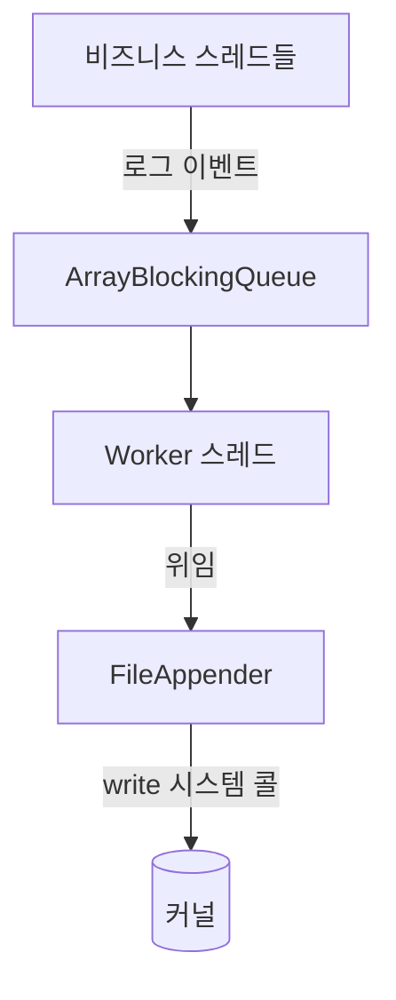

`PrintStream` 클래스는 `OutputStream`을 상속받아 출력 스트림을 구현하며, 다양한 타입의 데이터를 출력할 수 있는 메서드를 제공한다.

```java
public class Main {

    public static void main(String[] args) {
        System.out.println("Hello, World!");
    }
}
```

`System.out`은 `PrintStream` 타입의 static 객체이며, `println()`을 포함한 다양한 출력 메서드를 제공하여 간편하게 콘솔에 데이터를 출력할 수 있다.

## `System.out.println()` 호출

`PrintStream`을 import하거나 인스턴스를 생성 없이 `System.out.println()`을 바로 사용할 수 있는 데, 그 이유는 다음과 같다.

- `System` 클래스는 `java.lang` 패키지에 포함되어 있으며, 기본적으로 import되는 패키지이기 때문에 별도 import 없이 사용 가능
- `System` 클래스 내부에 `PrintStream` 타입의 static 필드 `out`이 정의되어 있음

```java

public final class System {

    /* Register the natives via the static initializer.
     *
     * The VM will invoke the initPhase1 method to complete the initialization
     * of this class separate from <clinit>.
     */
    private static native void registerNatives();

    static {
        registerNatives();
    }

    private System() {
    }

    public static final PrintStream out = null;

    // ...
}
```

`out`은 처음에는 `null`로 선언되어 있지만, JVM이 초기화 과정에서 실제 `PrintStream` 객체로 할당하게 된다.

1. `System.out`은 Java 코드 상으로는 `null`로 선언되어 있으나, 이는 컴파일 시점 값
2. `registerNatives()`라는 native 메서드가 `System` 클래스 초기화 블록에서 호출
3. JVM의 `initPhase1()`에서 입출력 스트림을 직접 설정

이 작업은 Java 코드가 아닌 JVM 내부 native 코드에서 수행되며, 실제로는 메모리 상의 `System.out` 필드에 객체가 강제로 할당된다.

## `System.out.println()` 내부 구현 코드 분석

일반적으로 사용하는 `System.out.println()` 호출은 `PrintStream` 클래스 구현을 그대로 사용하는 경우가 대부분이며, 이 경우 다음과 같은 흐름으로 동작한다.

```java
public void println(Object x) {
    String s = String.valueOf(x);
    if (getClass() == PrintStream.class) {
        // need to apply String.valueOf again since first invocation
        // might return null
        writeln(String.valueOf(s));
    } else {
        // 하위 클래스 확장 시의 예외적 경로
        synchronized (this) {
            print(s);
            newLine();
        }
    }
}

```

- `System.out`은 JVM이 직접 생성한 `PrintStream` 인스턴스이므로, 일반적으로는 `writeln()` 경로로 실행
- `writeln()`은 내부적으로 출력 버퍼에 문자열을 쓰고, 줄바꿈 후 flush까지 수행하는 방식으로 구현

`writeln(String s)`의 상세 구현을 살펴보면 다음과 같다.

```java
private void writeln(String s) {
    try {
        synchronized (this) {
            ensureOpen();
            textOut.write(s);
            textOut.newLine();
            textOut.flushBuffer();
            charOut.flushBuffer();
            if (autoFlush)
                out.flush();
        }
    } catch (InterruptedIOException x) {
        Thread.currentThread().interrupt();
    } catch (IOException x) {
        trouble = true;
    }
}
```

1. ensureOpen()
    - 스트림이 닫히지 않았는지 확인
    - 닫힌 경우 `IOException` 발생시켜 출력 중단
2. textOut.write(s) / textOut.newLine()
    - 문자열 및 줄바꿈 문자를 내부 문자 버퍼(`StreamEncoder`)에 쓰기 수행
    - 개행은 플랫폼에 맞는 \n, \r\n 등 줄바꿈 문자로 추가
    - 실제 출력은 하지 않고, 버퍼에만 저장
3. textOut.flushBuffer()
    - 문자 버퍼에 저장된 내용을 지정된 Charset으로 인코딩하여 바이트 배열로 변환
    - 인코딩된 바이트 배열 데이터를 `StreamEncoder` 내부의 `OutputStream`에 저장
4. charOut.flushBuffer()
    - `StreamEncoder` 내부 `OutputStream`에 저장된 바이트 데이터를 실제 출력 스트림으로 전달
    - 최종적으로 native 메서드를 호출하게 되며, 실제 OS 단에서 출력이 이루어짐
5. if (autoFlush) out.flush()
    - 기본 true로 설정되어 있어 자동으로 flush() 수행
    - 일반적으로 위 과정으로 이미 flush된 상태이기 때문에 추가 동작은 없음
    - 명시적으로 flush 호출을 통해 출력 스트림을 강제로 비우는 역할

## 성능 저하의 원인

모든 과정이 synchronized 블록 안에서 수행되기 때문에, 여러 쓰레드가 `System.out.println()`을 호출해도 출력 순서를 보장한다.  
하지만 내부적으로 동기화와 IO 작업을 수반하기 때문에 성능 저하를 유발할 수 있다.

- `println()` 호출 시, 내부적으로 `write()`와 `flush()`가 함께 수행
- 출력 스트림은 기본적으로 블로킹 IO이기 때문에, 호출 시점마다 시스템 콜을 발생시키고 쓰레드는 출력 완료까지 대기
- 특히 반복문 내에서 출력이 빈번하게 발생하는 경우, 다음과 같은 문제 발생
    - 출력 버퍼가 자주 flush되어 성능 저하
    - synchronized/lock 경쟁으로 인한 쓰레드 병목 현상 발생
    - 콘솔 IO 속도는 CPU 연산보다 훨씬 느림
- 톰캣 등에서 여러 스레드가 동시에 출력을 시도할 경우 락 경합으로 인한 병목 현상 발생
- 하나의 스레드가 I/O 작업을 완료할 때까지 다른 스레드들은 대기 상태에 머물게 되어 시스템 처리량이 급격히 저하

## Logback과 AsyncAppender를 통한 개선

로깅 프레임워크는 이러한 성능 문제를 해결하기 위해 비동기 전파 및 사용자 공간 버퍼링 기술을 활용한다.

### 사용자 공간 버퍼링

Logback의 FileAppender는 BufferedOutputStream을 사용하여 데이터를 사용자 공간 메모리에 모아두었다가 한꺼번에 커널로 전달한다.

- 시스템 콜 빈도를 획기적으로 줄여 Mode Switch로 인한 오버헤드 최소화
- 기본 8KB 등의 버퍼를 사용하여 디스크 쓰기 효율을 극대화

### AsyncAppender를 통한 비동기 분리

비즈니스 스레드와 I/O 스레드를 분리하여 응답 시간에서 입출력 부담을 제거하는 방식이다.



- 비즈니스 스레드는 큐에 로그 이벤트를 넣고 즉시 반환되므로 디스크 지연의 영향을 직접 받지 않음
- 큐를 통해 백프레셔(Backpressure)를 통제하며, 큐가 가득 찼을 때의 동작(drop 또는 block)을 명시적으로 설정할 수 있음
- 결과적으로 시스템의 응답성과 처리량을 보장하면서 안전하게 로그를 기록

