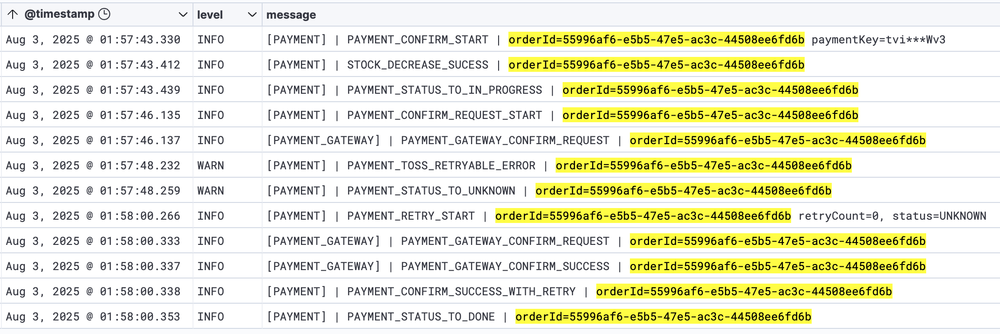

---

로그를 단순히 [`println()`으로 찍는 건 성능 이슈](/blog/java-print-performance/)와 레벨을 구분할 수 없기 때문에, 개발 초기 테스트 외엔 적절하지 않다.  
로그는 문제를 추적하고 흐름을 분석하기 위해 많은 양의 데이터를 남기기 때문에, 구조화된 출력과 불필요한 연산 제어가 반드시 필요하다.

- 로그 레벨 구분이 없음 (debug, info, warn 등 불가능)
- 시간, 클래스, 스레드 정보가 출력되지 않음
- 로그 파일 관리 및 저장 불가
- 멀티스레드 환경에서 병목 발생 (`System.out`은 synchronized I/O)

## Logger 문자열 결합과 성능 문제

로그를 남길 때는 `"Hello" + "World"`와 같은 문자열 결합 방식이 아닌, `"Hello {}"`와 같은 포맷팅 방식을 권장하는데, 이는 성능에 영향을 미치기 때문이다.

```java
private static void concatLog(Order order) {
    logger.trace("OrderId=" + order);
}
```

이 방식은 로그 레벨이 trace가 아니라면 출력도 안 되지만, `order.toString()` 호출과 문자열 결합은 그대로 발생하여, 출력은 안 되지만 연산은 수행되는 비효율이 생긴다.  
이를 피하기 위해 두 가지 방식을 사용할 수 있다.

1. 로그 레벨을 직접 체크하는 방식
2. 파라미터 포맷팅 방식 (`{}` 사용)

```java
// 1. 레벨을 직접 확인하는 방식
private static void checkConditionLog(Order order) {
    if (logger.isTraceEnabled()) {
        logger.trace("OrderId= " + order);
    }
}

// 2. 파라미터 포맷팅 방식
private static void paramLog(Order order) {
    logger.trace("OrderId={}", order);
}
```

1번 방식은 조건을 직접 해야하는 조건문을 작성해야 하므로 코드가 복잡해지고 가독성이 떨어져, 보통 2번 방식인 파라미터 포맷팅 방식을 사용한다.

### 로깅 방식별 성능 테스트

로그를 남기는 방식에 따라 성능 차이가 얼마나 나는지 테스트를 진행해보기 위해, 다음과 같이 멀티스레드 환경에서 로그를 남기는 테스트를 작성했다.(info 레벨 기준)

```java
class LoggerTest extends IntegrationTest {

    private static final Logger logger = LoggerFactory.getLogger(LoggerTest.class);
    private static final int THREAD_COUNT = 10;
    private static final int TASK_COUNT = 100000;

    private void runTest(ExecutorService executor, String label, Runnable task) throws InterruptedException {
        CountDownLatch latch = new CountDownLatch(THREAD_COUNT);
        long start = System.currentTimeMillis();
        for (int i = 0; i < THREAD_COUNT; i++) {
            executor.submit(() -> {
                for (int j = 0; j < TASK_COUNT; j++) {
                    task.run();
                }
                latch.countDown();
            });
        }
        latch.await();
        long end = System.currentTimeMillis();
        System.out.println(label + ": " + (end - start) + "ms");
    }

    static class TestData {

        private final List<String> data;

        public TestData(int size) {
            this.data = new ArrayList<>();
            for (int i = 0; i < size; i++) {
                data.add(UUID.randomUUID().toString());
            }
        }

        public String getTestDataString() {
            return data.stream().sorted().collect(Collectors.joining(","));
        }

        @Override
        public String toString() {
            return this.getTestDataString();
        }
    }
}
```

방식은 3가지로 나누어 테스트를 진행했다.

1. 문자열 결합 방식 (`+` 사용)
2. `String.format()` 방식
3. 파라미터 포맷팅 방식 (`{}` 사용)

```java
class LoggerTest extends IntegrationTest {

    private static void logWithConcat(TestData testData) {
        logger.trace("[TEST] | TEST | testData=" + testData);
    }

    private static void logWithFormat(TestData testData) {
        logger.trace(String.format("[TEST] | TEST | testData=%s", testData));
    }

    private static void logWithParam(TestData testData) {
        logger.trace("[TEST] | TEST | orderId={}", testData);
    }

    @Test
    void testLogSpeed() throws InterruptedException {
        ExecutorService executor = Executors.newFixedThreadPool(THREAD_COUNT);
        TestData testData = new TestData(100);

        // 948ms
        runTest(executor, "String concatenation (+)", () -> logWithConcat(testData));
        // 886ms
        runTest(executor, "String.format()", () -> logWithFormat(testData));
        // 19ms
        runTest(executor, "Parameterized logging ({})", () -> logWithParam(testData));

        executor.shutdown();
    }
}
```

|         방식         | 소요 시간 |
|:------------------:|:-----:|
|    문자열 결합 (`+`)    | 948ms |
| String.format() 사용 | 886ms |
|  파라미터 포맷팅 (`{}`)   | 19ms  |

- `+`, `String.format()` 연산자 방식은 로그 레벨에 관계없이 `toString()`이 호출되고 문자열 결합이 발생
- 파라미터 포맷팅(`{}`) 방식은 로그 레벨이 활성화된 경우에만 포맷팅이 수행되어, `toString()` 호출이 발생하지 않음

결과적으로 파라미터 포맷팅 방식이 가장 빠르며, 문자열 결합/포맷은 로그 레벨이 활성화되어 있지 않아도 `toString()` 호출과 문자열 결합이 발생하여 성능이 저하되는 것을 확인할 수 있었다.

## 메서드 호출 문제

`{}` 포맷팅을 사용하면 문자열 결합 비용은 줄일 수 있지만, 메서드 호출 자체는 여전히 발생한다는 점에서 성능 이슈는 완전히 사라지지 않는다.

```java
private static String getExpensiveDetail(Order order) {
    logger.trace("OrderId={}, detail={}", order.getId(), order.getExpensiveDetail());
}
```

위 코드처럼 로그 레벨과 무관하게 `getExpensiveDetail()`이 호출된다면, 불필요한 연산이 수행되어 성능 저하가 발생할 수 있다.

```java
private static void logWithSupplier(Order order) {
    logger.trace("OrderId={}, detail={}", () -> order.getId(), () -> order.getExpensiveDetail());
}
```

Log4j2는 이를 해결하기 위해 `Supplier` 기반 지연 평가를 지원하지만, Slf4j는 해당 기능을 제공하지 않기 때문에 `isTraceEnabled()` 같은 조건문을 명시적으로 사용하여 방지할 수 있다.

### 메서드 호출 성능 테스트(SlF4J 환경)

위와 동일한 테스트 환경에서 메서드 호출을 포함한 로그 성능을 테스트해보았다.

```java
class LoggerTest extends IntegrationTest {

    private static void logConcatWithMethodCall(TestData testData) {
        logger.trace("[TEST] | TEST | testData=" + testData.getTestDataString());
    }

    private static void logFormatWithMethodCall(TestData testData) {
        logger.trace(String.format("[TEST] | TEST | testData=%s", testData.getTestDataString()));
    }

    private static void logParamWithMethodCall(TestData testData) {
        logger.trace("[TEST] | TEST | orderId={}", testData.getTestDataString());
    }

    private static void logParamWithCheck(TestData testData) {
        if (logger.isTraceEnabled()) {
            logger.trace("[TEST] | TEST | testData={}", testData.getTestDataString());
        }
    }

    @Test
    void testLogSpeedWithMethodCall() throws InterruptedException {
        ExecutorService executor = Executors.newFixedThreadPool(THREAD_COUNT);
        TestData testData = new TestData(100);

        // 1042ms
        runTest(executor, "String concat + method call",
                () -> logConcatWithMethodCall(testData));
        // 1092ms
        runTest(executor, "String.format + method call",
                () -> logFormatWithMethodCall(testData));
        // 947ms
        runTest(executor, "Param-style logging + method call",
                () -> logParamWithMethodCall(testData));
        // 14ms
        runTest(executor, "Level check logging + method call",
                () -> logParamWithCheck(testData));

        executor.shutdown();
    }
}
```

|           방식            | 소요 시간  |
|:-----------------------:|:------:|
|     문자열 결합 + 메서드 호출     | 1042ms |
| String.format + 메서드 호출  | 1092ms |
|    파라미터 포맷팅 + 메서드 호출    | 947ms  |
| 로그 레벨 체크 후 포맷팅 + 메서드 호출 |  14ms  |

- 파라미터 포맷팅 방식은 로그 레벨과 관계없이 메서드 호출이 발생하여 성능 저하가 발생
- `isTraceEnabled()` 조건을 사용한 경우, 로그 레벨이 비활성화되어 있으면 해당 연산 자체가 수행되지 않아 성능 저하가 거의 없음

## 실전 대응: 구조화된 포맷 + 연산 최소화

로그 포맷을 강제하고 싶었고, 동시에 로그 레벨이 꺼져 있을 때 불필요한 연산이 발생하지 않도록 막고 싶어, 직접 `LogFmt` 유틸 클래스를 만들어 사용했다.

- 로그의 도메인과 이벤트명을 명확하게 구분
- 로그 메시지는 `Supplier<String>`으로 감싸, 로그 레벨이 비활성화되었을 땐 메시지 연산 자체가 발생하지 않도록 처리
- Slf4j 환경이므로 `isInfoEnabled()` 등의 레벨 체크 사용

```java
public void example() {
    LogFmt.info(
            logger,
            LogDomain.PAYMENT,
            EventType.PAYMENT_STATUS_TO_IN_PROGRESS,
            () -> String.format("orderId=%s", orderId)
    );
}
```

```
2025-08-03 12:56:56.129 ... - [3ce5fab6] [PAYMENT] | PAYMENT_STATUS_TO_IN_PROGRESS | orderId=55996af6-e5b5-47e5-ac3c-44508ee6fd6b
```

### LogFmt 클래스

```java

@NoArgsConstructor(access = AccessLevel.PRIVATE)
public class LogFmt {

    private static final String INFO_LOG_FORMAT = "[{}] | {} | {}";
    private static final String INFO_LOG_FORMAT_NO_MESSAGE = "[{}] | {}";

    // ...

    public static void info(Logger logger, LogDomain logDomain, EventType event) {
        if (logger.isInfoEnabled()) {
            logger.info(INFO_LOG_FORMAT_NO_MESSAGE, logDomain.name(), event.name());
        }
    }

    public static void info(Logger logger, LogDomain logDomain, EventType event, Supplier<String> messageSupplier) {
        if (logger.isInfoEnabled()) {
            logger.info(INFO_LOG_FORMAT, logDomain.name(), event.name(), messageSupplier.get());
        }
    }

    // ...
}
```

이렇게 구성된 로깅 유틸은 성능을 해치지 않으면서도 흐름을 추적할 수 있는 구조화된 로그 설계로 이어졌다.  
불필요한 연산을 막고, 도메인과 이벤트 타입을 명확히 하여 로그를 쉽게 파악할 수 있게 되었다.


