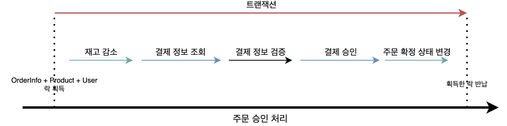
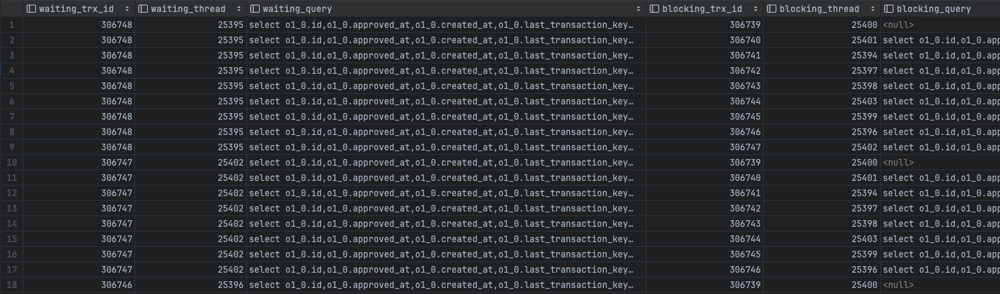
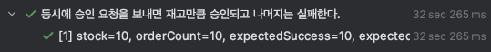
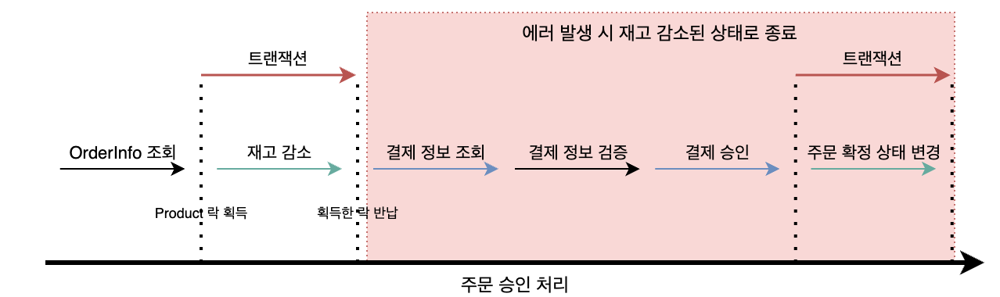
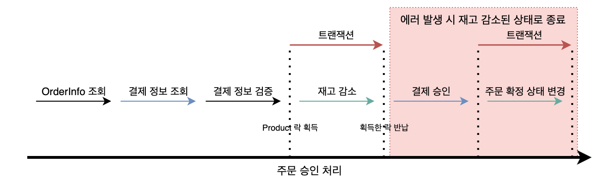
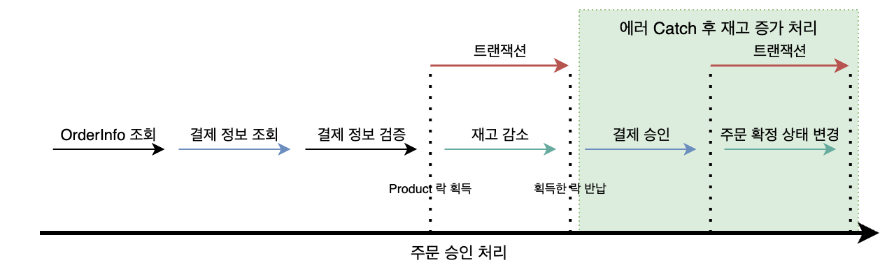
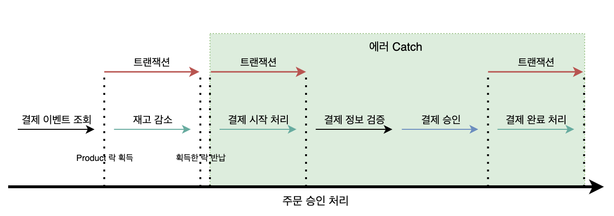

> 실행 환경: Java 17, Spring Boot 3.1.5, MySQL 8.0.33  
> !! 해당 내용은 [복구 로직 적용](/blog/payment-status-with-retry/) 전의 내용을 담고 있으며, 현재 적용된 내용은 마지막 부분에 기술되어 있습니다.

프로젝트 진행 중 MySQL 관련 공부를 하던 중, 트랜잭션 범위의 중요성에 대해 학습하게 되었다.  
특히, 트랜잭션 범위가 넓을 경우 발생하는 성능 문제를 인식하게 되었고, 이를 개선하기 위해 트랜잭션 범위 최소화 작업을 진행하였다.

트랜잭션 범위가 넓어지면 다음과 같은 문제점이 발생할 수 있다.

- 커넥션 풀 부족
    - 커넥션 풀은 데이터베이스와 연결된 커넥션을 미리 생성해두고, 요청이 들어올 때마다 커넥션을 빌려주고 반납받는 방식으로 동작한다.
    - 커넥션 풀에는 최대 커넥션 수가 정해져 있으며, 이를 초과하게 되면 대기열에 들어가게 된다.
    - 트랜잭션 범위가 넓어지면 커넥션을 오래 사용하게 되고, 이로 인해 커넥션 풀의 커넥션 수가 부족해지게 되어 대기열에 들어가게 된다.
    - 이로 인해 다른 요청들이 대기하게 되고, 이는 서비스의 응답 시간을 느리게 하게 된다.
- 잠금 대기
    - 만약 트랜잭션에서 레코드의 잠금을 거는 경우, 넓어진 트랜잭션 범위만큼 점유하는 시간이 길어지게 된다.
    - 해당 레코드를 다른 트랜잭션에서 사용하려고 할 때, 다른 트랜잭션들이 락을 대기하게 되고, 이는 데드락이 발생할 확률을 높이게 된다.

위와 같은 이유로 많은 책이나 컬럼에서는 트랜잭션 범위를 최소화하라고 권장하고 있다.  
특히, 내가 최근에 읽었던 Real MySQL 8.0 서적에서도 트랜잭션 범위를 최소화하라고 권장하고 있으며, 특히 네트워크 작업이 있는 요청은 반드시 트랜잭션에서 배제해야 한다고 말하고 있다.

## 넓은 범위에 걸친 트랜잭션

이전에 개발한 결제 연동 시스템에서 하나의 트랜잭션에서 네트워크 요청을 포함한 많은 작업을 수행하고 있었다.  
때문에 트랜잭션 범위가 넓어지게 되었는데, 대략적인 코드와 로직은 아래와 같다.  
(자세한 로직 및 전체적인 플로우는 [링크](/blog/payment-system-with-toss/) 참고)

```java
public class OrderService {

    // ...

    @Transactional // 해당 메서드 전체에 걸친 트랜잭션 범위
    public OrderConfirmResponse confirmOrder(OrderConfirmRequest orderConfirmRequest) {
        // 1. OrderInfo + Product + User Fetch Join 조회(X-LOCK)
        OrderInfo orderInfo =
                this.getOrderInfoByOrderPessimisticLock(orderConfirmRequest.getOrderId());
        // 2. 재고 감소
        productService.reduceStock(orderInfo.getProduct().getId(), orderInfo.getQuantity());

        // 3. TossPayment 측 결제 정보 조회(외부 API)
        TossPaymentResponse paymentInfo = paymentService.getPaymentInfoByOrderId(
                orderConfirmRequest.getOrderId()
        );

        // 4. 결제 정보 검증
        orderInfo.validateInProgressOrder(paymentInfo, orderConfirmRequest);

        // 5. TossPayment 측 결제 승인(외부 API)
        TossPaymentResponse confirmPaymentResponse =
                paymentService.confirmPayment(
                        TossConfirmRequest.createByOrderConfirmRequest(orderConfirmRequest)
                );

        // 6. 주문 확정 상태 변경
        OrderInfo confirmedOrderInfo = orderInfo.confirmOrder(
                confirmPaymentResponse,
                orderConfirmRequest
        );

        return new OrderConfirmResponse(confirmedOrderInfo);
    }

    // ...
}
```



해당 로직을 그림으로 표현하면 위와 같으며, 문제점은 다음과 같다.

1. 하나의 트랜잭션 범위에 포함된 모든 로직
    - 실질적으로 데이터베이스의 트랜잭션이 필요한 부분은 초록색으로 표시된 부분 뿐이지만 전체 로직을 트랜잭션 범위로 감싸고 있음
2. 불필요한 테이블의 레코드까지 X-LOCK을 통해 조회
    - 재고 감소 동시성 처리를 위해 필요한 테이블은 `Product` 레코드 뿐이지만, `OrderInfo`과 `User`의 레코드까지 잠금이 걸리게 됨
    - 여기서 얻은 LOCK을 로직이 끝나는 시점까지 유지하게 되어 다른 트랜잭션들이 대기하게 되어 데드락 발생 확률이 높아짐
3. 외부 API 요청을 트랜잭션 범위 내에서 수행
    - 외부 API 호출은 네트워크 작업을 수반하여 시간적 범위가 길어질 수 있음
    - 그 시간만큼 트랜잭션을 유지하는 시간이 길어지게 되어 다른 트랜잭션들의 대기 시간 증가하여 전체 서비스 응답 시간 증가
    - 최악의 경우 외부 API에서 응답이 늦게 오거나 Time Out 되면 기하급수적으로 서비스 응답 시간 증가하게 됨

### 외부 API 응답이 늦은 경우 발생하는 문제

가장 문제가 될 수 있는 부분은 외부 API 응답이 늦게 오거나 Time Out 되는 경우인데, 결제 승인 요청 API 응답이 늦게 오는 경우를 시뮬레이션하여 확인해보았다.

```java
// Mock Server의 승인 요청에 대한 응답 수신 시 3초 대기하도록 설정
@RestController
@RequiredArgsConstructor
public class MockController {

    // ...

    @PostMapping("/confirm")
    public TossPaymentResponse confirmPayment(@RequestBody TossConfirmRequest tossConfirmRequest) {
        // time out
        try {
            Thread.sleep(3000);
        } catch (InterruptedException e) {
            e.printStackTrace();
        }

        // ...
    }
}
```

그리고 동시에 10개의 주문 승인 요청을 보내는 동시성 테스트를 수행해보니 다음과 같은 결과를 얻을 수 있었다.



Lock을 가진 트랜잭션이 네트워크 지연을 기다리는 동안 다른 스레드들도 Lock 해제를 대기하는 것을 확인할 수 있었고,



테스트 수행 시간은 3초씩 대기하게 되어 10개 밖에 안 되는 요청이 30초가 넘게 걸리게 되었으며,  
10개보다 조금 더 많은 개수인 20개로만 설정했을 땐 Time Out이 발생하여 마지막 몇 개의 요청은 실패하게 되었다.

## 트랜잭션 범위 내에 있는 외부 API 요청 배제

우선 위의 문제를 해결하기 위해 네트워크에 영향을 받는 외부 API 요청을 트랜잭션 범위 밖으로 배제하고,  
Database에 대한 작업만 트랜잭션 범위 내에서 수행하도록 변경하였다.

```java
public class OrderService {

    // ...

    // @Transactional 어노테이션 제거하여 트랜잭션 X
    public OrderConfirmResponse confirmOrder(OrderConfirmRequest orderConfirmRequest) {
        // 1. OrderInfo + Product + User Fetch Join 조회(락 없이 단순 조회)
        OrderInfo orderInfo = this.getOrderInfoByOrderId(orderConfirmRequest.getOrderId());

        // 2. 재고 감소 및 Database Commit
        productService.reduceStockWithCommit(
                orderInfo.getProduct().getId(),
                orderInfo.getQuantity()
        );

        // 3. TossPayment 측 결제 정보 조회(외부 API)
        TossPaymentResponse paymentInfo = paymentService.getPaymentInfoByOrderId(
                orderConfirmRequest.getOrderId()
        );

        // 4. 결제 정보 검증
        orderInfo.validateInProgressOrder(paymentInfo, orderConfirmRequest);

        // 5. TossPayment 측 결제 승인(외부 API)
        TossPaymentResponse confirmPaymentResponse =
                paymentService.confirmPayment(
                        TossConfirmRequest.createByOrderConfirmRequest(orderConfirmRequest)
                );

        // 6. 주문 확정 상태 변경
        OrderInfo confirmedOrderInfo = orderInfo.confirmOrder(
                confirmPaymentResponse,
                orderConfirmRequest
        );
        orderInfoRepository.save(confirmedOrderInfo); // @Transactional이 없으므로 명시적으로 저장

        // WARNING!! 2번 이후에 에러 발생 시, 2번에서 발생한 재고 감소 건이 롤백되지 않음
        return new OrderConfirmResponse(confirmedOrderInfo);
    }

    // ...
}
```

위와 같이 변경을 한 덕분에, 목표로 한 외부 API 요청을 트랜잭션 범위 밖으로 배제할 수 있게 되었다.



하지만 큰 문제가 있는데, 2번에서 재고 감소 이후 에러가 발생하게 되면 재고 감소 건이 롤백되지 않게 되어 결국 재고만 감소된 상태로 남게 된다.  
이렇게 되면 하나의 요청이 원자성을 보장하지 못하게 되어, 결국 데이터의 불일치가 발생하게 된다.

## 로직 순서 변경을 통한 위험 범위 최소화

다음으론 위와 같은 문제점을 최소화 위해 로직 순서를 변경하여, 에러 발생 위험 범위를 줄일 수 있게 변경하였다.

```java
public class OrderService {

    // ...

    public OrderConfirmResponse confirmOrder(OrderConfirmRequest orderConfirmRequest) {
        // 1. OrderInfo + Product + User Fetch Join 조회(락 없이 단순 조회)
        OrderInfo orderInfo = this.getOrderInfoByOrderId(orderConfirmRequest.getOrderId());

        // 2. TossPayment 측 결제 정보 조회(외부 API)
        TossPaymentResponse paymentInfo = paymentService.getPaymentInfoByOrderId(
                orderConfirmRequest.getOrderId()
        );

        // 3. 결제 정보 검증
        orderInfo.validateInProgressOrder(paymentInfo, orderConfirmRequest);

        // 4. 재고 감소 및 Database Commit
        productService.reduceStockWithCommit(
                orderInfo.getProduct().getId(),
                orderInfo.getQuantity()
        );

        // 5. TossPayment 측 결제 승인(외부 API)
        TossPaymentResponse confirmPaymentResponse =
                paymentService.confirmPayment(
                        TossConfirmRequest.createByOrderConfirmRequest(orderConfirmRequest)
                );

        // 6. 주문 확정 상태 변경
        OrderInfo confirmedOrderInfo = orderInfo.confirmOrder(
                confirmPaymentResponse,
                orderConfirmRequest
        );
        orderInfoRepository.save(confirmedOrderInfo);

        // WARNING!! 4번 이후에 에러 발생 시, 2번에서 발생한 재고 감소 건이 롤백되지 않음
        return new OrderConfirmResponse(confirmedOrderInfo);
    }

    // ...
}
```

`TossPayment 측 결제 정보 조회`와 `결제 정보 검증`을 `재고 감소 및 Database Commit` 수행 전으로 변경하였는데,  
이와 같이 변경할 수 있는 이유는 아래와 같다.

- `TossPayment 측 결제 정보 조회`: 주문 승인 전 검증을 위한 외부 API 요청으로, 재고 감소 및 데이터베이스 커밋 이전에 수행해도 무방
- `결제 정보 검증`: 마찬가지로 주문 승인 전 검증을 위한 로직이므로, 재고 감소 및 데이터베이스 커밋 이전에 수행해도 무방

두 개의 로직을 분리함으로써 에러 발생 범위를 최소화할 수 있게 되었다.



하지만 여전히 에러 발생 시 재고 감소 건이 롤백되지 않는 근본적인 문제점은 해결되지 않았다.

## 보상 트랜잭션 명시적 추가를 통한 롤백

근본적인 문제를 해결하기 위해 재고를 다시 증가시키는 보상 트랜잭션을 명시적으로 추가하였다.  
여기서 결제 승인이 아닌 `재고` 감소를 먼저 수행하고, 보상 트랜잭션의 대상으로 `재고` 증가를 선정한 이유는 다음과 같다.

- 재고 증감 작업은 서버에서 직접 제어가 가능하므로, 핸들링하는데 있어 비교적 더 안전함
- 결제 승인 요청을 먼저 수행하는 경우, 승인에 대한 보상 트랜잭션으로 결제 취소라는 외부 API 요청을 수행해야 함
    - 결국 외부 API를 통한 작업이기 때문에, 네트워크 의존성이 더 커지면서 위험 요소가 증가함
    - 돈이 실제로 빠져나가고(승인 API) 다시 채워지게 되어(취소 API) 사용자 경험 측면에서 좋지 않음

```java
public class OrderService {

    // ...

    public OrderConfirmResponse confirmOrder(OrderConfirmRequest orderConfirmRequest) {
        // 1. OrderInfo + Product + User Fetch Join 조회(락 없이 단순 조회)
        OrderInfo orderInfo = this.getOrderInfoByOrderId(orderConfirmRequest.getOrderId());

        // 2. TossPayment 측 결제 정보 조회(외부 API)
        TossPaymentResponse paymentInfo = paymentService.getPaymentInfoByOrderId(
                orderConfirmRequest.getOrderId()
        );

        // 3. 결제 정보 검증
        orderInfo.validateInProgressOrder(paymentInfo, orderConfirmRequest);

        // 4. 재고 감소 및 Database Commit
        productService.reduceStockWithCommit(
                orderInfo.getProduct().getId(),
                orderInfo.getQuantity()
        );

        // 5. TossPayment 측 결제 승인(외부 API) + 6. 주문 확정 상태 변경
        OrderInfo confirmedOrderInfo = this.confirmPaymentAndOrderInfoWithStockRollback(
                orderConfirmRequest,
                orderInfo
        );

        return new OrderConfirmResponse(confirmedOrderInfo);
    }

    // 이후 로직 하나의 메서드로 추출
    private OrderInfo confirmPaymentAndOrderInfoWithStockRollback(
            OrderConfirmRequest orderConfirmRequest,
            OrderInfo orderInfo
    ) {
        try {
            TossPaymentResponse confirmPaymentResponse =
                    paymentService.confirmPayment(
                            TossConfirmRequest.createByOrderConfirmRequest(orderConfirmRequest)
                    );

            OrderInfo confirmedOrderInfo = orderInfo.confirmOrder(
                    confirmPaymentResponse,
                    orderConfirmRequest
            );
            orderInfoRepository.save(confirmedOrderInfo);

            return confirmedOrderInfo;
        } catch (Exception e) { // 에러 발생 시 롤백 수행
            // 재고 증가 및 Database Commit
            productService.increaseStockWithCommit(
                    orderInfo.getProduct().getId(),
                    orderInfo.getQuantity()
            );

            throw e;
        }
    }

    // ...
}
```

4번 재고 감소 이후 에러가 발생할 수 있는 나머지 로직을 하나의 메서드로 추출하고,  
해당 메서드 내에서 에러 발생 시 재고 증가 및 데이터베이스 커밋을 명시적으로 수행하도록 변경하였다.



결과적으로 주문 승인 처리 흐름은 위와 같이 변경되었으며, 트랜잭션 범위도 최소화되었고, 에러 발생 시 원자성을 보장할 수 있게 되었다.

## 마무리

주문 승인 처리의 큰 로직 수정 없이 단순 순서 변경과 추가된 보상 트랜잭션을 통해 트랜잭션 범위 최소화하여 아래의 결과를 얻을 수 있었다.

- 네트워크 지연 설정 X, 트랜잭션 범위 최소화 전/후 수행시간 비교(11s -> 6s)


트랜잭션 범위 최소화를 통해 레코드에 잠금이 걸리는 범위를 줄여 성능 향상을 가져올 수 있었으며,

- 네트워크 지연 설정 3,000ms, 트랜잭션 범위 최소화 후 1,000개 요청 성공


외부 API의 지연으로 잠금 대기 시간이 무한정 늘어나는 장애를 방지해 안정성을 향상 시켜, 1,000개의 요청을 모두 성공시킬 수 있었다.  
이전에 20개의 요청을 보냈을 때 Time Out이 발생했던 것과는 달리, 네트워크 지연이 발생하더라도 이전보다 더 안정적으로 서비스를 기대할 수 있게 되었다.

## 에러 처리 및 복구 로직 적용에 따른 트랜잭션 범위 변화

[결제 상태의 추가와 결제 복구 로직 추가](/blog/payment-status-with-retry/)로 인해 트랜잭션 범위 정책과 복구 로직도 함께 변경되었다.



결제 시작 처리를 먼저 수행하고, 재고 감소를 수행하며, 결제 검증 및 외부 API 요청을 수행하는 로직은 동일하게 유지하였다.  
시작 처리를 먼저 데이터베이스에 반영하기 때문에 그 이후에 발생하는 예외 상황들에 대해 맞는 복구 로직을 각각 작성할 필요가 있었다.

- 재시도 가능과 불가능한 에러로 구분
- 재시도 가능한 에러는 UNKNOWN 상태로 변경하고, 재고는 그대로 유지
- 재시도 불가능한 에러는 FAIL 상태로 변경하고, 재고를 복구

```java

@Service
@RequiredArgsConstructor
public class PaymentConfirmServiceImpl implements PaymentConfirmService {

    // ...

    @Override
    public PaymentConfirmResult confirm(PaymentConfirmCommand paymentConfirmCommand) {
        // 1. 결제 이벤트 조회
        PaymentEvent paymentEvent = paymentLoadUseCase.getPaymentEventByOrderId(
                paymentConfirmCommand.getOrderId()
        );

        try {
            // 2. 재고 차감 - 재고 부족 에러 발생 가능
            orderedProductUseCase.decreaseStockForOrders(paymentEvent.getPaymentOrderList());
        } catch (PaymentOrderedProductStockException e) {   // 에러 1: 재고 부족 에러 발생
            handleStockFailure(paymentEvent);               // FAIL 처리(재고 중 일어난 에러로, 감소가 일어나지 않았으므로 복구 필요 없음)
            throw PaymentTossConfirmException.of(PaymentErrorCode.ORDERED_PRODUCT_STOCK_NOT_ENOUGH);
        }

        try {
            // 3. 결제 시작 처리 - 결제 시작 상태 검증 중 에러 발생 가능
            paymentProcessorUseCase.executePayment(paymentEvent, paymentConfirmCommand.getPaymentKey());

            // 4. 결제 검증 - 결제 검증 중 에러 발생 가능
            // 5. 토스 결제 승인 요청 - 토스 측 재시도 가능/불가능한 에러 발생 가능
            // 6. 결제 완료 처리
            PaymentEvent completedPayment = processPayment(paymentEvent, paymentConfirmCommand);

            // 7. 결제 완료 결과 반환
            // ...
        } catch (PaymentStatusException e) {                // 에러 2: 이미 요청이 진행 된 건에 대한 요청
            handleNonRetryableFailure(paymentEvent);        // FAIL 처리 + 재고 복구
            throw e;
        } catch (PaymentTossRetryableException e) {         // 에러 3: 토스 측 재시도 가능한 에러 발생
            handleRetryableFailure(paymentEvent);           // UNKNOWN 상태로 변경 + 재고 그대로 유지
            throw PaymentTossConfirmException.of(PaymentErrorCode.TOSS_RETRYABLE_ERROR);
        } catch (PaymentTossNonRetryableException e) {      // 에러 4: 토스 측 재시도 불가능한 에러 발생
            handleNonRetryableFailure(paymentEvent);        // FAIL 처리 + 재고 복구
            throw PaymentTossConfirmException.of(PaymentErrorCode.TOSS_NON_RETRYABLE_ERROR);
        } catch (Exception e) {                             // 에러5: 결제 검증 중 에러 등 기타 에러 발생
            handleUnknownException(paymentEvent);           // FAIL 처리 + 재고 복구
            throw e;
        }
    }

    // ...
}
```
