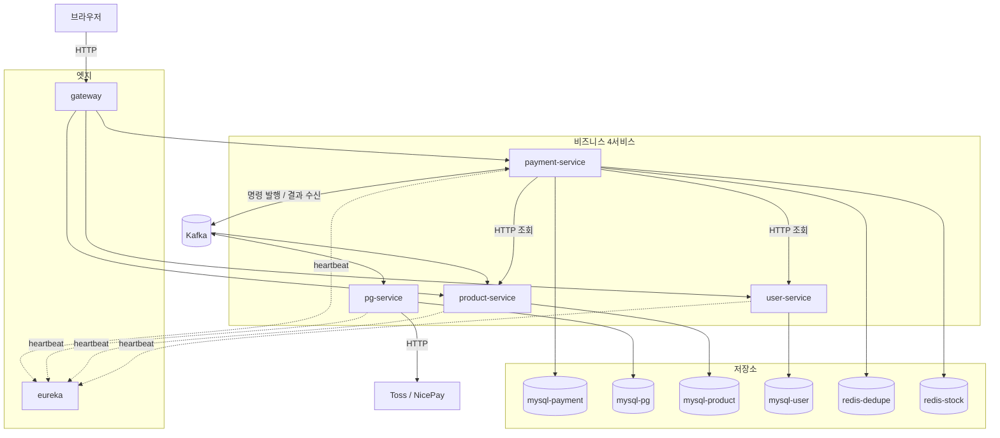
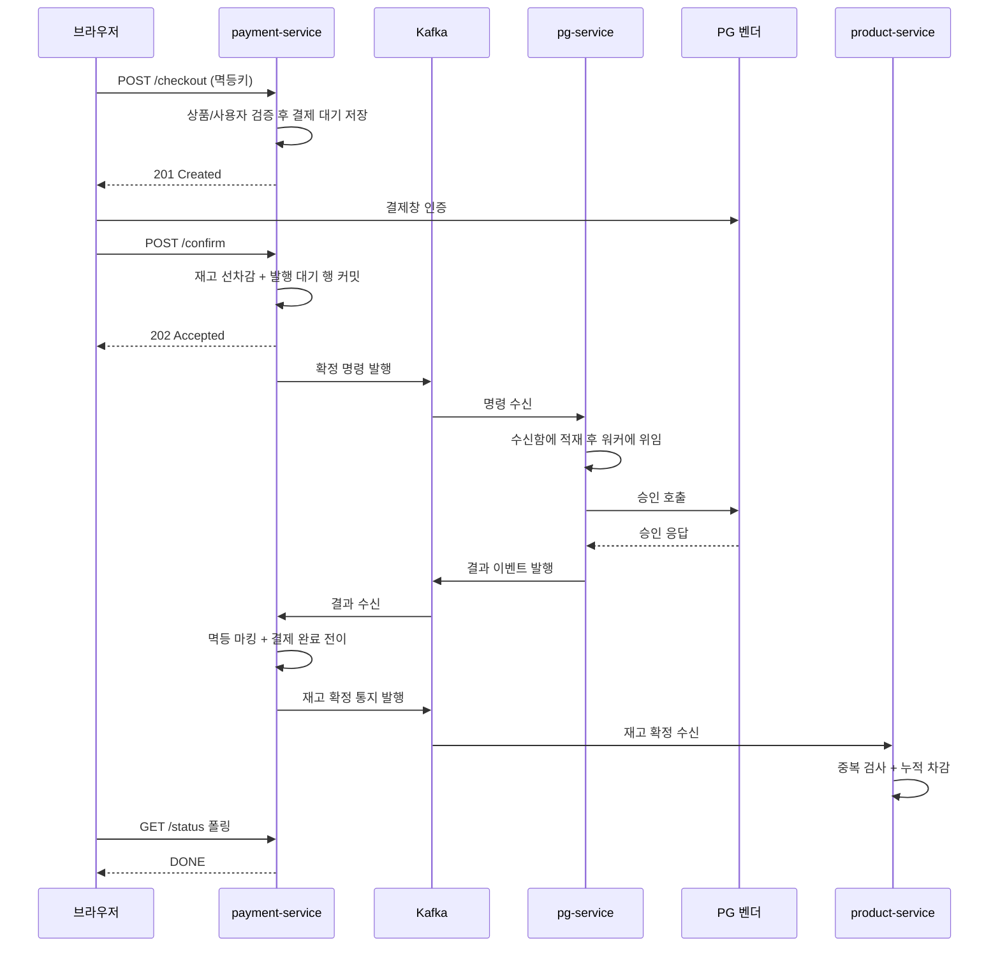
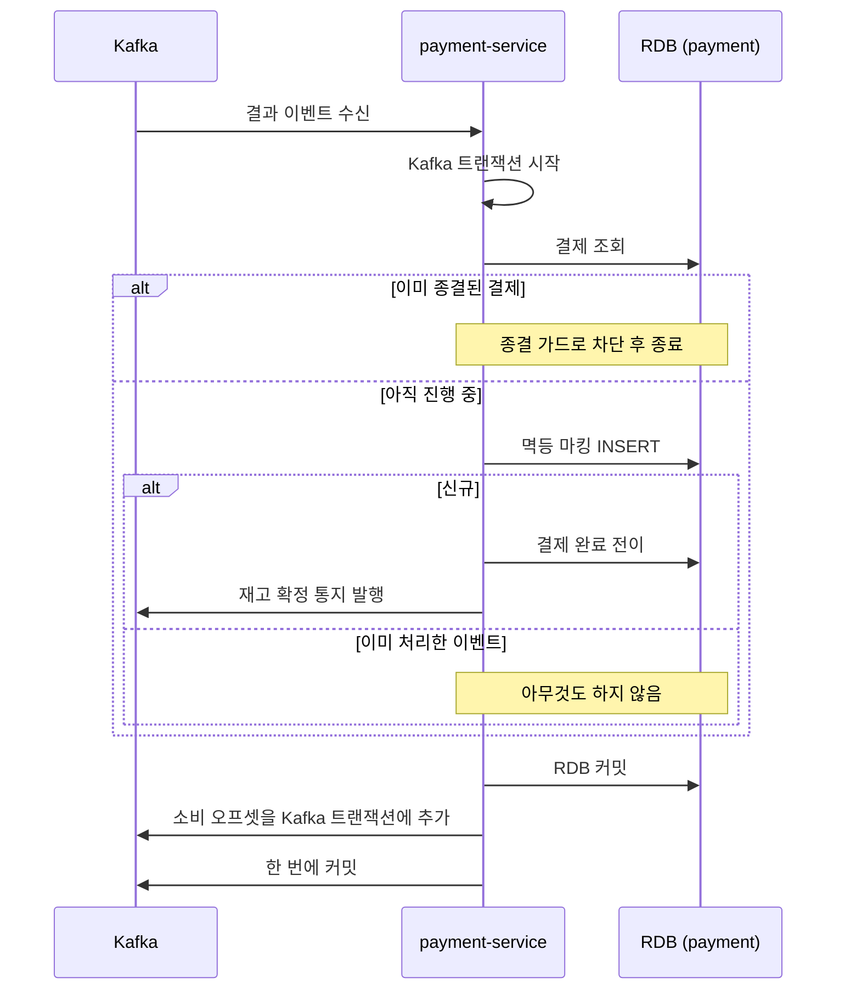
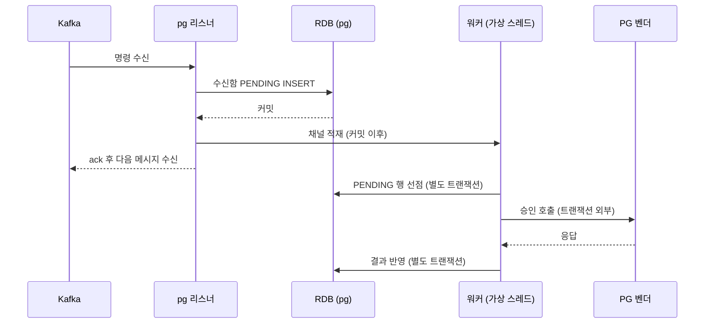
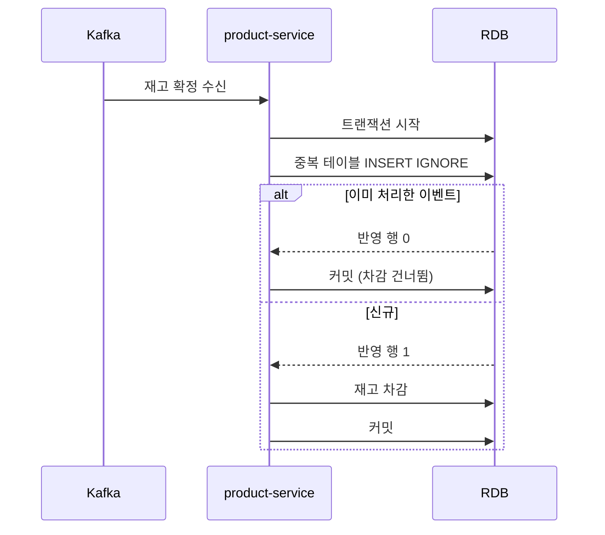
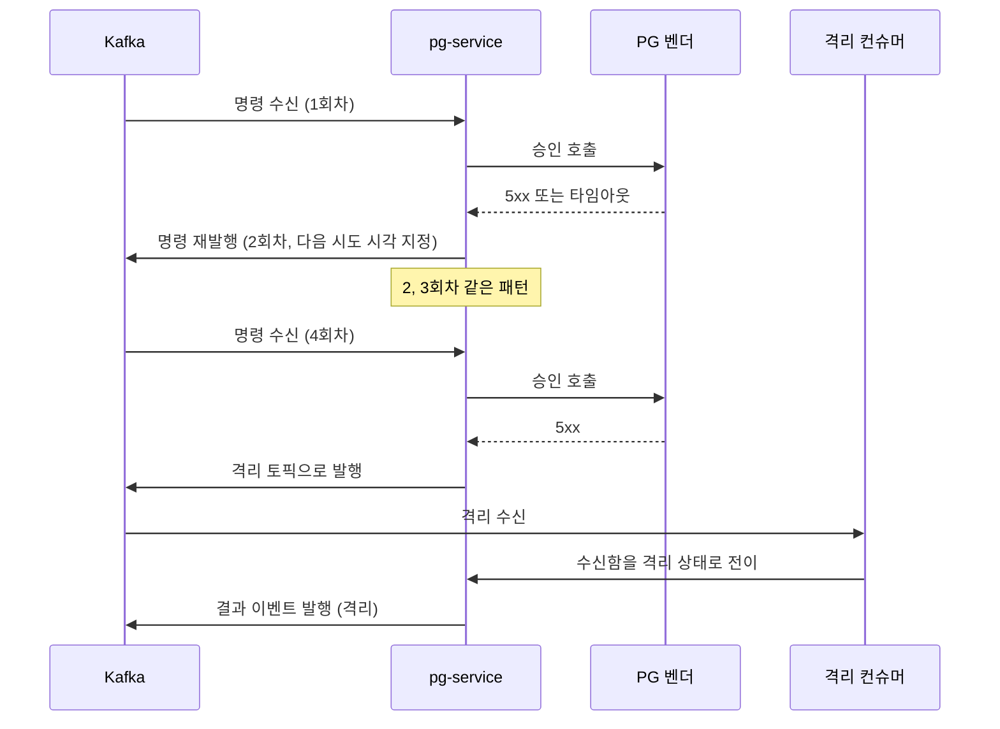
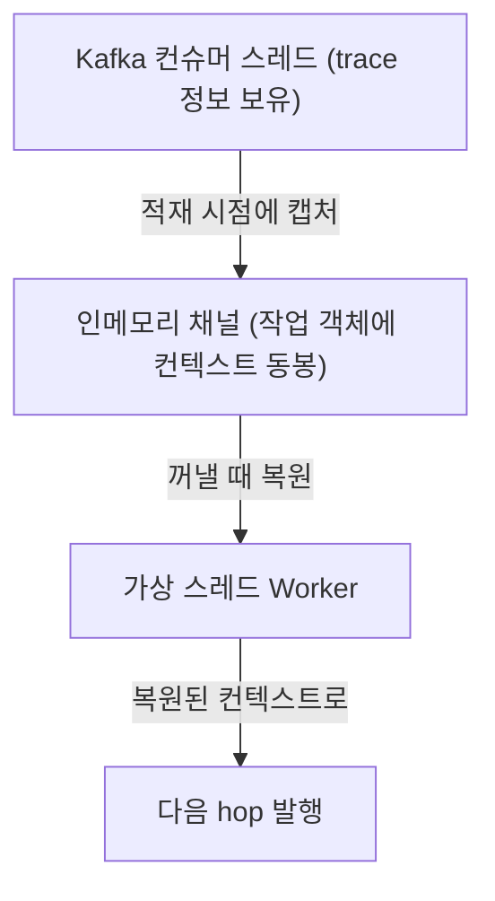

> 실행 환경: Java 21, Spring Boot 3.4.4, MySQL 8.0, Kafka (KRaft), Redis, Docker Compose

## 배경

Payment Platform 시리즈에서 결제 시스템을 단계별로 개선해왔다.

- [토스 결제 연동](/blog/payment-system-with-toss/): 결제 위젯과 서버 검증 연동
- [트랜잭션 범위 최소화](/blog/minimize-transaction-scope/): 외부 API를 트랜잭션 밖으로 분리
- [결제 복구 시스템](/blog/payment-status-with-retry/): 재시도 로직으로 장애 복구
- [보상 트랜잭션 실패 대응](/blog/payment-compensation-transaction/): 작업 테이블로 최종적 일관성 확보
- [Checkout 멱등성](/blog/checkout-idempotency/): 중복 결제 이벤트 생성 방지
- [비동기 결제 플로우](/blog/async-payment-flow/): Outbox 패턴과 LinkedBlockingQueue Worker
- [결제 복구 상태 모델](/blog/payment-recovery-state-design/): 장애 내성을 갖춘 상태 전이

직전까지 만든 구조는 Outbox 테이블에 발행 의도를 적고, 인메모리 채널로 즉시 처리하며, 폴링 Worker가 누락분을 회수하는 과정을 거쳤다.

---

## 전환의 동기

PG 연동 특성상 외부 의존이 강한데 그 변동을 이쪽에서 통제할 수 없다.

- 결제 도메인은 외부 의존성이 강함
- 외부 변동을 내부 시스템에서 통제 불가
- PG 벤더 외부 왕복 시간 장기화 (평균 1~3초, p99 5초 초과)
- 내부 배포 주기와 무관한 벤더 API 스펙 변경 발생

|           운영 위험           |                 모놀리스에서의 문제                  |               분리 후                |
|:-----------------------------:|:----------------------------------------------------:|:------------------------------------:|
| 벤더 호출 지연 (p99 5초 초과) | 스레드·커넥션 고갈이 상품·사용자 호출 지연까지 전파  | 벤더 호출 자원이 pg-service으로 한정 |
|        벤더 스펙 변경         |         hot-fix가 다른 도메인까지 함께 배포          |      pg-service만 수정하고 배포      |
|    도메인별 부하 패턴 차이    | 알람과 지표가 한 갈래 — 인스턴스 수 조정이 서로 묶임 |      도메인별로 독립 조정 가능       |

이번 분리 작업의 범위는 다음과 같이 잡았다.

- 성능 절대 수치는 목표로 삼지 않음
    - 로컬 Docker의 I/O 한계 때문에 수치 자체에 의미를 두기 어려움
- 성공 조건은 장애 주입 후 최종 정합성 복원 여부로 판단

---

## 분리 기준

경계는 도메인을 기준으로 분리했다.

|       모듈        |        역할        |                     분리 근거                     |
|:-----------------:|:------------------:|:-------------------------------------------------:|
| `payment-service` |  결제 도메인 본체  |     결제 생명주기의 주인, 상태의 진실의 원천      |
|   `pg-service`    | PG 벤더 호출 격리  | 외부 의존이 강한 영역, 회복성 정책을 한 곳에 모음 |
| `product-service` | 상품 + 재고 도메인 |    결제와 다른 생명주기 (상품 등록, 재고 운영)    |
|  `user-service`   |   사용자 도메인    |     결제와 다른 생명주기 (사용자 등록, 조회)      |
|     `gateway`     |  외부 단일 진입점  |       분리된 서비스 앞단에 라우팅을 단일화        |
|  `eureka-server`  | 서비스 디스커버리  |              인스턴스 위치 변동 추적              |



통신 방식은 호출자가 응답을 기다려야 하는지를 기준으로 구분했다.

- 결과를 받아야 다음을 진행할 수 있으면 HTTP: 결제 검증에 필요한 상품·사용자 조회
- 처리 시간이 길거나 책임을 넘기고 끝나면 Kafka: 벤더 호출, 재고 확정 통지

payment와 pg 사이는 Kafka를 통해 양방향으로 통신한다.

- 명령 토픽과 결과 토픽 별도 운용
- 벤더 API 호출이 지연되어도 payment 스레드 차단 방지

---

## 결제 한 건이 도는 경로

승인이 정상적으로 끝나는 경우의 전체 흐름이다.



구간별로 정리하면 다음과 같다.

|   구간    |                                   하는 일                                   |      경계       |
|:---------:|:---------------------------------------------------------------------------:|:---------------:|
| 주문 생성 |    멱등키로 중복 진입을 막고 상품·사용자를 검증해 결제 대기 상태로 저장     |    HTTP 동기    |
| 확정 진입 |        위변조 검사 후 재고를 우선 차감하고 발행 대기 행과 함께 커밋         | HTTP 동기 + 202 |
| 명령 발행 |                  발행 대기 행을 선점해 확정 명령을 내보냄                   |      Kafka      |
| 벤더 호출 | 리스너가 수신함에 적고 빠지면 워커가 선점해 벤더 API를 호출하고 결과를 반영 |    HTTP 외부    |
| 결과 확정 |        결제 상태를 완료로 변경하고 재고 확정 통지를 같은 단위로 발행        |    Kafka EOS    |
| 결과 조회 |                    브라우저가 최종 상태를 폴링으로 확인                     |    HTTP 동기    |

- 수신함: pg가 받은 명령을 RDB에 적어 두는 테이블
    - 같은 명령을 두 번 벤더에 보내지 않기 위한 장치이자 발행 측 Outbox의 수신 측 대응
- Kafka EOS (Exactly-Once Semantics): 소비 오프셋 커밋과 다음 메시지 발행을 단일 트랜잭션으로 묶는 모드 (결정 2에서 상술)

브라우저는 확정 요청에 202를 응답받고 폴링으로 결과를 기다린다.

- 벤더 응답 대기 구간을 요청 스레드 외부로 분리
- 벤더 연동 지연 시에도 시스템의 새로운 요청 처리 능력 유지

---

## 결정 1 — DB를 서비스마다 두고 단일 트랜잭션을 포기

한 인스턴스 안에서 스키마만 나누지 않고, 서비스마다 MySQL 인스턴스를 따로 뒀다.

|         선택         |                                  결과                                  |
|:--------------------:|:----------------------------------------------------------------------:|
| 인스턴스 분리 (채택) |   서비스 경계에서 스키마 결합 차단, cross-service 조인 자체가 불가능   |
|    스키마만 분리     | 같은 인스턴스를 공유해 조인이 가능하지만 서비스간 결합도 해소가 불가능 |

DB 분리로 기존 단일 DB가 제공하던 강한 일관성 이점을 다른 방식으로 대체해야 했다.

- 분산 트랜잭션 배제: 두 도메인 데이터를 단일 트랜잭션으로 수정 불가
- 원자적 처리 불가: 결제 상태 변경과 재고 차감을 하나의 원자적 작업으로 묶기 어려움

---

## 결정 2 — 멱등성을 서비스마다 다르게 구현

분산 환경에서 메시지 전달 보장은 아래 세 가지가 존재한다.

|     모델      |               의미               |                    비용                     |
|:-------------:|:--------------------------------:|:-------------------------------------------:|
| at-most-once  | 최대 한 번, 손실 가능, 중복 없음 |         단순하지만 메시지 유실 위험         |
| at-least-once | 최소 한 번, 손실 없음, 중복 가능 |            소비 측 멱등성이 필수            |
| exactly-once  | 정확히 한 번, 손실도 중복도 없음 | 발행자·브로커·소비자 3자 협력, 운영 비용 큼 |

메시지 전달 보장 모델은 소비 측에서 중복을 방지하는 at-least-once를 채택했다.

- at-most-once 배제: 결제 데이터 유실 위험 존재
- exactly-once 배제: 참여자가 늘어날수록 분산 합의 (coordination) 비용 급증

멱등 처리는 서비스별 소비 조건에 따라 다른 방식을 적용했다.

- 메시지 소비 후의 추가 발행 여부
- 외부 API 호출 여부

| 서비스  |         소비 후 하는 일          |          적용한 멱등 방식          |
|:-------:|:--------------------------------:|:----------------------------------:|
| payment | RDB 상태 전이 + 다음 메시지 발행 |    Kafka EOS + RDB 멱등 INSERT     |
|   pg    | RDB 수신함 전이 + 외부 벤더 호출 |  수신함 UNIQUE + 상태 조건부 선점  |
| product |         RDB 재고 차감만          | RDB 단일 검사 (재고 차감과 동시에) |

### payment — 발행과 소비를 한 단위로 묶음

결과 이벤트를 수신하면 결제 상태를 완료로 변경하고 재고 확정 통지를 발행한다.

- 외부 API 연동 없음
- 소비 오프셋 커밋과 메시지 발행을 단일 Kafka 트랜잭션으로 통합 처리



RDB와 Kafka는 서로 다른 자원이므로 단일 트랜잭션으로 묶일 수 없지만, 다음과 같이 처리할 수 있었다.

- DB 커밋 완료 후 Kafka 커밋 직전에 서버 장애 시 메시지 재전송 발생
- RDB 중복 처리가 발생할 수 있는 문제는 멱등 마킹으로 방지

### pg — 수신과 벤더 호출을 다른 스레드로 분리

외부 벤더 API를 호출을 메시지 소비와 하나로 묶으면 외부 지연에 의해 다음 메시지를 소비하지 못하므로, 수신과 호출을 분리했다.

- 리스너 트랜잭션: 수신함에 PENDING 행 INSERT + 채널 적재 이벤트 발행까지만 수행 (timeout 5초)
- 워커 (가상 스레드): 채널에서 꺼내 선점 → 벤더 API 호출 → 결과 반영을 각각 별도 트랜잭션으로 처리



- 벤더 지연이 소비 속도 지연으로 이어지지 않음
- 채널 내용이 유실되거나 서버가 죽으면 폴링 워커가 미처리 행을 회수

#### 멱등성 보장 방법

멱등성 보장의 핵심은 수신함 테이블에 있다.

- `order_id` UNIQUE: 같은 주문의 명령이 다시 들어와도 INSERT가 충돌하고 기존 행을 그대로 사용
- 상태 조건부 선점: 워커가 PENDING인 행만 IN_PROGRESS로 전이하므로 채널에 중복 적재돼도 벤더 호출은 1회
- 종결 상태 재수신: 저장해 둔 결과를 다시 발행할 뿐 벤더를 호출하지 않음

### product — 하나의 트랜잭션으로 종료

product 서비스는 재고 차감이 단일 목적이며 이후 발행할 메시지가 없다.

- 중복 검사와 후속 상태 변경이 동일한 RDB에서 처리됨
- 검증 계층을 여러 단계로 분리할 필요 없음



중복 마킹과 차감이 한 트랜잭션이라 둘 중 하나가 실패하면 같이 롤백된다.

### 중복 기록의 보존 기간

멱등 마킹 기록의 보존 기간은 Kafka 메시지 보관 기간과 연동하여 고정했다.

- 무한정 보존 시 테이블 크기 팽창 문제 발생
- 단기 보존 시 마킹 기록 선삭제로 인한 중복 결제 위험 노출

세 값을 부등식으로 묶어 고정했다.

|              값               | 기간 |                             근거                              |
|:-----------------------------:|:----:|:-------------------------------------------------------------:|
|        Kafka 보관 기간        | 7일  |                 브로커가 메시지를 버리는 시점                 |
|        멱등 기록 보존         | 8일  |                   보관 기간 + 복구 버퍼 1일                   |
| 결과 처리 실패 격리 토픽 보관 | 10일 | 격리된 메시지를 되돌릴 수 있는 기간이 멱등 기록보다 길게 설정 |

---

## 결정 3 — 벤더 호출 재시도 방식

벤더 호출 실패 시 재시도를 수행하게 된다.

- pg-service는 기존에 왔던 동일 토픽으로 명령을 다시 발행해 재시도
- 재시도 한도 초과 시 격리 토픽 (DLQ)으로 전송



- 수신함 테이블의 재시도 횟수 컬럼을 진실의 원천 (Single Source of Truth)으로 설정
- 메시지 재발행이나 중복 배달 시에도 해당 주문의 누적 재시도 횟수 정확히 유지

---

## 결정 4 — 공통 모듈 미채택

공통 모듈은 프로젝트 초기에 편리함을 주지만 변경에 있어 병목 지점이 된다고 판단했다.

- 단일 변경점 발생: 특정 서비스의 요구사항으로 공통 DTO 수정 필요
- 배포 결합도 증가: 모듈에 의존하는 모든 서비스의 연쇄 빌드 및 배포 유발
- 독립성 훼손: 독립적 배포를 위한 마이크로서비스 분리 목적 퇴색

위의 단점들로 인해 관리의 어려움이 더 커진다고 판단하여 코드 중복을 감수하는 방식을 택했다.

- 토픽 이름 상수: 세 서비스가 각자 자기 클래스에 동일한 문자열 선언
- 컨텍스트 전파 헬퍼: 가상 스레드 컨텍스트 전파 유틸리티를 서비스별 개별 유지

```java
// payment-service — PaymentTopics.java
public static final String COMMANDS_CONFIRM = "payment.commands.confirm";
public static final String EVENTS_CONFIRMED = "payment.events.confirmed";
public static final String EVENTS_STOCK_COMMITTED = "payment.events.stock-committed";
```

통합 테스트로 잠재적 위험을 보완하고 서비스 간 코드 의존성을 제거했다.

- 하드코딩된 이름 불일치 시 메시지 전송 실패로 테스트 단계에서 발견하여 방지
- 동일 코드 3곳 이상 복제 또는 동시다발적 변경 시 공통화 재검토 기준 마련

---

## traceId가 끊기는 자리들

MSA 전환 후 가장 까다로워진 부분은 디버깅이다.

- 기존 단일 콜스택 파악 방식 사용 불가
- 여러 서비스 홉 (hop)과 토픽을 거치는 실행 흐름 발생
- 사후 추적을 위해 분산된 모든 시스템 로그에 동일한 traceId 기록 필수

W3C Trace Context 표준의 `traceparent` 헤더 적용 시 자동 전파 구간과 수동 전파 구간으로 나뉘었다.

|       경계       |                                 끊기는 이유                                  |                     대응                      |
|:----------------:|:----------------------------------------------------------------------------:|:---------------------------------------------:|
| 서블릿 요청 진입 |                                    유지됨                                    |             Spring Boot 자동 설정             |
|    Kafka 경계    |                  관측(Observation) 설정이 기본으로 비활성화                  |           프로듀서·리스너 설정 추가           |
|   HTTP 어댑터    |                                    유지됨                                    |            Spring Cloud 자동 설정             |
|   가상 스레드    | trace 정보가 스레드 로컬(ThreadLocal)에 저장되어 새 가상 스레드 생성 시 유실 |          캡처·복원 헬퍼로 이중 래핑           |
|  인메모리 채널   |                큐에 적재하는 스레드와 소비하는 스레드가 다름                 |     작업 객체에 컨텍스트를 동봉하여 전달      |
|   폴링 Worker    |      주기적인 스케줄러로 진입하므로 원래 요청 메시지의 컨텍스트가 없음       | DB 수신함에 저장해 둔 traceparent 값으로 복원 |

### Kafka 경계

Kafka 경계는 설정 두 줄로 발행 시 현재 컨텍스트의 `traceparent`가 메시지 헤더에 실리고, 수신 시 이를 꺼내 복원하도록 할 수 있었다.

```yaml
spring:
  kafka:
    template:
      observation-enabled: true
    listener:
      observation-enabled: true
```

### 스레드 전환 케이스

구현이 까다로웠던 부분은 스레드 컨텍스트가 전환되는 경계다.

- 분산 추적 (trace) 정보는 스레드 로컬 (ThreadLocal)에 저장됨
- 스레드가 바뀌는 지점마다 명시적인 복원 처리 필요

#### 1. 인메모리 채널 (가상 스레드 전환)

- 새 가상 스레드 생성 시 기존 컨텍스트 미전달
- 미조치 시 벤더 API 호출 구간이 원래 흐름과 단절된 별도 트레이스로 기록됨

큐 적재 시점과 꺼내는 시점에 컨텍스트를 캡처 및 복원하는 구조를 적용했다.



#### 2. 폴링 Worker (백그라운드 스케줄러)

- 서버 장애 시 폴링 Worker가 DB에서 미처리 건 회수
- 백그라운드 스케줄러 진입으로 원본 메시지의 trace 정보 부재
- 미조치 시 복구 작업이 부모 (parent trace) 없는 고립된 트레이스로 기록됨

수신함 데이터 삽입 시에 `traceparent` 문자열을 함께 저장하는 방식으로 해결했다.

- 회수 시점에 DB에서 식별자를 읽어 컨텍스트 복원
- 복원된 부모 트레이스 아래에 새로운 하위 작업 생성

---

## 결론

### 전환 비용과 트레이드오프

도메인 분리 작업 자체보다 정합성과 일관성 보장 장치를 재구축하는 데 더 많은 설계 고민과 구현 비용이 소요되었다.

- 트랜잭션 제어권 상실: 단일 JVM과 단일 DB가 기본 제공하던 원자적 상태 변경 불가
- 복잡성 증가: 분산 환경에 맞춘 새로운 상태 관리 메커니즘 설계 비용 발생

|  단일 시스템의 이점   |             분산 환경의 대안              |
|:---------------------:|:-----------------------------------------:|
|   원자적 상태 변경    | Outbox 패턴 + 소비 측 멱등성 + 보상 경로  |
|    중복 없는 전달     | at-least-once + 서비스마다 다른 멱등 구현 |
| 끊기지 않는 실행 흐름 |    traceparent 전파 + 스레드 경계 복원    |
|  즉시 드러나는 실패   |       격리 토픽 + 지표 + 알람 규칙        |

### 전환으로 얻은 이점

높은 복잡성 비용을 지불하여 얻은 핵심은 장애 격리와 의존성 통제다.

- 외부 장애 격리: 벤더사 응답 지연 발생 시 호출 자원을 pg-service에 한정하여 타 서비스의 커넥션 고갈 방지
- 비동기 장애 복구: 일시적 연동 실패 시 큐와 워커로 재시도하고 한계 도달 시 격리 토픽 (DLQ)으로 이관하여 유실 방지
- 생명주기 독립: 결제 로직과 무관한 외부 PG 스펙 및 상품 재고 정책의 배포 일정을 분리

### 실패를 전제한 설계

결제 시스템의 안정성은 단일 트랜잭션 의존을 벗어나 실패 지점을 격리하고 최종적 일관성을 맞추는 데 있다.

- 네트워크 단절 대비: 일시적 통신 실패 시 재시도와 보상 트랜잭션으로 상태 동기화
- 메시지 중복 도달 대비: 서비스별 특성에 맞춘 소비 측 멱등성 구현
