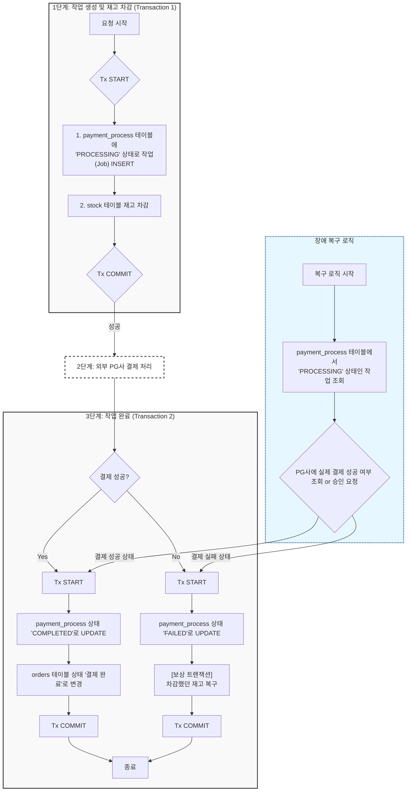
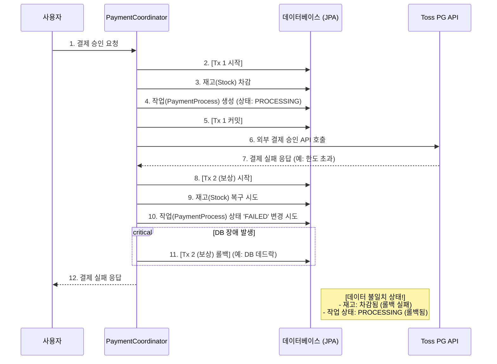
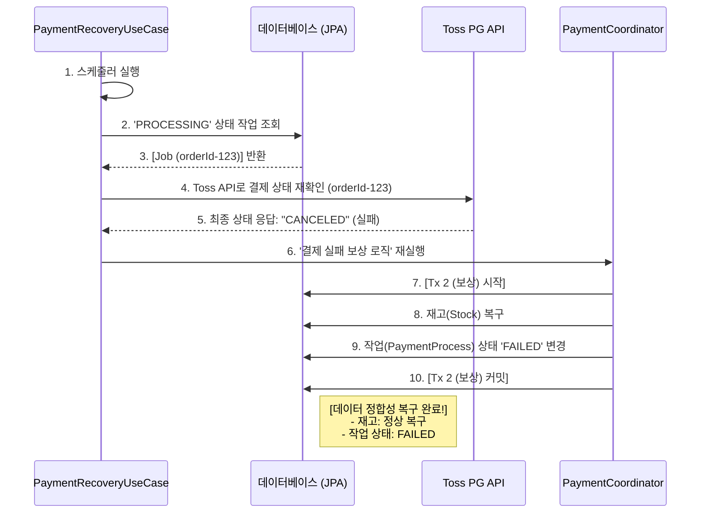

> 실행 환경: Java 21, Spring Boot 3.3.3

## 배경 및 문제 정의

결제 로직은 재고 차감(DB)'과 외부 PG 결제(API)라는 두 개의 분리된 작업을 수행하고 있다.
이 과정에서 1) 재고 차감은 성공했지만, 2) PG 결제가 실패하는 경우가 발생할 수 있는데, 차감했던 재고를 다시 되돌리는 보상 트랜잭션(Compensation Transaction)을 통해 해결하고 있었다.

하지만 이 보상 트랜잭션이 실패할 수 있다는 문제가 남아있다.

- **상황:** PG사 결제 실패
- **시스템:** 재고를 롤백하기 위한 보상 트랜잭션 실행
- **장애:** 이 보상 트랜잭션이 **DB 데드락, 커넥션 풀 고갈, 서버 다운** 등으로 **실패**

이 경우, 시스템은 다음과 같은 심각한 데이터 불일치 상태에 빠진다.

- **결제 상태:** **실패**
- **재고 상태:** **차감됨** (재고 롤백 실패)
- **최종 결과:** 고객은 구매에 실패했지만, 재고는 판매된 것으로 처리되어 유령 재고 발생

## 개발 목표 및 설계 원칙

이 실패 처리의 실패(Double Fault) 문제를 해결하기 위해, 다음과 같은 설계 원칙을 수립했다.

1. **상태 추적성 (Traceability):** 모든 결제 과정을 '작업'으로 정의하고 상태를 별도 테이블에 기록하여, 장애 발생 시에도 중단된 지점을 명확히 식별
2. **최종적 일관성 (Eventual Consistency):** 장애가 발생하더라도, 시스템 스스로 데이터 정합성 회복

## 기술적 결정 및 Trade-off

이 문제를 해결하기 위해 여러 해결 방법을 고려할 수 있었다.

1. **Two-Phase Commit (2PC)**
    - 모든 리소스(재고 DB, PG사)가 커밋에 동의해야 하는 강력한 일관성 모델
    - **한계:** 외부 PG사가 2PC를 지원하지 않으며, 전체 시스템의 성능 저하와 블로킹(Blocking)을 유발
2. **메시지 큐와 Saga Pattern**
    - 재고 차감, 결제 요청, 결과 처리를 별도의 트랜잭션으로 분리하고 메시지 큐(Kafka, RabbitMQ)로 연결하는 방식
    - **한계:** 시스템 간 결합도는 낮출 수 있으나, 별도의 메시징 인프라를 도입하는 것은 피하고 싶었음
3. **선택: 작업 테이블 + Scheduler**
    - '작업 테이블(`payment_process`)'을 DB 내의 '메시지 큐(Outbox)'처럼 활용하는 방식
    - **장점:**
        * **단순성:** 외부 인프라 의존성 없이, Spring 스케줄러와 DB만으로 '최종적 일관성'을 구현 가능
        * **트랜잭션 보장:** 데이터 처리를 DB 트랜잭션 내에서 처리하여, 복잡한 트랜잭션 관리 불필요

## 아키텍처 - 3단계 트랜잭션 분리와 작업 테이블

이 문제를 해결하기 위해 기존의 결제 로직을 3개의 명확한 단계로 분리하고, 모든 과정을 `PaymentProcess` (작업 테이블)에 기록하도록 설계했다.

### **작업 테이블 (`payment_process`) 스키마**

|   **컬럼명**    |     **타입**     |      **제약조건**      |                **설명**                 |
|:------------:|:--------------:|:------------------:|:-------------------------------------:|
|     `id`     |     BigInt     | PK, Auto-Increment |               작업 고유 ID                |
|  `order_id`  |     String     |      Not Null      |               주문 고유 ID                |
|   `status`   | Enum / Varchar |      Not Null      | 작업 상태 (PROCESSING, COMPLETED, FAILED) |
| `created_at` |   Timestamp    |      Not Null      |                 생성 시각                 |
| `updated_at` |   Timestamp    |      Not Null      |                 수정 시각                 |

이 테이블을 기반으로 결제 흐름은 다음과 같이 분리된다.

* **1단계 (Tx 1):** 재고 차감 + **작업 생성 (`PROCESSING`)**
* **2단계 (Non-Tx):** 외부 PG사 결제 API 호출
* **3단계 (Tx 2):** 결제 결과 반영 + **작업 상태 변경 (`COMPLETED` / `FAILED`)**

이 구조의 핵심은 장애 발생 시 `PROCESSING` 상태가 DB에 남는다는 것이다.

## 보상 트랜잭션 실패 흐름 시나리오

11번 단계가 핵심인데, 보상 트랜잭션이 롤백되면서, 재고는 차감되었지만 작업 상태는 `PROCESSING`으로 남는 데이터 불일치 상태가 된다.

## 스케줄러를 통한 최종적 일관성 확보

이 문제를 해결하기 위해 `PaymentRecoveryUseCase`라는 스케줄러를 구현했다.

- **동작:** `PROCESSING` 상태로 일정 시간 이상 방치된 작업을 조회
- **로직:** 조회된 작업의 `orderId`로 Toss API에 **실제 결제 상태를 다시 조회**

## 결론

이 프로젝트를 통해 다음과 같은 성과를 달성할 수 있었다.

* **실패 처리의 실패(Double Fault) 엣지 케이스 해결:** 결제 시스템에서 발생할 수 있는 데이터 불일치 시나리오에 대한 자동 복구 메커니즘 구축
* **최종적 일관성 확보:** 스케줄러와 작업 테이블 상태 관리를 통해, 장애가 발생하더라도 시스템은 스스로 데이터 정합성을 맞춰 회복 가능
