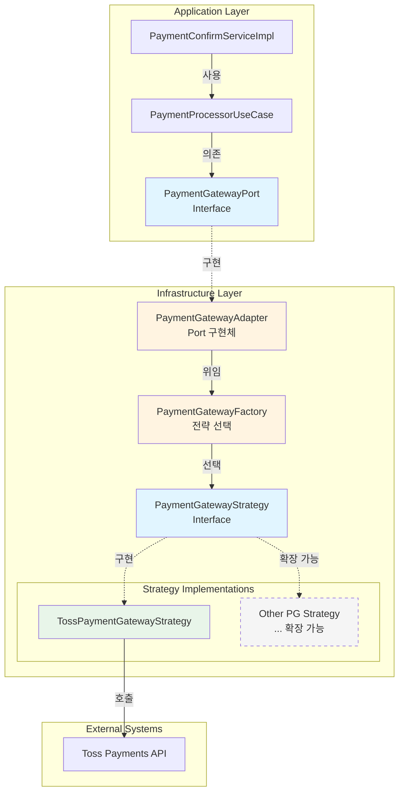

> 실행 환경: Java 21, Spring Boot 3.3.3

## 배경 및 문제 정의

결제 시스템은 다양한 PG(Payment Gateway) 업체와 연동되어야 하며, 비즈니스 요구사항에 따라 PG를 유연하게 전환할 수 있어야 한다. 그러나 초기 구현에서는 특정 PG(Toss Payments)에
강하게 결합된 구조로 인해 다음과 같은 근본적인 문제들이 존재했다.

- 도메인/애플리케이션 레이어에 Toss-specific 타입 직접 사용 (`TossPaymentInfo`, `TossPaymentDetails`)
- PG 변경 시 핵심 비즈니스 로직 수정 필요로 인한 높은 결합도
- 여러 PG 동시 지원 불가능으로 비즈니스 확장성 제약

## 해결 방향

이러한 문제를 해결하기 위해 전략 패턴(Strategy Pattern)과 포트-어댑터 패턴(Port-Adapter Pattern)을 결합하여 PG 독립적인 아키텍처를 구축했다.  
핵심은 **추상화를 통한 의존성 역전**으로, 도메인 레이어는 구체적인 PG 구현체가 아닌 추상화된 인터페이스에만 의존하도록 설계했다.

- 도메인 모델 PG 독립화: PG 변경 시 핵심 비즈니스 로직 무수정
- 런타임 전략 교체 가능(설정 기반): 코드 재배포 없이 PG 전환
- 새로운 PG 추가 시 기존 코드 무영향(OCP 준수): 확장에는 열려있고 수정에는 닫힌 구조

위 목표를 달성하기 위해 다음 디자인 패턴을 적용했다.

- **전략 패턴**: PG별 결제 처리 로직을 독립적인 전략으로 캡슐화
- **포트-어댑터 패턴**: 외부 시스템(PG API)과의 경계를 명확히 분리
- **팩토리 패턴**: 설정 기반 전략 객체 생성 및 선택 자동화

## 아키텍처 설계

### 레이어 구조

애플리케이션 레이어는 구체적인 구현이 아닌 Port 인터페이스에만 의존하며, 실제 PG 통신 로직은 Infrastructure 레이어의 Strategy 구현체에서 처리된다.



### 핵심 컴포넌트

#### 1. PaymentGatewayPort(포트 인터페이스)

애플리케이션 레이어가 외부 PG와 통신하기 위한 추상 인터페이스로, 구체적인 PG 구현체가 이를 구현하는 의존성 역전 구조를 형성한다.

```java
public interface PaymentGatewayPort {

    PaymentStatusResult getStatus(String paymentKey);

    PaymentStatusResult getStatusByOrderId(String orderId);

    PaymentConfirmResult confirm(PaymentConfirmRequest request);

    PaymentCancelResult cancel(PaymentCancelRequest request);
}
```

- PG 독립적인 DTO 모델 사용 (`PaymentStatusResult`, `PaymentConfirmRequest`)하여 특정 PG에 종속되지 않도록 설계
- 모든 메서드는 특정 PG사 종속적이지 않은 DTO 사용
- PG별 데이터 변환은 Infrastructure 레이어에서 처리

#### 2. InternalPaymentGatewayAdapter(어댑터 구현)

Port를 구현하고 전략 패턴으로 위임하는 역할을 한다. 이 어댑터는 애플리케이션 레이어와 인프라스트럭처 레이어 사이의 중재자 역할을 수행하며, 실제 PG 통신 로직은 Strategy 구현체에 위임한다.

```java

@Component
@RequiredArgsConstructor
public class InternalPaymentGatewayAdapter implements PaymentGatewayPort {

    private final PaymentGatewayFactory factory;
    private final PaymentGatewayProperties properties;

    @Override
    public PaymentConfirmResult confirm(PaymentConfirmRequest request) {
        PaymentGatewayStrategy strategy = factory.getStrategy(properties.getType());
        return strategy.confirm(request);
    }

    // 나머지 메서드도 동일한 패턴
}
```

#### 3. PaymentGatewayStrategy(전략 인터페이스)

PG별 구현체가 구현해야 하는 공통 인터페이스를 정의하여, 모든 PG가 제공해야 하는 표준 작업(결제 승인, 취소, 조회)을 명시한다.

```java
public interface PaymentGatewayStrategy {

    boolean supports(PaymentGatewayType type);

    PaymentConfirmResult confirm(PaymentConfirmRequest request);

    PaymentCancelResult cancel(PaymentCancelRequest request);

    PaymentStatusResult getStatus(String paymentKey);

    PaymentStatusResult getStatusByOrderId(String orderId);
}
```

#### 4. PaymentGatewayFactory(전략 선택 팩토리)

설정 기반으로 적절한 전략을 선택하고 반환하는 역할로, Spring의 의존성 주입을 활용하여 모든 Strategy 구현체를 자동으로 수집하고, 런타임에 설정값에 따라 적절한 구현체를 선택한다.

```java

@Component
@RequiredArgsConstructor
public class PaymentGatewayFactory {

    private final List<PaymentGatewayStrategy> strategies;

    public PaymentGatewayStrategy getStrategy(PaymentGatewayType type) {
        return strategies.stream()
                .filter(strategy -> strategy.supports(type))
                .findFirst()
                .orElseThrow(() -> UnsupportedPaymentGatewayException.of(type));
    }
}
```

- **Spring 자동 주입**: 모든 `PaymentGatewayStrategy` 구현체가 자동으로 `List`에 주입
- **예외 처리**: 지원하지 않는 PG 타입이 설정되면 명확한 예외(`UnsupportedPaymentGatewayException`)를 발생

#### 5. TossPaymentGatewayStrategy(구체적 전략 구현)

Toss Payments API와의 실제 통신 로직을 수행하며, 구현체는 특정 PG사에 종속적인 세부 사항을 캡슐화한다.

```java

@Component
@RequiredArgsConstructor
public class TossPaymentGatewayStrategy implements PaymentGatewayStrategy {

    private final PaymentGatewayInternalReceiver paymentGatewayInternalReceiver;

    @Override
    public boolean supports(PaymentGatewayType type) {
        return type == PaymentGatewayType.TOSS;
    }

    @Override
    public PaymentConfirmResult confirm(PaymentConfirmRequest request) {
        // 1. 도메인 모델 → Toss-specific 모델 변환
        TossConfirmGatewayCommand tossCommand = TossConfirmGatewayCommand.builder()
                .orderId(request.orderId())
                .paymentKey(request.paymentKey())
                .amount(request.amount())
                .idempotencyKey(generateIdempotencyKey(request.orderId()))
                .build();

        // 2. Toss API 호출
        PaymentGatewayInfo info = PaymentInfrastructureMapper.toPaymentGatewayInfo(
                paymentGatewayInternalReceiver.confirmPayment(
                        PaymentInfrastructureMapper.toTossConfirmRequest(tossCommand)
                )
        );

        // 3. Toss 응답 → 도메인 모델 변환
        return convertToPaymentConfirmResult(info, request);
    }

    private PaymentConfirmResult convertToPaymentConfirmResult(
            PaymentGatewayInfo info, PaymentConfirmRequest request) {
        // Toss 상태 코드 → 도메인 상태 매핑
        PaymentConfirmResultStatus status = determineConfirmResultStatus(info, failure);
        return new PaymentConfirmResult(status, info.getPaymentKey(), ...);
    }
}
```

해당 메서드는 계층 간 명확한 책임 분리를 위해 다음 3단계로 구성된다.

1. **도메인 모델 변환**: `PaymentConfirmRequest` (PG-독립 모델) → `TossConfirmGatewayCommand` (Toss-specific 모델)
    - 멱등성 키(Idempotency Key) 생성을 통한 중복 결제 방지
    - Toss API 요구사항에 맞는 데이터 형식 변환
2. **PG API 호출**: `PaymentGatewayInternalReceiver`를 통한 실제 HTTP 통신
    - 네트워크 통신 및 인증 처리
    - 타임아웃, 재시도 등의 복원력 패턴 적용
3. **응답 변환 및 매핑**: Toss 응답 → 도메인 모델 (`PaymentConfirmResult`)
    - Toss의 상태 코드를 도메인 상태(`PaymentConfirmResultStatus`)로 정규화
    - PG-specific한 에러 정보를 도메인 예외로 변환

## 결론

이번 아키텍처 리팩토링을 통해 기술적 개선과 함께 비즈니스 유연성을 확보할 수 있었다.

1. **PG 독립성 확보**: 도메인/애플리케이션 레이어에서 PG-specific 타입 완전 제거
2. **확장 가능한 구조**: 기존 코드 수정 없이 새로운 PG 추가 가능

이러한 아키텍처는 결제 시스템의 핵심인 **안정성**과 **확장성**을 동시에 달성하며, 향후 비즈니스 요구사항 변경에 따른 다양한 요구사항에 유연하게 대응할 수 있는 기반을 제공할 수 있다.
