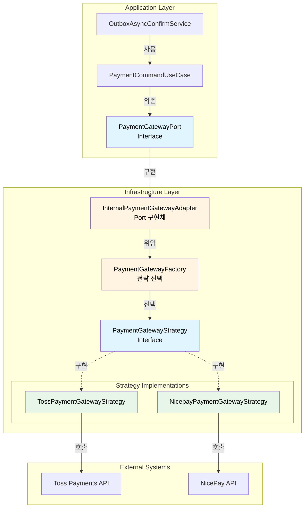
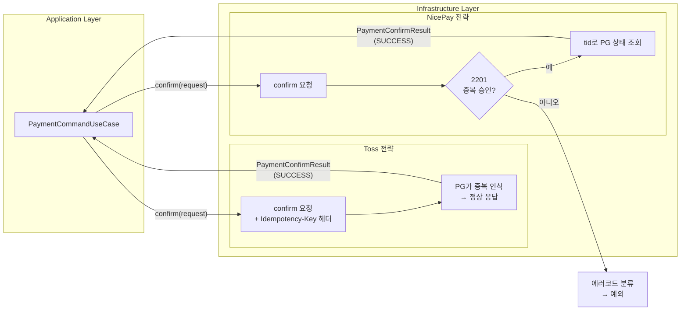

> 실행 환경: Java 21, Spring Boot 3.4.4

## 배경 및 문제 정의

초기 구현에서는 특정 PG(Toss Payments)에 강하게 결합된 구조로, 결제 시스템은 비즈니스 요구에 따라 PG를 유연하게 전환할 수 없는 구조였다.

- 도메인/애플리케이션 레이어에 Toss-specific 타입 직접 사용 (`TossPaymentInfo`, `TossPaymentDetails`)
- PG 변경 시 핵심 비즈니스 로직 수정 필요로 인한 높은 결합도
- 여러 PG 동시 지원 불가능으로 비즈니스 확장성 제약

## 해결 방향

이러한 문제를 해결하기 위해 전략 패턴과 포트-어댑터 패턴을 결합하여 PG 독립적인 아키텍처를 구축하고, 실제로 NicePay를 두 번째 PG로 추가하여 멀티 PG 운영을 달성했다.

|                 목표                  |        달성 방법        |
|:-----------------------------------:|:-------------------:|
| 도메인 모델 PG 독립화 (PG 변경 시 비즈니스 로직 무수정) |  포트-어댑터 패턴으로 경계 분리  |
|     새로운 PG 추가 시 기존 코드 무영향 (OCP)     |   전략 패턴으로 구현체 캡슐화   |
|   PG마다 다른 멱등성 처리를 상위 레이어에 노출하지 않음   | 구현체 내부에서 에러 감지 및 보상 |

핵심은 추상화를 통한 의존성 역전으로, 도메인 레이어는 구체적인 PG 구현체가 아닌 추상화된 인터페이스에만 의존하도록 설계했다.

## 아키텍처 설계

### 레이어 구조

애플리케이션 레이어는 구체적인 구현이 아닌 Port 인터페이스에만 의존하며, 실제 PG 통신 로직은 Infrastructure 레이어의 Strategy 구현체에서 처리된다.

- 현재 Toss와 NicePay 두 전략 구현
- 결제건마다 `gatewayType`으로 올바른 PG를 라우팅


```mermaid
graph TB
    subgraph "Application Layer"
        Service[OutboxAsyncConfirmService]
        UseCase[PaymentCommandUseCase]
        Port[PaymentGatewayPort<br/>Interface]
    end

    subgraph "Infrastructure Layer"
        Adapter[InternalPaymentGatewayAdapter<br/>Port 구현체]
        Factory[PaymentGatewayFactory<br/>전략 선택]
        Strategy[PaymentGatewayStrategy<br/>Interface]

        subgraph "Strategy Implementations"
            Toss[TossPaymentGatewayStrategy]
            Nicepay[NicepayPaymentGatewayStrategy]
        end
    end

    subgraph "External Systems"
        TossAPI[Toss Payments API]
        NicepayAPI[NicePay API]
    end

    Service -->|사용| UseCase
    UseCase -->|의존| Port
    Port -.->|구현| Adapter
    Adapter -->|위임| Factory
    Factory -->|선택| Strategy
    Strategy -.->|구현| Toss
    Strategy -.->|구현| Nicepay
    Toss -->|호출| TossAPI
    Nicepay -->|호출| NicepayAPI
    style Port fill: #e1f5ff, color: #000
    style Strategy fill: #e1f5ff, color: #000
    style Adapter fill: #fff4e1, color: #000
    style Factory fill: #fff4e1, color: #000
    style Toss fill: #e8f5e9, color: #000
    style Nicepay fill: #e8f5e9, color: #000
```

### 핵심 컴포넌트

#### 1. PaymentGatewayPort(포트 인터페이스)

애플리케이션 레이어가 외부 PG와 통신하기 위한 추상 인터페이스로, 구체적인 PG 구현체가 이를 구현하는 의존성 역전 구조를 형성한다.

```java
// PaymentGatewayPort.java
public interface PaymentGatewayPort {

    PaymentStatusResult getStatus(String paymentKey, PaymentGatewayType gatewayType);

    PaymentStatusResult getStatusByOrderId(String orderId, PaymentGatewayType gatewayType);

    PaymentConfirmResult confirm(PaymentConfirmRequest request);

    PaymentCancelResult cancel(PaymentCancelRequest request);
}
```

- 모든 메서드는 PG-독립적인 DTO(`PaymentStatusResult`, `PaymentConfirmRequest`) 사용 — 특정 PG에 종속되지 않는 구조
- 예외도 벤더 중립(`PaymentGatewayRetryableException`, `PaymentGatewayNonRetryableException`)으로 통일
- `getStatus`, `getStatusByOrderId`는 `gatewayType` 파라미터를 받아 결제건에 기록된 PG로 조회
- PG별 데이터 변환은 Infrastructure 레이어에서 처리

#### 2. InternalPaymentGatewayAdapter(어댑터 구현)

Port를 구현하고 전략 패턴으로 위임하는 중재 역할을 수행하며, 실제 PG 통신 로직은 Strategy 구현체에 위임한다.

```java
// InternalPaymentGatewayAdapter.java
@Component
@RequiredArgsConstructor
public class InternalPaymentGatewayAdapter implements PaymentGatewayPort {

    private final PaymentGatewayFactory factory;
    private final PaymentGatewayProperties properties;

    @Override
    public PaymentConfirmResult confirm(PaymentConfirmRequest request) {
        PaymentGatewayStrategy strategy = factory.getStrategy(request.gatewayType());
        return strategy.confirm(request);
    }

    // confirm/cancel은 요청의 gatewayType으로 전략 선택
    private PaymentGatewayType resolveGatewayType(PaymentGatewayType gatewayType) {
        return gatewayType != null ? gatewayType : properties.getType();
    }
}
```

- `confirm`/`cancel`: 요청 DTO에 포함된 `gatewayType`으로 전략 선택
- `getStatus`/`getStatusByOrderId`: `PaymentEvent`에 기록된 `gatewayType` 사용

#### 3. PaymentGatewayStrategy(전략 인터페이스)

PG별 구현체가 구현해야 하는 공통 인터페이스를 정의하여, 모든 PG가 제공해야 하는 표준 작업(결제 승인, 취소, 조회)을 명시한다.

```java
// PaymentGatewayStrategy.java
public interface PaymentGatewayStrategy {

    boolean supports(PaymentGatewayType type);

    PaymentConfirmResult confirm(PaymentConfirmRequest request);

    PaymentCancelResult cancel(PaymentCancelRequest request);

    PaymentStatusResult getStatus(String paymentKey);

    PaymentStatusResult getStatusByOrderId(String orderId);
}
```

#### 4. PaymentGatewayFactory(전략 선택 팩토리)

설정 기반으로 적절한 전략을 선택하고 반환하는 역할로, Spring의 의존성 주입을 활용하여 모든 Strategy 구현체를 자동으로 수집하고, 런타임에 설정값에 따라 적절한 구현체를 선택한다.

```java
// PaymentGatewayFactory.java
@Component
@RequiredArgsConstructor
public class PaymentGatewayFactory {

    private final List<PaymentGatewayStrategy> strategies;

    public PaymentGatewayStrategy getStrategy(PaymentGatewayType type) {
        return strategies.stream()
                .filter(strategy -> strategy.supports(type))
                .findFirst()
                .orElseThrow(() -> UnsupportedPaymentGatewayException.of(type));
    }
}
```

- Spring 자동 주입: 모든 `PaymentGatewayStrategy` 구현체가 자동으로 `List`에 주입
- 예외 처리: 지원하지 않는 PG 타입이 설정되면 명확한 예외(`UnsupportedPaymentGatewayException`)를 발생

## 구현체 내부에서의 멱등성 추상화

PG마다 다른 멱등성 보장 방식을 구현체 내부에서 캡슐화하여, Application 레이어에는 동일한 `PaymentConfirmResult`만 노출하게 구현했다.

### 문제 - PG마다 다른 멱등성 처리

결제 승인은 네트워크 장애, 타임아웃 등으로 중복 요청이 발생할 수 있는데, PG마다 멱등성 보장 방식이 다르다.

|   PG    | 멱등성 보장 방식               | 중복 요청 시 동작                   |
|:-------:|:------------------------|:-----------------------------|
|  Toss   | `Idempotency-Key` 헤더 전송 | PG가 같은 요청으로 인식, **정상 응답 반환** |
| NicePay | 멱등성 키 미지원               | **에러코드 2201 반환** (중복 승인 거절)  |

이러한 처리 방식의 차이를 Application 레이어에 노출하면 PG별 분기 로직이 비즈니스 레이어에 침투하게 된다.

### 해결 - 구현체 내부에서 에러를 감지하고 보상 처리

NicePay 전략 구현체는 중복 승인 에러(2201)를 내부에서 catch하고, 조회 API로 보상 처리한 뒤 정상 결과를 반환했다.

```java
// NicepayPaymentGatewayStrategy.java (발췌)
private PaymentConfirmResult executeConfirmPayment(
        NicepayConfirmRequest confirmRequest,
        PaymentConfirmRequest request
) throws PaymentGatewayRetryableException, PaymentGatewayNonRetryableException {
    try {
        NicepayPaymentResponse response =
                nicepayGatewayInternalReceiver.confirmPayment(confirmRequest);
        return convertToPaymentConfirmResult(response, request);
    } catch (PaymentGatewayApiException e) {
        if (NICEPAY_ERROR_CODE_DUPLICATE_APPROVAL.equals(e.getCode())) {
            // 2201 중복 승인 → 조회 API로 보상 처리
            return handleDuplicateApprovalCompensation(request);
        }
        return classifyAndThrowConfirmException(e);
    }
}
```

이 구조에서 Application 레이어의 `PaymentCommandUseCase`는 PG가 Toss인지 NicePay인지, 멱등성 키를 헤더로 보내는지 보상 조회로 처리하는지 전혀 알지 못한다.


```mermaid
flowchart LR
    subgraph "Application Layer"
        UC[PaymentCommandUseCase]
    end

    subgraph "Infrastructure Layer"
        subgraph "Toss 전략"
            T1["confirm 요청\n+ Idempotency-Key 헤더"]
            T2["PG가 중복 인식\n→ 정상 응답"]
        end
        subgraph "NicePay 전략"
            N1["confirm 요청"]
            N2{"2201\n중복 승인?"}
            N3["tid로 PG 상태 조회"]
        end
    end

    UC -->|" confirm(request) "| T1
    UC -->|" confirm(request) "| N1
    T1 --> T2
    T2 -->|" PaymentConfirmResult\n(SUCCESS) "| UC
    N1 --> N2
    N2 -->|예| N3
    N2 -->|아니오| N5["에러코드 분류\n→ 예외"]
    N3 -->|" PaymentConfirmResult\n(SUCCESS) "| UC
```

두 경우 모두 동일한 `PaymentConfirmResult(SUCCESS, ...)` 를 받으면서, 로직을 수행할 수 있게 된다.

## 결론

전략 패턴과 포트-어댑터 패턴을 결합하여 PG 독립적인 아키텍처를 구축하고, 실제로 NicePay를 두 번째 PG로 추가함으로써 설계의 확장성을 검증했다.

1. **PG 독립성 확보**: 도메인/애플리케이션 레이어에서 PG-specific 타입 완전 제거
2. **확장 가능한 구조**: `PaymentGatewayStrategy` 구현 + `@Component` 등록만으로 새 PG 추가 가능, Factory 코드 수정 불필요
3. **멱등성 차이 캡슐화**: PG마다 다른 멱등성 보장 방식(헤더 vs 보상 조회)을 구현체 내부에서 처리하여 상위 레이어에 동일한 결과 타입만 노출
