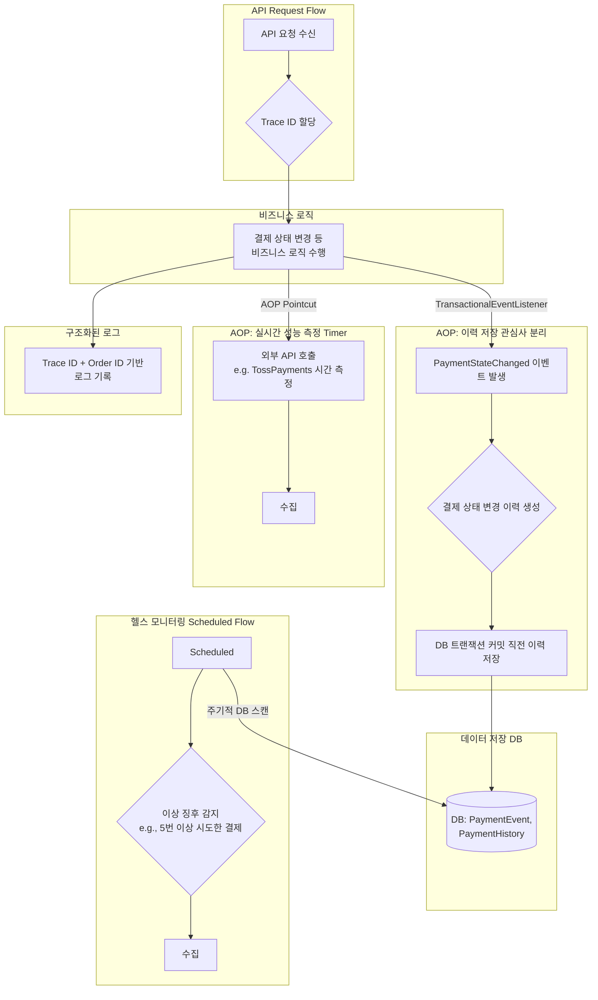
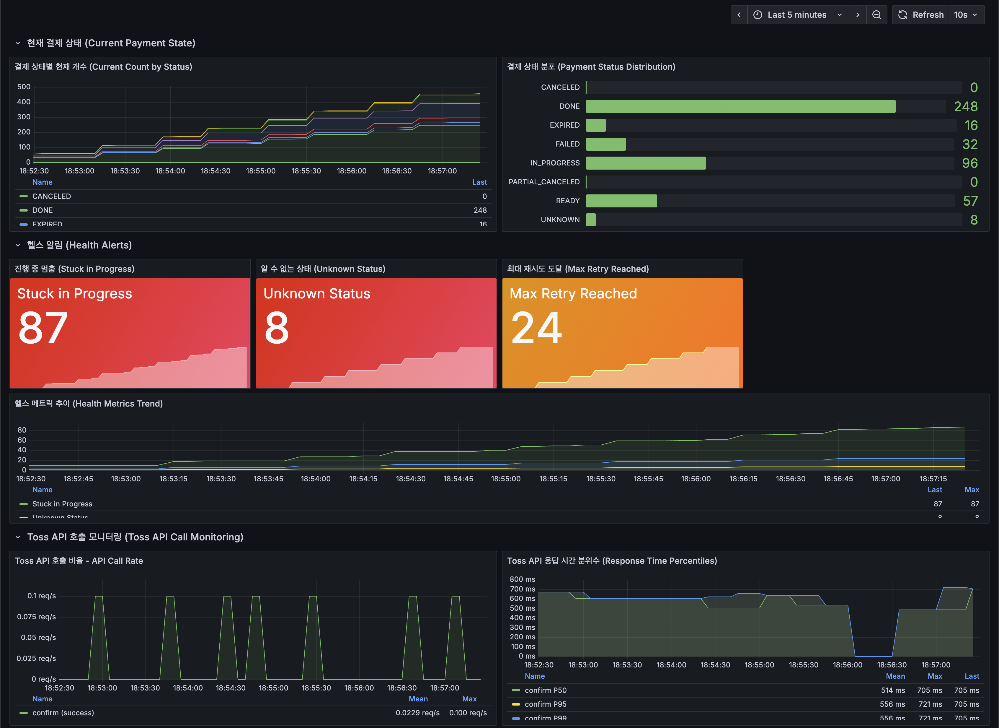
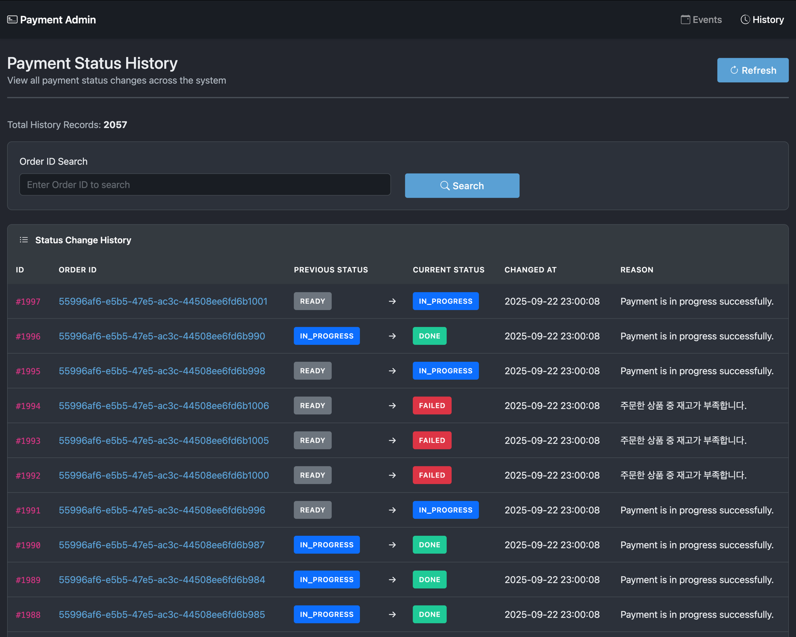
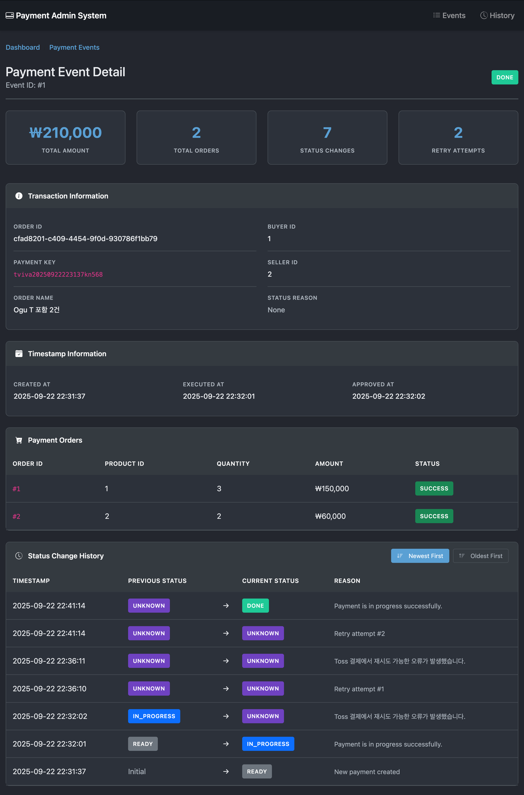

> 실행 환경: Java 21, Spring Boot 3.3.3

## 배경 및 문제 정의

[결제 복구 시스템](/blog/payment-status-with-retry/)을 구축하면서 결제 상태가 복잡해지면서 다양한 상태와 재시도 메커니즘이 추가되면서 상태의 추적이 필요해졌다.  
이러한 상태 전환을 단순 로그로만 남길 경우 다음과 같은 한계가 존재했다.

- 구조화되지 않은 로그 데이터로 인해 집계 및 분석이 어려움
- 트랜잭션 단위로 상태 변경의 정합성을 보장할 수 없음
- 수동 로그 해석에 따른 운영 효율성 저하
- 이상 데이터 탐지 및 모니터링 한계

따라서, 구조화된 상태 변경 이력을 별도 테이블에 저장하고, 결제 이벤트를 시간순으로 추적할 수 있는 시스템을 구축할 필요가 있었다.  
또한, 단순 이력 추적을 넘어 시스템 투명성 확보가 중요하다고 판단했고, 외부 API 호출 시간, 혹은 특정 상태에 비정상적으로 머무는 결제 건수 등을 파악할 수 있는 실시간 모니터링 체계를 추가하고자 했다.

## 개발 목표 및 설계 원칙

이번 기능 개발에 있어, 아래의 항목들을 충족시키는 것이 핵심 목표로 설정하였다.

- 완전성: 모든 상태 전환이 누락 없이 기록
- 추적 가능성: 단일 결제 건의 모든 상태 전환을 시간순으로 연결·조회 가능
- 관심사 분리: 비즈니스 로직에 침투하지 않고 선언적으로 이력 추적 및 모니터링 기능 추가
- 운영 투명성: 외부 API 호출 성능 / 비정상 상태(5회 이상 재시도) 등 운영 지표 실시간 모니터링 기능 제공

## 기술 검토 및 설계 결정

두 가지 핵심 목표(이력 추적, 헬스 모니터링)를 달성하기 위해 다양한 기술적 대안을 검토했다.

### 결제 이력 추적(AOP + Spring Event 기반 설계)

결제 이력 추적 기능 구현을 위해 AOP + Spring Event을 사용하고, 커밋 직전(BEFORE_COMMIT)에 이력 저장을 수행하는 방안을 채택했다.

- AOP (Aspect-Oriented Programming)
    - 선정 이유: 상태 변경 기록은 전형적인 횡단 관심사 -> 서비스 코드 변경 최소화 가능
    - 장점: 어노테이션 기반 선언적 프로그래밍으로 적용 누락 최소화
        - Repository 직접 호출 대비 결합도 낮음

- Spring ApplicationEvent
    - 선정 이유: 프레임워크 내장 이벤트 시스템 활용 -> 외부 라이브러리 불필요
    - 장점: 이벤트 발행(서비스)과 처리(저장) 분리 -> 결합도 낮춤
        - 메시지 큐 대비 인프라 비용 추가 없이 구현 가능

- TransactionPhase.BEFORE_COMMIT
    - 선정 이유: 커밋 직전에 실행하여 비즈니스 상태와 이력 간 정합성 확보
    - 장점: 로직이 성공한 경우에만 기록
        - AFTER_COMMIT은 커밋 후 저장 실패하더라도, 비즈니스 로직이 이미 커밋된 상태가 되어 불일치 발생하는 문제 발생
        - 히스토리 테이블의 변경 이력 == 실제 비즈니스 상태 변경을 보장

### 모니터링

- AOP
    - 선정 이유: 기존 이력 추적 AOP와 동일한 메커니즘 활용 가능
    - 장점: 메서드 실행 시간(API 호출 시간) 측정 및 결제 상태 변경 감지 용이
- Scheduler DB 스캔
    - 선정 이유: 5회 이상 재시도 상태 등 장기 체류 결제 건 탐지 용이
    - 장점: 주기적으로 스캔하고, 이를 메트릭으로 노출하여 Grafana 대시보드에서 실시간 모니터링 가능

## 구현 세부 사항 1 - 결제 이력 추적

```
Service Method (@PublishPaymentHistory)
    ↓
AOP Aspect
    ↓
ApplicationEvent 발행
    ↓
@TransactionalEventListener (BEFORE_COMMIT)
    ↓
PaymentHistory 저장
    ↓
Payment 상태 변경
```

### 1. 이력 추적 어노테이션 적용

비즈니스 서비스 메서드에 `@PublishPaymentHistory` 어노테이션을 선언하여, 해당 메서드 실행 시 자동으로 상태 변경 이력을 발행하도록 설정했다.

```java

@Transactional
@PublishPaymentHistory(action = "changed")
public PaymentEvent markPaymentAsFail(
        PaymentEvent paymentEvent,
        @Reason String failureReason // 이력에 기록할 사유
) {
    // 순수한 비즈니스 로직 수행
    paymentEvent.fail(failureReason);
    return paymentEventRepository.saveOrUpdate(paymentEvent);
}
```

- `@PublishPaymentHistory` 어노테이션으로 이력 추적 대상 메서드 지정 및 action 속성으로 상태 변경 유형 전달
- `@Reason` 어노테이션으로 이력 기록에 포함할 변경 사유 전달

### 2. AOP Aspect - 상태 변경 감지

AOP Aspect에서는 메서드 실행 전의 상태를 저장하고, 변경 이력을 담은 이벤트를 발행한다.

```java

@Around("@annotation(publishHistory)")
public Object publishHistoryEvent(ProceedingJoinPoint joinPoint, PublishPaymentHistory publishHistory)
        throws Throwable {
    // 1. 실행 전 상태 캡처
    Optional<PaymentEvent> beforeEventOpt = findPaymentEvent(joinPoint.getArgs());
    PaymentEventStatus beforeStatus = beforeEventOpt.map(PaymentEvent::getStatus).orElse(null);

    // 2. 이력에 기록할 사유 추출
    String reason = findReasonParameter(joinPoint);

    try {
        // 3. 비즈니스 로직 실행
        Object result = joinPoint.proceed();

        // 4. 실행 결과 기반으로 상태 변경 이벤트 발행
        processResultAndPublishEvent(beforeStatus, result, reason, publishHistory);

        return result;
    } catch (Exception e) {
        log.error("Error occurred while processing payment: {}", e.getMessage(), e);
        throw e;
    }
}
```

- `findPaymentEvent` 메서드로 현재 상태를 조회하여 이전 상태 저장
- `findReasonParameter`로 이력에 포함할 변경 사유 추출
- 비즈니스 로직 실행 후 action에 따라 적절한 이벤트 발행

### 3. 이벤트 리스너 - BEFORE_COMMIT 전략

Spring의 `@TransactionalEventListener`를 이용해, 트랜잭션 커밋 직전인 `TransactionPhase.BEFORE_COMMIT` 단계에서 이력 저장 로직을 실행한다.

```java

@TransactionalEventListener(phase = TransactionPhase.BEFORE_COMMIT)
public void handlePaymentHistoryEvent(PaymentHistoryEvent event) {
    paymentHistoryService.recordPaymentHistory(event);
}
```

- `BEFORE_COMMIT` 단계는 트랜잭션이 성공적으로 커밋되기 직전에 실행되어, 비즈니스 상태 변경과 이력 기록이 동일 트랜잭션 내에서 처리되도록 보장
- 상태 변경과 이력 저장 간 불일치 문제를 방지하며, 데이터 정합성과 원자성을 확보

## 구현 세부 사항 2 - 모니터링

### 1. Toss API 메트릭 수집

외부 PG사인 Toss API 호출 시, AOP를 활용하여 호출 시간 및 성공/실패 여부를 메트릭으로 기록하도록 구현했다.

```java

@Around("@annotation(tossApiMetric)")
public Object recordTossApiMetric(
        ProceedingJoinPoint joinPoint,
        TossApiMetric tossApiMetric
) throws Throwable {
    long startTime = System.currentTimeMillis();

    try {
        Object result = joinPoint.proceed();
        // 시간 측정
        long duration = System.currentTimeMillis() - startTime;

        // 성공 메트릭 기록
        handleSuccess(joinPoint, tossApiMetric, duration);

        return result;
    } catch (Exception e) {
        // ...
    }
}

private void handleSuccess(ProceedingJoinPoint joinPoint, TossApiMetric tossApiMetric, long duration) {
    switch (tossApiMetric.value()) {
        case SUCCESS:
            // 측정된 시간과 함께 메트릭 기록
            tossApiMetrics.recordTossApiCall(tossApiMetric.operation(), duration, true);
            break;
        // ...
    }
}
```

### 2. 스케줄러 기반 이상 징후 감지 (Gauge)

상태가 오랫동안 변경되지 않은 결제 건수, 알 수 없는 상태 건수, 최대 재시도 횟수에 도달한 건수 등은 주기적으로 DB에서 조회하여 Gauge 메트릭으로 기록하는 스케줄러를 구현했다.

```java

@Scheduled(fixedDelayString = "${metrics.payment.health.polling-interval-seconds:10}000")
public void updateHealthGauges() {
    LocalDateTime now = localDateTimeProvider.now();

    // Stuck in progress
    LocalDateTime stuckThreshold = now.minusMinutes(stuckInProgressMinutes);
    long stuckInProgress = paymentEventRepository
            .countByStatusAndExecutedAtBefore(PaymentEventStatus.IN_PROGRESS, stuckThreshold);
    healthGauges.get("stuck_in_progress").set(stuckInProgress);

    // Unknown status
    long unknownStatus = paymentEventRepository.countByStatus()
            .getOrDefault(PaymentEventStatus.UNKNOWN, 0L);
    healthGauges.get("unknown_status").set(unknownStatus);

    // Max retry reached
    long maxRetryReached = paymentEventRepository
            .countByRetryCountGreaterThanEqual(maxRetryCount);
    healthGauges.get("max_retry_reached").set(maxRetryReached);

    log.debug("Health gauges updated - stuckInProgress={}, unknownStatus={}, maxRetryReached={}",
            stuckInProgress, unknownStatus, maxRetryReached);
}
```

#### 주기적 DB 스캔의 위험성

헬스 체크를 위한 주기적인 DB 스캔을 사용하여 간단하게 구현할 수 있었으나, 운영 환경에서 다음과 같은 잠재적 위험이 존재한다.

- 트래픽이 많은 운영 환경에서 잦은 `SELECT`는 DB 부하 발생
- 헬스 체크 쿼리가 복잡해지거나 인덱스를 제대로 활용하지 못할 경우, 메인 비즈니스 로직의 트랜잭션 성능까지 영향 받을 수 있음

때문에 시스템 확장 시에는 다음과 같은 해결 방안을 고려해볼 수 있을 것으로 보인다.

1. **읽기 전용 복제(Read Replica) DB 활용:** 모니터링 및 헬스 체크 쿼리를 읽기 전용 DB(Replica)로 분리하여, 다른 비즈니스 트랜잭션에 미치는 영향 최소화
2. **쿼리 최적화:** 복합 인덱스를 적용하여 `Full Table Scan` 방지
3. **이벤트 기반 헬스 체크:** DB 스캔 대신, 지연 큐(e.g., Redis, Kafka Streams)를 활용해 '5분 뒤 헬스 체크' 이벤트를 발행하는 방식으로 DB 의존성 제거

## 결론



이번 작업을 통해 AOP, Spring Event, 스케줄러를 조합하여 추적 가능하고 투명한 결제 시스템의 기반을 구축하여 다음과 같은 성과를 달성할 수 있었다.

- 복잡한 결제 상태 변경의 체계적 관리: 다양한 결제 상태와 재시도 로직이 혼재하는 환경에서도 모든 상태 변경 내역을 누락 없이 기록하여 장애 분석 및 추적 가능
- 비즈니스 로직의 순수성 및 유지보수성 향상: 이력 추적 기능이 AOP를 통한 선언적 방식으로 분리되어, 기존 비즈니스 서비스 코드에 침투하지 않고 기능 추가
- 실시간 운영 투명성 확보: Toss API 호출 시간을 실시간 측정하고, 스케줄러로 핵심 결제 상태 지표를 추가하여, 시스템의 현재 상태를 실시간으로 모니터링 가능






