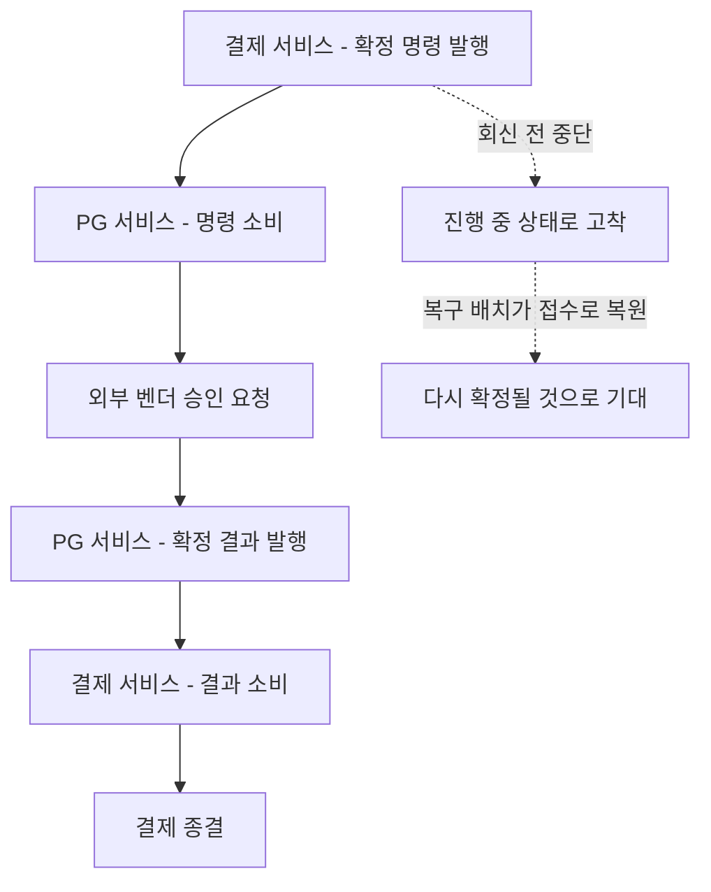
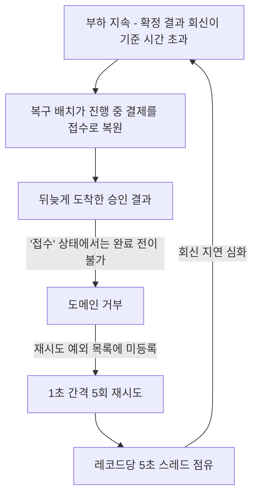
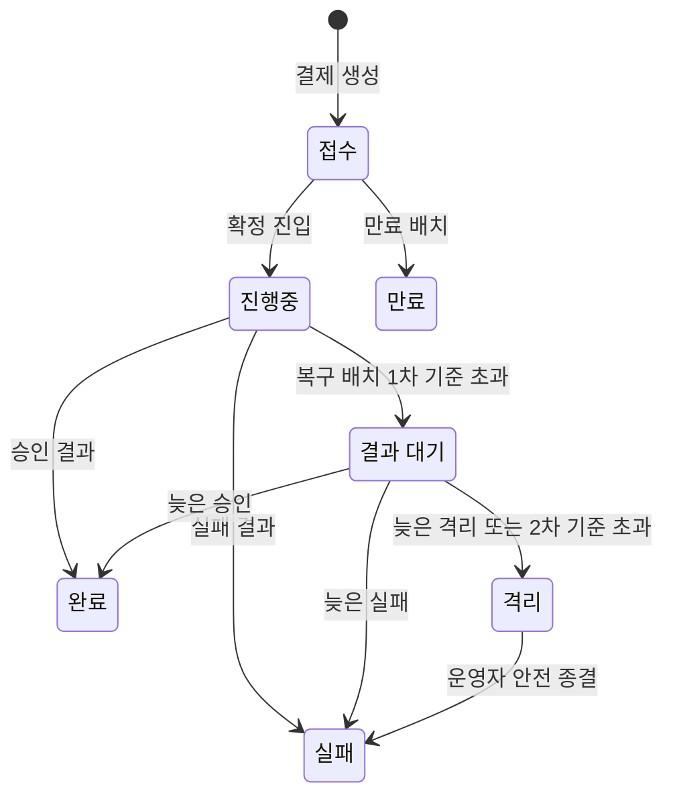

> 실행 환경: Java 21, Spring Boot 3.4.4, MySQL 8.0, Kafka (KRaft), Redis, Docker Compose

## 도입

결제 확정은 외부 벤더 (PG사)의 승인을 받아야 끝나며, 승인에는 길게 수 초가 소요될 수 있다.

- 동기로 처리하면 그동안 요청 스레드와 DB 커넥션이 묶임
- 트래픽이 몰리면 대기만 하는 요청이 자원을 모두 소진

그래서 승인 요청을 받은 즉시 접수만 응답하고, 실제 벤더 호출은 메시지로 넘겨 비동기로 처리한다.

- 결제 서비스가 확정 명령을 발행
- PG 서비스가 명령을 소비해 외부 벤더를 호출
- 벤더 판정을 확정 결과 메시지로 회신
- 결제 서비스가 결과를 소비해 결제를 종결

결과적으로 확정은 두 서비스가 메시지로 주고받는 왕복 구조가 된다.



명령과 결과 사이에 시간 간격이 있어, 그 사이 프로세스가 중단되면 결제가 진행 중 상태로 고착될 수 있기 때문에, 이를 되살리기 위해 복구 배치를 운영한다.

- 2분 주기로 진행 중 상태에 오래 머문 결제를 조회
- 기준 시간 5분을 넘겼으면 접수 상태로 복원
- 접수 상태로 복원된 결제는 다시 확정 흐름을 타고 종결될 것으로 기대

이 배치 결국 부하 구간에서 확정 처리를 통째로 멈추게 한 원인이 되었다.

### 결제 상태 정의

시스템 내 결제는 다음 상태를 가진다.

|  상태   |                      의미                      |
|:-------:|:----------------------------------------------:|
|  접수   |  주문이 생성되고 확정에는 아직 진입하지 않음   |
| 진행 중 |     확정에 진입해 벤더 응답을 기다리는 중      |
|  완료   |             승인이 확인되어 종결됨             |
|  실패   |      벤더 거절 또는 재고 부족으로 종결됨       |
|  격리   | 자동 판정이 불가능해 운영자 확인이 필요한 상태 |

격리는 이 시스템에서 "판단 보류"를 담당하며, 자동 처리를 멈추고 사람이 확인하도록 남겨 두는 상태다.

## 발단: 처리량 측정에서 드러난 이상

인스턴스 수를 조절하면서 처리율이 오르지 않아 원인을 추적하던 중에, 병목이 Kafka 토픽의 파티션 수에 있다는 것을 발견했다.

- 하나의 파티션은 한 번에 하나의 컨슈머만 담당
- 따라서 파티션 수가 소비 병렬도의 상한으로 작용
- 파티션보다 컨슈머를 많이 띄워도 남는 컨슈머는 배정받을 파티션이 없어 대기

측정 대상 토픽은 파티션이 3이었고, PG 서비스는 컨슈머 동시성을 지정한 적이 없어 기본값 1로 동작하고 있었다. (컨슈머 하나가 파티션 셋을 담당)

- 인스턴스를 늘려도 파티션 3을 넘는 병렬 소비가 불가능
- 파티션과 동시성을 9로 조정하자 인스턴스 증설 없이 처리율 1.86배 확보

설정값 조정으로 문제가 해결되는듯 했으나, 측정 사이클을 반복할수록 결과가 불안정해졌다.

- 일정 시간 부하를 준 뒤 결제 레코드의 상태를 세는 방식으로 진행
- 요청한 결제가 전부 완료나 실패에 도달하면 그 사이클은 정상으로 판단
- 하지만 요청한 결제 중 60%만 완료 상태에 도달하고, 나머지는 완료도 실패도 아닌 상태에서 멈춤

## 관측: 장애 없이 발생하는 처리 정지

로그와 지표를 확인한 결과 벤더 응답과 DB 모두 정상이었다.

### 결제 한 건이 막히는 과정

주문 하나를 시간순으로 따라가면 다음과 같다.

| 경과  |            발생 내용             |                    결제 상태                    |
|:-----:|:--------------------------------:|:-----------------------------------------------:|
|  0초  |       확정 진입, 명령 발행       |                     진행 중                     |
| 40초  | 벤더 승인 완료, 결과 메시지 발행 | 진행 중 (소비 적체로 결과가 아직 처리되지 않음) |
| 310초 |   복구 배치가 기준 초과로 판정   |             접수 (복구 배치가 복원)             |
| 330초 |     승인 결과가 뒤늦게 도착      |  접수 → 완료 전이 불가로 거부 (상태 전이 가드)  |
| 335초 |    재시도 5회 소진 후 격리 큐    |               접수 (그대로 잔류)                |

여기서 문제는 이 결제 한 건에 그치는 것이 아니라, 같은 파티션에서 순서를 기다리던 다른 결제들도 함께 멈추게 됐다.

- 뒤에 대기 중인 결제는 이 거부와 무관한 정상 건
- 소비가 5초 지연되면 그만큼 다른 결제의 회신도 늦어짐
- 회신이 늦어진 결제가 다시 복구 배치의 기준을 초과

### 문제가 심화되는 구조



```
21:55:14  기준 시간 초과 발견   965건 → 접수로 복원
21:55:39  기준 시간 초과 발견 1,879건 → 접수로 복원    (25초 만에 2배)
```

진행 중 상태로 기준 시간 5분을 넘긴 결제가 계속해서 증가하는 결과가 나왔고, 그만큼 병목이 발생하게 됐다.

- 배치가 옮긴 결제가 늘면 그만큼 뒤늦은 승인이 거부될 대상도 늘어남
- 거부가 늘면 소비가 더 막히고, 막히면 기준 시간을 넘기는 결제가 다시 늘어남

|              항목              |      값      |
|:------------------------------:|:------------:|
|           결제 요청            |    42,281    |
|              완료              | 25,539 (60%) |
| 접수 상태로 복원되어 멈춘 결제 |    16,742    |

벤더 승인은 정상적으로 처리됐지만, 결제는 완료로 넘어가지 못하는 상태 불일치 현상과 더불어, 상태가 스스로 복구되지 않는 문제가 발생했다.

## 주요 원인

### 5초 점유하는 주체

메시지 소비 중 예외가 발생하면 에러 핸들러가 백오프를 두고 같은 레코드로 리스너를 재호출한다. (설정은 1초 간격 5회)

|       현상        |                   실제 관계                   |
|:-----------------:|:---------------------------------------------:|
| 오프셋 커밋 안 됨 |  예외로 트랜잭션이 abort 되어 발생하는 결과   |
|  뒤 메시지 대기   | 재시도 백오프가 리스너 스레드를 점유해서 발생 |
|     공통 원인     |    스레드가 5초간 다음 레코드로 못 넘어감     |

결과적으로 5초는 거부된 결제 하나의 손실이 아니라, 동일 파티션에서 대기 중인 정상 결제 전부에 영향을 미친다.

### 도착 상태와 완료 가드

완료 전이는 진행 중 상태에서만 허용되는데, 복구 배치로 인해 접수 상태로 돌아간 결제에 승인이 도착하면 이 가드에서 거부된다.

```java
public void done(Instant approvedAt, Instant lastStatusChangedAt) {
    if (this.status != PaymentEventStatus.IN_PROGRESS) {
        throw PaymentStatusException.of(PaymentErrorCode.INVALID_STATUS_TO_SUCCESS);
    }
    ...
}
```

## 설계 결정: 도착 상태 선택

위 주요 원인을 바탕으로 다음 두 가지를 검토했다.

|             방안             |                      장점                      |                    단점                    |
|:----------------------------:|:----------------------------------------------:|:------------------------------------------:|
| 접수 상태에서 완료 전이 허용 |         코드 변경 최소, 상태 추가 없음         | 확정에 들어온 적 없는 결제가 승인으로 완료 |
|   결과 대기 상태 신규 도입   | 거부 자체가 사라지고, 남은 건도 끝낼 길이 생김 |  상태가 늘어 판정하는 곳들이 함께 늘어남   |

접수 상태는 결제 승인 요청을 의미하므로 여기서 완료를 허용하면 상태의 정의가 무너지게 되므로, 두 번째 방안을 선택했다.



## 종결 보장: 2차 기준과 기준 시각

회신이 영구히 도착하지 않는 결제를 방치하면 결제 잔류 문제가 발생하기 때문에, 2차 기준을 넘기면 격리로 옮겨 운영자가 확인하게 했다.

- 벤더가 승인했는지 모르는 채로 끝내면 실제 청구와 기록이 어긋남
- 판단 보류는 이 시스템에서 격리가 담당하는 역할
- 운영자가 벤더 상태를 조회한 후 안전 종결 수행

```java

@Scheduled(fixedDelayString = "${reconciler.fixed-delay-ms:120000}")
public void scan() {
    Instant now = clock.instant();
    resetStaleInFlightRecords(now);              // 1차: 진행 중 → 결과 대기
    quarantineStaleAwaitingResultRecords(now);   // 2차: 결과 대기 → 격리
}
```

## 검증

### 1차 — 운영 기본값 그대로

기준 시간 5분을 그대로 두고 측정했다.

|       항목       |   수정 전    | 수정 후 (1차) |
|:----------------:|:------------:|:-------------:|
|    결제 요청     |    42,281    |    52,530     |
|       완료       | 25,539 (60%) | 52,530 (100%) |
| 끝나지 못한 결제 |    16,742    |       0       |
|    상태 예외     |     838      |       0       |
|   격리 큐 유입   |   분당 3건   |       0       |

40%가 끝나지 못한 채 남던 이전과 달리, 요청한 결제가 전부 완료나 실패에 도달했다.

### 1차에서 확인되지 않은 것

수치는 좋지만 로그에 기준 시간을 넘긴 결제가 한 건도 없었다.

|      지표      | 값  |             의미             |
|:--------------:|:---:|:----------------------------:|
| 기준 시간 초과 | 0건 | 복구 배치가 걸러낸 결제 없음 |
|   상태 예외    | 0건 |  거부 경로에 들어가지 않음   |
|  격리 큐 유입  | 0건 |    격리까지 간 결제 없음     |

- 부하 구간 동안 아직 끝나지 않은 결제가 4만 건 넘게 쌓임
- 도착률이 처리 능력을 넘었다는 뜻

부하 자체는 충분했으나, 기준 시간을 넘긴 결제가 없었던 이유는 개별 결제가 끝나기까지 걸린 시간이 기준 시간 (5분)에 도달하지 않았기 때문이다.

### 2차 — 기준 시간을 넘기게 만든 조건

경로까지 보기 위해 조건을 바꿔 기준 시간을 5분에서 30초로 낮췄다.

- 정상 처리도 그 시간을 넘기게 되어 배치가 대량으로 걸러냄
- 되돌아간 결제에 뒤늦은 승인이 도착하는 상황이 만들어짐

|       항목       | 수정 전 (5분 기준) | 수정 후 (30초 기준) |
|:----------------:|:------------------:|:-------------------:|
|    결제 요청     |       42,281       |       51,704        |
|       완료       |    25,539 (60%)    |    51,704 (100%)    |
| 끝나지 못한 결제 |   16,742 (영구)    |          0          |
|    상태 예외     |        838         |          0          |
|   격리 큐 유입   |      분당 3건      |          0          |

기준 시간을 넘긴 결제가 44,999건 나왔으나, 전부 무사히 결제 처리가 마무리되었다.

## 정리

### 안전장치가 장애의 원인이 된 경로

복구 배치는 멈춘 결제를 되살리려고 넣은 장치인데, 판단 근거가 경과 시간 하나뿐이라 처리가 느릴 뿐인 결제와 실제로 멈춘 결제를 구분하지 못했다.

- 부하가 이어지자 정상 처리 중인 결제까지 접수 상태로 되돌아감
- 되돌아간 자리는 승인 결과를 받을 수 없어, 뒤늦게 도착한 승인이 전부 거부됨
- 거부 예외가 재시도 대상으로 분류되어 레코드 한 건이 5초간 파티션을 점유
- 그만큼 회신이 더 늦어지고, 기준 시간을 넘기는 결제가 다시 늘어남

안전장치가 스스로 부하를 키우는 구조로, 장애가 난 구간이 없는데도 처리 정지가 발생했다.

### 접수 대신 결과 대기로

결과 대기라는 새 상태를 추가해, 늦게 도착한 승인을 거부 없이 그대로 수용하도록 했다.

|               상황                |                 기존                 |        변경 후         |
|:---------------------------------:|:------------------------------------:|:----------------------:|
| 진행 중인 결제가 기준 시간을 넘김 |          접수 상태로 되돌림          | 결과 대기 상태로 옮김  |
|         그 뒤 승인이 도착         | 완료 전이가 거부되어 재시도 5회 소진 |    그대로 완료 처리    |
|       승인이 끝내 오지 않음       |   완료도 만료도 되지 못한 채 남음    | 2차 기준을 넘기면 격리 |

- 부하 구간에서 40%가 끝나지 못한 채 남던 결과가 전건 종결로 바뀜
- 함께 쌓이던 상태 예외와 격리 큐 유입도 0
- 접수 상태가 결제 요청 시점에만 생기게 되어, 만료 배치가 매 주기 집어 들었다가 그냥 넘기던 결제도 사라짐
