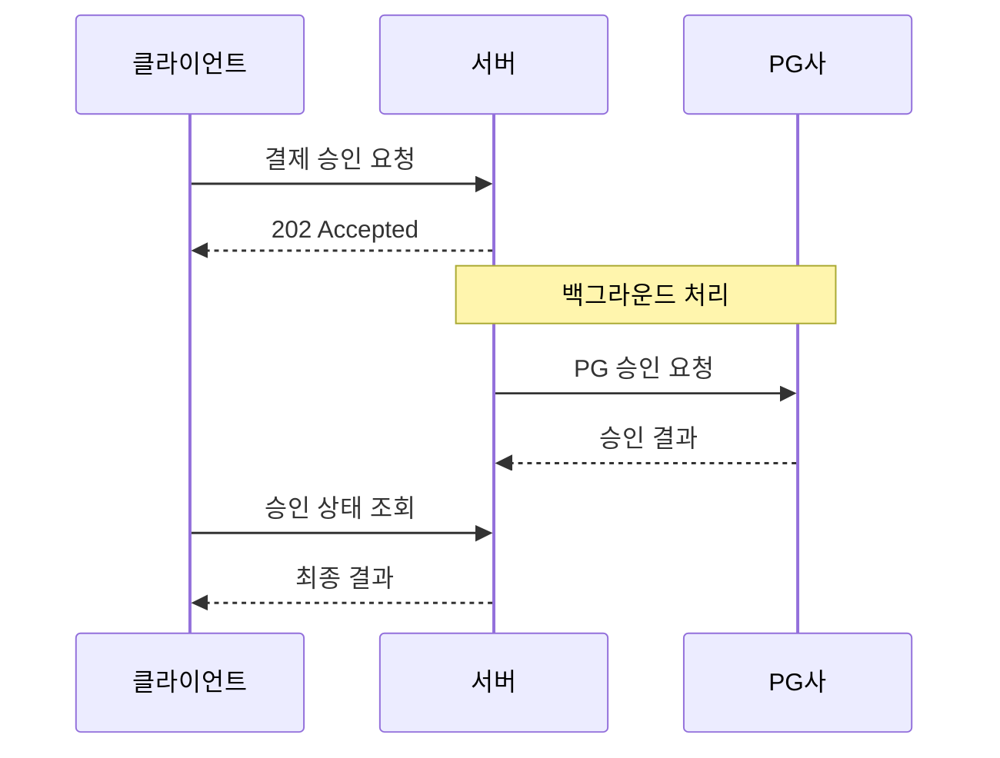
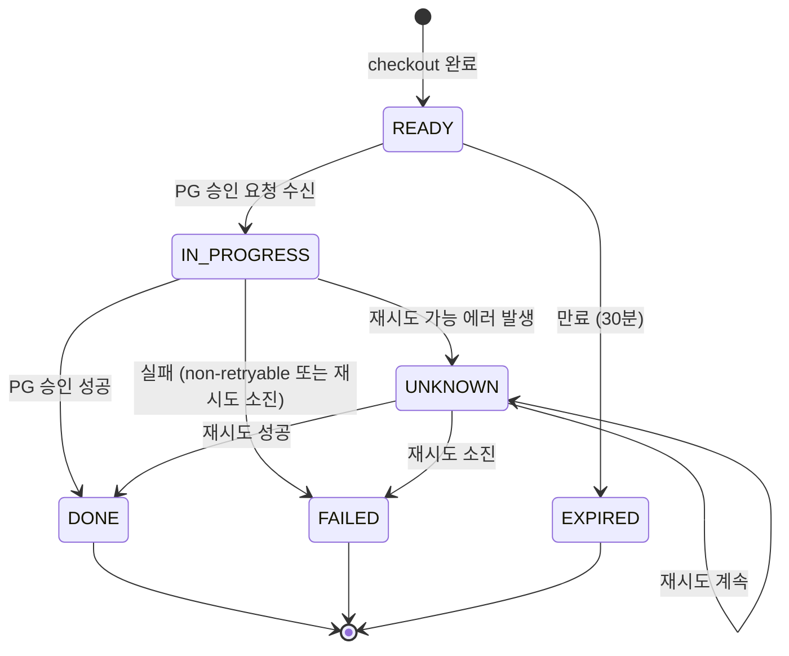
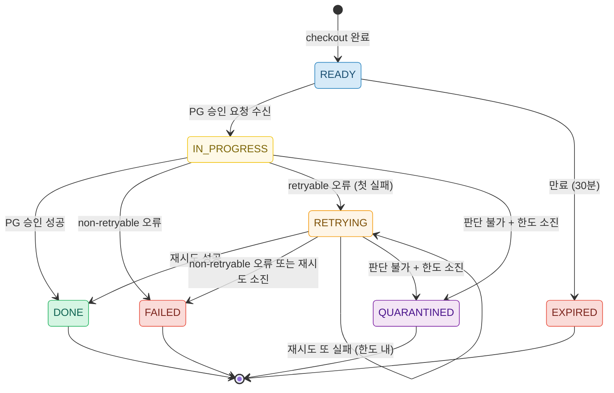
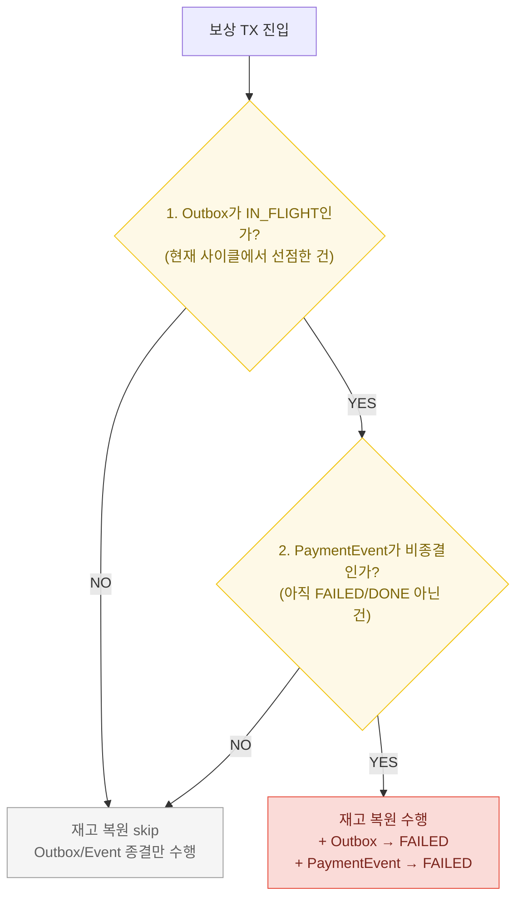
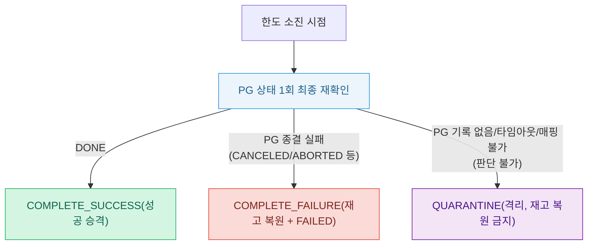
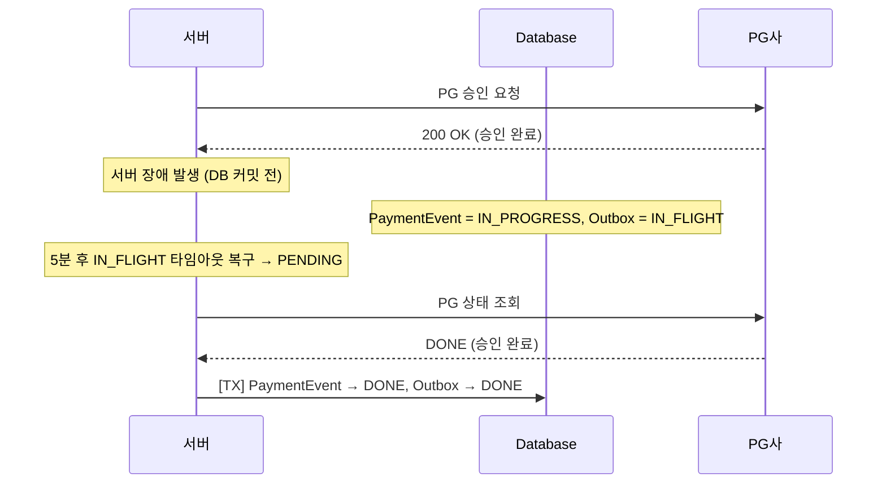
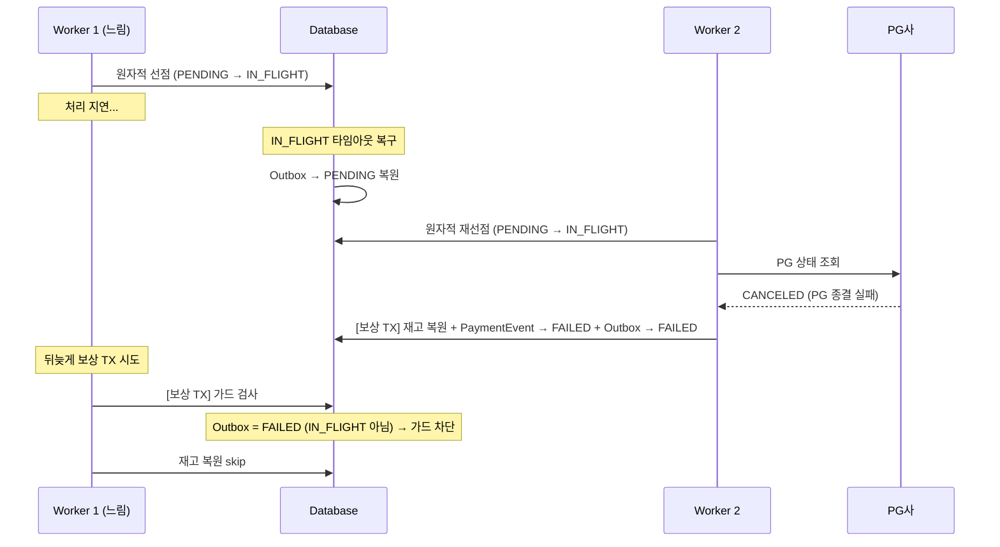
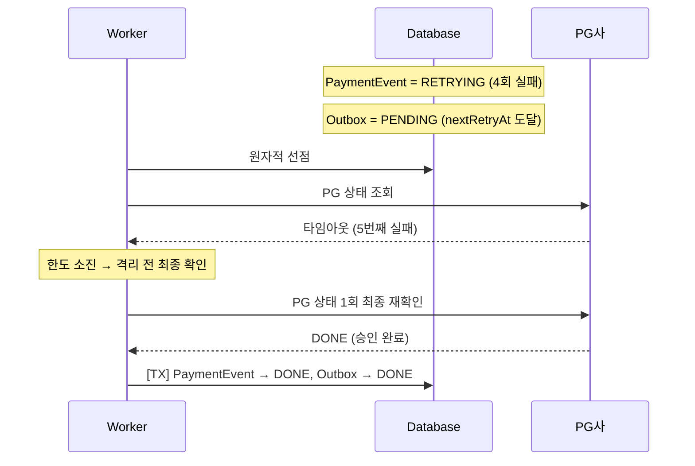
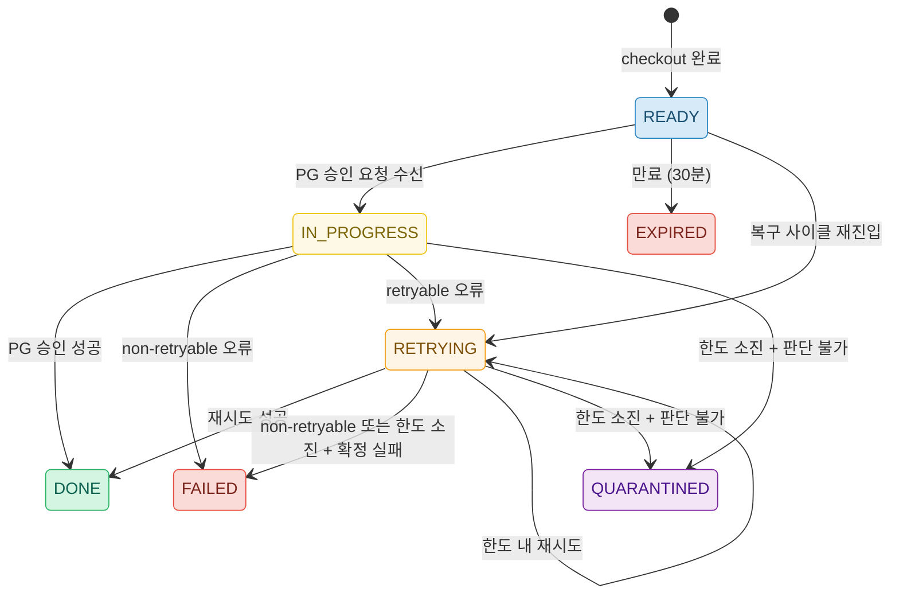
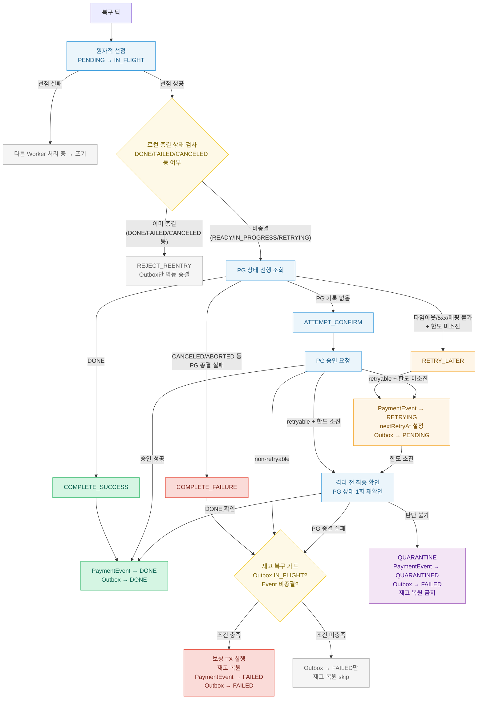

> 실행 환경: Java 21, Spring Boot 3.4.4, MySQL 8.0

## 배경

최근 비동기 결제 처리 아키텍처를 도입하면서, 기존 상태 모델이 새 아키텍처를 충분히 표현하지 못하는 문제가 드러났다.

- 재시도 대상과 완전 실패 건의 구분이 모호하여 복구 대상을 정확히 추적의 어려움
- 고정 간격 재시도로 인해 PG 장애 시 부하가 집중 위험 가능

이 글에서는 이러한 상태 모델의 구조적 한계를 분석하고, 장애 내성을 갖춘 상태 전이 체계를 재설계한 과정을 다룬다.

** 비동기 결제 아키텍처 자체의 도입 배경과 구현은 [이전 글](/blog/async-payment-flow/)에서 다루므로, 여기서는 상태 모델과 복구 로직에 집중한다.

## 비동기 결제 플로우 요약

본론에 앞서, 이 글의 전제가 되는 비동기 결제 구조를 간략히 정리한다.

1. 클라이언트의 결제 승인 요청(confirm)과 실제 PG(Payment Gateway, 결제 대행사) 승인 API 호출을 기술적으로 분리
2. 서버는 PG 응답을 기다리지 않고 즉시 202 Accepted를 반환
3. 실제 승인은 백그라운드에서 처리하며, 클라이언트는 승인 상태를 조회하여 최종 결과를 확인



이 구조에서 핵심이 되는 세 가지 개념이 있다.

- `PaymentEvent`: 결제 1건의 생명주기를 추적하는 도메인 엔티티
    - READY → IN_PROGRESS → DONE/FAILED 등 상태 전이를 관리
- `PaymentOutbox`: Outbox 패턴을 적용한 작업 큐 역할의 테이블
    - PENDING(대기) → IN_FLIGHT(처리 중) → DONE/FAILED(종결) 상태 전이를 관리
    - Outbox 패턴: 비동기로 처리할 작업을 같은 DB 트랜잭션(TX) 안에 기록하여, 서버가 중간에 죽더라도 처리 대상이 유실되지 않도록 보장하는 기법
- Worker: Outbox 레코드를 읽어 실제 PG 승인을 수행하는 백그라운드 처리기
    - 즉시 처리기(TX 커밋 직후 즉시 처리)와 폴링 복구기(주기적 폴링으로 누락 건 재처리) 두 트랙으로 구성

---

## 기존 설계의 한계

위 비동기 구조에서 기존 상태 모델에 네 가지 구조적 한계가 있었다.

### 한계 1 - 불명확한 UNKNOWN 상태와 분산된 스케줄러

기존 상태 머신의 `IN_PROGRESS`와 `UNKNOWN` 두 상태 모두 재시도 대상이었고, 실패가 반복되면 `FAILED`로 전이되었다.



또한 여러 스케줄러가 돌아가고 있고, 이를 관리하는 복구 사이클이 분산되어 있었다.

### 한계 2 - 하드코딩된 재시도 정책 및 부하 집중 위험

재시도 한도가 `PaymentEvent`와 `PaymentOutbox` 양쪽에 `RETRYABLE_LIMIT = 5`로 중복 하드코딩되어 있었다.

- 고정된 폴링 간격마다 모든 건에 요청하면서 일시적 장애 시 PG에 부하 집중될 수 있음
- `PaymentOutbox`에 `nextRetryAt` 개념이 없어 고정 간격(FIXED) 이외의 Backoff 전략을 지원할 수 없음
- 한도를 변경하려면 두 클래스를 동시에 수정해야 하는 구조

### 한계 3 - 예외 기반 실패 분류의 이중 구조

도메인 결과값(`PaymentConfirmResult`)이 이미 실패 유형을 분류하고 있음에도, 예외 타입으로 변환하여 catch 블록에서 분기하는 이중 구조가 존재했다.

### 한계 4 - PG 상태 미조회와 무조건 재승인

복구 사이클이 PG 상태를 조회하지 않고 무조건 승인 요청을 재발행하는 구조였다.

- 멱등성 키(동일 요청을 여러 번 보내도 결과가 한 번만 적용되도록 보장하는 고유 키)로 중복 결제라는 심각한 문제는 방지
- 재승인 요청 직전 상태를 알 수 없는 구조

---

## 재설계

위 네 가지 한계를 해결하기 위해, 상태 모델 재정의 → 재시도 정책 도메인 객체화 → 복구 결정 로직 집중 → 동시성 안전장치 순서로 재설계를 진행했다.

|        솔루션        |            대응하는 한계            |
|:-----------------:|:-----------------------------:|
|     상태 모델 재정의     | 한계 1 - 불명확한 UNKNOWN, 분산 스케줄러  |
|    RetryPolicy    |  한계 2 - 하드코딩된 재시도 정책, 부하 집중   |
| RecoveryDecision  | 한계 3, 4 - 실패 분류 이중 구조, PG 미조회 |
| 원자적 선점 / 재고 복구 가드 |         동시성 안전장치 (신규)         |

### 상태 모델 재정의 - RETRYING, QUARANTINED 도입과 UNKNOWN 제거

> 한계 1 해결: 불명확한 UNKNOWN 상태 제거, 분산 스케줄러 통합

기존 `UNKNOWN` 상태를 `RETRYING`으로 변경하여 "재시도 대기 중"이라는 의미를 명확히 부여하고, 한도 소진 시 복구 사이클에서 영구 이탈시키는 QUARANTINED(격리) 상태를 도입했다.



- `UNKNOWN → RETRYING`: "알 수 없는 상태"가 아니라 "재시도 대기 중"이라는 의미를 명확히 부여
- `RETRYING → RETRYING`: 한도 내에서 반복 실패 시 self-loop
- `RETRYING → DONE / FAILED`: 재시도 성공 또는 소진 시 종결
- `IN_PROGRESS / RETRYING → QUARANTINED`: 한도 소진 후에도 PG 상태를 판단할 수 없으면 격리 (관리자 개입 전까지 자동 복구 사이클에서 영구 이탈)
    - PG 측에서 이미 승인이 완료되었을 가능성 고려

이를 위해 기존 상태 전이 가드도 업데이트했다.

|    전이    |    기존 허용 source    |        변경 후 허용 source        |
|:--------:|:------------------:|:----------------------------:|
| 승인 완료 전이 | IN_PROGRESS, DONE  | IN_PROGRESS, RETRYING, DONE  |
| 실패 처리 전이 | READY, IN_PROGRESS | READY, IN_PROGRESS, RETRYING |
|  재시도 전환  |        (신규)        | READY, IN_PROGRESS, RETRYING |
|    격리    |        (신규)        | READY, IN_PROGRESS, RETRYING |

### RetryPolicy 도메인 객체 추가 및 nextRetryAt 필드 추가로 재시도 시점 제어

> 한계 2 해결: 하드코딩된 재시도 정책, 부하 집중 위험

중복 하드코딩된 재시도 한도를 `RetryPolicy` 도메인 객체로 분리했다.(설정은 `application.yml`로 외부화)

```java
public record RetryPolicy(
        int maxAttempts,
        BackoffType backoffType,
        long baseDelayMs,
        long maxDelayMs
) {

    public boolean isExhausted(int retryCount) {
        return retryCount >= maxAttempts;
    }

    public Duration nextDelay(int retryCount) {
        return switch (backoffType) {
            case FIXED -> Duration.ofMillis(baseDelayMs);
            case EXPONENTIAL -> Duration.ofMillis(
                    Math.min(baseDelayMs * (1L << retryCount), maxDelayMs)
            );
        };
    }
}
```

- `maxAttempts`: 최대 재시도 횟수
- `BackoffType`: FIXED(고정 간격) 또는 EXPONENTIAL(지수 증가)
- `baseDelayMs` / `maxDelayMs`: Backoff 계산의 기본값과 상한

추가적으로 `PaymentOutbox`에 `nextRetryAt` 필드를 도입하여, 재시도 시점을 동적으로 제어할 수 있도록 했다.

### RecoveryDecision 값 객체

> 한계 3, 4 해결: 예외 기반 실패 분류 → 도메인 결과값 기반, PG 상태 선행 조회 도입

기존의 예외 타입을 통한 실패 분류 대신, 복구 결정 로직을 순수 도메인 값 객체에 집중시켰다.

|     Decision     |           의미            |                  판단 기준                   |           후속 처리           |
|:----------------:|:-----------------------:|:----------------------------------------:|:-------------------------:|
| COMPLETE_SUCCESS |        PG 승인 완료         |             PG 조회 결과 = DONE              |        로컬 DONE 전이         |
| COMPLETE_FAILURE |  PG 종결 실패 (취소/중단/만료 등)  |  PG 조회 결과 = CANCELED/ABORTED/EXPIRED 등   |  보상 TX (재고 복원 + FAILED)   |
| ATTEMPT_CONFIRM  |        PG에 기록 없음        |           PG 조회 결과 = NOT_FOUND           |     PG 승인 요청 후 결과 재평가     |
|   RETRY_LATER    | PG 조회 오류 또는 진행 중 (한도 내) |  PG 조회 실패(타임아웃/5xx) 또는 PG 처리 중 + 한도 미소진  | RETRYING + nextRetryAt 설정 |
|    QUARANTINE    |      한도 소진 + 판단 불가      |     한도 소진 + PG 상태 판단 불가(타임아웃/매핑 불가)      |  QUARANTINED (자동 복구 이탈)   |
|  REJECT_REENTRY  |      로컬이 이미 종결 상태       | 로컬 PaymentEvent = DONE/FAILED/CANCELED 등 |       Outbox만 멱등 종결       |

```java
RecoveryDecision decision = RecoveryDecision.decide(
        pgStatus,           // PG 상태 조회 결과
        localEventStatus,   // 로컬 PaymentEvent 상태
        retryCount,         // 현재까지 재시도 횟수
        retryPolicy         // RetryPolicy 설정
);
```

Spring 의존 없이 순수하게 테스트할 수 있으며, 모든 복구 분기가 한 곳에 집중된다.

### 원자적 선점

같은 건을 여러 Worker가 동시에 처리하는 것을 막기 위해, Outbox 상태를 PENDING(대기)에서 IN_FLIGHT(Worker가 선점하여 처리 중)로 원자적으로 전환하는 선점 메커니즘을 도입했다.

```sql
UPDATE payment_outbox
SET status       = 'IN_FLIGHT',
    in_flight_at = :now
WHERE order_id = :orderId
  AND status = 'PENDING'
  AND (next_retry_at IS NULL OR next_retry_at <= :now)
```

- WHERE 절에 `status = 'PENDING'` 조건이 포함되어 있으므로, 두 Worker가 동시에 같은 건을 선점하려 해도 하나만 UPDATE에 성공
- 실패한 Worker는 영향 행 수가 0이므로 즉시 포기하고, 성공한 Worker만 이후 복구 로직 진행

### 재고 복구 가드

보상 트랜잭션은 재고를 복원하는 되돌릴 수 없는 작업이므로, 실행 전에 데이터가 정상 상태인지 이중 조건 가드로 확인한다.

- 정상 흐름에서는 원자적 선점이 중복 진입을 원천 차단
- 비정상 데이터(타임아웃 복구 후 상태 불일치 등)가 보상 TX까지 도달했을 때 재고를 함부로 건드리지 않기 위한 안전망



TX 시작 시점에 Outbox와 PaymentEvent를 DB에서 다시 조회하여, 두 조건 모두 충족할 때만 재고 복원을 실행한다.

- Outbox가 IN_FLIGHT가 아닌 경우: 다음 두 가지 경로로 이 상태에 도달
    - 다른 Worker가 복구를 먼저 완료하여 Outbox가 DONE 또는 FAILED로 전이된 경우
    - IN_FLIGHT 타임아웃 복구에 의해 Outbox가 PENDING으로 초기화된 뒤, 다른 Worker가 재선점하여 현재 Worker의 IN_FLIGHT가 무효화된 경우
    - 어느 쪽이든 현재 Worker의 선점이 유효하지 않으므로 재고 복원 skip
- PaymentEvent가 이미 종결 상태(DONE/FAILED/CANCELED 등)인 경우: 다른 경로에서 보상 TX가 이미 커밋되었으므로 재고 복원을 skip

### 격리 전 최종 확인

재시도 중 마지막 요청이 성공했을 수도 있으므로, 격리 직전에 PG 상태를 한 번 더 조회하여 최종 확인한다.



---

## 복구 처리기 구성

시나리오에 앞서, 복구 처리를 담당하는 세 구성 요소의 역할을 정리한다.

|  구성 요소  |   트리거    |                       역할                       |
|:-------:|:--------:|:----------------------------------------------:|
| 즉시 처리기  | 채널 수신 즉시 |        PG 승인 요청 직후 Outbox에 발행된 건을 즉시 처리        |
| 폴링 복구기  | 5초 주기 폴링 | IN_FLIGHT 타임아웃 복구 / PENDING 건 배치 조회 후 복구 처리 위임 |
| 만료 스케줄러 |  5분 주기   |       30분 이상 READY 상태인 만료 건을 EXPIRED로 전이       |

폴링 복구기는 매 틱마다 두 단계를 순서대로 수행한다.

1. IN_FLIGHT 상태가 일정 시간(기본 5분) 이상 지속된 건을 PENDING으로 복구: Worker가 처리 중 비정상 종료하거나 응답이 느려진 경우를 대비한 안전장치
    - 5분은 PG 승인 API의 최대 응답 시간(통상 수십 초)에 충분한 여유를 두되, 복구 지연이 과도하게 길어지지 않도록 설정한 값으로 설정
2. PENDING 건을 배치 조회하고, 각 건에 대해 PENDING → IN_FLIGHT 원자적 선점 후 복구 처리 시작

### 타임아웃 복구와 배치 조회를 별도 단계로 분리한 이유

한 쿼리로 합치면 "정상 처리 중인 IN_FLIGHT"와 "죽은 IN_FLIGHT"를 구분할 수 없기 때문이다.

- 먼저 시간 기준으로 죽은 건만 PENDING으로 확정
- 이후 원자적 선점이 PENDING → IN_FLIGHT 단일 전이만 경쟁하도록 하여 선점 보장을 단순하게 유지

---

## 엣지 케이스 검증

위 설계가 실제 장애 상황을 어떻게 방어하는지, 구체적인 시나리오로 확인한다.

### 1. PG 승인 완료인데 로컬이 모르는 경우

서버가 PG 승인 응답을 받은 직후, DB에 반영하기 전에 죽는 상황이다.



PG 상태를 먼저 조회함으로써 승인 재요청 없이 로컬에 바로 동기화하게 된다.

### 2. Worker 타임아웃으로 동시 처리 발생

W1이 처리 중 느려져서 타임아웃이 발생하고, W2가 같은 건을 다시 선점하는 상황이다.



W2가 먼저 보상 TX를 커밋한 뒤, W1이 뒤늦게 같은 건에 보상 TX를 시도했지만, 재고 복구 가드가 "Outbox가 IN_FLIGHT가 아님"을 감지하여 재고 이중 복원을 차단한다.

- Worker가 IN_FLIGHT 타임아웃(5분)을 초과하는 현실적인 시나리오
    - Worker 스레드 혹은 프로세스가 비정상 종료(OOM, 예기치 않은 예외 등)되어 응답 자체를 반환하지 못하는 경우를 가정
    - IN_FLIGHT 타임아웃은 이처럼 Worker가 처리 도중 사라진 건을 복구하기 위한 안전장치

### 3. 한도 소진 직전 PG 승인 완료

4번째 재시도까지 타임아웃이 반복되다가, 5번째(마지막) 시도 직전에 PG가 승인을 완료한 경우다.



이 확인이 없었다면 5회 소진 시점에 QUARANTINED 또는 FAILED로 처리되어, 이미 승인된 결제의 재고가 복원될 수 있었지만, 마지막 getStatus 조회가 성공으로 승격시켜준다.

---

## 최종 상태 다이어그램

모든 개선을 반영한 `PaymentEventStatus`의 최종 상태 전이는 다음과 같다.



## 복구 사이클 전체 플로우

복구 사이클의 최종 구조를 플로우차트로 정리하면 다음과 같다.

- 원자적 선점 성공 → 로컬 종결 여부 확인 → PG 상태 선행 조회 순서로 진입
- PG 조회 결과에 따라 즉시 종결(DONE/FAILED), 재시도(RETRY_LATER), 승인 요청(ATTEMPT_CONFIRM) 중 하나로 분기
- 한도를 소진하면 격리 전 최종 확인을 거쳐 QUARANTINE 또는 종결로 분기
- 보상 TX 실행 전에는 항상 재고 복구 가드가 이중 조건을 검증



---

## 마무리

상태 모델을 재정의하고 복구 결정 로직을 도메인 값 객체에 집중시킨 결과, 복구 사이클이 대응하는 전체 케이스를 다음과 같이 정리할 수 있다.

### 복구 사이클 내 케이스

복구 사이클은 PG 상태 조회 결과를 기준으로 종결 / 재시도 / 격리 중 하나를 결정하여 처리한다.

|             상황             |        Event         |         Outbox          |    재고     |
|:--------------------------:|:--------------------:|:-----------------------:|:---------:|
|     PG에서 승인이 정상 완료된 경우     |        → DONE        |         → DONE          |   점유 유지   |
|   PG에서 결제가 취소/중단/만료된 경우    |       → FAILED       |        → FAILED         |    복원     |
|    PG에 결제 기록 자체가 없는 경우     |     승인 결과에 따라 결정     |      승인 결과에 따라 결정       |   점유 유지   |
| PG 조회가 일시적으로 실패한 경우 (한도 내) |      → RETRYING      | → PENDING (nextRetryAt) |   점유 유지   |
|  PG에서 아직 처리 중인 경우 (한도 내)   |      → RETRYING      | → PENDING (nextRetryAt) |   점유 유지   |
|   위 재시도 케이스에서 한도를 소진한 경우   | 격리 전 최종 확인 결과에 따라 결정 |  격리 전 최종 확인 결과에 따라 결정   | 결과에 따라 결정 |
|   이미 로컬에서 종결 처리가 완료된 경우    |        변경 없음         |         → DONE          |   변경 없음   |

### 스케줄러 및 선점

복구 사이클 뿐만 아니라, 동시성과 장애 상황에 대응하는 스케줄러와 선점 구조도 다음과 같이 정리할 수 있다.

|                  상황                   | Event |  Outbox   |      재고      |
|:-------------------------------------:|:-----:|:---------:|:------------:|
| Worker가 느려져서 다른 Worker가 먼저 처리를 완료한 경우 | 변경 없음 |   변경 없음   | 가드가 이중 복원 차단 |
|      Worker가 비정상 종료하여 처리가 중단된 경우      | 변경 없음 | → PENDING |    점유 유지     |
|         다른 Worker가 이미 선점한 경우          | 변경 없음 |   변경 없음   |    변경 없음     |
