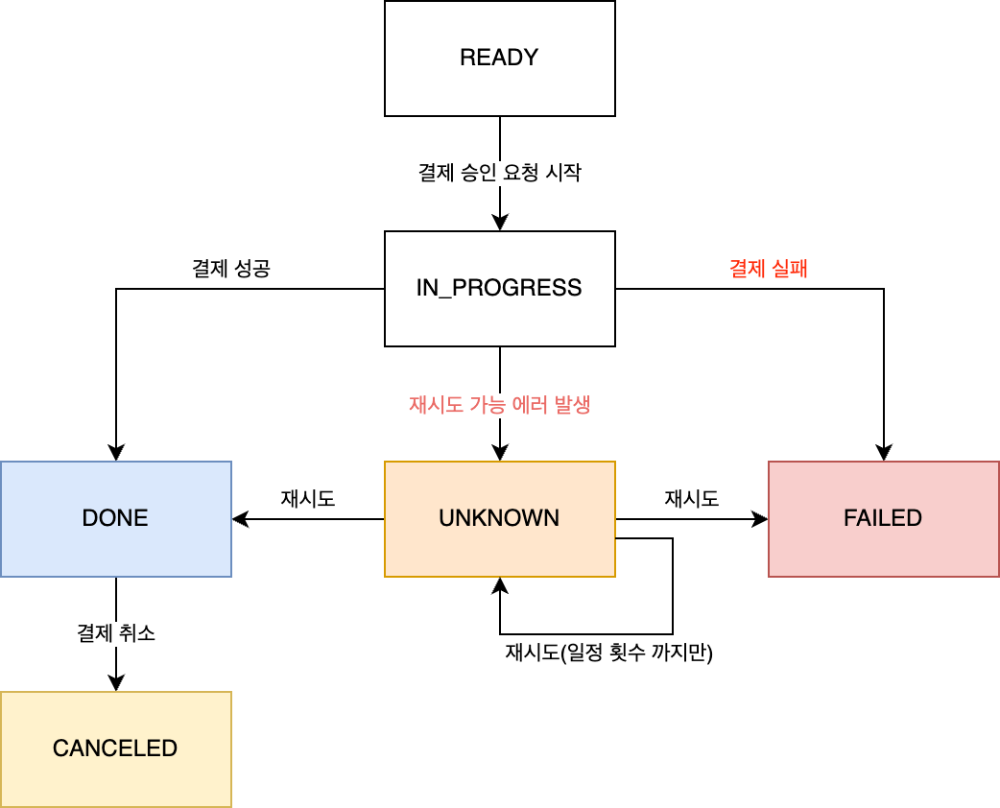
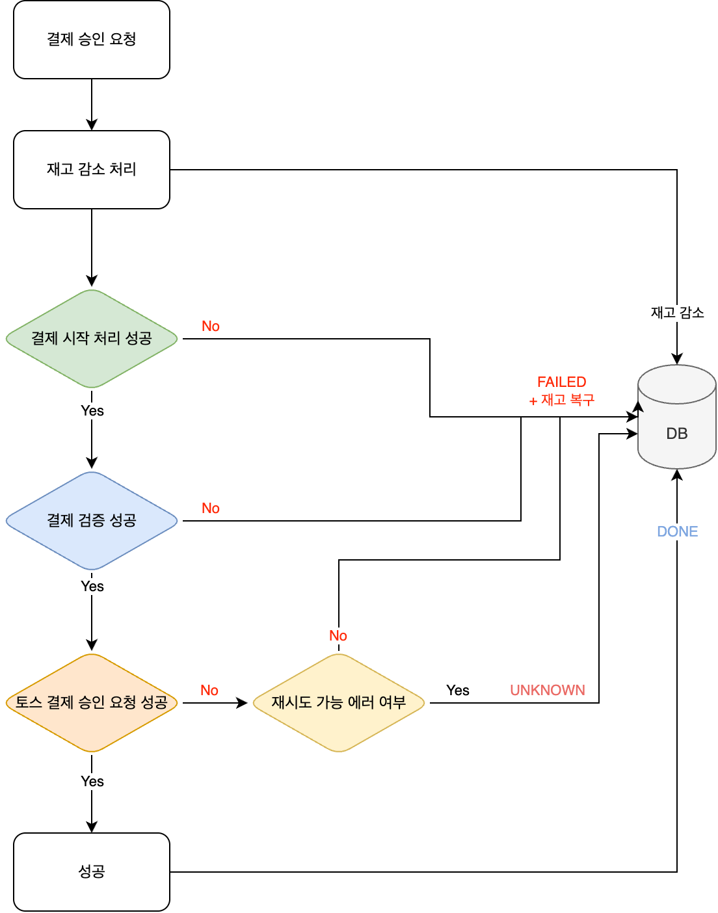
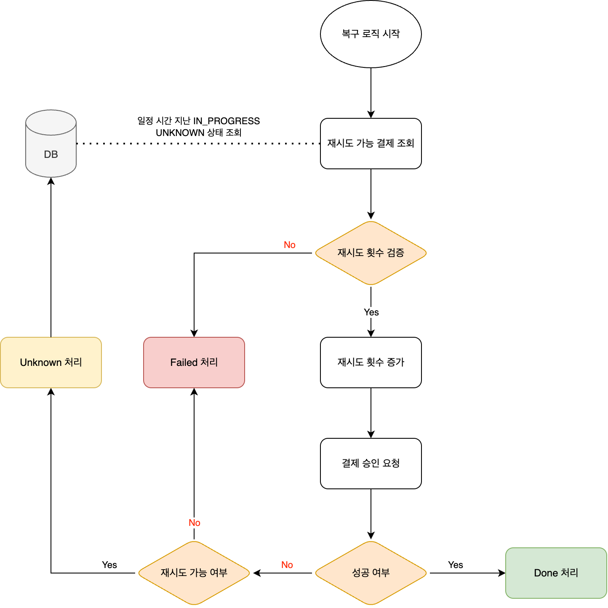

> 실행 환경: Java 21, Spring Boot 3.3.3

## 배경

최초 구상했던 [결제 로직](/blog/payment-system-with-toss/)은 결제 정보 검증을 통해 안전한 결제 연동 시스템을 목표로 하였지만, 예상치 못한 에러에 대한 처리 로직이 미흡했다.  
그로 인해 특수한 상황에서 사용자가 신뢰성을 느끼기 어려울 것으로 판단되어 결제 시스템에 대한 설계 및 구현을 다시 진행하게 되었다.

문제를 해결하기 위한 방법을 찾던 중
[가상 면접 사례로 배우는 대규모 시스템 설계 기초 중 결제 시스템](/docs/large-scale-system/system-design-interview/design-payment-system/)
파트를 통해 결제 시스템에 대한 도메인 지식과 안전한 결제 처리를 위한 해결 방법을 찾을 수 있었고, 이를 바탕으로 더 나은 결제 시스템을 설계하고자 했다.

책에서는 결제 서비스/결제 실행 서비스/원장 서비스/지갑 서비스로 분리된 구조를 제시했는데, 현 프로젝트에서는 결제 서비스와 결제 실행 서비스를 하나로 통합하여 구현하였다.  
또한, 이번 개선 작업에서는 결제 서비스와 그 안에서 발생하는 문제들에 대해서 다뤘으며, 원장 서비스와 지갑 서비스에 대한 부분과 시스템에 주는 이점은 다음 단계에서 다루고자 한다.

## 기존 프로젝트 문제점

기존 결제 시스템 구현에서 발생할 수 있던 문제점은 다음과 같았다.

1. 결제 승인 중 발생한 에러에 대한 명확한 처리 부재
    - 기존 코드에선 모든 에러에 대해 결제 실패로 처리하고 있었음
    - 그 중 재시도를 통해 해결될 수 있는 에러도 실패로 간주
2. API 지연으로 인한 결제 처리 오류
    - 토스 측에 결제 승인 요청을 보낸 후 응답이 지연되어 타임아웃 발생 가능성 존재
    - 서버 측에서는 지연으로 인해 실패 처리되었으나, 실제로는 토스 측에서 승인 완료하여 금액만 빠져나갈 수 있음
3. 결제 승인 요청 중 서버 중단
    - 결제 승인 요청이 토스 결제 서비스까지 전달되어 실제 결제가 완료되었으나, 서버가 중단되면서 결과를 반환하지 못함
    - 이로 인해 결제는 이미 이루어져 금액이 빠져나갔음에도 불구하고, 시스템에서는 결제가 완료되지 않은 상태로 남아있을 수 있음

## 해결 방법

이러한 문제들을 해결하기 위해 크게 아래 네 가지 방법들을 도입하였다.

1. 재시도 가능/불가능 에러 구분
2. 재시도 로직 구현
3. 결제 상태 전환 관리
4. 멱등키 사용

### 1. 재시도 가능/불가능 에러 구분

기존 코드에서는 어떤 에러가 발생하든지 동일하게 실패 처리했지만, 에러를 크게 두 가지 유형으로 구분하였다.

- 재시도 가능한 에러: 일시적인 네트워크 문제 / 외부 서비스 장애 / API 타임아웃과 같이 일정 시간 후 재 시도를 통해 해결될 수도 있는 에러
- 재시도 불가능한 에러: 잘못된 요청, 상품 재고 부족 등으로 인해 재시도가 불가능한 근본적인 문제

### 2. 재시도 로직 구현

위에서 구분 된 재시도 가능한 에러에 대해, 일정 횟수까지만큼 재시도 처리하는 스케줄러를 구현하여 결제 성공으로 이어질 수 있도록 하였다.

- 재시도 가능한 특정 결제 상태인 결제 요청에 대해 결제 재시도 요청
- 재시도가 너무 많아져 시스템에 부하가 걸리는 것을 방지하기 위해 재시도 횟수 제한

### 3. 결제 상태 전환 관리

기존 프로젝트에서는 `시작 -> 진행 -> 완료/실패 -> 결제 취소`로 순차적으로만 관리되었으나, 재시도 처리를 위한 디테일한 상태 관리가 필요했다.



- READY: checkout 으로 인해 최초 생성된 결제 상태
- IN_PROGRESS: 결제 승인 요청 처리 시작한 상태
- DONE: 결제가 성공적으로 완료된 상태
- FAILED: 결제 실패한 상태
- CANCEL: 결제가 취소된 상태
- UNKNOWN: 에러가 발생하였으나, 재시도를 통해 해결 가능성이 있는 상태

개선된 상태 다이어그램에서는 UNKNOWN 상태를 도입하여, 모든 에러를 바로 실패 처리하지 않고 재시도를 통해 결제 성공으로 이어질 수 있도록 하였다.

### 4. 멱등키 사용

이미 성공한 결제일 수 있지만, 알 수 없는 상태에 대한 결제 재시도로 인해 동일한 결제가 여러 번 이루어질 수 있다.  
특히 재시도 로직이 도입되는 만큼, 멱등키를 이용하여 중복 결제를 방지하여 정확히 한 번만 결제 금액이 빠져나가도록 해야 했다.

- 멱등키 생성: 각 결제 요청 시 고유한 멱등키를 DB에 저장하고, 같은 결제에 대해 다시 요청하면 해당 키로 중복 결제 방지
- 재시도 시 동일 결과 보장: 이미 토스 측에 성공한 결제더라도, 같은 키를 통해 중복 결제 방지

### 결과

결과적으로, 이러한 네 가지 해결 방안을 통해 기존 프로젝트에서 발생하던 문제들을 다음과 같이 해결할 수 있었다.

#### 1. 결제 승인 중 발생한 에러에 대한 명확한 처리 부재

모든 에러를 동일하게 처리하여 결제가 실패로 처리하던 부분을 재시도 가능한 에러와 불가능한 에러로 명확하게 구분하여 각각에 맞는 처리를 적용할 수 있게 되었다.

- 재시도 가능 에러: 재시도 로직을 통해 성공으로 처리
- 재시도 불가능한 에러: 근본적인 문제로 인한 에러는 즉시 결제 실패로 처리하여, 사용자에게 정확한 정보 전달

#### 2. API 지연으로 인한 실패

API 응답 지연 시에는 결제를 `UNKNOWN` 상태로 변경하여, 재시도를 통해 최종적으로 결제 성공으로 이어질 수 있도록 처리할 수 있게 되었다.

- 응답 지연 시 재시도 처리: 토스 측 응답 지연으로 결제가 실패 처리되는 경우, 즉시 실패로 간주하지 않고 재시도할 수 있도록 함
- 중복 결제 방지: 이미 성공했으나 토스측에 결과만 못 받은 경우에도, 멱등키를 사용하여 중복해서 결제되지 않도록 함

#### 3. 결제 승인 요청 중 서버가 중단되는 경우

서버 중단으로 인해 결제가 제대로 처리되지 못하거나 중복 결제가 발생할 수 있었으나, 재시도를 통해 올바른 결제 처리를 보장할 수 있게 되었다.

- 서버 중단 시 복구: `IN_PROGRESS` 상태로 남아있는 결제들에 대해 결제 요청을 다시 시도
- 중복 결제 방지: (토스 측에 요청을 보냈으나 반환되기 전에 서버가 중단 된 경우)성공한 결제에 대해 중복 결제 방지를 위해 멱등키 사용

## 세부 구현

앞서 설명한 문제들을 해결하기 위해 도입한 네 가지 개선 방안에 대한 실제 구체적인 구현 방법과 코드를 살펴보자.

### 1. 재시도 가능/불가능 에러 구분 + 3. 결제 상태 전환 관리

결제 승인 과정에서 발생하는 다양한 에러에 따라 시스템은 다음과 같이 처리하도록 구현하였다.



이러한 에러 상태를 구분하기 위해, 먼저 토스 측에서 발생하는 에러 코드를 명확히 정의할 필요가 있었다.

- 토스 측에서 발생하는 모든 에러 코드에 대해 Enum으로 정의
- 해당 에러 코드에 대해 성공 / 재시도 가능 여부 판단 메서드 구현

그 외에 추가적으로 타임아웃 관련 에러 코드를 추가해 재시도 가능한 에러로 처리하였다.

- [TossPaymentErrorCode.java](https://github.com/hyoguoo/payment-platform/blob/5d80acb9369043df8c26cebc15b19e714addcb4c/src/main/java/com/hyoguoo/paymentplatform/paymentgateway/exception/common/TossPaymentErrorCode.java)

```java

@Getter
@RequiredArgsConstructor
public enum TossPaymentErrorCode {

    ALREADY_PROCESSED_PAYMENT(400, "이미 처리된 결제 입니다."),
    // ...

    UNKNOWN_PAYMENT_ERROR(500, "결제에 실패했어요. 같은 문제가 반복된다면 은행이나 카드사로 문의해주세요."),
    UNKNOWN(500, "알 수 없는 에러입니다."),
    NETWORK_ERROR(500, "네트워크 오류가 발생했습니다. 잠시 후 다시 시도해주세요."); // 타임아웃 처리를 위한 별도로 추가한 에러

    //...

    public boolean isSuccess() {
        return this == ALREADY_PROCESSED_PAYMENT;
    }

    public boolean isRetryableError() {
        return switch (this) {
            case PROVIDER_ERROR, FAILED_PAYMENT_INTERNAL_SYSTEM_PROCESSING,
                 FAILED_INTERNAL_SYSTEM_PROCESSING, UNKNOWN_PAYMENT_ERROR,
                 UNKNOWN, NETWORK_ERROR -> true;
            default -> false;
        };
    }

    public boolean isFailure() {
        return !isSuccess() && !isRetryableError();
    }
}
```

위 클래스를 통해 토스 결제 결과가 성공인지, 재시도 가능한 에러인지, 실패인지를 판단할 수 있도록 구현하였고, 호출한 곳에서 해당 결과에 따라 성공 객체 혹은 Checked Exception을 던지도록 하였다.

- [PaymentProcessorUseCase.java](https://github.com/hyoguoo/payment-platform/blob/5d80acb9369043df8c26cebc15b19e714addcb4c/src/main/java/com/hyoguoo/paymentplatform/payment/application/usecase/PaymentProcessorUseCase.java)

```java

@Service
@RequiredArgsConstructor
public class PaymentProcessorUseCase {

    // ...

    public TossPaymentInfo confirmPaymentWithGateway(PaymentConfirmCommand paymentConfirmCommand)
            throws PaymentTossRetryableException, PaymentTossNonRetryableException {

        // ... 토스 측에 결제 승인 요청 및 반환

        PaymentConfirmResultStatus paymentConfirmResultStatus = tossPaymentInfo.getPaymentConfirmResultStatus();

        // 상태에 따라 처리
        return switch (paymentConfirmResultStatus) {
            // 1. 성공
            case PaymentConfirmResultStatus.SUCCESS -> tossPaymentInfo;
            // 2. 재시도 가능한 에러 - Checked Exception
            case PaymentConfirmResultStatus.RETRYABLE_FAILURE ->
                    throw PaymentTossRetryableException.of(PaymentErrorCode.TOSS_RETRYABLE_ERROR);
            // 3. 재시도 불가능한 에러 - Checked Exception
            case PaymentConfirmResultStatus.NON_RETRYABLE_FAILURE ->
                    throw PaymentTossNonRetryableException.of(PaymentErrorCode.TOSS_NON_RETRYABLE_ERROR);
        };
    }

    // ...
}
```

호출한 메서드에서 해당 에러를 처리하도록 하였고(Checked Exception으로 이를 강제), 에러 핸들링은 다음과 같은 유형으로 나누어 처리하였다.

| 예외 상황                  | 재시도 가능 |   결제 상태 처리    | 재고 처리  |
|:-----------------------|:------:|:-------------:|:------:|
| 1. 재고 차감 중 오류          |   X    |     실패 처리     | 복구 불필요 |
| 2. 이미 처리된 결제에 대한 중복 요청 |   X    |     실패 처리     | 재고 복구  |
| 3. 외부 결제사의 일시적인 오류     |   O    | 알 수 없음 상태로 변경 | 재고 유지  |
| 4. 외부 결제사의 복구 불가능 오류   |   X    |     실패 처리     | 재고 복구  |
| 5. 결제 검증 또는 기타 시스템 오류  |   X    |     실패 처리     | 재고 복구  |

- [PaymentConfirmServiceImpl.java](https://github.com/hyoguoo/payment-platform/blob/5d80acb9369043df8c26cebc15b19e714addcb4c/src/main/java/com/hyoguoo/paymentplatform/payment/application/PaymentConfirmServiceImpl.java)

```java

@Service
@RequiredArgsConstructor
public class PaymentConfirmServiceImpl implements PaymentConfirmService {

    // ...

    @Override
    public PaymentConfirmResult confirm(PaymentConfirmCommand paymentConfirmCommand) {
        // 1. 결제 이벤트 조회
        PaymentEvent paymentEvent = paymentLoadUseCase.getPaymentEventByOrderId(
                paymentConfirmCommand.getOrderId()
        );

        try {
            // 2. 재고 차감 - 재고 부족 에러 발생 가능
            orderedProductUseCase.decreaseStockForOrders(paymentEvent.getPaymentOrderList());
        } catch (PaymentOrderedProductStockException e) {   // 에러 1: 재고 부족 에러 발생
            handleStockFailure(paymentEvent);               // FAIL 처리(재고 중 일어난 에러로, 감소가 일어나지 않았으므로 복구 필요 없음)
            throw PaymentTossConfirmException.of(PaymentErrorCode.ORDERED_PRODUCT_STOCK_NOT_ENOUGH);
        }

        try {
            // 3. 결제 시작 처리 - 결제 시작 상태 검증 중 에러 발생 가능
            paymentProcessorUseCase.executePayment(paymentEvent, paymentConfirmCommand.getPaymentKey());

            // 4. 결제 검증 - 결제 검증 중 에러 발생 가능
            // 5. 토스 결제 승인 요청 - 토스 측 재시도 가능/불가능한 에러 발생 가능
            // 6. 결제 완료 처리
            PaymentEvent completedPayment = processPayment(paymentEvent, paymentConfirmCommand);

            // 7. 결제 완료 결과 반환
            // ...
        } catch (PaymentStatusException e) {                // 에러 2: 이미 요청이 진행 된 건에 대한 요청
            handleNonRetryableFailure(paymentEvent);        // FAIL 처리 + 재고 복구
            throw e;
        } catch (PaymentTossRetryableException e) {         // 에러 3: 토스 측 재시도 가능한 에러 발생
            handleRetryableFailure(paymentEvent);           // UNKNOWN 상태로 변경 + 재고 그대로 유지
            throw PaymentTossConfirmException.of(PaymentErrorCode.TOSS_RETRYABLE_ERROR);
        } catch (PaymentTossNonRetryableException e) {      // 에러 4: 토스 측 재시도 불가능한 에러 발생
            handleNonRetryableFailure(paymentEvent);        // FAIL 처리 + 재고 복구
            throw PaymentTossConfirmException.of(PaymentErrorCode.TOSS_NON_RETRYABLE_ERROR);
        } catch (Exception e) {                             // 에러5: 결제 검증 중 에러 등 기타 에러 발생
            handleUnknownException(paymentEvent);           // FAIL 처리 + 재고 복구
            throw e;
        }
    }

    // ...
}
```

### 2. 재시도 로직 구현

위 구현 사항으로 처리 된 재시도 가능으로 구분 된 에러에 대해, 재시도 로직을 구현하여 두 가지 상태에 대해 결제 성공으로 이어질 수 있도록 구현하였다.

1. UNKNOWN: 토스 측 재시도 가능 에러 혹은 타임아웃으로 인해 결제 결과를 받지 못한 상태
2. IN_PROGRESS: 결제 승인 시작 처리는 했지만 아직 결과를 받지 못한 상태

이 두 가지 상태를 기반으로 재시도 가능한 결제를 주기적으로 조회하여 재시도 처리를 수행하여, 결제를 성공으로 마무리하거나, 실패로 처리하도록 구현하였다.

- [PaymentRecoverServiceImpl.java](https://github.com/hyoguoo/payment-platform/blob/5d80acb9369043df8c26cebc15b19e714addcb4c/src/main/java/com/hyoguoo/paymentplatform/payment/application/PaymentRecoverServiceImpl.java)

```java

@Service
@RequiredArgsConstructor
public class PaymentRecoverServiceImpl implements PaymentRecoverService {

    // 1. 재시도 가능한 결제 이벤트 조회 후 아래 로직 수행
    private void processRetryablePaymentEvent(PaymentEvent retryablePaymentEvent) {
        try {
            // 2. 재시도 가능 여부 횟수 검증 - 재시도 불가능 에러 발생 가능
            if (!retryablePaymentEvent.isRetryable(localDateTimeProvider.now())) {
                throw PaymentRetryableValidateException.of(PaymentErrorCode.RETRYABLE_VALIDATION_ERROR);
            }

            // 3. 재시도 횟수 증가
            paymentProcessorUseCase.increaseRetryCount(retryablePaymentEvent);

            // ...

            // 4. 토스 결제 승인 요청 재시도 후 완료 처리 - 토스 측 재시도 가능/불가능한 에러 발생 가능
            TossPaymentInfo tossPaymentInfo = paymentProcessorUseCase.confirmPaymentWithGateway(
                    paymentConfirmCommand
            );
            paymentProcessorUseCase.markPaymentAsDone(
                    retryablePaymentEvent,
                    tossPaymentInfo.getPaymentDetails().getApprovedAt()
            );
        } catch (PaymentRetryableValidateException              // 에러 1: 재시도 불가능한 상태 에러 발생
                 | PaymentTossNonRetryableException e) {        // 에러 2: 토스 측 재시도 불가능한 에러 발생
            handleNonRetryableFailure(retryablePaymentEvent);   // FAIL 처리 + 재고 복구
        } catch (PaymentTossRetryableException e) {             // 에러 3: 토스 측 재시도 가능한 에러 발생
            handleRetryableFailure(retryablePaymentEvent);      // UNKNOWN 상태로 변경
        }
    }

    // ...
}
```

재시도 검증 후, 기존 결제 승인 요청과 같이 토스 측에 재시도 요청을 보내도록 처리하였으며, 다음과 같이 구분하여 처리하였다.



- 성공: 재시도 성공 후 결제 완료 처리(이미 재고가 차감되어 있으므로, 재고 감소나 복구는 필요 없음)
- 토스 측 재시도 불가능한 에러: 해당 결제에 대해 실패 처리 + 재고 복구
- 토스 측 재시도 가능 에러: UNKNOWN 상태로 변경
- 재시도 횟수 초과: 해당 결제에 대해 실패 처리 + 재고 복구

재시도 횟수 초과 에러로, 계속 해서 `UNKNOWN` 상태로 유지되더라도, 일정 횟수 이상 재시도를 했을 때 결제 실패로 처리하여 무한히 재시도하는 것을 방지하였다.

### 4. 멱등키 사용

결제 처리 중 서버의 장애나 네트워크 문제로 동일한 결제 요청이 중복될 가능성이 존재하고, 해당 결제들에 대한 복구 로직이 실행되기 때문에 중복 결제를 방지하기 위해 멱등키를 도입하였다.

- 이번 프로젝트에서는 결제 이벤트 생성 시 만들어지는 고유한 `orderId`를 멱등키로 사용
- UUID를 사용하여 고유한 키임을 보장

이렇게 생성 된 멱등키는 토스 결제 서비스로 요청을 보낼 때 HTTP 헤더에 포함되어 전송하여, 동일한 결제 요청에도 중복 결제를 막고 성공적인 결제 처리를 보장할 수 있었다.

## 결론

이번 결제 시스템 개선을 통해 기존 구현에서 발생했던 주요 문제점들을 해결할 수 있었다.

|     항목      |                기존 시스템 문제점                 |              개선된 시스템 해결 방안               |
|:-----------:|:-----------------------------------------:|:----------------------------------------:|
|    에러 처리    |           모든 에러를 동일하게 결제 실패로 처리           |     재시도 가능/불가능 에러로 구분하여 각각에 맞는 처리 도입     |
|  API 응답 지연  |             응답 지연 시 결제 실패로 처리             |  `UNKNOWN` 상태로 관리하고 재시도를 통해 최종적으로 성공 처리  |
| 결제 도중 서버 중단 | 서버 중단으로 결제 완료 여부를 알 수 없고, 중복 결제 발생 가능성 존재 | 멱등키를 사용하여 중복 결제 방지 및 재시도 로직을 통한 결제 완료 처리 |

이번 결제 시스템 개선을 통해 재시도 가능한 에러와 불가능한 에러를 구분하고, 멱등키를 통해 중복 결제를 방지하며, 재시도 로직을 도입하여 결제의 안정성과 유연성을 크게 향상시킬 수 있었다.  
이를 통해 결제를 복구할 수 있는 시스템을 구현하였으며, 결제 처리의 신뢰성을 높일 수 있었다.

## 한계점 및 추가 개선 사항

그러나 정확한 상태 변경 이력 추적과 원장 및 지갑 관리 시스템의 부재로 인해 결제 내역의 투명성 및 결제 상태 추적이 어려운 한계점이 존재한다.  
이를 보완하기 위한 추가적인 개선이 이루어진다면, 결제 시스템의 완성도를 더욱 높일 수 있을 것으로 기대된다.

### 정확한 상태 변경 이력 추적 부족 -> [결제 이력 저장으로 해결](/blog/payment-history-and-metrics/)

결제 상태가 변경될 때마다 상태 변경 이력을 추적하고, 상태 변경에 따른 추가적인 로그를 남기지 않아 추후 에러에 대한 추적이 어려울 수 있음

### 원장 및 지갑 관리 시스템 부재

책에서 제시한 것처럼 원장/지갑 관리 기능이 포함되지 않아 결제 내역과 잔액 간의 정확한 일치 여부를 추적할 수 없음

###### 참고

- [Design Payment System](/docs/large-scale-system/system-design-interview/design-payment-system/)
