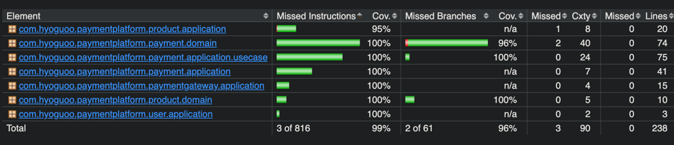

> 실행 환경: Java 21, Spring Boot 3.3.3, JUnit 5

결제 시스템은 서비스 신뢰성과 직결되기 때문에 안정적이고 오류 없는 시스템을 구축하기 위해서는 다양한 시나리오를 검증하는 테스트 코드 작성이 필수적이다.  
결제 승인 과정에서 발생할 수 있는 다양한 시나리오에 대응할 수 있고, 신뢰성 높은 결제 프로세스를 보장하기 위해 여러 테스트 전략을 적용해보았다.

크게 단위 테스트와 통합 테스트로 구분지어 테스트 코드를 작성했으며, 각 테스트 코드의 목표는 다음과 같이 설정하였다.

- 단위 테스트: 개별 도메인 및 서비스 로직을 대상으로 세부적인 로직 검증
- 통합 테스트: 실제 결제 흐름을 따르고 다양한 예외 상황에 대해 대응하는 테스트를 작성

특히 토스 결제 시스템의 의존성을 제어하는 것이 가장 주요한 과제였는데, 이를 위해 여러 전략을 활용하여 결제 시나리오를 테스트하는 방법을 적용했다.

** 참고: 토스 실제 결제 승인은 클라이언트 SDK를 통해 결제 요청을 먼저 수행해야 하며, 그 후에 결제 승인을 진행해야 한다.

## 테스트 코드 작성 목표

위 두 가지를 기반으로 테스트를 통해 보장하고자 했던 주요 목표는 다음과 같다.

1. 결제 승인 과정 중 발생할 수 있는 다양한 시나리오 검증 및 도메인/서비스 로직 신뢰성 확보
2. 인프라스트럭처 영역은 페이크 또는 목 객체를 활용하여 효율적인 테스트 환경 구성
3. 멀티 스레드 테스트로 기본적인 동시성 이슈 검증 및 타임아웃 시나리오에 대한 검증

각 목표를 달성하기 위해 취한 전략 및 작성한 테스트 코드의 예시는 다음과 같다.

### 1. 결제 승인 과정 중 발생할 수 있는 다양한 시나리오 검증 및 도메인/서비스 로직 신뢰성 확보

결제 승인 과정은 다양한 예외 상황과 복잡한 절차적 흐름을 포함하고 있기 때문에, 이를 신뢰성 있게 처리하기 위해서는 다양한 시나리오를 고려한 테스트 코드 작성이 필수적이다.  
단일 케이스를 넘어 여러 파라미터를 조합한 테스트를 통해 다양한 시나리오를 검증하고, 서비스 로직에서 발생 가능한 모든 에러에 대한 처리를 확인함으로써 신뢰성을 높일 수 있었다.

PaymentEvent 관련된 로직에서는 결제 승인 및 검증 과정에서 발생할 수 있는 다양한 시나리오를 파라미터화된 테스트로 작성하여,
단순 성공 케이스 뿐만 아니라, 예외 상황이나 여러 상태 값에 대한 다양한 케이스를 고려하여 테스트 코드를 작성했다.

- [PaymentEventTest.java](https://github.com/hyoguoo/payment-platform/blob/69cdec2bff27c5fd5ea5c8ffffb41d70eb077294/src/test/java/com/hyoguoo/paymentplatform/payment/domain/PaymentEventTest.java)

```java
class PaymentEventTest {

    @ParameterizedTest
    @CsvSource({
            "1, validPaymentKey, 15000, order123, INVALID_TOTAL_AMOUNT",
            "2, invalidPaymentKey, 15000, order123, INVALID_PAYMENT_KEY",
            "1, validPaymentKey, 14000, wrongOrderId, INVALID_ORDER_ID"
    })
    @DisplayName("다양한 조건에서 검증 실패 시 PaymentValidException 예외가 발생한다.")
    void validate_InvalidCases(
            Long userId,
            String paymentKey,
            int amount,
            String orderId
    ) {
        PaymentEvent paymentEvent = defaultPaymentEvent();

        // ...

        assertThatThrownBy(
                () -> paymentEvent.validateCompletionStatus(paymentConfirmCommand, paymentInfo))
                .isInstanceOf(PaymentValidException.class);
    }

    @ParameterizedTest
    @EnumSource(value = TossPaymentStatus.class, names = {
            "CANCELED", "EXPIRED", "PARTIAL_CANCELED", "ABORTED"
    })
    @DisplayName("결제 상태가 유효하지 않은 경우 PaymentStatusException 예외가 발생한다.")
    void validate_InvalidPaymentStatus(TossPaymentStatus tossPaymentStatus) {
        PaymentEvent paymentEvent = defaultPaymentEvent();

        // ...

        assertThatThrownBy(
                () -> paymentEvent.validateCompletionStatus(paymentConfirmCommand, paymentInfo))
                .isInstanceOf(PaymentStatusException.class);
    }
}
```

위 코드에서는 다양한 조건과 상황에 따라 결제 승인 검증 과정에서 발생할 수 있는 다양한 케이스를 다루며, 각 상황에 적합한 예외 처리를 확인했다.

또한, 서비스 로직에서 Toss API와의 통신 중 발생할 수 있는 모든 에러 코드를 검수하고, 이를 적절하게 처리할 수 있도록 테스트 할 수 있었다.

- [PaymentGatewayServiceImplErrorCaseTest.java](https://github.com/hyoguoo/payment-platform/blob/69cdec2bff27c5fd5ea5c8ffffb41d70eb077294/src/test/java/com/hyoguoo/paymentplatform/paymentgateway/application/PaymentGatewayServiceImplErrorCaseTest.java)

```java
class PaymentGatewayServiceImplErrorCaseTest extends IntegrationTest {

    // ...

    @ParameterizedTest(name = "{index}: Test with TossPaymentErrorCode={0}")
    @EnumSource(TossPaymentErrorCode.class)
    @DisplayName("TossPaymentErrorCode에 따라 Header를 설정하고 결제 확인 결과를 검증한다.")
    void confirmPayment_withTossPaymentErrorCode(TossPaymentErrorCode errorCode) {
        // given
        String uuid = new SystemUUIDProvider().generateUUID();

        ReflectionTestUtils.invokeMethod(httpOperator, "addHeader", "TossPayments-Test-Code", errorCode.name());

        // ...

        // when
        TossPaymentInfo tossPaymentInfo = paymentGatewayService.confirmPayment(tossConfirmCommand, uuid);
        PaymentConfirmResultStatus paymentConfirmResultStatus = tossPaymentInfo.getPaymentConfirmResultStatus();

        // then
        Assertions.assertThat(paymentConfirmResultStatus)
                .isEqualTo(getExpectedResultStatus(errorCode));
    }

    // ...

    @TestConfiguration
    static class TestConfig {

        @Bean
        public HttpOperator httpOperator() {
            return new AdditionalHeaderHttpOperator();
        }
    }
}
```

실제 요청을 보내되, 헤더에 특정한 에러 코드를 추가하면 토스 측에서 에러를 반환해주는 테스트 API를 이용해 에러 상황을 시뮬레이션하고 검증했다.  
이를 통해 결제 승인 과정에서 발생할 수 있는 모든 예외 상황에 대한 적절한 처리를 확인하고, 각 에러에 대해 재요청 가능/불가능 여부를 검증할 수 있었다.

### 2. 인프라스트럭처 영역은 페이크 또는 목 객체를 활용하여 효율적인 테스트 환경 구성

토스 API의 결제 승인 요청은 클라이언트 SDK를 통해 요청을 먼저 수행해야 하며, 그 후에 결제 승인을 진행해야 하는 선행 작업을 만족해야하는 어려움이 있었다.  
이를 해결하기 위해 페이크 객체를 활용하여 외부 의존성을 제거하여 테스트 환경을 구성했다.

- [FakeTossHttpOperator.java](https://github.com/hyoguoo/payment-platform/blob/69cdec2bff27c5fd5ea5c8ffffb41d70eb077294/src/test/java/com/hyoguoo/paymentplatform/mock/FakeTossHttpOperator.java)

```java
public class FakeTossHttpOperator implements HttpOperator {

    // ...

    // Reflection을 통해 호출되는 메서드

    @SuppressWarnings("unused")
    public void setDelayRange(int minDelayMillis, int maxDelayMillis) {
        this.minDelayMillis = minDelayMillis;
        this.maxDelayMillis = maxDelayMillis;
    }

    @SuppressWarnings("unused")
    public void addErrorInPostRequest(String code, String message) {
        this.code = code;
        this.message = message;
        this.isErrorInPostRequest = true;
    }

    @SuppressWarnings("unused")
    public void clearErrorInPostRequest() {
        this.isErrorInPostRequest = false;
    }

    @SuppressWarnings("java:S2925")
    private void simulateNetworkDelay() {
        long delay = minDelayMillis + (long) (Math.random() * (maxDelayMillis - minDelayMillis));
        try {
            TimeUnit.MILLISECONDS.sleep(delay);
        } catch (InterruptedException e) {
            Thread.currentThread().interrupt();
        }
    }

    private void throwError() {
        // ...
    }

    // ...

    @Override
    public <T, E> E requestPost(String url, Map<String, String> httpHeaderMap, T body, Class<E> responseType) {
        // 네트워크 지연 시뮬레이션
        simulateNetworkDelay();

        // 에러 발생 시뮬레이션
        if (isErrorInPostRequest) {
            throwError();
        }

        // ...

        // 실제 API 호출 없이 응답 반환
        return responseType.cast(tossPaymentApiResponse);
    }
}
```

위 구현체는 기존 실제 요청을 보내는 구현체의 인터페이스인 `HttpOperator`를 구현했지만 실제 네트워크 요청 없이 결제 승인을 테스트할 수 있게 해준다.

1. 실제 API 호출 X: 외부 API 호출 없이 승인 결과를 반환
2. 네트워크 지연 시뮬레이션: 실제 환경과 유사하게 네트워크 지연 시간 설정 가능
3. 에러 발생 시뮬레이션: 특정한 오류 코드와 메시지를 지정한 에러 발생 가능

이렇게 구성 된 페이크 객체는 `@TestConfiguration`을 통해 테스트 환경에서만 사용되도록 설정한 뒤, Reflection을 통해 테스트 코드에서 호출하여 사용할 수 있었다.

- [PaymentControllerTest.java](https://github.com/hyoguoo/payment-platform/blob/69cdec2bff27c5fd5ea5c8ffffb41d70eb077294/src/test/java/com/hyoguoo/paymentplatform/payment/presentation/PaymentControllerTest.java)

```java

class PaymentControllerTest extends IntegrationTest {


    @Test
    @DisplayName("Payment Confirm 요청이 성공하면 결제가 승인되고 DONE / SUCCESS 상태로 변경되면서 재고가 감소한다.")
    void confirmPayment_Success() throws Exception {
        // ...

        ReflectionTestUtils.invokeMethod(httpOperator, "clearErrorInPostRequest"); // 에러 없음 => 성공

        // ...
    }

    @Test
    @DisplayName("Payment Confirm 요청 중 재시도 가능 오류가 발생하면 결제는 실패하고 UNKNOWN / UNKNOWN 상태로 변경되면서 재고는 감소된 상태로 유지된다.")
    void confirmPayment_Failure_RetryableError() throws Exception {
        // ...

        ReflectionTestUtils.invokeMethod(httpOperator, "addErrorInPostRequest",
                TossPaymentErrorCode.PROVIDER_ERROR.name(), // 재시도 가능한 오류 코드
                TossPaymentErrorCode.PROVIDER_ERROR.getDescription()
        );

        // ...
    }


    @Test
    @DisplayName("Payment Confirm 요청 중 재시도 불가능 오류가 발생하면 결제는 실패하고 FAILED / FAIL 상태로 변경되면서 재고는 다시 복구된다.")
    void confirmPayment_Failure_NonRetryableError() throws Exception {
        // ...

        ReflectionTestUtils.invokeMethod(httpOperator, "addErrorInPostRequest",
                TossPaymentErrorCode.INVALID_STOPPED_CARD.name(), // 재시도 불가능한 오류 코드
                TossPaymentErrorCode.INVALID_STOPPED_CARD.getDescription()
        );

        // ...
    }


    @TestConfiguration
    static class TestConfig {

        @Bean
        public HttpOperator httpOperator() {
            return new FakeTossHttpOperator();
        }
    }
}
```

페이크 객체를 활용함으로써 외부 API 의존성 및 절차적 테스트의 어려움을 해소했을 뿐만 아니라, 결제 승인 중 발생할 수 있는 다양한 시나리오에 대한 테스트를 보다 쉽게 작성할 수 있었다.

### 3. 멀티 스레드 테스트로 기본적인 동시성 이슈 검증 및 타임아웃 시나리오에 대한 검증

결제 시스템에서 다수의 사용자가 동시에 결제를 시도할 때 발생할 수 있는 동시성 문제는 중요한 검증 대상이다.  
특히, 여러 사용자가 동일한 상품을 동시에 주문하거나 외부 API 타임아웃이 발생할 수 있기 때문에 이러한 상황에 대한 검증이 필요하다.

#### 동시성 이슈 검증

동시성 문제는 여러 스레드가 동시에 동일한 리소스를 수정할 때 발생하며, 이를 해결하지 못할 경우 결제가 중복되거나 재고 관리에 오류가 발생할 수 있다.  
본 프로젝트에서는 비관적 락을 사용하여 동시 결제 시 재고 수량의 일관성을 보장했으며, 멀티 스레드 테스트를 통해 상황을 시뮬레이션하고, 주문 수량과 재고가 정확히 관리되는지 확인했다.

- [PaymentConfirmConcurrentTest.java](https://github.com/hyoguoo/payment-platform/blob/69cdec2bff27c5fd5ea5c8ffffb41d70eb077294/src/test/java/com/hyoguoo/paymentplatform/payment/presentation/PaymentConfirmConcurrentTest.java)

```java

@Tag("TooLongIntegrationTest")
class PaymentConfirmConcurrentTest extends IntegrationTest {

    @ParameterizedTest
    @CsvSource({
            "1000, 1000, 1000, 0, 0",   // 재고와 주문 수량이 일치
            "1000, 999, 999, 0, 1",     // 주문 수량이 재고보다 적음
            "1000, 1001, 1000, 1, 0",   // 주문 수량이 재고보다 많음
            "1000, 1050, 1000, 50, 0",  // 재고 초과 주문 (50개 초과 주문 실패)
            "1200, 1000, 1000, 0, 200", // 재고가 1200개, 주문 수량은 1000개 (200개 남음)
    })
    @DisplayName("멀티스레드로 Payment Confirm 요청 시 결제 승인 처리와 상태가 동시성에 맞게 처리된다.")
    void concurrentConfirmPayment_withStock(
            int stock,
            int orderCount,
            int expectedSuccess,
            int expectedFail,
            int expectedStock
    ) {
        // ...

        executeConcurrentActions(orderIndex -> {
            try {

                // ...

                MvcResult mvcResult = mockMvc.perform(
                        post("/api/v1/payments/confirm")
                                .contentType(MediaType.APPLICATION_JSON)
                                .content(objectMapper.writeValueAsString(confirmRequest))
                ).andReturn();
                if (mvcResult.getResponse().getStatus() == 200) {
                    successCount.incrementAndGet();
                } else {
                    failCount.incrementAndGet();
                }
            } catch (Exception e) {
                throw new RuntimeException(e);
            }
        }, orderCount);

        // then
        Product updatedProduct = jpaProductRepository.findById(1L).orElseThrow().toDomain();
        assertThat(successCount.get()).isEqualTo(expectedSuccess);
        assertThat(failCount.get()).isEqualTo(expectedFail);
        assertThat(updatedProduct.getStock()).isEqualTo(expectedStock);
    }

    @TestConfiguration
    static class TestConfig {

        @Bean
        public HttpOperator httpOperator() {
            return new FakeTossHttpOperator();
        }
    }
}
```

다섯 번의 시나리오에서 동시 다발적인 결제 요청을 시뮬레이션하고, 결제가 성공적으로 처리되었는지, 재고가 정확하게 차감되었는지를 검증한다.  
`FakeTossHttpOperator`를 활용해 실제 API 호출 없이 외부 의존성을 가지지 않는 환경에서 테스트를 진행할 수 있었다.  
(실제 테스트 키로 부하 테스트를 수행하면 토스 측에서 일정 시간 동안 요청을 제한한다.)

#### 타임아웃 시나리오 검증

동시성 문제 외에도 외부 네트워크 지연으로 인한 타임아웃 문제는 실제 결제 시스템에서 발생할 수 있다.  
이를 검증하기 위해 결제 승인 요청에 대해 일정 지연을 설정하여 해당 상황에서도 모든 결제 요청이 적절하게 처리되는지 검증하는 테스트를 작성했다.

```java

@Tag("TooLongIntegrationTest")
class PaymentConfirmConcurrentTest extends IntegrationTest {

    @ParameterizedTest
    @CsvSource({
            "500, 1000",
            "1000, 3000",
            "3000, 7000",
    })
    @DisplayName("멀티스레드로 Payment Confirm 요청 시 결제 승인 처리와 상태가 동시성에 맞게 처리된다.")
    void confirmPayment_withTimeout(
            int minDelayMills,
            int maxDelayMills
    ) {
        // ...

        // 네트워크 지연 설정
        ReflectionTestUtils.invokeMethod(httpOperator, "setDelayRange", minDelayMills, maxDelayMills);

        executeConcurrentActions(orderIndex -> {
            try {

                // ...

                MvcResult mvcResult = mockMvc.perform(
                        post("/api/v1/payments/confirm")
                                .contentType(MediaType.APPLICATION_JSON)
                                .content(objectMapper.writeValueAsString(confirmRequest))
                ).andReturn();
                if (mvcResult.getResponse().getStatus() == 200) {
                    successCount.incrementAndGet();
                } else {
                    failCount.incrementAndGet();
                }
            } catch (Exception e) {
                throw new RuntimeException(e);
            }
        }, orderCount);

        // then
        Product updatedProduct = jpaProductRepository.findById(1L).orElseThrow().toDomain();
        assertThat(successCount.get()).isEqualTo(expectedSuccess);
        assertThat(failCount.get()).isEqualTo(expectedFail);
        assertThat(updatedProduct.getStock()).isEqualTo(expectedStock);
    }

    @TestConfiguration
    static class TestConfig {

        @Bean
        public HttpOperator httpOperator() {
            return new FakeTossHttpOperator();
        }
    }
}
```

## 결론



결제 시스템은 안정성이 최우선이기 때문에, 발생 가능한 다양한 시나리오와 문제를 테스트하는 것이 다른 도메인보다 더 중요하다고 생각한다.  
본 테스트에서는 단위 테스트와 통합 테스트를 통해 각각의 로직과 전체 흐름을 검증하고, 멀티 스레드 테스트를 통해 동시성 및 타임아웃 같은 문제도 처리할 수 있는지 확인했다.

이번 테스트 과정을 통해 다음과 같은 성과를 얻을 수 있었다.

1. 결제 승인 과정 검증: 다양한 시나리오를 고려한 테스트를 통해 결제 승인 과정의 여러 상황에 대한 검증을 수행할 수 있었다.
2. 효율적인 테스트 환경 구성: 페이크 객체(FakeTossHttpOperator)를 활용하여 외부 API 호출을 대체함으로써 유연한 테스트 환경을 구축할 수 있었다.
3. 동시성 이슈와 타임아웃 처리: 멀티 스레드 테스트를 통해 결제 시스템의 동시성 이슈와 타임아웃 처리 능력을 검증함으로써 실서비스 환경에서 발생할 수 있는 문제를 미리 방지할 수 있었다.

특히, 외부 API 서버에 요청을 보내는 대신 페이크 객체를 사용해 실제 요청 없이 테스트를 수행한 점이 테스트의 유연성을 높이는 데 큰 도움이 되었다.

다만, 이번 테스트는 동시성 이슈와 타임아웃 문제를 기본적인 수준에서 검증했을 뿐, 실제 부하가 걸리는 환경에서의 완벽한 검증을 수행했다고 보기는 어렵다.  
따라서, 더 정밀한 부하 테스트는 전용 툴을 사용해 추가적으로 진행해야 하며, 이를 통해 결제 시스템의 성능 지표와 처리량을 더욱 정확하게 파악할 수 있을 것이다.  
이러한 추가적인 검증 작업을 통해 결제 시스템의 안정성을 한층 더 강화할 수 있을 것이다.
