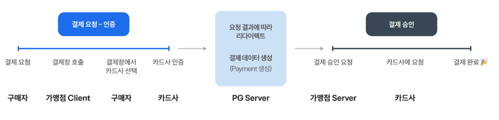
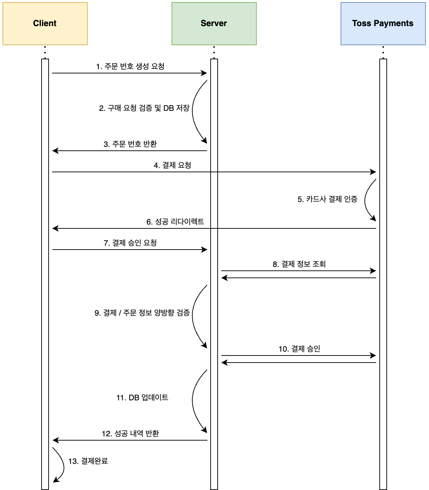
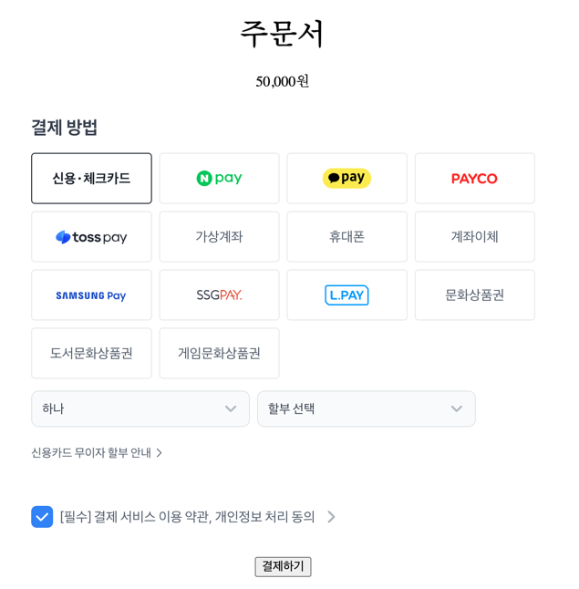
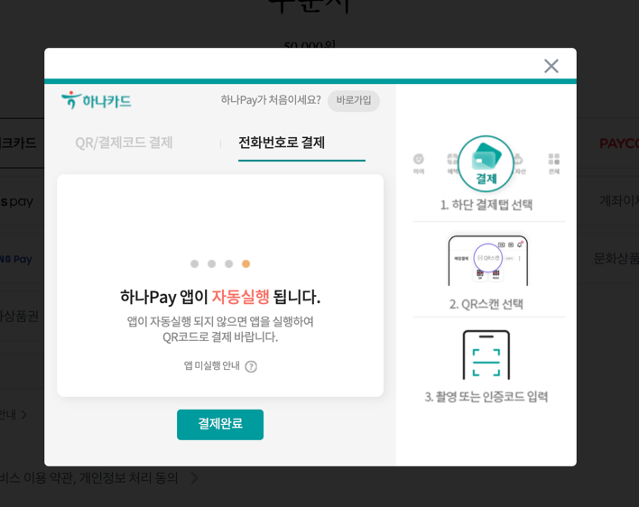
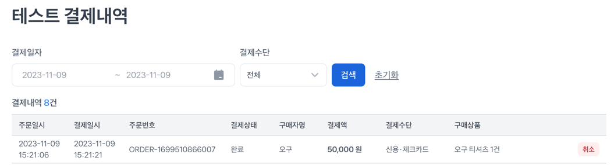

> 실행 환경: Java 17, Spring Boot 3.1.5  
> 서버 위주의 포스팅이기 때문에 클라이언트 코드는 간략하게 작성  
> 프론트엔드는 토스페이먼츠에서 제공해준 [샘플 프로젝트 리액트](https://github.com/tosspayments/payment-widget-sample) 일부 수정 사용  
> !! 해당 문서는 2023년 11월 기준의 코드로 작성되었으며, 구현 코드는 많은 부분이 변경되었습니다. 

KG이니시스, 다날 페이먼트, 토스 페이먼츠 등의 결제 서비스를 제공하는 업체들이 존재하는데, 그 중 토스페이먼츠를 이용하여 결제 시스템을 구현해보았다.  
토스페이먼츠에서는 이미 [클라이언트 코드](https://github.com/tosspayments/payment-widget-sample)를 제공해주어 쉽게 구현할 수 있다.  
하지만 클라이언트에서만 처리하는 것은 보안에 취약하기 때문에 중간에 서버를 두어 검증 하는 단계를 추가하여 결제 시스템을 구현해보고자 한다.

- [Server Repository](https://github.com/hyoguoo/payment-platform)
- [Client Repository](https://github.com/hyoguoo/payment-widget-client)

## 결제 연동 이해하기

[문서](https://docs.tosspayments.com/guides/payment-widget/integration)가 잘 되어 있어 해당 문서를 참고하는 것이 가장 좋으나
핵심 용어를 간단하게 요약하면 아래와 같다.

- 결제 위젯: 토스페이먼츠에서 제공해주는 결제 위젯 SDK로, 결제 요청을 위한 정보를 받아 결제 요청을 보내준다.
- Client Key: 결제 위젯을 사용하기 위해 필요한 키로, 토스 페이먼츠에서 제공해준다.
- Secret Key: 결제 승인 및 조회를 위해 필요한 키로, 토스 페이먼츠에서 제공해준다.(공개하면 안되는 비밀키이므로 해당 프로젝트에서는 서버에서 사용하도록 하였다.)
- 결제 후 리다이렉트: 결제가 완료되면 결제 정보와 함께 리다이렉트를 해주는데, 이때 결제 정보는 URL 파라미터로 전달된다.
    - 결제 인증만 완료된 상태로, 완전히 결제가 완료된 것은 아니다.
- 결제 승인: 인증된 결제를 최종 승인하는 것으로, 결제 승인이 완료되면 결제가 완전히 완료된 것이다.

## 전체적인 흐름



[결제 흐름](https://docs.tosspayments.com/guides/learn/payment-flow) 페이지에도 나와있듯이 결제 흐름은 세 단계로 나눌 수 있다.

1. 요청
2. 인증
3. 승인

문서가 잘 되어 있기 때문에 전체적인 기본 플로우나 각 단계에 대한 설명은 토스 제공 공식 문서를 참고하는 것이 좋은 것 같다.  
기본적인 결제 흐름은 위와 같으며 안전한 결제를 위하여 결제 정보를 검증하기 위해 서버를 두어 검증자의 역할을 수행하도록 하였다.



1. 주문 번호 생성 요청: 클라이언트에서 결제 요청 전 주문 번호를 서버에 요청
2. 구매 요청 검증 및 DB 저장: 서버에서는 주문 번호를 생성하고 받은 정보와 주문 번호를 DB에 저장
3. 주문 번호 반환: 서버에서 생성한 주문 번호를 클라이언트에게 반환
4. 결제 요청: 받은 주문 정보로 결제 요청
5. 결제 인증: 결제 요청을 통해 결제 위젯이 뜨면 결제 인증 진행
6. 성공 리다이렉트: 결제 인증이 완료되면 결제 정보와 함께 성공 페이지로 리다이렉트
7. 결제 승인 요청: 성공 페이지로 리다이렉트 되면 서버에 결제 승인 요청
8. 결제 정보 조회: 서버에서 결제 인증 단계에서 토스페이먼츠에 저장된 결제 정보 조회
9. 결제/주문 정보 양방향 검증: 서버에서 결제 정보와 클라이언트에서 받은 결제 정보, DB에 저장된 주문 정보 검증
10. 결제 승인: 결제 정보에 이상이 없다면 토스에 결제 승인 요청
11. DB 업데이트: 결제 완료로 DB 업데이트
12. 성공내역 반환: 클라이언트에게 성공 내역 반환
13. 결제 완료: 클라이언트에서 결제 완료 페이지로 이동

각 과정에 대한 설명을 코드와 함께 아래에서 자세히 설명하도록 하겠다.

## 상세 플로우 및 코드

### 1. 주문 번호 생성 요청 - (클라이언트)

실제 결제를 하기 전에 주문 번호를 생성해야 하는데, 토스에서 제공해준 기존 클라이언트 코드에서는 직접 주문 번호를 생성하고 있었다.  
이러한 정보는 클라이언트에서 생성하는 것 보단 서버에서 생성하는 것이 더 안전하다고 생각하여 서버에서 주문 번호를 생성하도록 하였다.

```javascript
const requestData = {
  userId: USER_ID, // 인증 처리 생략으로 인해 userId를 직접 넘겨줌
  amount: PRICE,
  orderProduct: { // 구매하는 상품 정보와 수량
    productId: PRODUCT_ID,
    quantity: QUANTITY,
  },
}

// 주문 번호 생성 요청
const response = await fetch("http://localhost:8080/api/v1/orders/create", {
  method: "POST",
  headers: {
    "Content-Type": "application/json",
  },
  body: JSON.stringify(requestData),
})
```

아래 화면에서 결제하기 버튼을 누르면 실제 결제 요청을 시작하기 전에 서버에 주문 번호를 생성하는 요청을 보내도록 구현하였다.



### 2. 구매 요청 검증 및 DB 저장 + 3. 주문 번호 반환 - (서버)

클라이언트에서 주문 번호를 요청하면 서버에서는 주문 번호 반환 뿐만 아니라 구매 상품에 대한 검증과 DB에 저장하는 작업을 수행하게 된다.  
수행 작업 및 순서는 주석의 번호를 따라가며 확인할 수 있다.

```java
// OrderService.java
public class OrderService {
    // ...

    @Transactional
    public OrderCreateResponse createOrder(OrderCreateRequest orderCreateRequest) {
        OrderProduct orderProduct = orderCreateRequest.getOrderProduct();

        OrderInfo createdOrder = orderInfoRepository.save(
                // 1. toEntity()로 builder()를 호출하여 생성자를 호출
                orderCreateRequest.toEntity(
                        // userId로 사용자 정보 조회
                        userService.getById(orderCreateRequest.getUserId()),
                        // productId로 구매 상품 정보 조회
                        productService.getById(orderProduct.getProductId())
                ));

        return new OrderCreateResponse(createdOrder); // 4. Order ID를 포함한 생성된 주문 정보 반환
    }

    // ...
}

// OrderInfo.java
@Getter
@Entity
@Table(name = "order_info")
@NoArgsConstructor(access = AccessLevel.PROTECTED)
public class OrderInfo extends BaseTime {

    // ... 필드 생략

    // 2. 생성자 호출
    @Builder
    protected OrderInfo(/* ... */) {
        // ...

        this.validateProductInfo(totalAmount, quantity); // 3. 생성 완료 전 상품 정보 검증
    }

    private void validateProductInfo(BigDecimal totalAmount, Integer quantity) {
        this.product.validateStock(quantity); // 상품 재고 검증

        // 상품 가격 * 수량 == 결제 금액 검증
        BigDecimal totalPrice = this.product.getPrice().multiply(BigDecimal.valueOf(quantity));
        if (totalAmount.compareTo(totalPrice) != 0) {
            throw OrderInfoException.of(OrderInfoErrorMessage.INVALID_TOTAL_AMOUNT);
        }
    }

    // ...
}
```

우선 상품 금액과 결제 금액이 일치하는지 검증하고, DB에 저장한다.(여기서 저장한 정보는 이후 승인 요청에서 검증을 위해 사용된다.)  
그 후 클라이언트에게 주문 번호를 반환하여 클라이언트가 결제 요청을 할 수 있도록 한다.

### 4. 결제 요청 + 5. 결제 인증 + 6. 성공 리다이렉트 - (클라이언트)

```javascript
// 위의 클라이언트 로직 이후...

// 반환 된 주문 번호 저장
const orderId = json.orderId;

try {
  // 결제 요청 시작
  await paymentWidget?.requestPayment({
    orderId: orderId,
    orderName: ORDER_NAME,
    customerName: CUSTOMER_NAME,
    customerEmail: CUSTOMER_EMAIL,
    successUrl: `${window.location.origin}/success`,
    failUrl: `${window.location.origin}/fail`,
  });
} catch (error) {
  // 에러 처리
  console.error(error);
}
```

주문 번호를 성공적으로 받게 되면 클라이언트에서 결제 정보를 통해 요청을 하게 되고 아래 화면에서 결제 완료 버튼을 누르면 결제 인증이 진행된다.



결제 인증까지 완료된다면 성공 페이지로 리다이렉트 되는데, 이 때 리다이렉트 정보에는 `paymentKey`, `orderId`, `amount` 정보가 포함되어 있다.  
각 정보는 결제에 있어 중요한 정보이기 때문에 서버에서 검증 과정을 거치도록 한다.

#### 7. 결제 승인 요청 - (클라이언트)

토스에서 제공해준 클라이언트 코드에서는 성공 페이지로 리다이렉트 되면 결제 승인 요청을 클라이언트에서 직접하도록 되어있다.  
하지만 결제 승인 요청을 클라이언트에서 직접 하게 되면 결제 정보를 조작하여 요청을 할 수 있기 때문에 서버에 요청을 보내 검증 과정을 거치도록 하였다.

```javascript
// 리다이렉트로 받은 결제 정보 데이터를 서버에게 전달하기 위해 데이터 생성
const requestData = {
  userId: USER_ID,
  orderId: searchParams.get("orderId"),
  amount: searchParams.get("amount"),
  paymentKey: searchParams.get("paymentKey"),
};

async function confirm() {
  // 토스가 아닌 우리가 구축한 서버에 결제 승인 요청
  const response = await fetch("http://localhost:8080/api/v1/orders/confirm", {
    method: "POST",
    headers: {
      "Content-Type": "application/json",
    },
    body: JSON.stringify(requestData),
  })

  const json = await response.json();

  // 실패 시 에러 페이지로 이동
  if (!response.ok) {
    console.log(json);
    navigate(`/fail?message=${json.message}`)
    return;
  }

  console.log(json);
}

confirm();
```

### 8. 결제 정보 조회 + 9. 결제/주문 정보 검증 + 10. 결제 승인 + 11. DB 업데이트 + 12. 성공내역 반환 - (서버)

이제 서버에서는 결제 승인 요청을 받게 되는데, 클라이언트에서 받은 승인 요청 정보와 결제 요청 및 승인을 통해 저장된 토스페이먼츠 결제 정보를 검증하게 된다.  
우선 결제 정보 조회 및 승인 요청 코드는 아래와 같다.

```java

@Service
public class PaymentService {

    @Value("${spring.myapp.toss-payments.secret-key}")
    private String secretKey; // 토스 페이먼츠 인증에 사용되는 시크릿키
    @Value("${spring.myapp.toss-payments.api-url}")
    private String tossApiUrl; // 토스 페이먼츠 API URL

    public TossPaymentResponse getPaymentInfoByOrderId(String orderId) {
        return findPaymentInfoByOrderId(orderId)
                .orElseThrow(() -> PaymentException.of(PaymentErrorMessage.NOT_FOUND));
    }

    // 결제 정보 조회
    public Optional<TossPaymentResponse> findPaymentInfoByOrderId(String orderId) {
        return HttpUtils.requestGetWithBasicAuthorization(
                tossApiUrl + "/orders/" + orderId,
                EncodeUtils.encodeBase64(secretKey + ":"),
                TossPaymentResponse.class);
    }

    // 결제 승인 요청
    public TossPaymentResponse confirmPayment(TossConfirmRequest tossConfirmRequest) {
        return HttpUtils.requestPostWithBasicAuthorization(
                tossApiUrl + "/confirm",
                EncodeUtils.encodeBase64(secretKey + ":"),
                tossConfirmRequest,
                TossPaymentResponse.class);
    }

    // ...
}
```

노출되면 안되는 값들은 `application.yaml`로 관리하였고, `RestTemplate`을 사용하여 토스측에 결제 정보 조회 및 승인 요청을 보내도록 하였다.  
다음으로 자세한 수행 작업 및 순서는 주석의 번호를 따라가며 확인할 수 있다.

```java
// OrderService.java
public class OrderService {
    // ...

    @Transactional
    public OrderConfirmResponse confirmOrder(OrderConfirmRequest orderConfirmRequest) {
        // 1. Order ID 저장 때 생성된 주문 정보 조회(+ Pesimistic Lock으로 재고 차감 동시성 제어)
        OrderInfo orderInfo = this.getOrderInfoByOrderPessimisticLock(
                orderConfirmRequest.getOrderId()
        );
        // 2. 재고 충분한지 확인 + 재고 차감
        productService.reduceStock(orderInfo.getProduct().getId(), orderInfo.getQuantity());
        // 3. 결제 정보 조회
        TossPaymentResponse paymentInfo = paymentService.getPaymentInfoByOrderId(
                orderConfirmRequest.getOrderId()
        );

        // 4. 저장된 정보 + 클라이언트 요청 정보 + 토스에 저장된 결제 정보 검증
        orderInfo.validateInProgressOrder(paymentInfo, orderConfirmRequest);

        // 5. 결제 승인
        TossPaymentResponse confirmPaymentResponse =
                paymentService.confirmPayment(
                        TossConfirmRequest.createByOrderConfirmRequest(orderConfirmRequest)
                );

        // 6. OrderInfo 업데이트
        OrderInfo confirmedOrderInfo = orderInfo.confirmOrder(
                confirmPaymentResponse,
                orderConfirmRequest
        );

        // 7. 성공내역 반환
        return new OrderConfirmResponse(confirmedOrderInfo);
    }

    // ...
}
```

OrderInfo와 재고를 차감할 Product, 그리고 User에 대해 Lock을 걸어 동시에 재고 차감 및 수정되는 것을 방지하였다.  
검증 및 데이터 변경은 `OrderInfo` 엔티티에서 수행하도록 하였고, 검증하는 정보는 주석에 작성해두었다.

```java
// OrderInfo.java
@Getter
@Entity
@Builder
@Table(name = "order_info")
@NoArgsConstructor(access = AccessLevel.PROTECTED)
public class OrderInfo extends BaseTime {

    // ...

    // (위 코드의 4번에서 호출)저장된 정보 + 클라이언트 요청 정보 + 토스에 저장된 결제 정보 검증
    public void validateInProgressOrder(TossPaymentResponse paymentInfo,
            OrderConfirmRequest orderConfirmRequest) {
        // 주문 상태가 IN_PROGRESS가 아니라면 결제 승인 요청을 할 수 없음
        if (!paymentInfo.getStatus().equals(OrderStatus.IN_PROGRESS.getStatusName())) {
            throw OrderInfoException.of(OrderInfoErrorMessage.NOT_IN_PROGRESS_ORDER);
        }

        this.validateOrderInfo(paymentInfo, orderConfirmRequest);
    }

    // (위 코드의 6번에서 호출)OrderInfo 업데이트
    public OrderInfo confirmOrder(TossPaymentResponse paymentInfo,
            OrderConfirmRequest orderConfirmRequest) {
        // 승인 요청 후 결제 정보가 DONE이 아니라면 결제 승인이 완료되지 않음
        if (!paymentInfo.getStatus().equals(OrderStatus.DONE.getStatusName())) {
            throw OrderInfoException.of(OrderInfoErrorMessage.NOT_DONE_PAYMENT);
        }

        this.validateOrderInfo(paymentInfo, orderConfirmRequest);

        updateOrderPaymentInfo(paymentInfo); // 결제 정보 업데이트

        return this;
    }

    // 검증 로직, validateInProgressOrder/confirmOrder에서 호출
    private void validateOrderInfo(TossPaymentResponse paymentInfo,
            OrderConfirmRequest orderConfirmRequest) {
        // 저장된 order id == 클라이언트 요청 order id
        if (!this.orderId.equals(orderConfirmRequest.getOrderId())) {
            throw OrderInfoException.of(OrderInfoErrorMessage.INVALID_ORDER_ID);
        }

        // 저장된 user id == 클라이언트 요청 user id
        if (!this.user.getId().equals(orderConfirmRequest.getUserId())) {
            throw OrderInfoException.of(OrderInfoErrorMessage.INVALID_USER_ID);
        }

        // 클라이언트 요청 payment key == 토스에 저장된 payment key
        if (!paymentInfo.getPaymentKey().equals(orderConfirmRequest.getPaymentKey())) {
            throw OrderInfoException.of(OrderInfoErrorMessage.INVALID_PAYMENT_KEY);
        }

        // 클라이언트 요청 amount == 토스에 저장된 total amount == 상품 가격 * 수량
        if (!compareAmounts(paymentInfo, orderConfirmRequest)) {
            throw OrderInfoException.of(OrderInfoErrorMessage.INVALID_TOTAL_AMOUNT);
        }
    }

    private boolean compareAmounts(
            TossPaymentResponse paymentInfo,
            OrderConfirmRequest orderConfirmRequest
    ) {
        BigDecimal paymentInfoTotalAmount = BigDecimal.valueOf(paymentInfo.getTotalAmount());
        BigDecimal orderConfirmRequestAmount = orderConfirmRequest.getAmount();
        BigDecimal orderInfoAmount = this.product.getPrice()
                .multiply(BigDecimal.valueOf(this.quantity));

        return orderInfoAmount.compareTo(paymentInfoTotalAmount) == 0 &&
                orderInfoAmount.compareTo(orderConfirmRequestAmount) == 0 &&
                orderConfirmRequestAmount.compareTo(paymentInfoTotalAmount) == 0;
    }
    // ...
}
```

코드를 살펴보면 `validateOrderInfo`가 결국 결제 승인 요청 전/후로 두 번 호출 되는 것을 확인할 수 있다.

- 요청 전: 아직 검증되지 않은 결제 정보가 불필요하게 결제 승인 요청 되는 것을 방지하기 위해 검증을 수행
- 요청 후: 승인 요청 후 올바르게 결제 정보를 승인하였는지 다시 한 번 검증

검증 자체는 큰 비용이 아니기 때문에 불필요하게 결제 승인 요청을 보내는 것 보다는 검증 로직을 두 번 호출하는 것이 더 안전하다고 판단하였다.  
비슷한 맥락으로 승인 요청 전 결제 정보 조회 API 요청 전에 재고 검증을 먼저 수행하도록 하였다.

### 12. 결제 완료 - (클라이언트)

결제가 무사히 완료되면 결제 완료 페이지로 이동하게 되면서 결과를 확인할 수 있다.


또한 토스 페이먼츠의 테스트 결제내역에서도 동일한 주문번호가 남아있어 정상적으로 결제가 완료되었음을 확인할 수 있다.



## 한계 및 개선 방향

외부 API를 연동하여 통신을 하게 되는 부분에서 여러 문제점들이 발생할 수 있다고 생각하였다.  
추후 이러한 문제점들을 개선 방향으로 잡으면 좋을 것 같다.

```java
// OrderService.java
public class OrderService {
    // ...

    @Transactional // 외부 API 2회 요청이 있는 트랜잭션 범위
    public OrderConfirmResponse confirmOrder(OrderConfirmRequest orderConfirmRequest) {
        OrderInfo orderInfo = this.getOrderInfoByOrderPessimisticLock(
                orderConfirmRequest.getOrderId()
        );
        productService.reduceStock(orderInfo.getProduct().getId(), orderInfo.getQuantity());
        TossPaymentResponse paymentInfo = paymentService.getPaymentInfoByOrderId(
                orderConfirmRequest.getOrderId()
        );

        orderInfo.validateInProgressOrder(paymentInfo, orderConfirmRequest);

        // 결제 승인
        TossPaymentResponse confirmPaymentResponse =
                paymentService.confirmPayment(
                        TossConfirmRequest.createByOrderConfirmRequest(orderConfirmRequest)
                );
        // 요청이 지연 되는 경우..

        if (true)
            throw new Exception("test"); // 만약 승인 이후 오류 발생하면?

        OrderInfo confirmedOrderInfo = orderInfo.confirmOrder(
                confirmPaymentResponse,
                orderConfirmRequest
        );

        return new OrderConfirmResponse(confirmedOrderInfo);
    }

    // ...
}
```

### 결제 승인 후 오류 발생 케이스 - [추적 가능한 로깅으로 문제 최소화](/blog/log-structure-and-performance/)

결제 승인 이후 오류가 발생한다면 서버의 데이터베이스에는 전부 롤백이 되지만 토스에는 결제 승인된 내역이 그대로 남아있게 된다.  
우선은 변동 가능성이 큰 재고를 가진 Product에 대한 Lock을 얻어 내부에서 오류가 발생할 확률은 낮지만, 해당 케이스에 대한 처리가 필요하다.

### API 지연으로 인한 실패 처리 - [재시도 로직을 통해 해결](/blog/payment-status-with-retry/)

결제 승인 단계에서 통신 중 응답이 지연되는 경우가 발생할 수 있다.  
우리 서버의 타임 아웃이 5초이고, 토스 API의 응답이 지연되어 6초가 걸렸다고 가정하면 우리 서버는 5초 후에 응답을 받지 못하고 타임 아웃이 발생하게 된다.  
하지만 토스사에서는 결제 승인이 완료되었기 때문에 결제가 완료된 것으로 처리되지만 우리 서버에서는 결제 승인이 완료되지 않은 것으로 처리될 수 있다.  
이번에도 마찬가지로 데이터베이스는 롤백되지만 토스사에는 결제 승인된 내역이 그대로 남아있게 된다.

### 넓은 Transaction 범위 - [트랜잭션 범위 조정으로 해결](/blog/minimize-transaction-scope/)

현재 트랜잭션 범위가 메서드 전체에 걸려있는데, 해당 메서드 안에 외부 API 요청이 2회가 있기 때문에 트랜잭션의 시간적 범위가 넓어지게 된다.  
여기서 API 타임 아웃이 발생하게 되면 락을 획득한 상태에서 계속 대기하게 되는데, 이는 다른 사용자의 요청이 많아질 경우 성능 저하를 발생시킬 수 있다.
