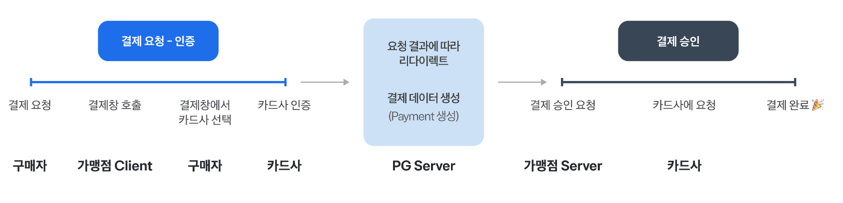
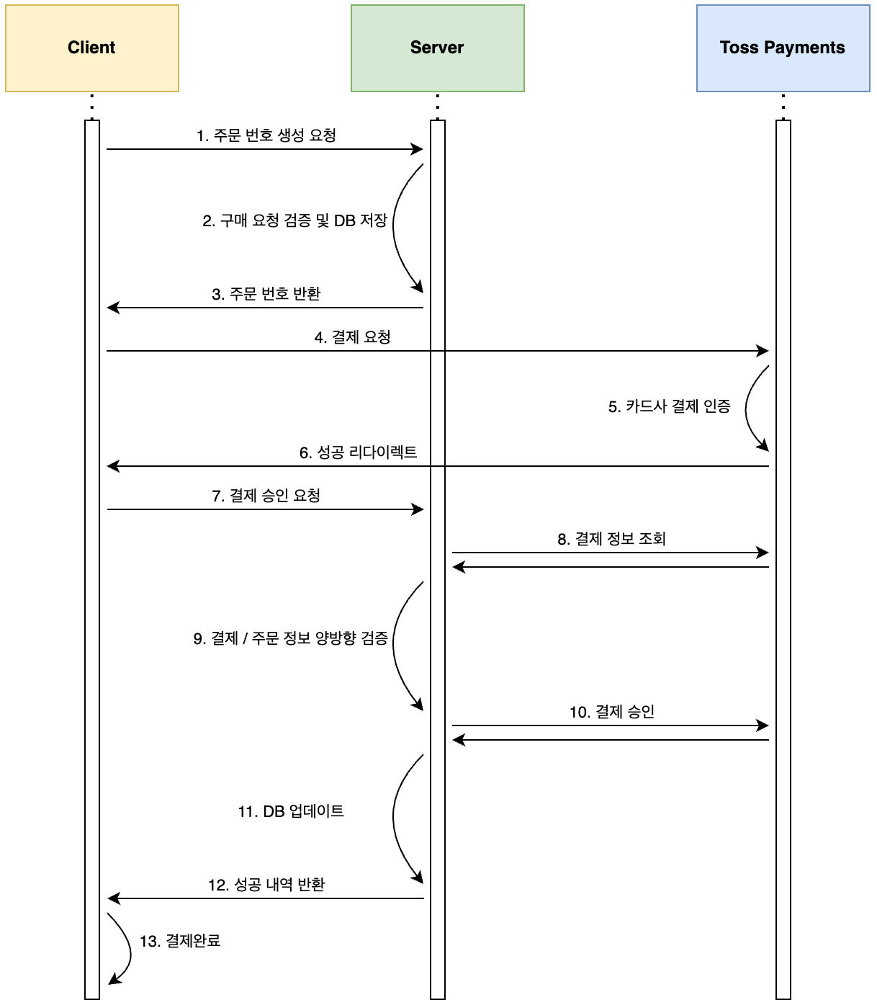
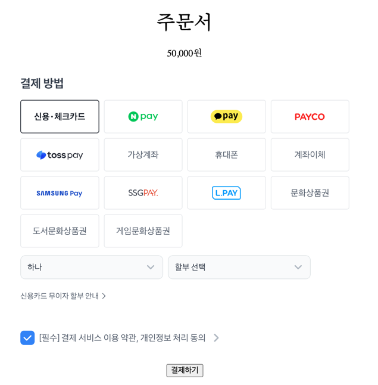
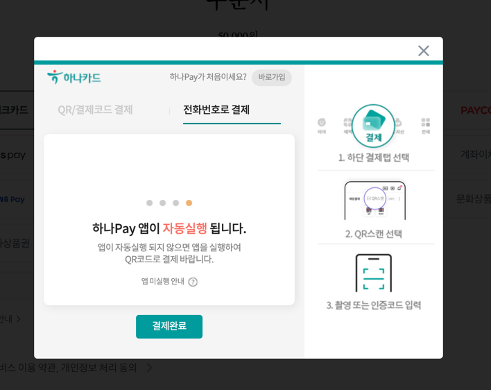
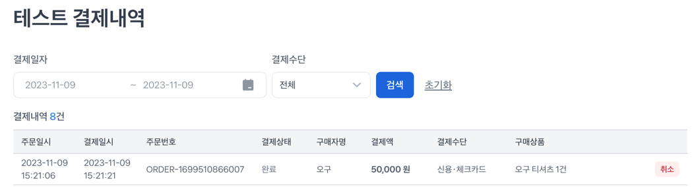

> 실행 환경: Java 17, Spring Boot 3.1.5  
> 서버 위주의 포스팅이기 때문에 클라이언트 코드는 간략하게 작성  
> 프론트엔드는 토스페이먼츠에서 제공해준 [샘플 프로젝트 리액트](https://github.com/tosspayments/payment-widget-sample) 일부 수정 사용  
> [!CAUTION] 해당 문서는 2023년 11월 기준의 코드로 작성되었으며, 구현 코드 상방 부분 변경

KG이니시스, 다날 페이먼트, 토스 페이먼츠 등의 결제 서비스를 제공하는 업체들이 존재하는데, 그 중 토스페이먼츠를 이용하여 결제 시스템을 구현해보았다.  

- 토스페이먼츠에서 제공한 [클라이언트 코드](https://github.com/tosspayments/payment-widget-sample) 사용  
- 서버를 두어 검증 단계를 추가한 결제 시스템 구현

## 결제 연동 이해하기

[문서](https://docs.tosspayments.com/guides/payment-widget/integration)가 잘 되어 있어 해당 문서를 참고하면 되며, 핵심 용어를 간단하게 요약하면 아래와 같다.

- 결제 위젯: 토스페이먼츠에서 제공해주는 결제 위젯 SDK로, 결제 요청을 위한 정보를 받아 결제 요청 전송
- Client Key: 결제 위젯을 사용하기 위해 필요한 키로(토스 페이먼츠에서 제공)
- Secret Key: 결제 승인 및 조회를 위해 필요한 키로(토스 페이먼츠에서 제공)
    - 공개하면 안되는 비밀키이므로 서버에서만 사용
- 결제 후 리다이렉트: 결제가 완료되면 결제 정보와 함께 리다이렉트를 해주는데, 이때 결제 정보는 URL 파라미터로 전달
    - 결제 인증만 완료된 상태(완전히 결제가 완료된 상태 X)
- 결제 승인: 인증된 결제를 최종 승인

## 전체적인 흐름



[결제 흐름](https://docs.tosspayments.com/guides/learn/payment-flow) 페이지에도 나와있듯이 결제 흐름은 요청 - 인증 - 승인 단계로 나눌 수 있다.

### 실제 구현 흐름

기본 결제 흐름을 기반으로, 안전한 결제를 위해 서버는 검증자 역할을 수행한다.



## 상세 플로우 및 코드

### 1. 주문 번호 생성 요청 - (클라이언트)

실제 결제를 하기 위해선 주문 번호가 필요한데, 생성 정책을 다음과 같이 변경했다.

- Before: 클라이언트 측에서 직접 주문 번호 생성
- After: 서버측에서 생성하여 반환



위 화면의 결제하기 버튼을 누르면 실제 결제 요청 전에 서버에 주문 번호를 생성하는 요청을 먼저 보낸다.

### 2. 구매 요청 검증 및 DB 저장 + 3. 주문 번호 반환 - (서버)

서버에서는 주문 번호 반환 뿐만 아니라 구매 상품에 대한 검증과 DB에 저장하는 작업을 수행하게 된다.

```java
// OrderService.java
public class OrderService {
    // ...

    @Transactional
    public OrderCreateResponse createOrder(OrderCreateRequest orderCreateRequest) {
        OrderProduct orderProduct = orderCreateRequest.getOrderProduct();

        OrderInfo createdOrder = orderInfoRepository.save(
                // 1. 생성자 호출
                orderCreateRequest.toEntity(
                        userService.getById(orderCreateRequest.getUserId()),
                        productService.getById(orderProduct.getProductId())
                ));

        return new OrderCreateResponse(createdOrder); // 4. Order ID를 포함한 생성된 주문 정보 반환
    }

    // ...
}
```

```java
// OrderInfo.java
public class OrderInfo extends BaseTime {

    // ...

    // 2. 생성 및 검증
    @Builder
    protected OrderInfo(/* ... */) {
        // ...
        this.validateProductInfo(totalAmount, quantity); // 3. 생성 완료 전 상품 정보 검증
    }

    private void validateProductInfo(BigDecimal totalAmount, Integer quantity) {
        this.product.validateStock(quantity); // 상품 재고 검증

        // 상품 가격 * 수량 == 결제 금액 검증
        BigDecimal totalPrice = this.product.getPrice().multiply(BigDecimal.valueOf(quantity));
        if (totalAmount.compareTo(totalPrice) != 0) {
            throw OrderInfoException.of(OrderInfoErrorMessage.INVALID_TOTAL_AMOUNT);
        }
    }

    // ...
}
```

우선 상품 금액과 결제 금액이 일치하는지 검증하고, DB에 저장한다.(여기서 저장한 정보는 이후 승인 요청에서 검증을 위해 사용된다.)

### 4. 결제 요청 + 5. 결제 인증 + 6. 성공 리다이렉트 - (클라이언트)

주문 번호를 성공적으로 받게 되면 클라이언트에서 결제 정보를 통해 요청을 하게 되고 아래 화면에서 결제 완료 버튼을 누르면 결제 인증이 진행된다.



결제 인증까지 완료된다면 `paymentKey`, `orderId`, `amount` 정보를 포함하여 성공 페이지로 리다이렉트 되는데, 각 서버에서 검증 과정을 거치도록 한다.

#### 7. 결제 승인 요청 - (클라이언트)

토스에서 제공해준 클라이언트 코드에서는 성공 페이지로 리다이렉트 되면 결제 승인 요청을 클라이언트에서 직접하고 있었으나, 서버에 요청을 거치도록 하였다.

### 8. 결제 정보 조회 + 9. 결제/주문 정보 검증 + 10. 결제 승인 + 11. DB 업데이트 + 12. 성공내역 반환 - (서버)

결제 승인 요청을 받은 서버는 클라이언트에서 받은 승인 요청 정보와 결제 요청 및 승인을 통해 저장된 토스페이먼츠 결제 정보를 검증하게 된다.

```java
// OrderService.java
public class OrderService {
    // ...

    @Transactional
    public OrderConfirmResponse confirmOrder(OrderConfirmRequest orderConfirmRequest) {
        // 1. Order ID 저장 때 생성된 주문 정보 조회(+ Pesimistic Lock으로 재고 차감 동시성 제어)
        OrderInfo orderInfo = this.getOrderInfoByOrderPessimisticLock(
                orderConfirmRequest.getOrderId()
        );
        // 2. 재고 충분한지 확인 + 재고 차감
        productService.reduceStock(orderInfo.getProduct().getId(), orderInfo.getQuantity());
        // 3. 결제 정보 조회
        TossPaymentResponse paymentInfo = paymentService.getPaymentInfoByOrderId(
                orderConfirmRequest.getOrderId()
        );

        // 4. 저장된 정보 + 클라이언트 요청 정보 + 토스에 저장된 결제 정보 검증
        orderInfo.validateInProgressOrder(paymentInfo, orderConfirmRequest);

        // 5. 결제 승인
        TossPaymentResponse confirmPaymentResponse =
                paymentService.confirmPayment(
                        TossConfirmRequest.createByOrderConfirmRequest(orderConfirmRequest)
                );

        // 6. OrderInfo 업데이트
        OrderInfo confirmedOrderInfo = orderInfo.confirmOrder(
                confirmPaymentResponse,
                orderConfirmRequest
        );

        // 7. 성공내역 반환
        return new OrderConfirmResponse(confirmedOrderInfo);
    }

    // ...
}
```

OrderInfo와 재고를 차감할 Product에 Lock을 걸어 재고 차감 동시성 문제를 방지하였고, 검증 및 데이터 변경은 `OrderInfo` 엔티티에서 수행했다.

```java
// OrderInfo.java
public class OrderInfo extends BaseTime {

    // ...

    // (위 코드의 4번에서 호출)저장된 정보 + 클라이언트 요청 정보 + 토스에 저장된 결제 정보 검증
    public void validateInProgressOrder(TossPaymentResponse paymentInfo,
            OrderConfirmRequest orderConfirmRequest) {
        // 주문 상태가 IN_PROGRESS가 아니라면 결제 승인 요청을 할 수 없음
        if (!paymentInfo.getStatus().equals(OrderStatus.IN_PROGRESS.getStatusName())) {
            throw OrderInfoException.of(OrderInfoErrorMessage.NOT_IN_PROGRESS_ORDER);
        }

        this.validateOrderInfo(paymentInfo, orderConfirmRequest);
    }

    // (위 코드의 6번에서 호출)OrderInfo 업데이트
    public OrderInfo confirmOrder(TossPaymentResponse paymentInfo,
            OrderConfirmRequest orderConfirmRequest) {
        // 승인 요청 후 결제 정보가 DONE이 아니라면 결제 승인이 완료되지 않음
        if (!paymentInfo.getStatus().equals(OrderStatus.DONE.getStatusName())) {
            throw OrderInfoException.of(OrderInfoErrorMessage.NOT_DONE_PAYMENT);
        }

        this.validateOrderInfo(paymentInfo, orderConfirmRequest);

        updateOrderPaymentInfo(paymentInfo); // 결제 정보 업데이트

        return this;
    }

    // 검증 로직, validateInProgressOrder/confirmOrder에서 호출
    private void validateOrderInfo(TossPaymentResponse paymentInfo,
            OrderConfirmRequest orderConfirmRequest) {
        // 저장된 order id == 클라이언트 요청 order id
        // 저장된 user id == 클라이언트 요청 user id
        // 클라이언트 요청 payment key == 토스에 저장된 payment key
        // 클라이언트 요청 amount == 토스에 저장된 total amount == 상품 가격 * 수
        // 코드 생략
    }

    // ...
}
```

`validateOrderInfo`를 결제 승인 요청 전/후로 두 번 호출하였는데, 그 목적은 다음과 같다.

- 요청 전: 아직 검증되지 않은 결제 정보가 불필요하게 결제 승인 요청 되는 것을 방지하기 위해 검증을 수행
- 요청 후: 승인 요청 후 올바르게 결제 정보를 승인하였는지 다시 한 번 검증

검증 자체는 비용이 크지 않으므로, 불필요한 결제 승인 요청을 방지하기 위해 검증 로직을 승인 전후로 두 번 호출하는 것이 더 안전하다고 판단했다.

### 12. 결제 완료 - (클라이언트)

결제가 무사히 완료되면 결제 완료 페이지로 이동하게 되면서 결과를 확인할 수 있다.


또한 토스 페이먼츠의 테스트 결제내역에서도 동일한 주문번호가 남아있어 정상적으로 결제가 완료되었음을 확인할 수 있다.



## 한계 및 개선 방향

구현을 완료하고 나니 외부 API 연동 구조에서 발생 가능한 여러 문제들이 발견되었고, 추후 이러한 문제점을 개선 방향으로 잡으면 좋을 것 같다.

```java
// OrderService.java
public class OrderService {
    // ...

    @Transactional // 외부 API 2회 요청이 있는 트랜잭션 범위
    public OrderConfirmResponse confirmOrder(OrderConfirmRequest orderConfirmRequest) {
        OrderInfo orderInfo = this.getOrderInfoByOrderPessimisticLock(
                orderConfirmRequest.getOrderId()
        );
        productService.reduceStock(orderInfo.getProduct().getId(), orderInfo.getQuantity());
        TossPaymentResponse paymentInfo = paymentService.getPaymentInfoByOrderId(
                orderConfirmRequest.getOrderId()
        );

        orderInfo.validateInProgressOrder(paymentInfo, orderConfirmRequest);

        // 결제 승인
        TossPaymentResponse confirmPaymentResponse =
                paymentService.confirmPayment(
                        TossConfirmRequest.createByOrderConfirmRequest(orderConfirmRequest)
                );
        // 요청이 지연 되는 경우..

        if (true)
            throw new Exception("test"); // 만약 승인 이후 오류 발생하면?

        OrderInfo confirmedOrderInfo = orderInfo.confirmOrder(
                confirmPaymentResponse,
                orderConfirmRequest
        );

        return new OrderConfirmResponse(confirmedOrderInfo);
    }

    // ...
}
```

### 결제 승인 후 오류 발생 케이스 - [결제 상태 전환 관리와 재시도 로직을 통한 결제 복구](/blog/payment-status-with-retry/)

- 결제 승인 이후 오류 발생 시, 서버의 데이터베이스에는 전부 롤백이 되지만 토스에는 결제 승인된 채로 남음
- 내부에서 오류가 발생할 확률은 낮지만, 갑작스러운 서버 장애 시 문제 발생 가능

### API 지연으로 인한 실패 처리 - [재시도 로직을 통해 해결](/blog/payment-status-with-retry/)

- 결제 승인 단계에서 통신 중 응답이 지연 케이스
- 우리 서버의 타임 아웃 설정 값이 5초 + 토스 API 6초 지연 시 타임 아웃 발생
- 토스사에서는 결제 승인 완료 상태 / 우리 서버에서는 결제 승인이 완료되지 않은 것으로 처리되는 데이터 불일치 상황 발생

### 넓은 Transaction 범위 - [트랜잭션 범위 조정으로 해결](/blog/minimize-transaction-scope/)

- 외부 API 요청이 2회이 존재하는 넓은 트랜잭션 범위 설정
- API 타임 아웃이 발생하게 되면 락을 획득한 상태에서 계속 대기하면서, 요청이 많아질 경우 성능 저하 발생
