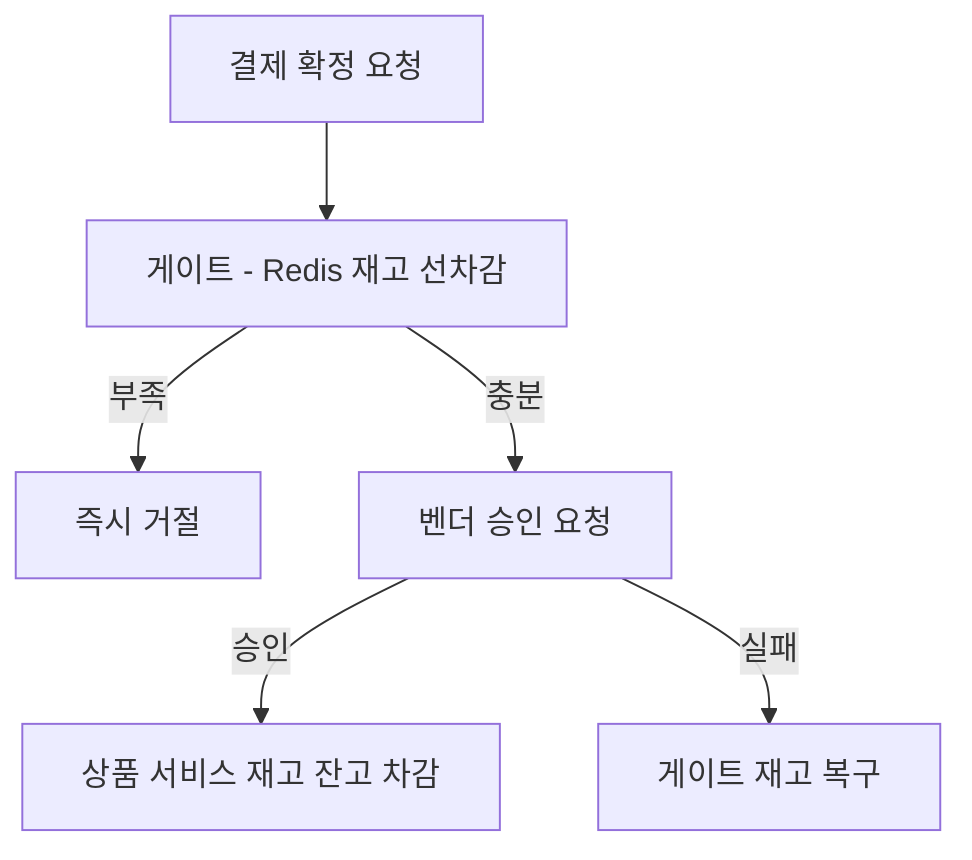
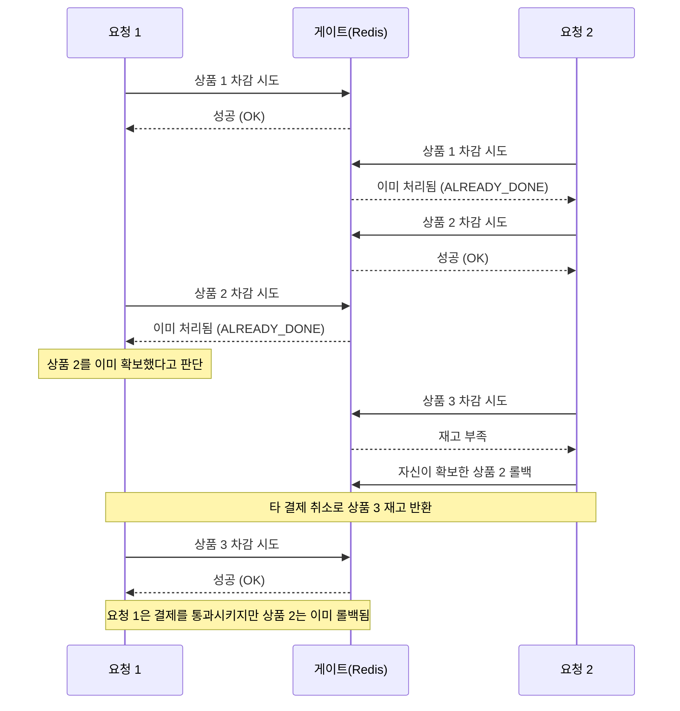
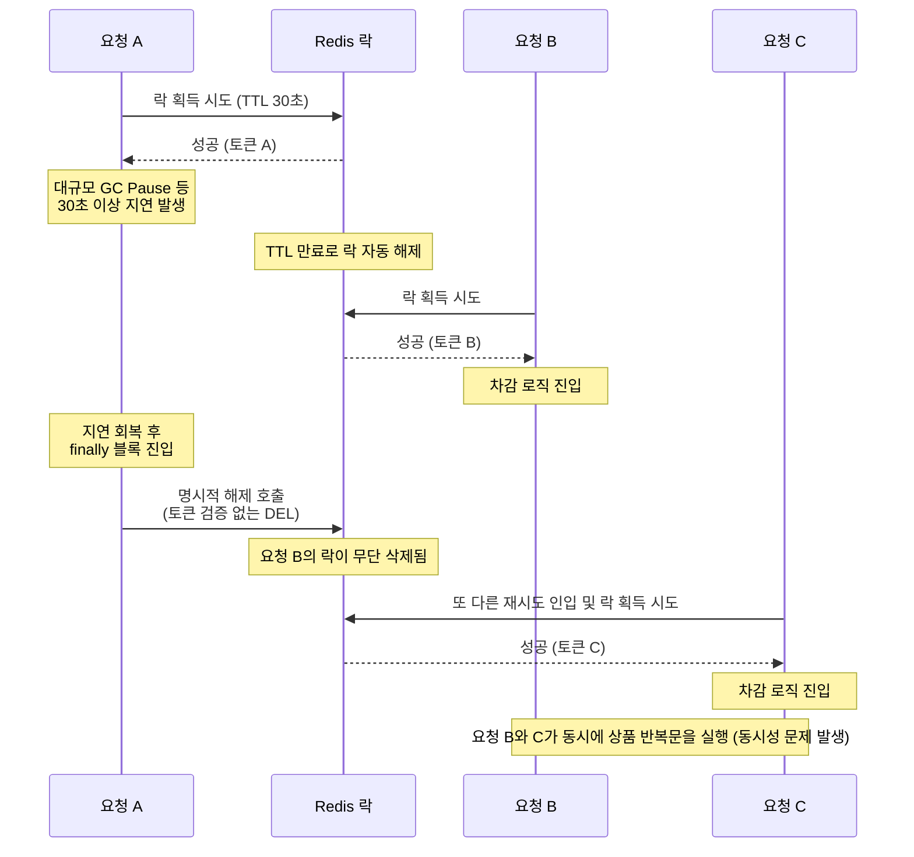
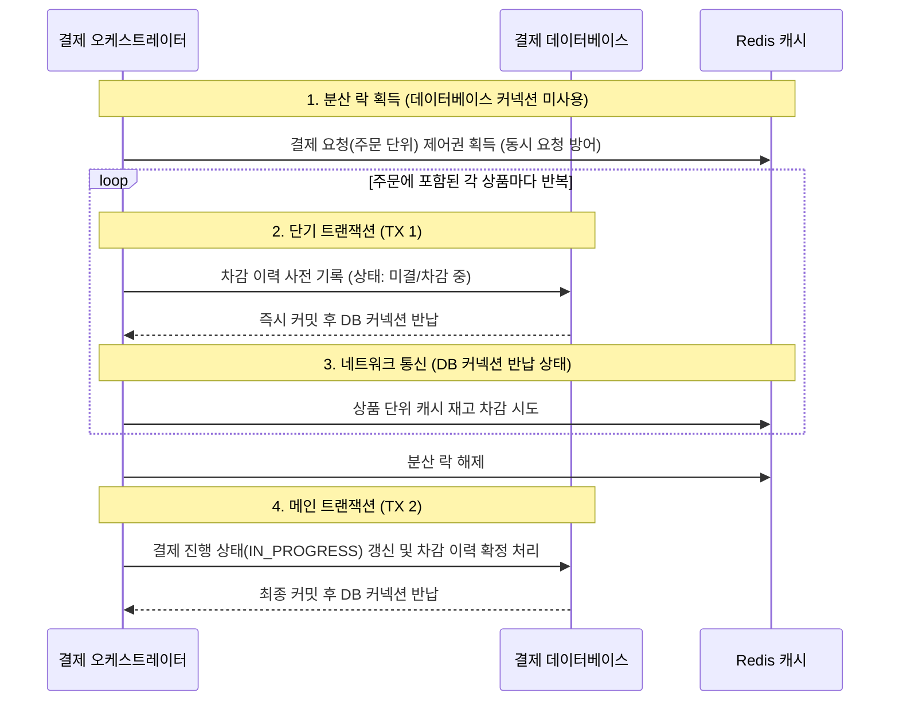
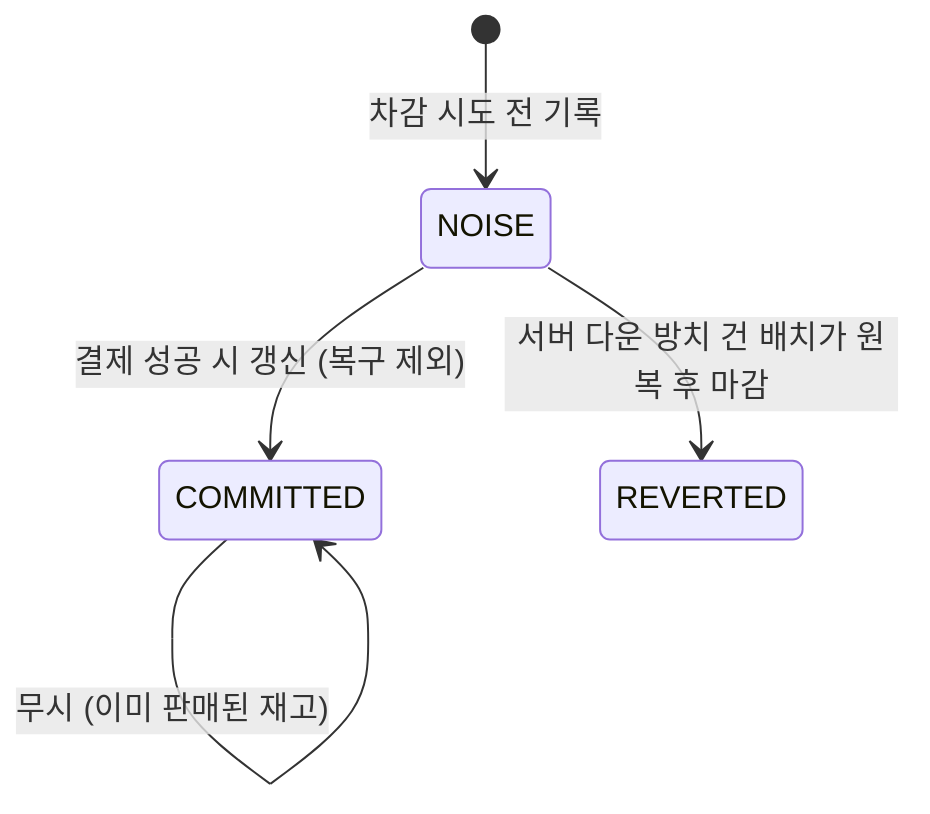
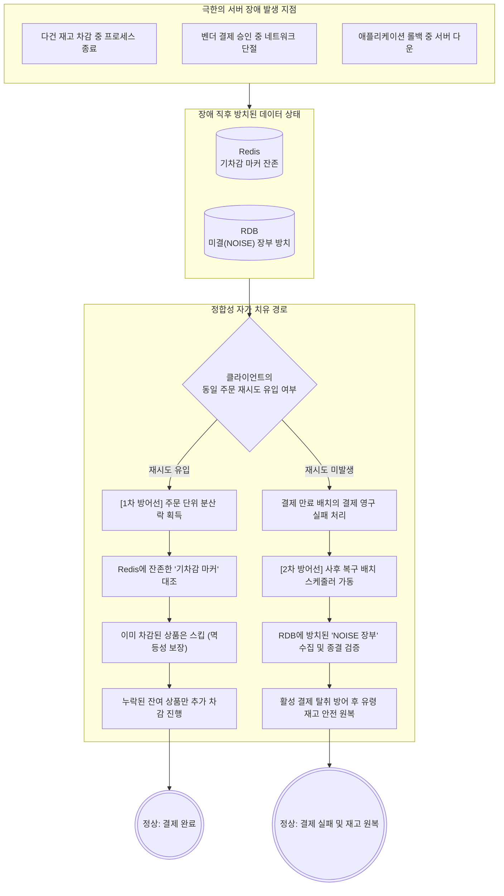
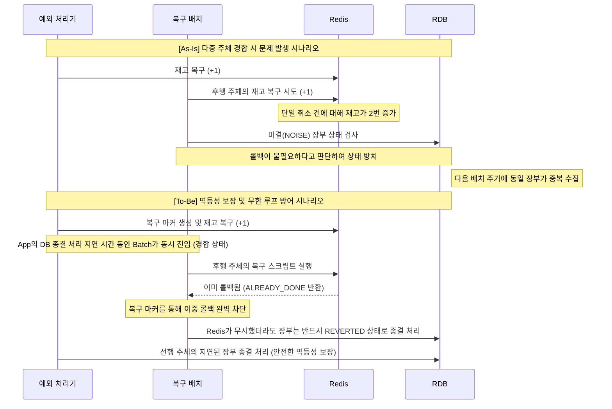

> 실행 환경: Java 21, Spring Boot 3.4.4, MySQL 8.0, Kafka (KRaft), Redis, Docker Compose

## 도입

MSA 전환 이후 결제 서비스와 상품 서비스는 서로 다른 데이터베이스를 사용한다.

- 재고 잔고는 상품 서비스에서 관리
- 외부 벤더 (PG) 승인이 완료된 결제만 최종적으로 재고를 차감

이 분리된 구조에서는 외부 벤더 승인 과정의 네트워크 지연이 문제가 된다.

- 승인 왕복에 길게는 수 초가 소요
- 대기 시간 동안 동일 상품에 대한 다른 결제 요청이 지속적으로 유입
- 실제 잔고는 승인 시점에 감소하므로, 그 사이 초과 판매가 발생할 위험 존재

초과 판매를 막기 위해 결제 진입 시점에 Redis 캐시에서 재고를 미리 빼두는 '선차감 게이트'를 구축했다.



### 결제 상태 정의

시스템 내에서 결제는 다음 세 가지 최종 상태를 가진다.

- 완료: 벤더 승인이 나고 실제 재고 잔고까지 차감된 상태
- 실패: 벤더가 거절했거나 선차감 단계에서 재고가 부족해 거절된 상태
- 만료: 완료나 실패로 전이되지 못한 채 일정 시간이 지나 시스템 배치가 강제 종료한 결제

## 기존 구현: 스크립 하나로 전체 처리

초기 구조에서는 Redis Lua 스크립트 하나가 주문에 담긴 모든 상품의 재고를 원자적으로 처리했다.

- 단일 스레드로 동작하는 Redis 특성상 스크립트 실행 중에는 다른 명령이 끼어들 수 없음
- 검증과 차감이 하나의 트랜잭션처럼 동작

```lua
-- 결제 단위 재고 선차감 스크립트
-- KEYS[1]       = decrement:done:{orderId}  (차감 완료 마커)
-- KEYS[2..N+1]  = stock:{productId}         (N개 상품 재고 키)
-- ARGV[1..N]    = 차감 수량 N개
-- ARGV[N+1]     = 마커 수명 (초, P8D = 691200)

local dedup_key = KEYS[1]
local n = #KEYS - 1

-- 1. 중복 요청 차단 (마커 선점)
local set_result = redis.call('SETNX', dedup_key, '1')
if set_result == 0 then
    return 'ALREADY_DONE'
end
redis.call('EXPIRE', dedup_key, tonumber(ARGV[n + 1]))

-- 2. 모든 상품 재고 검증
for i = 1, n do
    local stock = tonumber(redis.call('GET', KEYS[i + 1]) or '0')
    if stock < tonumber(ARGV[i]) then
        redis.call('DEL', dedup_key)  -- 재시도 가능하게 표시 삭제
        return 'INSUFFICIENT'
    end
end

-- 3. 전체 차감 실행
for i = 1, n do
    redis.call('DECRBY', KEYS[i + 1], ARGV[i])
end

return 'OK'
```

이 접근 방식은 두 가지 강력한 보장을 제공했다.

- 원자성 보장: 상품 중 하나라도 재고가 부족하면 어떠한 데이터도 변경하지 않음
- 동시성 제어: 주문 ID를 키로 사용하는 마커 (`decrement:done`)를 통해 동일 주문의 중복 요청을 즉시 차단

결제가 실패하여 차감했던 재고를 복구할 때도 별도의 복구 완료 마커 (`compensation:done`)를 남겨 동일 주문에 대한 중복 롤백을 방지했다.

## 문제 인식: Redis 샤딩 제약

단일 Redis 인스턴스에서는 효율적인 방식이나, 클러스터 환경으로 확장할 경우 구조적 한계에 부딪힌다.

- Redis Cluster는 데이터를 여러 노드의 해시 슬롯으로 분산 저장
- Lua 스크립트 내부에서 접근하는 모든 키는 동일한 슬롯에 존재해야 실행 가능
- 기존 방식은 주문 내 여러 상품의 키를 동시에 참조하므로, 키들이 서로 다른 슬롯에 흩어질 확률이 높음

키의 특정 부분을 중괄호로 묶는 해시태그 (`{}`) 기능을 활용하여 연관된 키들을 같은 슬롯에 모으기 위한 기준을 결정해야 했다.

|  기준  |                           장점                            |                              단점                               |
|:------:|:---------------------------------------------------------:|:---------------------------------------------------------------:|
|  주문  |          주문 전체를 스크립트 한 번에 처리 가능           | 같은 상품의 재고가 여러 주문 슬롯으로 파편화되어 총량 관리 불가 |
| 사용자 |               특정 사용자 트래픽 분산 용이                |         동일 상품 재고 관리가 분산되어 정합성 유지 불가         |
|  상품  | 단일 상품의 재고 데이터를 한 곳에서 일관성 있게 관리 가능 |    여러 상품이 포함된 주문을 스크립트 하나로 처리할 수 없음     |

재고의 근본적인 정합성을 지키기 위해서 상품을 기준으로 슬롯을 할당하는 방법을 채택하였다.

## 트레이드오프와 원칙 설정

상품 단위로 차감 스크립트를 분리하면, 중간 단계에서 실패가 발생할 수 있다.

- 상품 A, B는 차감에 성공했으나 상품 C에서 재고 부족 발생 시 결제는 거절
- 이 때 게이트에는 롤백 전까지 상품 A와 B의 차감 기록이 잔존
- 스크립트가 알아서 해주던 부분 실패 롤백을 애플리케이션 로직으로 직접 구현 필요

부분 실패 시 발생하는 오차의 수용 여부를 결정하기 위해 게이트의 역할을 재정의했다.

- 미회수 차감이 남으면 실제 잔고보다 게이트 재고가 적게 표시됨
- 과소 평가 오차: 판매 가능한 물건을 일시적으로 못 파는 기회비용으로 한정
- 과대 평가 오차: 실제 재고를 초과하여 판매하게 되므로 절대 허용 불가
- 오차의 회복: 롤백되지 않은 차감분은 추후 백그라운드 배치를 통해 복구

이 전제를 바탕으로 정합성 훼손을 원천 차단하고 일시적인 과소 평가 오차를 수용하는 방향으로 수정했다.

## 구조 개편: 상품 단위 분할

상품 번호 (`productId`)를 해시태그로 감싸, 단일 상품과 관련된 키가 항상 동일한 슬롯에 배치되도록 구성을 변경했다.

|                   키                    |                         용도                          |
|:---------------------------------------:|:-----------------------------------------------------:|
|           `stock:{productId}`           |           해당 상품의 남은 게이트 재고 잔량           |
|  `decrement:done:{productId}:orderId`   | 특정 주문이 해당 상품을 차감했음을 증명하는 완료 마커 |
| `compensation:done:{productId}:orderId` | 특정 주문이 해당 상품을 복구했음을 증명하는 완료 마커 |

Lua 스크립트 역시 한 번에 하나의 상품만 다루도록 축소했다.

```lua
-- 상품 단위 재고 선차감 스크립트
-- KEYS[1] = decrement:done:{productId}:orderId
-- KEYS[2] = stock:{productId}
-- ARGV[1] = 차감 수량 / ARGV[2] = 마커 수명(초)

local dedup_key = KEYS[1]
local stock_key = KEYS[2]
local qty = tonumber(ARGV[1])

local set_result = redis.call('SETNX', dedup_key, '1')
if set_result == 0 then
    return 'ALREADY_DONE'
end
redis.call('EXPIRE', dedup_key, tonumber(ARGV[2]))

local stock = tonumber(redis.call('GET', stock_key) or '0')
if stock < qty then
    redis.call('DEL', dedup_key)
    return 'INSUFFICIENT'
end

redis.call('DECRBY', stock_key, qty)
return 'OK'
```

이제 애플리케이션 코드가 주문에 포함된 상품 목록을 순회하며 차감 스크립트를 개별적으로 호출한다.

- 도중에 재고 부족 등 예외가 발생하면 즉각 순회를 중단
- 순회가 멈춘 시점까지 성공적으로 차감된 상품들만 역순으로 롤백 스크립트 호출

```java
private StockDecrementResult decrementEachProduct(String orderId, List<PaymentOrder> paymentOrderList) {
    List<PaymentOrder> decrementedThisCall = new ArrayList<>();

    for (PaymentOrder order : paymentOrderList) {
        StockDecrementAtomicResult result = stockCachePort.decrementAtomic(orderId, order);

        if (result == StockDecrementAtomicResult.INSUFFICIENT) {
            rejectDecrementedProducts(orderId, decrementedThisCall);
            return StockDecrementResult.REJECTED;
        }

        if (result == StockDecrementAtomicResult.OK) {
            decrementedThisCall.add(order);
        }
    }
    return StockDecrementResult.SUCCESS;
}
```

결과적으로 단일 스크립트가 통제하던 보장 사항들이 애플리케이션 로직으로 분산 이관되었다.

| 기존 스크립트의 보장 범위 |            변경 후 애플리케이션 처리 방식             |
|:-------------------------:|:-----------------------------------------------------:|
|     원자적 전체 차감      | 개별 반복 호출 및 예외 발생 시 애플리케이션 주도 롤백 |
|      동시 요청 제어       |       주문 단위 분산 락(Lock)을 통한 진입 제어        |
|     롤백 완결성 보장      |   미결 기록 기반의 비동기 백그라운드 복구 배치 도입   |

하단 섹션에서는 이관된 기능 중 동시성 제어와 사후 복구를 애플리케이션 단에서 어떻게 재구현했는지 구체적으로 다룬다.

## 동시성 제어 복원: 주문 단위 락

기존 구조에서는 락 (Lock) 없이도 차감 마커 하나를 선점하는 행위가 동일 주문의 중복 요청을 완벽히 통제했지만, 상품 단위 분할로 더이상 보장하지 못하게 됐다.



요청 1은 모든 상품 확보에 성공했다고 간주하여 결제를 속행하지만, 게이트 상에서 상품 2의 재고는 요청 2의 롤백으로 인해 이미 반환된 상태가 된다.

- 반환된 상품 2의 재고를 제3의 사용자가 구매하게 되면 초과 판매 발생
- 동일한 결제 건에 대해 요청 2는 사용자에게 거절을 응답하고 요청 1은 결제를 진행하는 불일치 결과 발생

이 결함을 제거하기 위해 상품 순회를 시작하기 전 주문 식별자 기반의 락 선점 로직을 도입했다.

```java
public StockDecrementResult decrementStock(String orderId, List<PaymentOrder> paymentOrderList) {
    Optional<String> lockToken = stockCachePort.acquireOrderLock(orderId);
    if (lockToken.isEmpty()) {
        return StockDecrementResult.ALREADY_PROCESSING;
    }
    try {
        return decrementEachProduct(orderId, paymentOrderList);
    } finally {
        stockCachePort.releaseOrderLock(orderId, lockToken.get());
    }
}
```

락 획득에 실패한 요청은 결제 상태를 오염시키지 않고 즉시 `ALREADY_PROCESSING`을 반환하며 물러난다.

- 이 결과를 일반 재고 부족 거절과 동일하게 취급하면, 앞선 정상 요청의 결제 상태가 실패로 덮어씌워질 위험 존재
- 거절과 실패를 명확히 구분하는 별도 상태로 정의하여 분기 처리

락 해제 시에는 선점 당시 발급받은 토큰이 동일한지 검증하는 스크립트를 사용한다.

```lua
if redis.call('GET', lock_key) == token then
    return redis.call('DEL', lock_key)
else
    return 0
end
```

토큰 검증이 누락될 경우 락 타임아웃과 맞물려 재고 정합성 문제가 발생한다.



동시다발적으로 반복문이 순회되면서 동시성 문제가 발생하는 것을 원천 차단하기 위해 발급받은 고유 토큰 (UUID) 대조 방어 로직을 스크립트에 반드시 포함했다.

### 2중 방어 체계: 중복 및 재시도 요청 차단

재시도 요청이 유입되어 새로운 UUID를 발급받더라도, 2중 방어 체계를 통해 중복 차감을 차단한다.

#### 1단계: 주문 락 (동시 진입 차단)

락의 키 (Key)는 주문 번호이며, UUID는 값 (Value)으로 할당한다.

- 진입 차단: 같은 주문에 대한 재시도 요청이 와도 키가 이미 점유되어 있어 락 획득 실패
- UUID 역할: 락을 풀 때 본인의 락만 해제할 수 있도록 검증하는 서명

#### 2단계: Dedup 마커 (완료 후 재진입 차단)

선행 요청이 완료되어 락이 풀린 뒤 재시도 요청이 들어오면 락을 통과하지만, 차감 스크립트 내부의 멱등성 검증에 가로막힌다.

```lua
local dedup_key = KEYS[1]  -- decrement:done:{productId}:{orderId}

if redis.call('SETNX', dedup_key, '1') == 0 then
    return 'ALREADY_DONE'
end
```

- 선행 요청 처리 시 남긴 완료 마커 (Dedup)로 인해 후행 요청의 `SETNX` 검사 실패
- 재고 차감 없이 안전하게 종료

## 사후 복구: 서버 다운 및 네트워크 단절 대비

애플리케이션이 직접 롤백을 수행하는 구조는 프로세스 강제 종료나 네트워크 단절 발생 시 심각한 상태 불일치를 유발한다.

- 상태 불일치: Redis 차감은 성공했으나 데이터베이스에 결과를 기록하기 직전 서버가 다운되면 결제는 미완료 상태로 방치
- 고아 재고 발생: 롤백을 실행해야 할 애플리케이션 스레드가 증발하면 해당 재고는 복구되지 못한 상태로 유지

이러한 유실을 막기 위해 차감 시도 전 데이터베이스에 미결 상태 레코드를 먼저 기록하고, 백그라운드 스케줄러가 남은 고아 내역을 찾아 회수하는 2차 방어선을 구축했다.

### 아키텍처 요약: 트랜잭션 생명주기와 자원 효율화

세부 구현을 살펴보기 앞서 1차 방어선 (Redis 락)과 2차 방어선 (데이터베이스 미결 기록)이 결합된 전체 트랜잭션 생명주기를 요약하면 다음과 같다.



트랜잭션 구간을 분리한 구조는 다음 아키텍처 이점을 제공한다.

- 사후 복구 보장: Redis 통신 중 프로세스가 종료되더라도 디스크에 선행 커밋된 미결 레코드를 근거로 스케줄러가 누락된 롤백 수행
- 커넥션 점유 최소화: `TX 1 커밋 및 반납 -> Redis I/O -> TX 2 커밋 및 반납` 순서로 외부 통신 지연이 데이터베이스 커넥션 풀에 미치는 영향 차단

### 추적 기록을 Redis가 아닌 RDB에 남기는 이유

차감 연산은 초고속 인메모리인 Redis에 위임하면서도, 의도와 결과의 기록 (Log)은 영속성이 보장되는 데이터베이스에 남긴 데에는 다음과 같은 공학적 근거가 있다.

- 분산 트랜잭션 회피: 추후 PG사 승인이 완료될 때, 결제 최종 상태 (DONE) 갱신과 장부 확정 (COMMITTED) 처리를 동일한 트랜잭션으로 묶어 원자성을 보장
- 단일 진실 공급원 (SSOT): 사후 복구에 필요한 결제 최종 상태를 외부 네트워크 조회 없이 일관되게 확인 가능

이러한 설계 원칙에 따라 데이터베이스에 기록되는 레코드의 구조는 다음과 같다.

```sql
CREATE TABLE stock_hold_record
(
    id         BIGINT       NOT NULL AUTO_INCREMENT,
    order_id   VARCHAR(100) NOT NULL,
    product_id BIGINT       NOT NULL,
    quantity   INT          NOT NULL,
    status     VARCHAR(20)  NOT NULL,
    UNIQUE INDEX uk_stock_hold_record_order_product (order_id, product_id),
    INDEX idx_stock_hold_record_status (status)
);
```

특정 주문에 포함된 개별 상품마다 하나의 행이 생성되며, 클라이언트 재시도로 인해 동일 내역이 중복 기록되지 않도록 복합 유니크 키 (`order_id`, `product_id`)를 설정했다.

| 상태 |   식별 값   |                            의미                             |
|:----:|:-----------:|:-----------------------------------------------------------:|
| 미결 |   `NOISE`   |       차감 시도 직전 데이터베이스에 기입한 초기 상태        |
| 복구 | `REVERTED`  | 정상적으로 롤백이 수행되었거나 롤백할 내역이 없어 닫힌 상태 |
| 확정 | `COMMITTED` |        벤더 승인이 완료되어 실제 매출로 이어진 상태         |

상태의 전이는 결제의 성공 및 시스템 장애 여부에 따라 두 가지 명확한 경로로 갈라진다.

### 정상 결제 흐름 (Success Path)

결제가 무사히 벤더 승인까지 마치면 결제 완료 트랜잭션과 함께 장부 상태가 확정된다.

- 차감 전: `NOISE` 상태로 초기 기록됨
- 결제 완료: `COMMITTED` 상태로 갱신되며 사후 복구 대상에서 영구히 배제됨

### 시스템 장애 및 사후 복구 흐름 (Recovery Path)

결제 도중 서버가 다운되면 장부는 `COMMITTED`로 전이되지 못하고 `NOISE` 상태로 방치되며, 스케줄러가 이를 발견하여 다음 순서로 원복을 수행한다.

1. 타겟 수집: 상태가 `NOISE`인 레코드를 데이터베이스에서 조회
2. 종결 검증: 해당 결제가 완전히 실패하거나 만료되었는지 확인 (진행 중인 결제의 재고를 탈취하는 초과 판매 방지)
3. 재고 원복: 검증을 통과하면 Redis에 접근해 차감되었던 `quantity`만큼 재고 잔량 복구
4. 장부 마감: 복구가 끝난 레코드는 `REVERTED` 상태로 닫아 이중 복구를 차단



### 사후 복구 정합성을 지키는 세부 제어 기법

기본 상태 전이 흐름이 분산 환경에서 안전하게 동작하도록 다음 세 가지 방어 로직을 추가로 적용했다.

- 불필요 롤백 차단: 결제 성공 시 메인 트랜잭션 내에서 장부를 `COMMITTED`로 확정하여, 배치가 기판매 재고를 롤백하는 현상을 원천 배제
- 스케줄러 모니터링: 배치 구동 카운터와 미결 잔량 게이지를 지표로 구성하여 복구 지연 현상을 시각화

## 서버 크래시 시나리오 수렴 검증

어느 지점에서 장애가 발생하더라도 시스템은 두 개의 방어선을 통해 정상 상태를 회복할 수 있게 됐다.

- 1차 방어선: 주문 단위 분산 락
- 2차 방어선: 미결 레코드 기반 사후 복구 로직



클라이언트의 자동 재시도와 백그라운드 배치가 경합하거나 연쇄 장애가 발생하더라도, 각 방어선에 내장된 안전장치를 통해 정합성이 완벽히 유지된다.

- 클라이언트의 동일 주문 재시도 유입 시 (1차 방어선 작동)
    - 네트워크 지연 등으로 동일한 `order_id` 요청이 다시 유입될 경우, Redis의 과거 차감 마커를 대조하여 멱등성 보장
    - 이미 차감된 상품은 안전하게 건너뛰고 누락된 상품만 추가 차감하여 결제 완료
- 재시도 미발생 및 결제 만료 시 (2차 방어선 작동)
    - 클라이언트가 이탈하여 활성 결제가 타임아웃 처리되면, 초과 판매를 막기 위해 결제의 최종 실패 여부를 선제 검증
    - 검증을 통과한 미결 상태 (`NOISE`)의 유령 재고만 찾아내어 안전하게 원복
- 복구 도중 연쇄 장애 발생 시
    - 롤백 중 서버가 다시 다운되더라도 DB의 장부 상태가 닫히지 않고 열려 있음
    - 데이터베이스 영속성에 의해 다음 배치 주기에 누락 없이 재조회되어 복구를 완수

다양한 장애 지점에 대한 시스템의 최종 수렴 경로는 다음과 같다.

|         장애 시나리오          |              직면한 시스템 상태               |                          최종 수렴 경로                          |
|:------------------------------:|:---------------------------------------------:|:----------------------------------------------------------------:|
|   다건 차감 중 프로세스 종료   |   일부 상품만 Redis에서 차감된 채 결제 중단   |  결제 타임아웃 처리 후 2차 방어선(배치)이 기차감분을 찾아 회수   |
| 애플리케이션 롤백 중 서버 다운 | 예외 발생 후 롤백 스레드가 증발하여 원복 중단 | 원복되지 못한 재고가 미결 장부에 남아 다음 배치 주기에 일괄 회수 |
|    사후 복구 스케줄러 다운     |   2차 방어선이 중지되어 유령 재고가 방치됨    |     RDB 영속성에 기반하여 스케줄러 재기동 시 누락 없이 회수      |

## 구현 중 발생한 트러블슈팅

### 장부 재오픈 순서와 데드락

장부는 동일한 조합에 대해 한 행만 유지하므로, 데이터가 없으면 삽입하고 있으면 상태를 갱신하는 방식으로 구현했다.

- 초기에는 갱신 (Update)을 시도하고 대상이 없으면 삽입 (Insert)하는 순서로 작성
- 갱신 대상이 없을 경우 0건 처리와 함께 갭 락 (Gap Lock)을 점유
- 이후 삽입을 시도할 때 이미 점유한 갭 락과 삽입 의도 락 (Insert Intention Lock)이 충돌
- 동시 다발적인 트랜잭션이 서로 갭 락을 쥔 채 대기하며 데드락 유발

이를 해결하기 위해 삽입을 먼저 시도하도록 순서를 변경했다.

```java
public String openHold(String orderId, PaymentOrder paymentOrder) {
    // ...
    Optional<String> inserted = tryInsertAsNoise(orderId, productId, quantity);
    if (inserted.isPresent()) {
        return inserted.get();
    }

    Optional<String> reopened = tryReopenAsNoise(orderId, productId, quantity);

    // ...
}
```

- 데이터가 없을 때의 삽입은 갭 락 없이 단일 레코드 락만 점유하여 충돌 회피
- 삽입이 유일 키 제약조건 위반으로 실패하면 대상 행이 존재한다는 의미이므로, 이후의 갱신은 갭 락 없이 수행됨

### 다중 복구 주체 경합 방어

사후 복구 배치와 애플리케이션 예외 처리기가 동시에 롤백을 시도할 경우 다음과 같은 두 가지 결함이 발생할 수 있다.

- 이중 롤백 문제: 단일 취소 건에 대해 다수의 주체가 재고를 증가시켜 총 재고 초과 복구
- 무한 루프 문제: 롤백이 이미 완료된 사실을 인지하더라도 DB 장부를 닫지 않으면, 스케줄러가 해당 건을 영구적으로 재수집

결함을 해결하기 위해 Redis 멱등성 마커와 RDB 장부 종결 처리를 결합한 이중 방어선을 구축했다.



- Redis 방어선: 복구 시 `compensation:done` 마커를 검증하여, 마커가 존재할 경우 재고 증가를 무시하고 `ALREADY_DONE` 반환
- RDB 방어선: Redis로부터 `ALREADY_DONE`을 반환받더라도 예외를 발생시키지 않고 반드시 DB 장부를 `REVERTED` 상태로 종결하여 미결 상태 해소

## 회고

단일 분산 락에 의존하던 아키텍처를 개편하여, 1·2차 방어선이 독립적으로 정합성을 맞추는 유연한 구조를 완성했다.

- 복구: 클라이언트 재시도 (1차)와 사후 복구 배치 (2차)를 결합해 자가 복구 시스템 구축
- 동시성 제어: Redis 멱등성 마커와 RDB 종결 처리로 다중 주체의 롤백 경합 제어

### 현재 한계점

견고한 방어선을 구축하기 위해 단일 스크립트에 의존하던 로직을 여러 단계로 쪼개면서, 애플리케이션과 Redis 간의 통신 횟수가 구조적으로 증가하는 단점이 발생했다.

- 잦은 네트워크 왕복: 재고 차감, 마커 생성, 상태 검증 등이 개별적인 요청으로 분리되어 주문당 발생하는 Redis 통신 (Round-Trip) 비용 크게 증가함
- 레이턴시 (Latency) 누적: 여러 번의 네트워크 I/O가 동기적으로 실행되며 전체적인 결제 처리 지연 시간에 영향을 미침

현재 아키텍처에서는 이러한 오버헤드 증가를 시스템의 장애 복원력을 얻기 위한 합리적인 트레이드오프로 수용했으며, 부하 테스트를 거쳐 구조적인 최적화 필요 여부를 점검할 예정이다.

### 개선 방향

이후 부하 테스트 등을 거쳐 병목이 확인된다면 다음과 같은 튜닝 기법을 Next Step으로 고려해 볼 수 있다.

- 미결 장부 Bulk Insert 및 트랜잭션 병합 적용
    - 현재는 루프 내에서 상품마다 DB 커넥션을 맺고 단건 INSERT (TX 1)를 수행함
    - 이를 개선하여, 루프 진입 전 주문에 담긴 모든 상품의 미결 레코드 (NOISE)를 1번의 Bulk Insert로 밀어 넣는 방식으로 흐름을 개편함
- 개선된 프로세스 흐름
    - Redis 분산 락 획득 (주문 단위)
    - 단기 트랜잭션 (TX 1): 전체 상품 차감 이력을 미결 상태로 한 번에 Bulk Insert 후 커넥션 반납
    - Redis 네트워크 통신: 개별 상품 캐시 차감 (실패 시 기차감분 롤백 및 에러 반환)
    - 메인 트랜잭션 (TX 2): 결제 상태 확정 및 커넥션 반납
    - Redis 분산 락 해제
