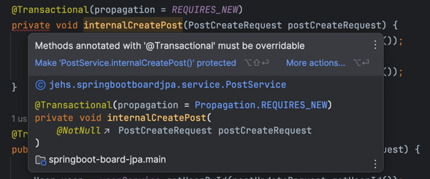

> 실행 환경: Java 17, Spring Boot 3.1.5, MySQL 8.0.33

Spring에서는 `@Transactional`을 통해 트랜잭션을 관리할 수 있으며, 이를 통해 트랜잭션을 쉽게 사용할 수 있다.
`@Transactional`을 통한 선언적 트랜잭션 관리 방식을 사용하면 프록시 방식의 AOP가 적용되는데 그로 인해 아래와 같은 특징을 가지게 된다.

- `@Transactional` 애노테이션이 특정 클래스나 메서드에 하나라도 있으면 트랜잭션 AOP는 프록시를 만들어 스프링 컨테이너에 등록
- 실제 객체 대신에 프록시를 스프링 빈에 등록한 뒤 프록시는 실제 객체를 참조
- 만약 다른 곳에서 해당 객체를 의존관계 주입을 요청하게 되면 스프링 컨테이너에서 실제 객체 대신에 등록되어 있던 프록시 객체를 주입
- 최종적으로 `다른 객체` -> `실제 객체` -> `프록시 객체` 순으로 의존관계가 주입되게 됨

결국 요청을 받게되면 아래와 같이 트랜잭션이 동작하게 된다.

1. 프록시 객체가 요청을 먼저 받음
2. 프록시 객체에서 트랜잭션 시작
3. 프록시 객체에서 실제 객체의 메서드 호출
4. 실제 객체 로직 수행
5. 프록시 객체에서 트랜잭션 커밋 또는 롤백

## 자기 호출(Self Invocation)

`@Transactional` 선언 방식은 프록시 객체를 통해 수행되는데, 만약 프록시 객체를 거치지 않고 대상 객체를 직접 호출하게 되면 트랜잭션이 적용되지 않는다.
보통의 경우는 프록시 객체를 거치기 때문에 문제가 되지 않지만, 대상 객체 내부에서 메서드 호출을 하게 되면 프록시를 거치지 않게 되어 위의 문제가 발생할 수 있다.

```java

@Service
@RequiredArgsConstructor
public class PostService {

    private final PostRepository postRepository;
    private final UserService userService;
    private final EntityManager entityManager;

    public void externalCreatePost(PostCreateRequest postCreateRequest) {
        internalCreatePost(postCreateRequest);
    }

    @Transactional
    public void internalCreatePost(PostCreateRequest postCreateRequest) {
        User user = userService.getUserById(postCreateRequest.getUserId());
        postRepository.save(postCreateRequest.toEntity(user));

        System.out.println(entityManager.isJoinedToTransaction()); // false
        if (true) {
            throw new RuntimeException();
        }
    }

}
```

`internalCreatePost` 메서드에 트랜잭션이 선언 되어 있기 때문에 트랜잭션 적용을 기대할 수 있지만,
`externalCreatePost` 메서드를 통해 호출하게 되어 적용되지 않고 다음과 같이 동작하게 된다.

1. 클라이언트에서 프록시 호출
2. 프록시에서 external 메서드에 트랜잭션이 적용되어 있지 않기 때문에 트랜잭션 없이 메서드 호출
3. 실제 `externalCreatePost` 메서드 실행
4. `externalCreatePost` 메서드 내부에서 `internalCreatePost` 메서드 호출
5. 실행 된 `internalCreatePost` 메서드는 실제 객체에서 실행되기 때문에 트랜잭션이 적용되지 않음

실제로 `entityManager.isJoinedToTransaction()`을 통해 트랜잭션이 적용되었는지 확인해보면 적용되지 않았고, DB에도 롤백 없이 데이터가 저장됐다.
단순히 생각했을 때 이 방법을 해결하기 위해서 `externalCreatePost` 메서드에도 `@Transactional`을 추가하여 해결해 볼 수 있을 것이다.

```java

@Service
@RequiredArgsConstructor
public class PostService {

    private final PostRepository postRepository;
    private final UserService userService;
    private final EntityManager entityManager;

    @Transactional // 추가
    public void externalCreatePost(PostCreateRequest postCreateRequest) {
        internalCreatePost(postCreateRequest);
    }

    @Transactional
    public void internalCreatePost(PostCreateRequest postCreateRequest) {
        User user = userService.getUserById(postCreateRequest.getUserId());
        postRepository.save(postCreateRequest.toEntity(user));

        System.out.println(entityManager.isJoinedToTransaction()); // true
        if (true) {
            throw new RuntimeException();
        }
    }
}
```

실제로 위와 같이 `externalCreatePost` 메서드에도 `@Transactional`을 추가하면 트랜잭션이 적용되었고,
`internalCreatePost` 메서드에서 예외가 발생하면 롤백이 되는 것을 확인할 수 있었다.

## [다른 트랜잭션 전파 방식(링크 참고)](https://hyoguoo.gitbook.io/docs/spring/transactional#5.-propagation)

`propagation` 속성을 통해 트랜잭션 전파 방식을 설정할 수 있는데, 그 중 `REQUIRES_NEW` 방식을 사용하면 항상 새로운 트랜잭션을 생성하여 실행하게 된다.
위의 `internalCreatePost` 메서드에 `propagation = REQUIRES_NEW`을 추가했을 때 새로운 트랜잭션을 생셩하여 실행되는지 확인해보자.

```java

@Service
@RequiredArgsConstructor
public class PostService {

    private final PostRepository postRepository;
    private final UserService userService;
    private final EntityManager entityManager;

    @Transactional
    public void externalCreatePost(PostCreateRequest postCreateRequest) {
        System.out.println(entityManager.getDelegate()); // SessionImpl(1985594165<open>)

        internalCreatePost(postCreateRequest);
        // 내부 메서드 종료 후 예외 발생
        if (true) {
            throw new RuntimeException();
        }
    }

    @Transactional(propagation = REQUIRES_NEW) // 새로운 트랜잭션 생성
    public void internalCreatePost(PostCreateRequest postCreateRequest) {
        System.out.println(entityManager.getDelegate()); // SessionImpl(1985594165<open>)

        User user = userService.getUserById(postCreateRequest.getUserId());
        postRepository.save(postCreateRequest.toEntity(user));
        // 정상적으로 메서드 종료
    }
}
```

위와 같이 `internalCreatePost` 메서드에 `propagation = REQUIRES_NEW`을 추가했지만 하나의 트랜잭션으로 실행되고 있었다.
실제 `entityManager.getDelegate()`를 통해 세션을 확인해보면 동일한 세션을 사용하고 있었으며, 모두 롤백 처리 되어 DB에 데이터가 저장되지 않았다.

- `@Transactional` 선언 방식은 프록시 객체를 통해 트랜잭션을 관리하기 때문에 프록시 객체를 거치지 않고 직접 호출하게 되면 트랜잭션이 적용되지 않음
- 때문에 내부에서 호출한 메서드에 `@Transactional`을 추가하더라도 프록시 객체를 거치지 않아 새로운 트랜잭션 정책이 적용되지 않음
- 결국`internalCreatePost` 메서드에 적용된 `REQUIRES_NEW` 정책 뿐만 아니라 `@Transactional` 자체가 무시됨

** `entityManager.getDelegate()`: 현재 사용되고 있는 세션을 확인하는 메서드(같은 세션 == 같은 영속성 컨텍스트 == 같은 트랜잭션)

## Self Invocation 해결 방법

`@Transactional` 선언 방식을 사용하면서 위와 같은 문제를 해결하고 싶다면, 자기 호출을 하지 않도록 다른 클래스를 통해 호출하는 것이 가장 좋은 방법이다.
(`AopContext`나 Self Injection을 통해 자기 호출을 할 수 있지만, 이는 권장되지 않는 방법이다.)

```java
// PostService.java
@Service
@RequiredArgsConstructor
public class PostService {

    private final PostRepository postRepository;
    private final UserService userService;
    private final EntityManager entityManager;
    private final PostServiceInternal postServiceInternal;

    @Transactional
    public void externalCreatePost(PostCreateRequest postCreateRequest) {
        System.out.println(entityManager.getDelegate()); // SessionImpl(1431135451<open>)

        this.postServiceInternal.internalCreatePost(postCreateRequest);
        if (true) {
            throw new RuntimeException();
        }
    }
}

// PostServiceInternal.java
@Service
@RequiredArgsConstructor
public class PostServiceInternal {

    private final PostRepository postRepository;
    private final UserService userService;
    private final EntityManager entityManager;

    @Transactional(propagation = REQUIRES_NEW)
    public void internalCreatePost(PostCreateRequest postCreateRequest) {
        System.out.println(entityManager.getDelegate()); // SessionImpl(460044237<open>)

        User user = userService.getUserById(postCreateRequest.getUserId());
        postRepository.save(postCreateRequest.toEntity(user));
    }
}
```

`PostServiceInternal`을 주입받아 `internalCreatePost` 메서드를 호출하면 정상적으로 새로운 트랜잭션을 생성하는 것을 확인할 수 있다.
`PostService`에서는 예외가 발생하였지만, `internalCreatePost` 메서드는 정상적으로 종료됐기 때문에 DB에 정상적으로 데이터가 저장되었다.
또한 `entityManager.getDelegate()`를 통해 세션을 확인해보면 서로 다른 세션을 사용하고 있음을 확인할 수 있었다.

### 예방 방법

자기 호출에 대한 문제를 인지하고 있었다면 다른 클래스를 통해 호출하면 되지만, 내부 호출을 인지하지 못한다면 의도한대로 트랜잭션이 적용되지 않을 수 있다.
때문에 의도치 않은 자기 호출을 막기 위해서 하위 메서드는 항상 `private`으로 선언하여 외부에서 호출할 수 없도록 하는 것이 좋다.



## REQUIRES_NEW != 독립적인 메서드

위 상황에서 조금 다른 아래와 같은 상황을 생각해보자.

- internalCreatePost 메서드에서 데이터 저장 수행
- externalCreatePost 메서드에서도 데이터 저장 수행
- internalCreatePost 메서드에서 예외 발생

```java
// PostService.java
@Service
@RequiredArgsConstructor
public class PostService {

    private final PostRepository postRepository;
    private final UserService userService;
    private final EntityManager entityManager;
    private final PostServiceInternal postServiceInternal;

    // 먼저 외부에서 호출되는 메서드
    @Transactional
    public void externalCreatePost(PostCreateRequest postCreateRequest) {
        System.out.println(entityManager.getDelegate()); // SessionImpl(1431135451<open>)

        this.postRepository.save(
                postCreateRequest.toEntity(userService.getUserById(postCreateRequest.getUserId()))
        );

        this.postServiceInternal.internalCreatePost(postCreateRequest);
    }
}

// PostServiceInternal.java
@Service
@RequiredArgsConstructor
public class PostServiceInternal {

    private final PostRepository postRepository;
    private final UserService userService;
    private final EntityManager entityManager;

    // PostService의 externalCreatePost 메서드에서 호출되는 메서드
    @Transactional(propagation = REQUIRES_NEW)
    public void internalCreatePost(PostCreateRequest postCreateRequest) {
        System.out.println(
                "get delegate: " + entityManager.getDelegate() // SessionImpl(460044237<open>)
        );

        User user = userService.getUserById(postCreateRequest.getUserId());
        postRepository.save(postCreateRequest.toEntity(user));
        if (true) {
            throw new RuntimeException();
        }
    }
}
```

`internalCreatePost` 메서드를 `REQUIRES_NEW`으로 설정했기 때문에, 두 서비스의 트랜잭션이 독립적으로 실행되길 기대할 것이다.
때문에 `internalCreatePost`에서 예외가 발생하더라도 `externalCreatePost`에서 데이터가 저장될 것으로 예상할 수 있지만 실제론 그렇지 않다.

|     externalCreatePost      |  internalCreatePost  |
|:---------------------------:|:--------------------:|
|        트랜잭션 시작(id 1)        |                      |
|       데이터 저장 수행(id 1)       |                      |
|  internalCreatePost 메서드 호출  |                      |
|                             |  새로운 트랜잭션 생성(id 2)   |
|                             |   데이터 저장 수행(id 2)    |
|                             |        예외 발생         |
|                             | 예외로 인한 트랜잭션 롤백(id 2) |
|                             |    트랜잭션 종료(id 2)     |
| internalCreatePost 예외 전달 받음 |                      |
|    예외로 인한 트랜잭션 롤백(id 1)     |                      |
|        트랜잭션 종료(id 1)        |                      |

원인은 아주 간단하게 전파 받은 예외를 처리하지 않았기 때문인데, 전파 받은 예외를 처리하도록 수정하면 해결할 수 있다.

```java
// PostService.java
@Service
@RequiredArgsConstructor
public class PostService {

    private final PostRepository postRepository;
    private final UserService userService;
    private final EntityManager entityManager;
    private final PostServiceInternal postServiceInternal;

    @Transactional
    public void externalCreatePost(PostCreateRequest postCreateRequest) {
        System.out.println(entityManager.getDelegate()); // SessionImpl(1431135451<open>)

        this.postRepository.save(
                postCreateRequest.toEntity(userService.getUserById(postCreateRequest.getUserId()))
        );

        try {
            this.postServiceInternal.internalCreatePost(postCreateRequest);
        } catch (Exception e) { // 예외 처리 추가
            System.out.println("catch exception");
        }
        // 예외를 처리하게 되면서 트랜잭션 커밋 수행
    }
}
```

## 결론

Self Invocation 문제는 `@Transactional` 선언 방식을 사용할 때 발생할 수 있는 문제로, 내부 호출을 통해 발생할 수 있다.
다양한 해결 방법이 있겠지만, 객체의 책임을 분리하고 외부에서 호출하도록 설계하는 것이 가장 좋은 방법인 것 같다.
또한, `REQUIRES_NEW`는 새로운 스레드를 생성하는 것이 아닌 새로운 트랜잭션을 생성하는 것을 명심해야 한다.

###### 참고

- [Transactional](https://hyoguoo.gitbook.io/docs/spring/transactional)
