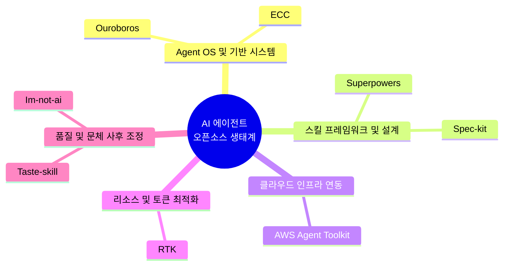

## 배경

다양한 AI 코딩 에이전트가 개발 생태계의 주류 도구로 확산됐고, 더 효율적으로 복잡해지는 시스템을 제어하기 위한 도구들이 많이 등장했다.

---

## 에이전트 도구 생태계 맵

각 에이전트 도구가 여러 가지 등장했고, 목적에 따라 여러 갈래로 나뉘고 있다.

---

## 목적별 주요 저장소 분류

|            카테고리            |                                  저장소                                   |              요약              |                                                주요 특징                                                 |
|:------------------------------:|:-------------------------------------------------------------------------:|:------------------------------:|:--------------------------------------------------------------------------------------------------------:|
|    Agent OS 및 기반 시스템     |             [Q00/ouroboros](https://github.com/Q00/ouroboros)             |       명세 중심 Agent OS       |               단순 프롬프팅에서 벗어나 명세 중심의 재현 가능한 체계적인 개발 프로세스 지향               |
|    Agent OS 및 기반 시스템     |              [affaan-m/ECC](https://github.com/affaan-m/ECC)              |  에이전트 성능 최적화 시스템   |                여러 에이전트에 스킬, 기억력, 보안 기능 등을 통합한 전용 OS 성격의 시스템                 |
| 스킬 프레임워크 및 설계 방법론 |          [obra/superpowers](https://github.com/obra/superpowers)          | 스킬 프레임워크 및 개발 방법론 |     조합 가능한 스킬 세트를 제공해 에이전트들이 보다 일관성 있고 효율적으로 작동할 수 있는 기반 제공     |
| 스킬 프레임워크 및 설계 방법론 |           [github/spec-kit](https://github.com/github/spec-kit)           |      명세 주도 개발 툴킷       |            실제 코드 작성 전 AI 에이전트와 구현할 명세를 명확히 정의하도록 돕는 오픈소스 툴킷            |
|    클라우드 및 인프라 연동     | [aws/agent-toolkit-for-aws](https://github.com/aws/agent-toolkit-for-aws) |     AWS 공식 에이전트 툴킷     | 에이전트가 AWS 클라우드 환경에서 애플리케이션을 직접 구축, 배포, 관리할 수 있도록 지원하는 공식 MCP 서버 |
|     리소스 및 토큰 최적화      |                [rtk-ai/rtk](https://github.com/rtk-ai/rtk)                |    LLM 토큰 절약 CLI 프록시    |           에이전트가 읽는 터미널 출력의 불필요한 내용을 최대 90%까지 필터링해 토큰 소모를 차단           |
|    결과물 품질 및 문체 조정    |      [Leonxlnx/taste-skill](https://github.com/Leonxlnx/taste-skill)      |   프론트엔드 품질 향상 스킬    |      AI가 UI를 생성할 때 진부한 형태를 배제하고 사용자 경험이 뛰어난 디자인 코드를 작성하도록 유도       |
|    결과물 품질 및 문체 조정    |      [epoko77-ai/im-not-ai](https://github.com/epoko77-ai/im-not-ai)      |     한글 AI 문체 교정 스킬     |          원본 내용은 보존하면서 AI 특유의 번역투나 어색한 병렬 구조를 자연스러운 한국어로 윤문           |

---

## 분석 및 인사이트

### 프롬프팅에서 명세 기반 설계로의 전환

- 에이전트에게 구현체 생성을 곧바로 지시하는 기존 방식의 한계를 보완
- 구현과 검증을 격리시켰던 기존 접근법처럼, AI가 임의로 코드를 생산하게 두지 않고 사전 명세를 확고히 합의하는 방향

### 에이전트 인지 부하 감소

- 에이전트는 한 번에 너무 방대한 문맥을 주입받으면 지시의 핵심을 잃어버림
- RTK와 같은 프록시 도구를 활용해 에이전트가 소화할 수 있는 필수 정보만 선별해서 노출함으로써 문제 해결 능력을 개선

### 미시적 품질 통제

- taste-skill이나 im-not-ai 프로젝트는 에이전트가 도출하는 1차 결과물의 조잡함을 사후 보정
- 범용 모델을 세련된 UI 설계나 글쓰기 같은 특정 도메인에 맞춰 튜닝하는 실용적인 방법론

---

## 결론

- 에이전트 워크플로우 설계와 하네스 엔지니어링의 필요성이 구체적인 오픈소스 툴킷 생태계의 등장으로 입증
-프로젝트 성격에 맞는 세분화된 도구들을 결합하여 견고한 에이전트 운영 체제를 선제적으로 구축하는 방식이 중요
