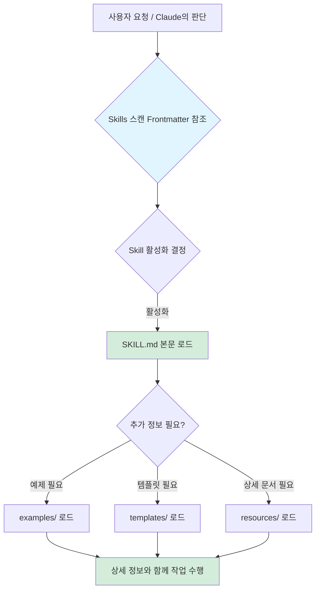
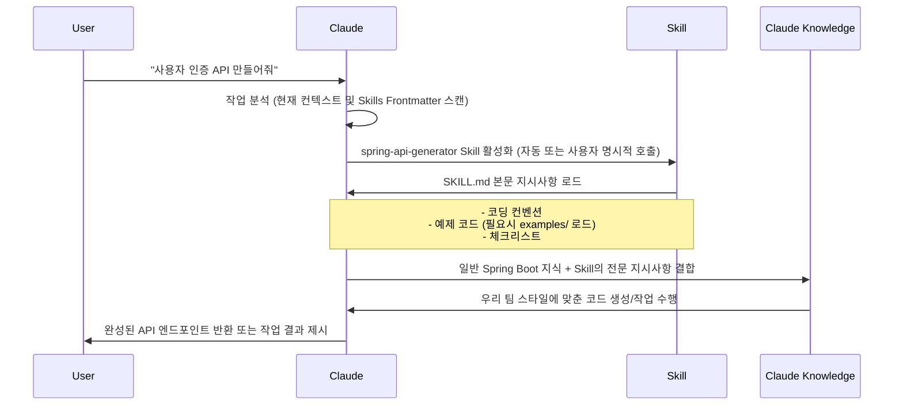
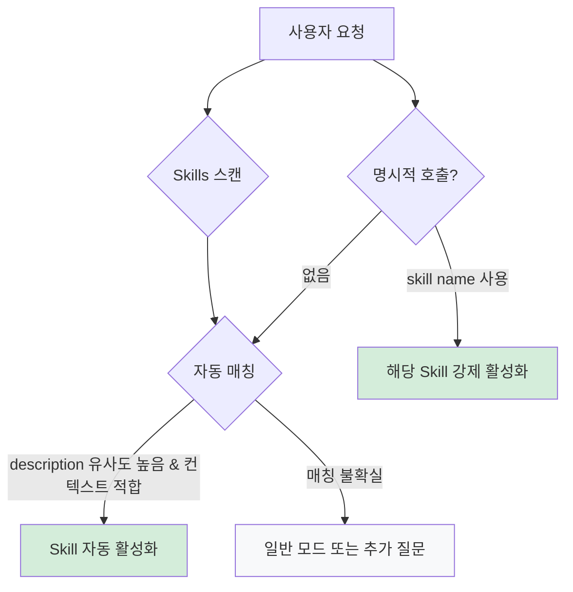
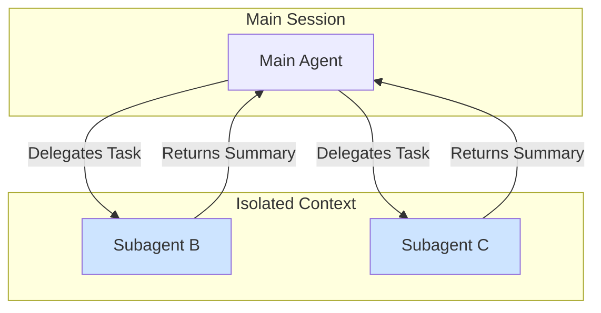
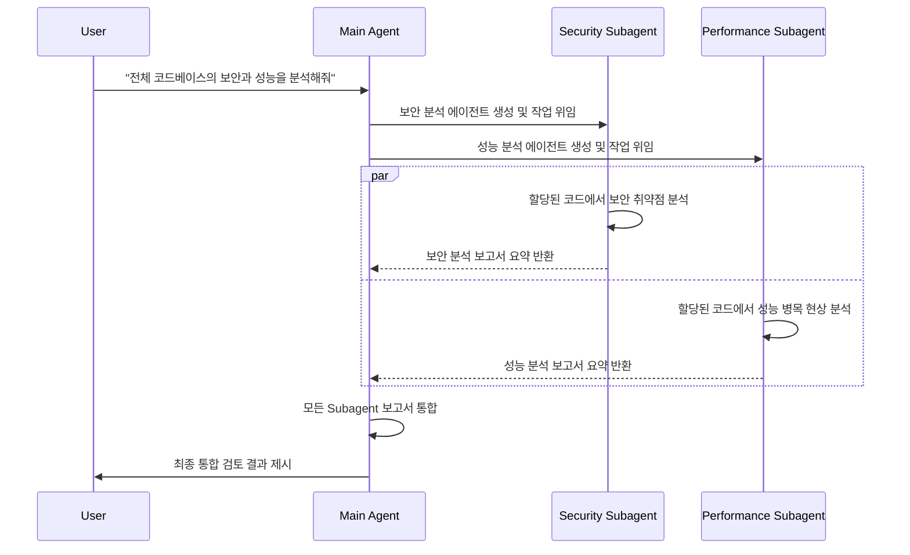

## 1. CLAUDE.md

### 핵심 개념

`CLAUDE.md` 파일은 에이전트의 영구적인 컨텍스트 역할을 하며, 각 세션 시작 시 자동으로 로드되어 AI가 프로젝트 작업을 수행하는 동안 반드시 준수해야 할 아래와 같은 핵심 정보들을 작성하는 것이 좋다.

- 프로젝트의 기본 정보: 프로젝트의 목적, 주요 기능, 아키텍처 개요 등
- 코딩 컨벤션 및 스타일 가이드: 특정 언어, 프레임워크에 대한 코딩 표준, 파일 명명 규칙 등
- 기술 스택: 프로젝트에서 사용되는 주요 라이브러리, 프레임워크, 도구
- 개발 워크플로우: 코드 리뷰 절차, 테스트 전략, 배포 프로세스 등 팀의 고유한 작업 방식
- 도메인 특정 용어: 프로젝트에서 사용되는 전문 용어나 비즈니스 로직과 관련된 개념 정의

`CLAUDE.md`는 AI가 개발자의 의도를 벗어나거나 프로젝트의 기존 규칙을 위반하는 동작을 하지 않도록 한다.

### 동작 방식

- 로드 시점: Claude Code 세션이 시작될 때 (CLI, IDE 확장 등 모든 환경에서) 시스템 프롬프트 이후 가장 먼저 로드
- 컨텍스트 비용: `CLAUDE.md`는 항상 로드되므로, AI의 전체 컨텍스트 윈도우에서 차지하는 비중이 커져 토큰 비용이 증가하고 다른 중요한 정보가 밀려날 위험 존재
- 계층 구조: Claude Code는 현재 작업 디렉토리부터 시작하여 상위 디렉토리로 이동하며 발견되는 모든 `CLAUDE.md` 파일을 계층적으로 로드
    - 이를 통해 모노레포(monorepo)와 같이 여러 하위 프로젝트가 존재하는 경우, 각 프로젝트의 특정 규칙과 상위 프로젝트의 공통 규칙을 함께 적용 가능

### 작성 및 활용 권장사항

`CLAUDE.md`의 효율적인 활용을 위해 다음 권장사항을 따르는 것이 좋다.

- 간결성 유지: 토큰 비용 및 AI의 집중도를 고려하여 `CLAUDE.md`는 약 500줄 이하로 간결하게 유지하는 것이 이상적
- 게이트웨이 역할: `CLAUDE.md`를 모든 지식을 담는 것 대신, 프로젝트의 다른 중요한 문서나 컨벤션이 위치한 곳을 안내하는 목차 역할로 활용
    - 상세한 코딩 가이드는 `docs/coding-style.md`와 같은 별도의 파일에 두고, `CLAUDE.md`에서는 해당 파일의 존재와 중요성만 언급하여 컨텍스트를 절약
- Skill 분리: 필요할 때만 참조하는 상세한 정보, 복잡한 워크플로우, 특정 도메인 전문 지식 등은 'Skills'로 분리하여 관리
- 생성 및 관리: `CLAUDE.md` 파일은 수동으로 작성할 수도 있고, Claude Code가 프로젝트 디렉토리를 스캔하여 초기 버전을 생성 가능
    - 프로젝트의 변화에 맞춰 주기적으로 업데이트하고 관리하는 것이 제일 중요

### CLAUDE.md vs Skills

| 구분      | CLAUDE.md                        | Skills                                     |
|---------|----------------------------------|--------------------------------------------|
| 로드 방식   | 모든 세션에서 자동 로드                    | 필요시 온디맨드 로드 (자동 또는 수동)                     |
| 컨텍스트 포함 | 항상 컨텍스트에 포함                      | 활성화 시점에만 컨텍스트에 추가                          |
| 주요 목적   | "항상 X를 하라"는 규칙 정의, 프로젝트의 기본 가드레일 | 재사용 가능한 참조 자료, 호출 가능한 워크플로우, 특정 도메인 지식 캡슐화 |
| 토큰 비용   | 높음 (상시 로드)                       | 낮음 (필요시 로드)                                |
| 활용 시점   | 프로젝트 전반에 걸쳐 항상 적용되어야 하는 최우선 규칙   | 특정 작업에 대한 전문 지식이나 복잡한 절차가 필요한 경우           |

---

## 2. Skills(Commands)

Claude Skills는 Claude 에이전트에게 구조화되고 강제 가능한 워크플로우를 제공하여 특정 작업을 반복 가능하고 일관되게 수행할 수 있도록 하는 전문화된 지시사항 패키지다.(Commands 기능과 통합)

### 핵심 개념

기존에는 매 명령마다 긴 프롬프트를 작성해야 하거나 CLAUDE.MD에 모든 규칙을 넣어서 사용해야 했지만, Skills는 다음과 같은 이점을 제공한다.

- 재사용 가능한 지시사항: 한 번 정의된 전문 지식과 워크플로우를 다양한 맥락에서 재사용 가능
- 컨텍스트 효율성: 필요할 때만 활성화되어 관련 정보만 로드하므로, AI의 컨텍스트 윈도우를 효율적으로 관리하고 토큰 비용을 절약
- 구조화된 전문성: AI에게 단순히 정보를 제공하는 것을 넘어, 특정 작업을 수행하기 위한 명확한 단계와 제약 조건 제시
- 자동 활성화: Claude는 사용자 요청과 현재 작업 컨텍스트에 따라 적절한 Skills를 자동으로 선택하고 활성화할 수 있음
- 사용자 제어: 사용자는 명시적으로 특정 Skills를 호출하여 특정 동작을 실행 가능

### 구조 및 계층적 정보 로딩

Skills는 특정 디렉토리 안에 SKILL.md 파일과 관련 자료들을 포함하는 폴더 구조로 되어 있어, 계층적 정보 로딩 메커니즘을 통해 컨텍스트 관리를 최적화한다.

```
my-skill/
├── SKILL.md          # 필수: 메타데이터(YAML frontmatter)와 핵심 지시사항(항상 로드)
├── examples/         # 선택: 자세한 사용 예제(필요시 로드)
│   ├── good-example.md
│   └── bad-example.md
├── templates/        # 선택: 코드 템플릿 파일(필요시 로드)
│   └── controller-template.java
└── resources/        # 선택: 참조 문서, 이미지 등 기타 자료(필요시 로드)
    └── api-guide.pdf
```

정보 로딩은 다음 세 가지 계층으로 이루어진다.

1. YAML Frontmatter: `SKILL.md` 파일 상단의 메타데이터(`name`, `description`, `dependencies` 등)는 스킬 검색 및 활성화를 위해 항상 로드
2. `SKILL.md` 본문: 스킬이 활성화되면 `SKILL.md` 파일의 본문(핵심 지시사항, 역할, 규칙, 워크플로우 등)이 AI의 컨텍스트에 추가
3. 연결된 파일: `SKILL.md` 본문이나 AI의 판단에 따라 하위 디렉토리의 파일들이 필요할 때만 컨텍스트에 동적으로 로드



### Skills 동작 흐름



### Skills 활성화 로직

Claude는 다음 기준들을 복합적으로 사용하여 Skills를 자동으로 선택하고 활성화한다.

1. 설명(description) 매칭: 사용자 요청 또는 현재 작업 목표와 Skill의 `description` (frontmatter에 정의된) 간의 유사도 분석
2. 컨텍스트 분석: 현재 작업 중인 파일, 프로젝트 구조, 이전 대화 내용 등 전반적인 컨텍스트를 파악하여 가장 적합한 Skill을 식별
3. 명시적 호출: 사용자가 `@skill-name` 형태 (또는 Command를 통해 Skill을 트리거)로 특정 Skill을 직접 지정할 경우, Claude는 해당 Skill을 강제로 활성화



### Custom Skills 작성법

효과적인 Skill을 작성하기 위해서는 `SKILL.md`를 핵심 지시사항만 포함하도록 하고, 상세 내용은 별도 파일로 분리하여 계층적 로딩의 이점을 활용하는 것이 중요하다.

```markdown
---
name: skill-name                 # Skill의 고유한 이름 (필수)
description: Skill의 간단한 설명     # Skill이 무엇을 하는지 AI가 이해하는 데 사용되는 핵심 설명 (필수)
dependencies:                   # 이 Skill이 활성화될 때 함께 로드되어야 할 다른 Skill 목록 (선택)
  - other-skill-name
resources:                      # Skill이 참조할 수 있는 추가 파일/디렉토리 (선택)
  - examples/
  - templates/
---

# Skill Name

## 역할

핵심 역할과 목적을 간단히 설명 (1-2문장)

## 핵심 규칙

가장 중요한 규칙 3-5개만 나열 (항상 적용되는 것들)

1. 규칙 1
2. 규칙 2
3. 규칙 3

## 워크플로우

기본적인 작업 순서 (간단히)

1. 단계 1
2. 단계 2
3. 단계 3

## 추가 리소스

더 자세한 정보가 필요한 경우:

- examples/good-example.md: 모범 사례
- examples/bad-example.md: 피해야 할 패턴
- templates/template.java: 코드 템플릿
- resources/guide.pdf: 상세 가이드
```

위 파일을 직접 작성할 수도 있지만, Claude는 `skill-creator`라는 메타-Skill을 제공하기 때문에 대화형으로 Skill을 자동 생성할 수도 있다.

### `$ARGUMENTS`를 활용한 동적 실행

사용자 정의 명령어는 Markdown 파일로 작성되며, `$ARGUMENTS` 키워드를 사용하여 동적인 인자를 전달받을 수 있다.

```markdown
# .claude/commands/test.md

Run tests based on the provided arguments.
Arguments: $ARGUMENTS

- If no argument is given, run all unit tests.
- If 'integration' is given, run only the integration tests.
- If a file path is given, run tests only in that specific file.
```

- `/test`: 모든 유닛 테스트 실행
- `/test integration`: 통합 테스트만 실행
- `/test src/user/service_test.go`: 특정 파일의 테스트만 실행

---

## 3. Subagents

복잡한 문제를 효율적으로 해결하기 위해 AI는 작업을 더 작고 관리하기 쉬운 단위로 나누고, 각 단위에 최적화된 Subagent에게 위임하는 전략을 사용할 수 있다.

- 메인 에이전트가 복잡하거나 전문적인 지식이 필요한 작업을 인지하면, 정의된 Subagent들의 description을 참고하여 가장 적합한 에이전트에게 작업을 할당
- 사용자가 명시적으로 Subagent 생성을 요청할 수도 있음

### 핵심 개념

- 독립적인 실행: 자신만의 고유한 시스템 프롬프트, 제한된 도구 권한, 그리고 자신만의 컨텍스트 윈도우를 가지고 동작
- 단방향 보고: Subagent는 오직 메인 에이전트에게만 작업 결과를 보고하며, 다른 Subagent 간에는 직접적인 통신 불가능
- 컨텍스트 오염 방지: 주 에이전트의 컨텍스트와 분리되어 실행되므로, Subagent의 작업 내용이나 중간 결과가 메인 에이전트의 컨텍스트를 불필요하게 차지하거나 오염 방지
- 병렬 처리: 여러 Subagent가 동시에 독립적인 작업을 수행할 수 있어 전체 작업 시간을 단축 가능



### 구조 및 정의

기본적으로 내장된 Subagent들이 제공되지만, 사용자는 특정 도메인이나 작업에 특화된 Custom Subagent를 정의할 수 있다.

```markdown
# .claude/agents/code_reviewer.md
---
name: code-reviewer # Subagent의 고유한 이름 (필수)
description: 코드의 품질, 성능, 보안 측면을 검토하는 전문 리뷰 Subagent. # Subagent의 역할과 전문성 설명
tools: Read, Glob, Write # Subagent가 사용할 수 있는 도구 목록 (예: Read, Glob, Write, run_shell_command 등)
model: sonnet # 이 Subagent에 최적화된 특정 AI 모델 지정 가능 (선택)
skills:                         # 이 Subagent가 미리 로드하여 전문성을 강화할 Skill 목록 (선택)

- security-checklist

---

# Code Reviewer Subagent

## 역할

이 Subagent는 할당된 코드에 대해 `security-checklist` Skill을 바탕으로 보안 취약점을 중점적으로 검토하고, 발견된 문제점과 개선 방안을 메인 에이전트에게 보고하는 역할을 수행합니다.

## 규칙

- 절대로 메인 에이전트의 명시적인 지시 없이는 코드를 직접 수정하지 않습니다.
- 모든 지적사항은 파일 경로와 라인 번호, 그리고 구체적인 설명과 함께 명확하게 제시해야 합니다.
- 할당된 범위를 벗어나 다른 코드나 기능에 대한 분석을 자율적으로 수행하지 않습니다.
```

- `name`: Subagent를 식별하는 고유한 이름
- `description`: Subagent의 주된 역할과 전문성을 설명
    - Subagent를 선택하거나 메인 에이전트가 작업을 위임할 때 참조
- `tools`: Subagent가 작업 수행을 위해 접근할 수 있는 도구들을 명시적으로 제한
    - Subagent의 행동 범위를 제어하고 보안을 강화하는 중요한 요소
- `model`: 특정 Subagent 작업에 더 적합하거나 비용 효율적인 다른 AI 모델을 지정 가능
- `skills`: Subagent가 활성화될 때 특정 Skill을 미리 로드하여 해당 분야의 전문성을 강화하거나 특정 워크플로우를 강제할 수 있음

### 동작 흐름

메인 에이전트가 작업을 받으면, 각기 다른 전문성을 가진 여러 Subagent를 동시에 생성하고 작업을 위임할 수 있다.


