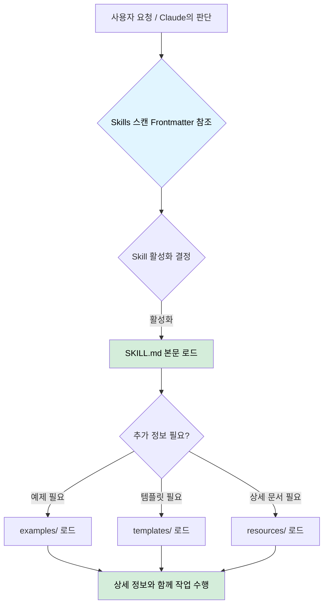
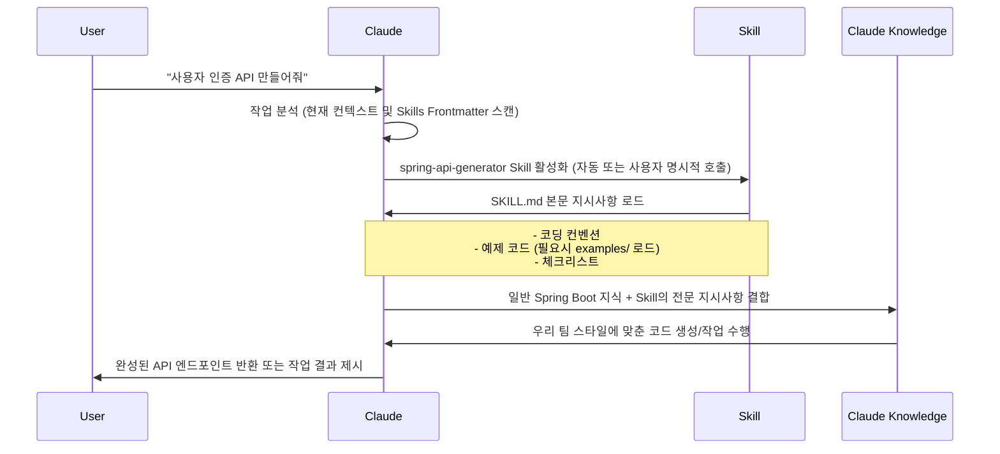
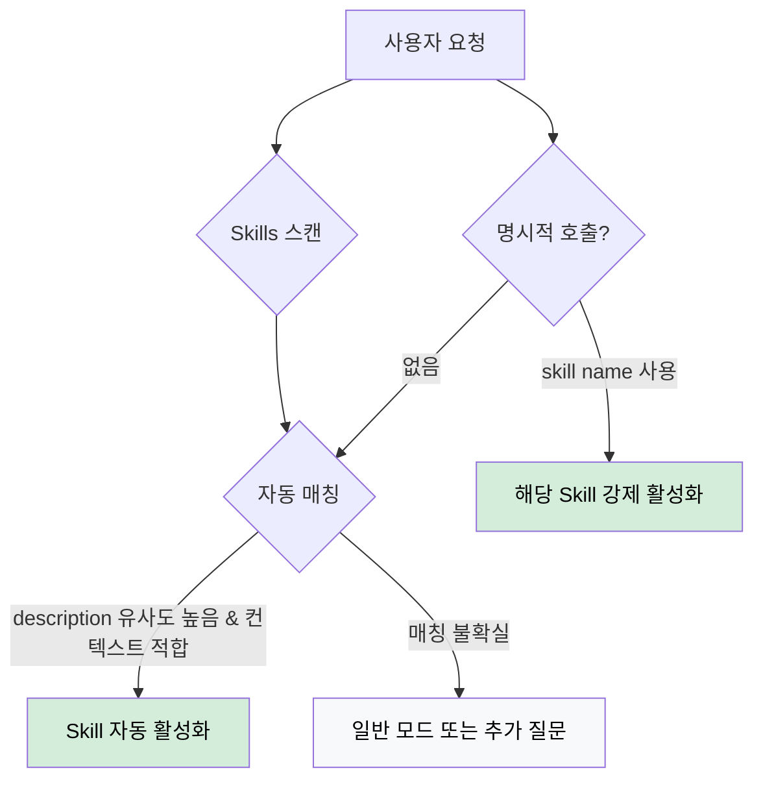

Claude Skills는 Claude 에이전트에게 구조화되고 강제 가능한 워크플로우를 제공하여 특정 작업을 반복 가능하고 일관되게 수행할 수 있도록 하는 전문화된 지시사항 패키지다.(Commands 기능과 통합)

## 핵심 개념

기존에는 매 명령마다 긴 프롬프트를 작성해야 하거나 CLAUDE.MD에 모든 규칙을 넣어서 사용해야 했지만, Skills는 다음과 같은 이점을 제공한다.

- 재사용 가능한 지시사항: 한 번 정의된 전문 지식과 워크플로우를 다양한 맥락에서 재사용 가능
- 컨텍스트 효율성: 필요할 때만 활성화되어 관련 정보만 로드하므로, AI의 컨텍스트 윈도우를 효율적으로 관리하고 토큰 비용을 절약
- 구조화된 전문성: AI에게 단순히 정보를 제공하는 것을 넘어, 특정 작업을 수행하기 위한 명확한 단계와 제약 조건 제시
- 자동 활성화: Claude는 사용자 요청과 현재 작업 컨텍스트에 따라 적절한 Skills를 자동으로 선택하고 활성화할 수 있음
- 사용자 제어: 사용자는 명시적으로 특정 Skills를 호출하여 특정 동작을 실행 가능

## 구조 및 계층적 정보 로딩

Skills는 특정 디렉토리 안에 SKILL.md 파일과 관련 자료들을 포함하는 폴더 구조로 되어 있어, 계층적 정보 로딩 메커니즘을 통해 컨텍스트 관리를 최적화한다.

```
my-skill/
├── SKILL.md          # 필수: 메타데이터(YAML frontmatter)와 핵심 지시사항(항상 로드)
├── examples/         # 선택: 자세한 사용 예제(필요시 로드)
│   ├── good-example.md
│   └── bad-example.md
├── templates/        # 선택: 코드 템플릿 파일(필요시 로드)
│   └── controller-template.java
└── resources/        # 선택: 참조 문서, 이미지 등 기타 자료(필요시 로드)
│   └── api-guide.pdf
└── scripts/          # 선택: 실행 스크립트, 파일 내용을 로드하지 않고, 실행 결과만 활용
    ├── analyze_form.py   # 입력 분석 · 정규화 스크립트
    ├── fill_form.py      # 양식 작성 스크립트
    └── validate.py       # 검증 스크립트
```

정보 로딩은 다음 세 가지 계층으로 이루어진다.

1. YAML Frontmatter: `SKILL.md` 파일 상단의 메타데이터(`name`, `description` 등)는 스킬 검색 및 활성화를 위해 항상 로드
2. `SKILL.md` 본문: 스킬이 활성화되면 `SKILL.md` 파일의 본문(핵심 지시사항, 역할, 규칙, 워크플로우 등)이 AI의 컨텍스트에 추가
3. 연결된 파일: `SKILL.md` 본문이나 AI의 판단에 따라 하위 디렉토리의 파일들이 필요할 때만 컨텍스트에 동적으로 로드



## Skills 동작 흐름



## Skills 활성화 로직

Claude는 다음 기준들을 복합적으로 사용하여 Skills를 자동으로 선택하고 활성화한다.

1. 설명(description) 매칭: 사용자 요청 또는 현재 작업 목표와 Skill의 `description` (frontmatter에 정의된) 간의 유사도 분석
2. 컨텍스트 분석: 현재 작업 중인 파일, 프로젝트 구조, 이전 대화 내용 등 전반적인 컨텍스트를 파악하여 가장 적합한 Skill을 식별
3. 명시적 호출: 사용자가 `@skill-name` 형태 (또는 Command를 통해 Skill을 트리거)로 특정 Skill을 직접 지정할 경우, Claude는 해당 Skill을 강제로 활성화



## Custom Skills 작성법

효과적인 Skill을 작성하기 위해서는 `SKILL.md`를 핵심 지시사항만 포함하도록 하고, 상세 내용은 별도 파일로 분리하여 계층적 로딩의 이점을 활용하는 것이 중요하다.

```markdown
---
name: skill-name                 # Skill의 고유한 이름 (필수)
description: Skill의 간단한 설명     # Skill이 무엇을 하는지 AI가 이해하는 데 사용되는 핵심 설명 (필수)
dependencies:                   # 이 Skill이 활성화될 때 함께 로드되어야 할 다른 Skill 목록 (선택)
  - other-skill-name
resources:                      # Skill이 참조할 수 있는 추가 파일/디렉토리 (선택)
  - examples/
  - templates/
---

# Skill Name

## 역할

핵심 역할과 목적을 간단히 설명 (1-2문장)

## 핵심 규칙

가장 중요한 규칙 3-5개만 나열 (항상 적용되는 것들)

1. 규칙 1
2. 규칙 2
3. 규칙 3

## 워크플로우

기본적인 작업 순서 (간단히)

1. 단계 1
2. 단계 2
3. 단계 3

## 추가 리소스

더 자세한 정보가 필요한 경우:

- examples/good-example.md: 모범 사례
- examples/bad-example.md: 피해야 할 패턴
- templates/template.java: 코드 템플릿
- resources/guide.pdf: 상세 가이드
```

위 파일을 직접 작성할 수도 있지만, Claude는 `/skill-creator`라는 메타-Skill을 제공하기 때문에 대화형으로 Skill을 자동 생성할 수도 있다.

## `$ARGUMENTS`를 활용한 동적 실행

현재 custom commands는 Skills로 통합되었으며, `.claude/skills/<name>/SKILL.md` 형태가 권장 경로다. (기존 `.claude/commands/*.md`도 호환 유지)

사용자 정의 명령어는 Markdown 파일로 작성되며, `$ARGUMENTS` 키워드를 사용하여 동적인 인자를 전달받을 수 있다.

```markdown
# .claude/skills/test/SKILL.md

Run tests based on the provided arguments.
Arguments: $ARGUMENTS

- If no argument is given, run all unit tests.
- If 'integration' is given, run only the integration tests.
- If a file path is given, run tests only in that specific file.
```

- `/test`: 모든 유닛 테스트 실행
- `/test integration`: 통합 테스트만 실행
- `/test src/user/service_test.go`: 특정 파일의 테스트만 실행
