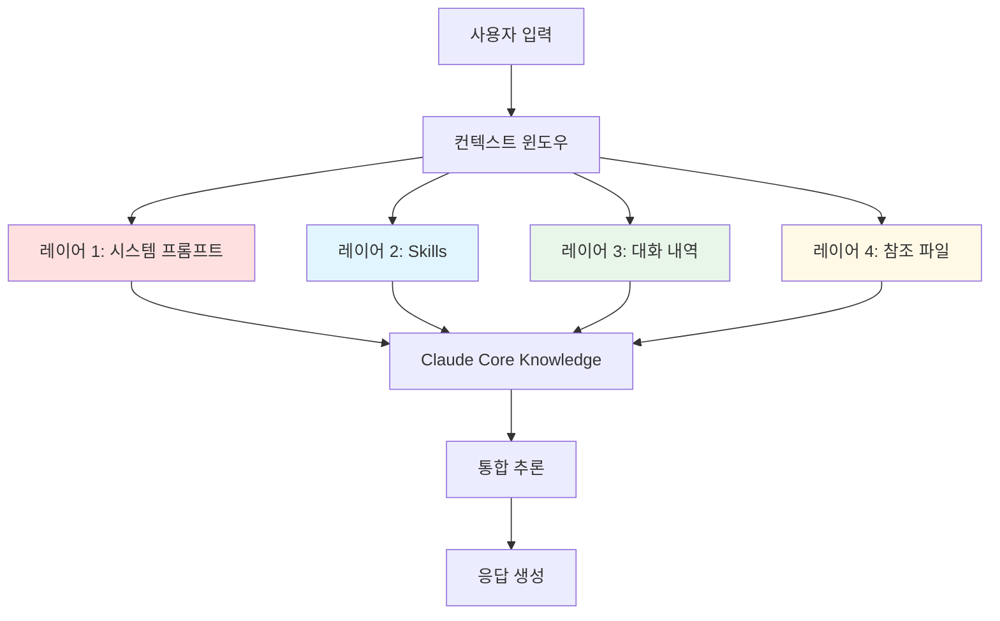
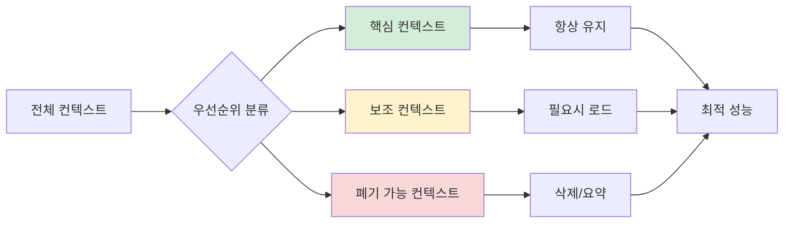

Claude의 성능은 컨텍스트 윈도우를 얼마나 효율적으로 관리하느냐에 따라 결정된다. 제한된 토큰 공간에 필요한 정보만 정확히 담아야 높은 품질의 응답을 얻을 수 있다.

## Claude의 정보 처리 계층

Claude의 컨텍스트는 다음 4가지 주요 레이어로 구성되고, 우선순위에 따라 처리된다.

1. 시스템 프롬프트: Claude의 기본 역할과 규칙
2. Skills: 도메인 전문 지식
3. 대화 내역: 현재 세션 컨텍스트
4. 참조 파일: 프로젝트별 컨텍스트

## 컨텍스트 관리 전략

컨텍스트 윈도우 초과 문제로 답변이나 결과의 품질이 떨어지는 경우가 많아, 계층적 관리 전략이 필요하다.

이를 적용하기 위한 구체적인 방법은 다음과 같다.

1. Skills로 반복 지식 압축: 자주 사용하는 규칙, 패턴, 워크플로우를 Skills로 정의하여 필요한 경우에만 로드하여 토큰 절약
2. CLAUDE.MD로 영구 컨텍스트 저장: 기본 아키텍처, 기술 스택, 코딩 컨벤션 등 변하지 않는 정보를 CLAUDE.MD에 기록
3. 대화 압축 및 초기화: `/compact` 명령어로 이전 대화를 요약하거나, `/clear` 명령어로 컨텍스트를 초기화하여 불필요한 정보 제거
