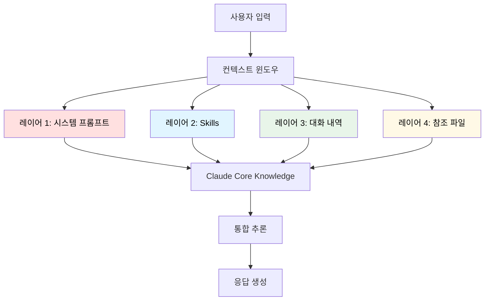
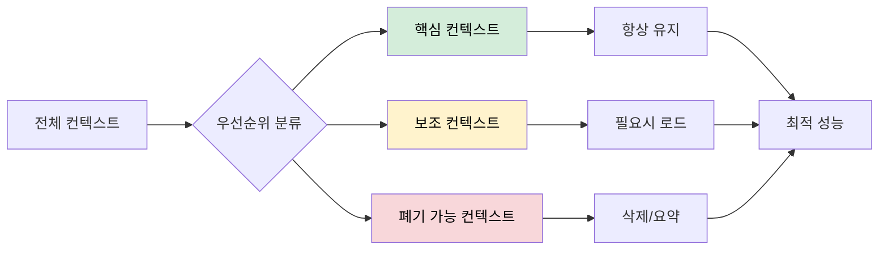

Claude의 성능은 컨텍스트 윈도우를 얼마나 효율적으로 관리하느냐에 따라 결정된다. 제한된 토큰 공간에 필요한 정보만 정확히 담아야 높은 품질의 응답을 얻을 수 있다.

## Claude의 정보 처리 계층

```mermaid
graph TB
    A[사용자 입력] --> B[컨텍스트 윈도우]
    B --> C[레이어 1: 시스템 프롬프트]
    B --> D[레이어 2: Skills]
    B --> E[레이어 3: 대화 내역]
    B --> F[레이어 4: 참조 파일]
    C --> G[Claude Core Knowledge]
    D --> G
    E --> G
    F --> G
    G --> H[통합 추론]
    H --> I[응답 생성]
    style C fill: #ffe0e0, color: #000
    style D fill: #e1f5ff, color: #000
    style E fill: #e8f5e9, color: #000
    style F fill: #fff9e6, color: #000
```

Claude의 컨텍스트는 다음 4가지 주요 레이어로 구성되고, 우선순위에 따라 처리된다.

1. 시스템 프롬프트: Claude의 기본 역할과 규칙
2. Skills: 도메인 전문 지식
3. 대화 내역: 현재 세션 컨텍스트
4. 참조 파일: 프로젝트별 컨텍스트

## 컨텍스트 관리 전략

컨텍스트 윈도우 초과 문제로 답변이나 결과의 품질이 떨어지는 경우가 많아, 계층적 관리 전략이 필요하다.

```mermaid
graph LR
    A[전체 컨텍스트] --> B{우선순위 분류}
    B --> C[핵심 컨텍스트]
    B --> D[보조 컨텍스트]
    B --> E[폐기 가능 컨텍스트]
    C --> F[항상 유지]
    D --> G[필요시 로드]
    E --> H[삭제/요약]
    F --> I[최적 성능]
    G --> I
    H --> I
    style C fill: #d4edda, color: #000
    style D fill: #fff3cd, color: #000
    style E fill: #f8d7da, color: #000
```

이를 적용하기 위한 구체적인 방법은 다음과 같다.

1. Skills로 반복 지식 압축: 자주 사용하는 규칙, 패턴, 워크플로우를 Skills로 정의하여 필요한 경우에만 로드하여 토큰 절약
2. CLAUDE.MD로 영구 컨텍스트 저장: 기본 아키텍처, 기술 스택, 코딩 컨벤션 등 변하지 않는 정보를 CLAUDE.MD에 기록
3. 대화 압축 및 초기화: `/compact` 명령어로 이전 대화를 요약하거나, `/clear` 명령어로 컨텍스트를 초기화하여 불필요한 정보 제거
4. Auto Memory로 경험 자동 축적: Claude가 작업 중 학습한 내용을 자동으로 기록하여 다음 세션에 반영

## Auto Memory

Auto Memory는 CLAUDE.MD와 달리 Claude가 작업하면서 스스로 학습하고 기록하는 자동 메모리다.

|  구분   |   CLAUDE.MD   |       Auto Memory       |
|:-----:|:-------------:|:-----------------------:|
| 작성 주체 |   개발자 직접 작성   |      Claude가 자동 기록      |
| 내용 성격 | 규칙·팀 표준·지시 사항 | 경험적 메모 ('이렇게 하면 잘 되더라') |
| 적용 범위 | 모든 세션에 항상 로드  |     관련 내용만 필요 시 로드      |

### 동작 방식

- `/memory` 명령어로 활성화/비활성화 토글 가능(기본값: 활성화)
- `MEMORY.md` 파일이 인덱스 역할을 하며, 처음 200줄만 컨텍스트에 로드
- 200줄 초과 시 별도 마크다운 파일로 분리 -> `MEMORY.md`에 링크로 관리(컨텍스트 최적화)
- 사용자가 직접 내용을 추가 가능

Auto Memory는 같은 실수 반복, 매번 동일한 프로젝트 구조 재분석, 설정 재지정 등의 비효율을 줄이는 데 특히 유용하다.
