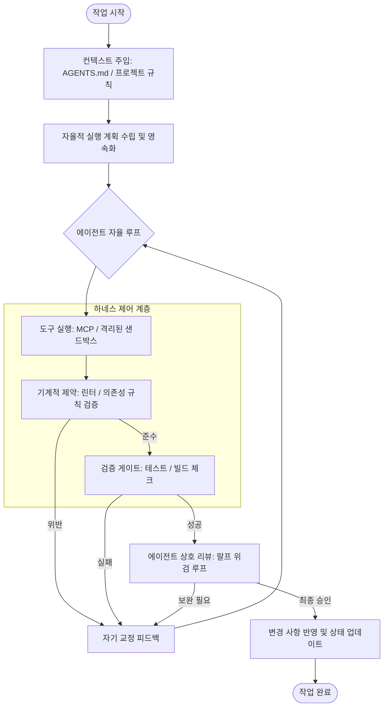
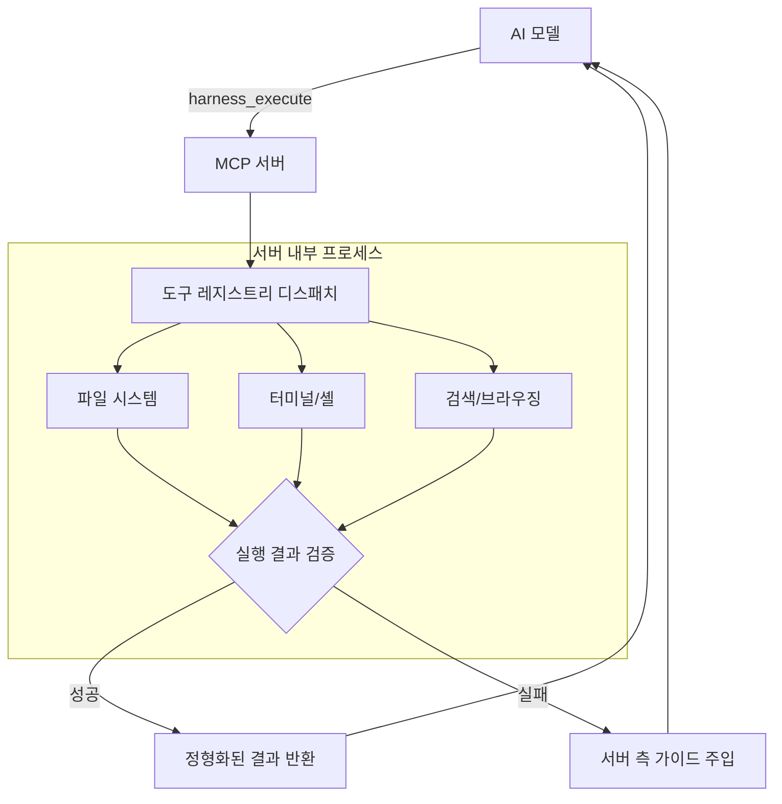

AI 에이전트가 단순한 응답 생성을 넘어 도구를 사용하고 복잡한 과업을 수행하는 자율 에이전트로 전이됨에 따라, 이를 제어하고 신뢰성을 확보하기 위한 구조적 계층 설계의 중요성이 커지고 있다.

## 하네스 엔지니어링의 개념

하네스 엔지니어링(Harness Engineering)은 AI 에이전트의 핵심 지능을 둘러싼 구조적 제약, 도구 체계, 검증 게이트 및 상태 관리 시스템을 구축하는 것을 의미한다.

- 핵심 아이디어: 에이전트의 실수를 프롬프트 수정으로 해결하는 대신, 실수가 반복될 수 없도록 시스템적 환경 설정
- 물리적 경계 역할: 에이전트가 무엇을 할 수 있고 무엇을 할 수 없는지를 규정하는 인프라 구축
- 기계적 강제(Mechanical Enforcement): "좋은 코드를 작성하라"는 지시 대신 린터와 테스트 게이트를 통해 부적절한 코드 유입을 원천 차단

## 4대 핵심 요소

성공적인 하네스 구축을 위해 컨텍스트 관리, 구조적 제약, 검증 루프, 상태 유지성이 상호작용해야 한다.

### 1. 컨텍스트 관리 및 지식 체계

에이전트에게 필요한 정보를 적시에, 과하지 않게 제공하는 기술이다.

- 점진적 공개: `AGENTS.md` 또는 `CLAUDE.md`와 같은 가이드 파일을 통해 프로젝트 규칙과 구조 단계적 노출
- 저장소 기반 진실의 원천: 모든 설계 결정과 로직 의도를 마크다운 문서로 관리하여 에이전트의 추론 자료로 활용
- 동적 컨텍스트 주입: 실시간 로그, CI/CD 상태 등 현실 세계의 정보를 동적으로 주입

### 2. 기계적 제약과 아키텍처 강제

에이전트의 행동 반경을 규정하는 엄격한 경계를 설정하여 오류 가능성을 차단한다.

- 의존성 레이어링: 레이어 간 단방향 의존성 흐름을 정의하고 이를 위반할 경우 빌드 단계에서 에러 발생
- 불변성 정의: 반드시 지켜야 할 규칙(예: 스키마 검증)을 하네스에 탑재하여 강제
- 샌드박스 환경: 격리된 실행 환경을 제공하여 공유 자원 오염 방지

### 3. 검증 게이트와 피드백 루프

에이전트의 작업 결과물을 객관적으로 검증하고 교정하는 프로세스이다.

- 랄프 위검 루프(Ralph Wiggum Loop): 에이전트가 스스로 변경 사항을 리뷰하고, 다른 리뷰어 에이전트들의 승인 받는 과정
- 자기 교정 지침: 에러 메시지에 구체적인 기술 가이드를 포함하여 인간 개입 없이 스스로 오류 수정 유도
- 루프 감지 및 에스컬레이션: 동일한 잘못된 해결책을 반복하는 '둠 루프' 감지 시 인간 관리자 개입 요청

### 4. 상태 관리와 세션 유지성

모델의 무상태성을 극복하고 작업의 연속성을 확보한다.

- 실행 계획 영속화: `execution_plan.md` 등에 단계별 진행 상황을 기록하여 세션 간 작업 연계
- 가비지 컬렉션: 불필요한 기술 부채나 깨진 패턴을 탐색하여 자동 리팩토링 수행

## 기술적 구현 - MCP (Model Context Protocol)

하네스 엔지니어링을 실질적으로 구현하기 위해 도구와 모델 사이의 인터페이스 표준화가 필요하다.

- 표준 인터페이스: JSON-RPC 기반의 통일된 인터페이스를 통해 다양한 모델과 도구 통합
- 도구 최적화: 수많은 세분화된 도구 대신 핵심 범용 도구로 축소하여 컨텍스트 소모 최소화
- 레지스트리 기반 디스패치: 에이전트는 목적만 결정하고 세부 로직은 하네스 서버의 레지스트리가 처리

