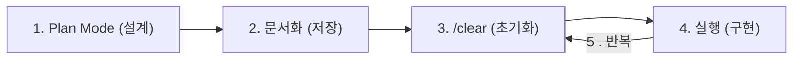

에이전트는 대화가 길어지면 컨텍스트를 압축하면서 초기의 세부 지시사항이 누락될 수 있다. `/clear`로 세션을 초기화하면 해결되지만, 작업 계획까지 함께 사라지는 딜레마가 존재한다.

## 문서 기반 워크플로우

State-Persistent Planning Workflow는 설계 내용을 마크다운 파일로 저장하고, 세션 초기화 후에도 해당 문서를 참조하여 작업을 이어가는 방식이다.

설계와 구현을 분리하고, 문서를 '상태 저장소(State Repository)'로 활용하여 AI 에이전트를 통제한다.

### 1단계: 설계 및 계획 (Plan Mode)

- `Plan Mode`에서 사고 레벨(`think hard` 등)을 작업 난이도에 맞게 지정
- `문제 정의 → 목표 → 범위 → 작업 분해 → 완료 기준`을 정리하며, 코드를 직접 작성하지 않고 설계의 명확성에 집중
- Scope와 Non-Scope를 명확히 구분하여 범위를 제어

### 2단계: 문서화 (Documentation)

작업 계획을 별도의 마크다운 파일로 저장하여 세션 간 상태를 유지한다.

- 파일명: `{작업명}_plan.md` (예: `todo_api_plan.md`)
- 지시어: "plan_template.md 형식으로 {작업명}_plan.md 생성해줘."

### 3단계: 세션 초기화 (Clear)

- `/clear` 명령어로 이전 대화의 컨텍스트 정리
- 이후 작업 성격에 맞게 `Normal Mode` 또는 `Auto-accept Mode` 전환

### 4단계: 구현 및 업데이트

초기화된 세션에서 계획 문서를 읽고 단계별로 구현을 진행한다.

- 지시어: "{작업명}_plan.md 읽고 다음 미완료 단계 구현"
- 구현이 완료되고 검증되면, 문서의 상태를 업데이트하고 다음 단계를 위해 다시 세션을 초기화

#### 5단계: 검증 및 상태 업데이트

- AI가 작성한 코드에 대해 리뷰 및 테스트 수행
- 정상 작동이 검증되면, 마크다운 문서로 돌아가 해당 작업 단계를 `DONE` 상태로 변경
- 변경된 소스 코드는 개발자가 직접 Git Commit을 수행하여 프로젝트의 통제권을 유지

#### 6단계: 완료 및 아카이빙 (Archive & Iteration)

- 모든 단계가 `DONE` 처리되면, 계획 파일을 별도 디렉토리에 보관
- 다음 기능 개발을 위해 다시 1단계(Plan Mode)로 돌아가 새로운 계획 파일 작성

## 작업 상태 관리 컨벤션

계획 문서에서 각 항목의 진행 상태를 다음과 같은 형식으로 관리한다.

| 기호    | 상태 태그      | 의미                        |
|:------|:-----------|:--------------------------|
| `[X]` | `DONE`     | 구현 및 검증(단위 테스트 등)이 완료된 항목 |
| `[-]` | `PROGRESS` | 현재 세션에서 작업 중인 항목          |
| `[ ]` | `TODO`     | 아직 시작하지 않은 대기 항목          |

## 워크플로우의 규격화 및 자동화

개별적으로 수행하던 수동 워크플로우를 Skills로 패키징하거나 커뮤니티의 검증된 플러그인을 활용하면 작업의 재현성을 극대화하고 표준 운영 절차(SOP)를 코드화할 수 있다.

- Skills 기반 패키징: 도메인 지식, 설계 가이드라인, 검증 스크립트를 하나의 실행 단위로 묶어 세션마다 동일한 품질의 결과물 산출 보장
- 구조화된 실행 루프: 분석(Analyze), 사전 검증(Validate), 실행(Apply), 사후 검증(Verify) 단계를 자동화하여 아키텍처 정합성 유지
- 에코시스템 통합: 프레임워크나 전문 MCP 서버를 연동하여 다단계 추론과 컨텍스트 최적화 과정을 규격화된 프로토콜로 관리
