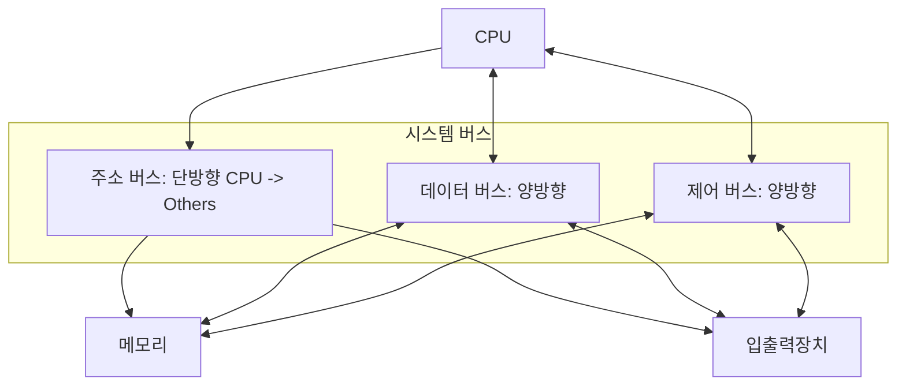

## 컴퓨터가 이해하는 정보

컴퓨터는 0과 1로 이루어진 비트(Bit) 신호를 전압의 높낮이로 인식하여 처리하여, 이 0과 1의 집합은 문맥에 따라 데이터가 되거나 명령어로 구분하여 읽는다.

- 데이터: 프로그램이 처리하는 대상이 되는 정적인 정보(숫자, 문자, 이미지 등)
- 명령어: 데이터를 조작하거나 컴퓨터의 동작을 제어하는 정보
- 특징: 메모리에 저장된 비트 패턴이 같더라도 CPU가 이를 가져오는 시점과 해석하는 방식에 따라 데이터인지 명령어인지가 결정

## 핵심 구성 요소와 역할

컴퓨터 시스템은 크게 연산과 제어를 담당하는 CPU, 작업을 위한 공간인 메모리, 데이터 보존을 위한 보조기억장치, 그리고 외부와의 소통을 위한 입출력장치로 구성된다.

### CPU (중앙처리장치)

메모리로부터 명령어를 인출(Fetch)하고 해석(Decode)하여 실행(Execute)하는 컴퓨터의 두뇌이다.

- 제어장치(Control Unit)
    - 클럭 신호에 맞춰 각 부품의 동작을 지시하고 조율
    - 메모리 읽기/쓰기 신호 및 입출력 제어 신호를 생성
- 산술논리장치(ALU)
    - 사칙연산과 논리연산(AND, OR 등)을 수행하는 디지털 회로
    - 연산 결과와 상태 플래그(오버플로우, 0 여부 등)를 출력
- 레지스터(Register)
    - CPU 내부의 가장 빠른 임시 저장 공간
    - 범용 레지스터 외에 PC(Program Counter, 다음 실행할 명령어 주소), IR(Instruction Register, 현재 실행 중인 명령어) 등 특수 목적 레지스터가 존재
    - 컨텍스트 스위칭(Context Switching) 발생 시 현재 레지스터의 상태를 PCB(Process Control Block)에 백업해야 하므로 성능에 영향을 줌

### 메모리(주기억장치)

현재 실행 중인 프로그램(프로세스)의 명령어와 데이터를 저장한다.

- 주소(Address)를 통해 임의의 위치에 즉시 접근 가능(Random Access)
- 전원이 꺼지면 데이터가 사라지는 휘발성(Volatile) 매체
- CPU와 보조기억장치 사이의 속도 차이를 완충하는 역할

### 보조기억장치

전원이 차단되어도 데이터가 유지되는 비휘발성 저장 장치이다.

- 종류: HDD, SSD
- 역할: 실행되지 않은 프로그램(코드)과 데이터를 보관하는 창고 역할
- 운영체제는 메모리 공간이 부족할 때 보조기억장치의 일부를 메모리처럼 사용하는 스왑(Swap) 혹은 가상 메모리 기법을 사용

### 입출력장치

컴퓨터 외부와 연결되어 데이터를 입력받거나 결과를 출력한다.

- 구성: 마우스, 키보드, 모니터, 네트워크 인터페이스 카드 등
- CPU는 입출력장치의 상태를 확인하기 위해 폴링(Polling) 방식을 쓰거나, 입출력장치가 CPU에 신호를 보내는 인터럽트(Interrupt) 방식을 사용하여 효율을 높임

## 메인보드와 시스템 버스

메인보드는 위 부품을 물리적으로 연결하고 전원을 공급하는 기판이며, 부품 간 정보 전달의 통로인 버스(Bus)가 내장되어 있다.

핵심 부품(CPU, 메모리, 입출력장치)을 연결하는 통로를 시스템 버스라 하며, 아래 세 가지로 구성되어 있다.

- 데이터 버스(Data Bus)
    - 명령어와 데이터를 주고받는 양방향 통로
    - 버스의 폭(Width)이 한 번에 전송할 수 있는 데이터의 양(Word Size)을 결정(예: 64비트 컴퓨터는 64비트 폭을 가짐)
- 주소 버스 Address Bus)
    - CPU가 메모리나 입출력장치의 특정 위치를 지목하기 위해 주소를 전송하는 단방향 통로 (CPU → 외부)
    - 주소 버스의 비트 수가 CPU가 관리할 수 있는 최대 메모리 용량을 결정(예: 32비트 주소 버스는 2^32 = 4GB까지만 인식 가능)
- 제어 버스(Control Bus)
    - 메모리 읽기/쓰기 신호, 인터럽트 요청 및 승인 신호 등을 주고받는 통로
    - 제어 신호를 통해 데이터 버스와 주소 버스가 충돌 없이 작동하도록 조율함

###### 참고자료

- [혼자 공부하는 컴퓨터 구조+운영체제](https://kobic.net/book/bookInfo/view.do?isbn=9791162243091)
