현대 CPU는 물리적 한계로 클럭 속도를 높이는 대신, 한 번의 클럭 사이클 동안 여러 개의 명령어를 동시에 처리하여 효율을 높이는 명령어 병렬 처리(ILP) 기법을 사용하기 시작했다.

## 명령어 파이프 라인(Instruction Pipelining)

명령어 처리 과정을 여러 단계로 나누어 동시에 수행하는 기법이다.

- CPU 내부의 각 단계(인출, 해석 등)를 담당하는 하드웨어 회로가 독립적이라는 특성 이용
- 하나의 명령어가 실행되는 동안 놀고 다른 회로가 다음 명령어를 처리하는 방식

### 파이프라인 단계

1. 명령어 인출(Instruction Fetch, IF): 메모리에서 명령어를 가져옴
2. 명령어 해석(Instruction Decode, ID): 가져온 명령어를 분석하고 제어 신호 생성
3. 명령어 실행(Execute Instruction, EX): ALU를 통해 연산 수행 또는 메모리 주소 계산
4. 결과 저장(Write Back, WB): 연산 결과를 레지스터나 메모리에 기록

```mermaid
gantt
    title 4단계 명령어 파이프라인 처리 흐름
    dateFormat s
    axisFormat %s

    section 명령어 1
        IF: 0, 1
        ID: 1, 2
        EX: 2, 3
        WB: 3, 4

    section 명령어 2
        IF: 1, 2
        ID: 2, 3
        EX: 3, 4
        WB: 4, 5

    section 명령어 3
        IF: 2, 3
        ID: 3, 4
        EX: 4, 5
        WB: 5, 6

```

파이프라인은 이상적인 경우 성능을 비약적으로 높이지만, 특정 상황에서는 다음 명령어를 바로 실행하지 못하고 기다려야 하는 상황이 발생하기 때문에 주의해야 한다.

## 슈퍼스칼라(Superscalar)

CPU 코어 내부에 파이프라인을 여러 개 두어, 매 클럭 주기마다 두 개 이상의 명령어를 동시에 인출하고 실행하는 구조다.

```mermaid
gantt
    title 슈퍼스칼라 (2-way issue) 처리 흐름
    dateFormat s
    axisFormat %s

    section 동시 시작 그룹 1
        명령어 1 (IF): 0, 1
        명령어 1 (ID): 1, 2
        명령어 1 (EX): 2, 3
        명령어 1 (WB): 3, 4
        명령어 2 (IF): 0, 1
        명령어 2 (ID): 1, 2
        명령어 2 (EX): 2, 3
        명령어 2 (WB): 3, 4

    section 동시 시작 그룹 2
        명령어 3 (IF): 1, 2
        명령어 3 (ID): 2, 3
        명령어 3 (EX): 3, 4
        명령어 3 (WB): 4, 5
        명령어 4 (IF): 1, 2
        명령어 4 (ID): 2, 3
        명령어 4 (EX): 3, 4
        명령어 4 (WB): 4, 5
```

- 동작 원리: 복수의 ALU(산술논리장치)를 탑재하여 물리적으로 동시에 연산을 수행
- 특징
    - 이론적으로는 파이프라인 개수만큼 처리 속도가 빨라져야 하지만, 의존성 문제로 인해 실제 성능은 그에 미치지 못함
    - 이를 보완하기 위해 컴파일러나 하드웨어가 명령어의 의존성을 파악하여 최적화하는 과정 필요

## 비순차적 명령어 처리(Out-of-Order Execution)

순차적으로 실행하다가 데이터 위험 등으로 인해 멈추는 상황이 발생하면, 뒤에 있는 명령어 중 의존성이 없어 당장 실행 가능한 명령어를 먼저 처리한다.

1. 인출 및 해석: 명령어를 순서대로 가져옴
2. 실행 대기: 명령어를 실행 큐(Instruction Queue) 또는 재정렬 버퍼(Reorder Buffer)에 넣음
3. 비순차 실행: 데이터 준비가 완료된 명령어부터 순서와 상관없이 실행 유닛으로 보냄
4. 순차 종료(Retire/Commit): 실행은 순서가 바뀌었더라도, 결과 저장은 반드시 원래 프로그램의 순서대로 수행하여 정합성을 보장

이 기법은 파이프라인의 낭비를 최소화하고 높은 처리량을 유지하기 위해 현재 대부분의 CPU가 채택하고 있다.

###### 참고자료

- [혼자 공부하는 컴퓨터 구조+운영체제](https://kobic.net/book/bookInfo/view.do?isbn=9791162243091)
