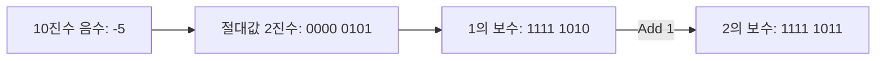

## 컴퓨터 언어의 기본 단위

컴퓨터는 전기의 켜짐(ON)과 꺼짐(OFF)이라는 두 가지 상태만을 인식할 수 있으며, 이를 수학적으로 추상화한 것이 비트다.

- 비트(Bit): Binary Digit의 약자. 정보 처리의 최소 단위(0 또는 1)
- 바이트(Byte): 8개의 비트가 모인 단위. 문자를 표현하는 기본 단위이자 메모리 주소 지정의 기본 단위
- 워드(Word): CPU가 한 번에 처리할 수 있는 데이터의 크기(32비트 CPU는 4바이트, 64비트 CPU는 8바이트가 1워드)

## 논리 연산(Boolean Algebra)

2진 논리 체계로, 현대 컴퓨터 회로 설계의 기초가 된다.

| 연산  | 기호 |                  설명                   | 결과 예시 (A=1, B=0) |
|:---:|:--:|:-------------------------------------:|:----------------:|
| NOT | ~  |      입력된 비트를 반전시킴 (1의 보수 생성에 사용)      |        0         |
| AND | &  |   두 비트가 모두 1일 때만 1 반환 (비트 마스킹에 사용)    |        0         |
| OR  | \| |  두 비트 중 하나라도 1이면 1 반환 (특정 비트 설정에 사용)  |        1         |
| XOR | ^  | 두 비트가 서로 다를 때만 1 반환 (암호화, 두 값 교환에 사용) |        1         |

## 정수의 표현(Integer Representation)

컴퓨터는 제한된 비트 수로 정수를 표현해야 하므로, 값의 범위와 부호 처리에 대한 명확한 규칙이 존재한다.

### 양의 정수(Unsigned Integer)

부호 없이 양수만을 표현하며, 모든 비트를 숫자의 크기를 나타내는 데 사용한다.

- 표현 범위(n비트): 0 ~ 2^n - 1
- 오버플로우(Overflow): 표현 가능한 최대값을 넘어설 경우 가장 작은 값으로 돌아가는 현상

### 음의 정수 표현 방식의 진화

음수를 표현하기 위해 최상위 비트(MSB, Most Significant Bit)를 부호 비트로 사용한다.(0: 양수, 1: 음수)

1. 부호와 절대치(Sign-Magnitude): MSB만 부호로 쓰고 나머지는 절대값 표현
    - 0이 +0과 -0 두 개로 존재하는 문제 발생
    - 덧셈과 뺄셈 회로를 따로 설계해야 하는 비효율성
2. 1의 보수(1's Complement): 양수의 모든 비트를 반전
    - 여전히 +0과 -0이 존재
    - 연산 시 엔드 어라운드 캐리(End-around Carry) 처리가 필요하여 복잡함
3. 2의 보수(2's Complement): 1의 보수에 1을 더함
    - 현재 모든 현대 컴퓨터가 사용하는 표준 방식
    - 0이 하나만 존재하며, 덧셈 회로 하나로 뺄셈까지 처리 가능

### 2의 보수 변환 흐름

## 실수의 표현(Floating Point Representation)

실수는 정수와 달리 무한한 값을 가질 수 있어, 유한한 비트 내에서 표현하기 위해 정밀도를 포기하고 범위를 넓히는 방식을 택한다.

### 고정 소수점(Fixed Point)

소수점의 위치를 미리 정해두고 표현하는 방식이다.

- 구현이 단순하고 연산 속도가 빠름
- 표현할 수 있는 수의 범위가 매우 좁아 범용 컴퓨터에서는 잘 사용되지 않음(임베디드 등 특수 목적 사용)

### 부동 소수점(Floating Point) - IEEE 754 표준

소수점의 위치가 고정되지 않고 떠다니는(Floating) 방식으로, 현재 대부분의 시스템은 IEEE 754 표준을 따른다.

| 구성 요소    | 역할                 | 32비트(float) 할당 | 64비트(double) 할당 |
|----------|--------------------|----------------|-----------------|
| 부호 비트(S) | 양수(0) / 음수(1) 결정   | 1 bit          | 1 bit           |
| 지수부(E)   | 소수점의 위치 결정 (값의 범위) | 8 bits         | 11 bits         |
| 가수부(M)   | 실제 유효 숫자 표현 (정밀도)  | 23 bits        | 52 bits         |

숫자를 `부호(Sign) * 가수(Mantissa) * 2^지수(Exponent)` 형태로 저장하게 된다.

### 부동 소수점의 정밀도 문제

컴퓨터는 실수를 2진수로 근사하여 저장하기 때문에 미세한 오차가 발생한다.

- 0.1 + 0.2가 0.3이 되지 않는 현상 발생
- 금융 계산 등 정확성이 필수적인 분야에서는 float/double 대신 `BigDecimal`(Java 기준)과 같은 별도의 라이브러리나 정수형으로 변환하여 사용

## 텍스트의 표현(Text Representation)

문자를 숫자에 대응시키는 약속(Character Set)과 이를 비트로 저장하는 방식(Encoding)으로 나뉜다.

### 아스키 코드(ASCII)

- 7비트를 사용하여 128개의 문자 표현 (영문 대소문자, 숫자, 특수기호, 제어 문자)
- 1바이트(8비트) 중 남는 1비트는 통신 에러 검출용 패리티 비트로 사용하기도 함
- 영미권 외의 문자를 표현할 수 없는 한계 존재

### 유니코드(Unicode)

전 세계의 모든 문자를 일관되게 표현하고 다루기 위한 산업 표준이다.

### 인코딩 방식(UTF-8 vs UTF-16)

유니코드 값을 컴퓨터에 실제로 저장하는 방식의 차이다.

- UTF-8
    - 가변 길이 인코딩 방식 (문자에 따라 1~4바이트 사용)
    - 영문/숫자는 1바이트(ASCII와 호환), 한글은 3바이트로 표현
    - 웹 환경 및 대부분의 OS에서 표준으로 사용 (용량 효율이 좋음)
- UTF-16
    - 대부분의 문자를 2바이트(일부는 4바이트)로 고정하여 표현
    - 자바(Java)의 메모리 내 문자열 처리 방식(`char` 타입)이나 윈도우 API 등에서 사용
    - 바이트 순서(Endianness)를 표시하는 BOM(Byte Order Mark)이 필요할 수 있음
