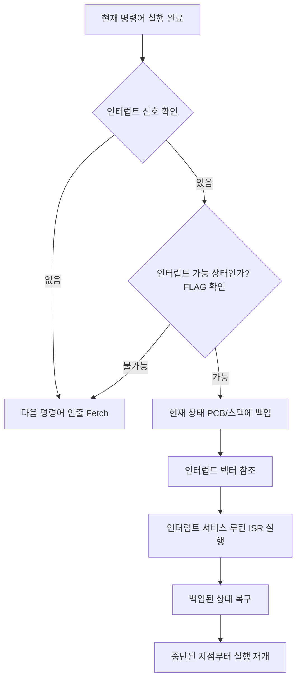

CPU가 프로그램을 실행하는 도중 예기치 않은 상황이나 급한 처리를 요하는 작업이 발생했을 때, 현재 실행 중인 작업을 잠시 중단하고 해당 작업을 먼저 처리한 후 다시 복귀하는 메커니즘이다.

- 입출력 장치가 작업이 완료되거나 처리가 필요할 때 CPU에 신호를 보내는 방식
- 운영체제가 멀티태스킹을 지원하고 시스템 자원을 효율적으로 관리하기 위한 필수적인 기능
- 현대의 거의 모든 컴퓨터 시스템은 인터럽트 방식을 기반으로 동작

## 종류

발생 주체와 원인에 따라 크게 동기적 인터럽트(예외)와 비동기적 인터럽트(하드웨어 인터럽트)로 구분된다.

1. 동기 인터럽트(Synchronous Interrupt): CPU 내부에서 명령어를 실행하는 과정에서 발생하는 예외 상황
    - 폴트(Fault): 처리가 가능한 오류, 예외 처리 후 예외가 발생한 명령어부터 다시 실행
        - 예시 - 페이지 폴트(Page Fault): 메모리에 없는 페이지 접근 시 디스크에서 가져온 후 다시 접근 시도
    - 트랩(Trap): 의도적으로 발생시키는 예외, 예외 처리 후 다음 명령어부터 실행
        - 예시 - 시스템 호출(System Call): 디버깅 중 브레이크 포인트
    - 중단(Abort): 복구할 수 없는 심각한 하드웨어 오류, 해당 프로세스를 강제로 종료
2. 비동기 인터럽트(Asynchronous Interrupt): CPU 외부의 하드웨어 장치에 의해 발생하는 인터럽트(일반적으로 통칭하는 인터럽트)
    - 마스크 가능 인터럽트(Maskable Interrupt): 인터럽트 플래그(IF)를 통해 CPU가 무시할 수 있는 인터럽트
        - 예시: 일반적인 입출력 장치(키보드, 마우스 등)의 요청
    - 마스크 불가능 인터럽트(Non-Maskable Interrupt, NMI): 중요도가 매우 높아 CPU가 무시할 수 없는 인터럽트
        - 예시: 정전 위기(Power Fail), 하드웨어 고장 등

## 인터럽트 처리 과정

CPU는 명령어 사이클의 마지막 단계에서 항상 인터럽트 여부를 확인하며, 인터럽트가 감지되면 다음과 같은 흐름으로 처리한다.

- 인터럽트 요청 신호(IRQ): 하드웨어가 CPU에 보내는 신호
- 인터럽트 플래그(Interrupt Flag): CPU 상태 레지스터 내에 존재하며, 현재 인터럽트를 받아들일지 말지를 결정하는 비트
- 인터럽트 벡터(Interrupt Vector): 여러 종류의 인터럽트를 구분하기 위한 번호. 이 번호를 통해 메모리 상의 인터럽트 처리 루틴 주소를 찾음
- 인터럽트 벡터 테이블(IVT): 인터럽트 벡터와 해당 서비스 루틴의 시작 주소가 매핑된 테이블
- 인터럽트 서비스 루틴(ISR): 실제 인터럽트를 처리하는 커널 내부의 코드 함수

###### 참고자료

- [혼자 공부하는 컴퓨터 구조+운영체제](https://kobic.net/book/bookInfo/view.do?isbn=9791162243091)
