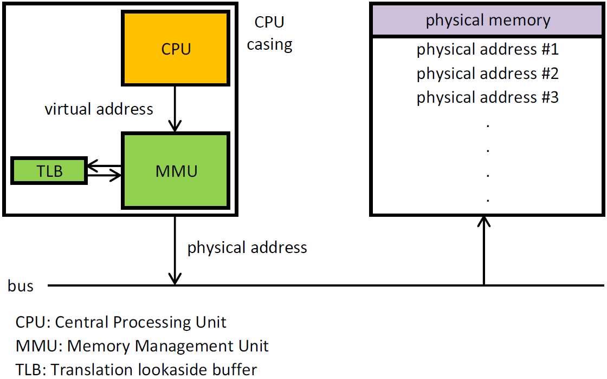

메모리란 프로그램과 프로그램 수행에 필요한 데이터 및 코드를 저장하는 장치로 크게 내부 기억 장치인 주기억장치와 외부 기억장치인 보조 기억장치로 분류된다.

## 메모리 계층 구조

컴퓨터는 속도와 용량의 트레이드오프를 해결하기 위해 메모리를 계층적으로 구성한다.

- 레지스터(Register): CPU 내부에 존재하는 가장 빠른 기억 장치
- 캐시 메모리(Cache Memory): CPU와 주기억장치 사이의 속도 차이를 완화 (L1, L2, L3)
- 주기억장치(Main Memory/RAM): 실행 중인 프로세스와 데이터가 저장됨
- 보조기억장치(Secondary Storage): HDD, SSD 등 데이터의 영구 저장 담당

## 메모리 주소

프로세스가 실행되기 위해서는 메모리에 적재되어야 하는데, 이때 바라보는 주소의 관점이 다르다.

- 논리 주소(Logical Address)
    - 가상 주소(Virtual Address)라고도 함
    - CPU와 실행 중인 프로세스가 보는 주소 공간
    - 0번지부터 시작하며 각 프로세스마다 독립적으로 할당됨

- 물리 주소(Physical Address)
    - 메모리 하드웨어가 실제로 사용하는 주소
    - 데이터가 물리적으로 저장된 실제 위치

CPU가 논리 주소를 참조하면, 중간에서 누군가가 물리 주소로 변환해주어야 하는데 이 역할을 하드웨어 장치인 MMU가 담당한다.

## Memory Management Unit(MMU)

CPU 코어 내부(또는 인접)에 위치하는 장치로, 논리 주소를 물리 주소로 변환하고 메모리 보호 기능을 수행하는 핵심 하드웨어다.

### MMU의 주요 역할

|   주요역할   |                             특징                             |
|:--------:|:----------------------------------------------------------:|
|  주소 변환   |               CPU가 보내온 가상 주소를 실제의 물리적 주소로 변환               |
|  동적 적재   |          실행에 반드시 필요한 프로그램과 데이터를 적재하는 OS 주요 기능 지원           |
|  캐시 통제   |                 캐시 가능한 영역과 불가능한 영역 분리하여 관리                 |
|  권한 통제   |                   사용자 프로그램에서 커널 영역 침범 차단                   |
| 읽기/쓰기 보호 |                     읽기/쓰기 가능 여부 영역 관리                      |
|  메모리 보호  | 각 프로세스들이 별도의 분리된 영역에서 운용되도록 통제 / 상한 레지스터 보다 큰 값이 오는 경우도 체크 |

## 캐시 메모리

주기억장치의 속도가 CPU의 연산 속도를 따라가지 못하는 병목 현상을 줄이기 위한 고속 버퍼 메모리다.

### 캐시 적중률과 지역성

캐시 메모리가 효율적으로 동작하기 위해선, 캐시 히트율이 높아야하는데, 이 때 지역성의 원리가 사용된다.

- 시간 지역성(Temporal Locality): 최근에 참조된 주소의 내용은 조만간 다시 참조될 가능성이 높음
    - 예시: 반복문(for/while) 내에서 사용되는 변수나 인덱스
- 공간 지역성(Spatial Locality): 참조된 주소와 인접한 주소의 내용이 참조될 가능성이 높음
    - 예시: 배열 순회 (배열은 연속된 메모리 공간을 차지하므로 `arr[0]` 접근 후 `arr[1]`에 접근할 확률이 높음)

###### 참고자료

- [한 권으로 읽는 컴퓨터 구조와 프로그래밍](https://kobic.net/book/bookInfo/view.do?isbn=9791189909284)
