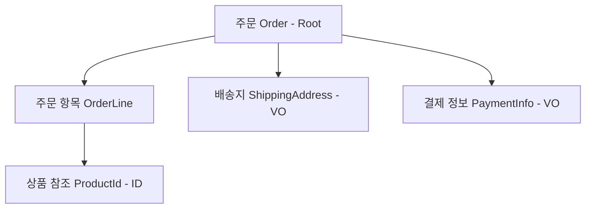

애그리거트(Aggregate)는 관련된 객체들을 하나의 단위로 묶어 데이터 변경의 일관성을 보장하는 경계다.

## 애그리거트의 구조와 루트 엔티티

애그리거트는 하나 이상의 엔티티와 밸류 오브젝트(VO)로 구성되며, 이 중 중심이 되는 엔티티를 애그리거트 루트(Aggregate Root)라고 한다.

- 외부 통제: 외부 객체는 오직 루트를 통해서만 애그리거트 내부 객체에 접근 가능
- 상태 보호: 루트 엔티티는 애그리거트 내부의 모든 객체가 비즈니스 규칙을 준수하도록 관리
- 전역 식별자: 루트 엔티티만이 전역적으로 고유한 식별자를 가짐 (내부 엔티티는 애그리거트 내에서만 유효한 지역 식별자 사용)

### 애그리거트 구성 예시 (주문)



## 애그리거트 설계의 3대 원칙

### 1. 도메인 규칙(Invariant)의 보호

애그리거트 내의 모든 상태 변경은 비즈니스 규칙을 만족해야 한다.

- 루트를 통한 변경: 외부에서 `OrderLine`의 수량을 직접 수정하는 대신 `order.changeQuantity()`와 같이 루트의 메서드를 호출
- 원자적 변경: 하나의 애그리거트 내 데이터는 트랜잭션이 끝나는 시점에 모두 함께 올바른 상태여야 함

### 2. 작게 설계 (Small Aggregate)

거대한 애그리거트는 동시성 문제를 유발하고 시스템의 유연성을 떨어뜨린다.

- 성능 향상: 객체 로딩 속도가 빠르고 메모리 사용량이 적음
- 충돌 방지: 여러 사용자가 동일한 애그리거트를 동시에 수정할 확률 감소
- 명확한 책임: 도메인의 핵심 규칙에만 집중할 수 있는 최소한의 범위 설정

### 3. 객체 참조 대신 ID 참조

애그리거트 간의 결합도를 낮추기 위해 다른 애그리거트를 직접 참조하지 않고 식별자(ID)만 보유한다.

|  구분  |       객체 참조       |      ID 참조       |
|:----:|:-----------------:|:----------------:|
| 결합도  | 높음 (함께 로딩·수정 가능성) | 낮음 (독립적인 라이프사이클) |
|  성능  | 지연 로딩 등 복잡한 설정 필요 |  단순하고 명확한 쿼리 수행  |
| 트랜잭션 |  여러 애그리거트가 묶일 위험  | 애그리거트 단위 트랜잭션 강제 |

```java
// ID 참조를 통한 애그리거트 간의 느슨한 결합
public class Order {

    private OrderId id;
    private MemberId ordererId; // Member 객체 대신 ID만 참조
    private List<OrderLine> orderLines;
}
```

## 트랜잭션 범위와 일관성 유지 전략

원칙적으로 하나의 트랜잭션에서는 하나의 애그리거트만 수정한다.

- 강한 일관성: 하나의 트랜잭션 내에서 즉각적으로 일관성 보장
- 최종 일관성: 다른 애그리거트의 상태 변경이 필요한 경우 도메인 이벤트를 발행하여 비동기적으로 처리
- 예외 상황: 기술적 제약이나 강력한 비즈니스 요구사항이 있는 경우에만 예외적으로 다수 애그리거트 수정 허용

## 리포지토리와 애그리거트

리포지토리(Repository)는 애그리거트 루트 단위로만 존재해야 한다.

- 루트 단위 인터페이스: `OrderLineRepository`와 같은 하위 엔티티용 리포지토리를 만들지 않고, `OrderRepository`만 생성
- 개념적 범위 vs 기술적 진입점: 리포지토리는 애그리거트라는 개념적 범위의 데이터를 다루지만, 기술적으로는 애그리거트 루트의 식별자를 통해 접근하고 관리
- 데이터 무결성 강제: 루트를 통해서만 영속성 저장소에 접근하게 함으로써 애그리거트 내부의 일관성 경계를 기술적으로 보호

```java
public interface OrderRepository {

    Optional<Order> findById(OrderId id);

    void save(Order order); // 내부 OrderLine들까지 함께 저장되어 일관성 유지
}
```
