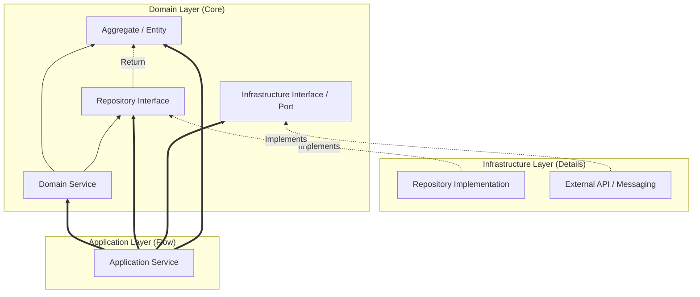

애플리케이션 서비스(Application Service)는 도메인 모델을 외부 클라이언트와 연결하는 통로이자, 사용자의 요구사항(Use Case)을 실현하기 위한 오케스트레이션 계층이다.

## 애플리케이션 서비스의 책임과 역할

애플리케이션 서비스는 도메인 로직을 직접 수행하지 않고, 도메인 객체들이 협력하여 문제를 해결하도록 흐름을 제어한다.

- 유스케이스 구현: 클라이언트의 요청을 받아 도메인 모델에 전달하고 결과를 반환
- 트랜잭션 관리: 비즈니스 작업 단위의 원자성을 보장하며 DB 상태 동기화
- 흐름 제어 및 보안: 입력 데이터 검증, 권한 확인, 로깅 등 횡단 관심사 처리
- 인프라스트럭처 협력: 리포지토리, 메시징 큐, 알림 발송 등 외부 시스템과 통신

## 커맨드 패턴과 유스케이스 구현

애플리케이션 서비스는 입력 파라미터를 캡슐화한 커맨드(Command) 객체를 통해 요청의 의도를 명확히 표현한다.

### 커맨드 객체를 활용한 입력 데이터 전달

```java
public record CreateOrderCommand(
        Long memberId,
        List<OrderLineRequest> items,
        String shippingAddress
) {

}
```

- 입력 캡슐화: 단순 파라미터 나열이 아닌 의미 있는 단위로 묶어 전달
- 사전 검증: @Valid 등을 활용하여 유효하지 않은 요청을 서비스 진입 전 차단
- 불변성 유지: 외부로부터 전달받은 데이터가 서비스 내부에서 변하지 않도록 관리

### 서비스 구현 예시 (오케스트레이션)

단순 CRUD를 넘어, 여러 애그리거트와 도메인 서비스를 조합하여 하나의 유스케이스를 완성한다.

```java

@Service
@Transactional
@RequiredArgsConstructor
public class OrderService {

    private final OrderRepository orderRepository;
    private final MemberRepository memberRepository;
    private final DiscountService discountService; // 도메인 서비스
    private final NotificationService notificationService; // 인프라 인터페이스

    public OrderResponse createOrder(CreateOrderCommand command) {
        // 1. 필요한 도메인 구성 요소 준비
        Member member = memberRepository.findById(command.memberId())
                .orElseThrow(() -> new EntityNotFoundException("회원을 찾을 수 없습니다."));

        // 2. 도메인 서비스 및 엔티티를 활용한 비즈니스 로직 실행
        Money discountAmount = discountService.calculateDiscount(member, command.items());
        Order order = Order.create(member, command.items(), command.shippingAddress(), discountAmount);

        // 3. 영속화 및 외부 알림 오케스트레이션
        orderRepository.save(order);
        notificationService.sendOrderConfirmation(member.getEmail(), order.getId());

        // 4. 결과 반환 (DTO 변환)
        return OrderResponse.from(order);
    }
}
```

- 얇은 서비스(Thin Service): 실제 비즈니스 계산이나 규칙 검증은 `Order`나 `DiscountService`에 위임
- 일관성 보장: 한 트랜잭션 내에서 영속화와 이벤트 발행 준비를 마침

## 데이터 변환 전략 (DTO와 도메인 모델)

클라이언트에게 도메인 엔티티를 직접 노출하지 않고 DTO(Data Transfer Object)를 통해 데이터를 교환한다.

### DTO 변환 시점과 책임

| 구분  |             DTO              |          도메인 모델          |
|:---:|:----------------------------:|:------------------------:|
| 역할  | 외부 통신을 위한 데이터 구조 (UI/API 맞춤) | 비즈니스 규칙과 로직을 포함하는 핵심 개념  |
| 변경  |    화면 요구나 API 스펙 변경에 민감함     |  도메인 지식의 변화가 있을 때만 변경됨   |
| 종속성 |    프레임워크나 외부 라이브러리에 의존 가능    | 외부 환경에 독립적이며 순수 비즈니스에 집중 |

- 서비스 계층 반환: 서비스는 DTO를 반환하여 엔티티의 내부 구현 유출을 방지
- 변환 로직 위치: DTO 클래스 내부의 static factory 메서드나 별도의 Mapper 활용
- 성능 최적화: 필요한 데이터만 선별하여 전송함으로써 네트워크 부하 감소

## 애플리케이션 서비스와 의존성 역전 (DIP)

애플리케이션 서비스는 도메인 계층의 구성 요소들을 조합하며, 모든 의존성은 시스템의 핵심인 **도메인 계층**을 향한다.



- 도메인 중심 의존성: 애플리케이션 서비스와 인프라 구현체 모두 도메인 계층의 인터페이스나 엔티티에 의존
- 의존성 역전(DIP): 인프라 계층이 도메인 계층의 인터페이스를 구현하게 함으로써, 데이터베이스나 외부 API 같은 기술적 세부 사항이 바뀌어도 핵심 비즈니스 로직(Domain) 변경 X
- 오케스트레이션: 애플리케이션 서비스는 이러한 도메인 객체들을 적재적소에 호출하여 사용자 유스케이스를 달성하는 조율자 역할 수행

애플리케이션 서비스는 도메인의 순수성을 지키면서도 실제 시스템이 동작하도록 조율하는 중추적인 역할을 수행한다.
