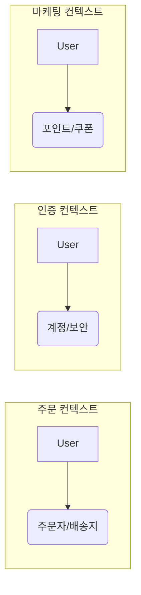
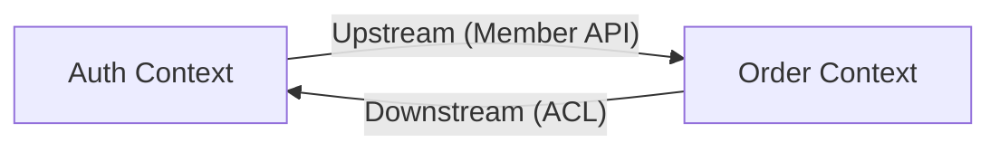

도메인 주도 설계(Domain-Driven Design, DDD)에서 가장 중요한 전략적 설계 도구는 바운디드 컨텍스트(Bounded Context)다.

- 모델의 경계: 특정 도메인 모델과 보편적 언어가 일관되게 적용되는 명시적인 범위
- 언어의 응집성: 경계 내부에서 모든 용어는 하나의 명확한 의미를 가짐
- 팀의 자율성: 각 컨텍스트가 독립적인 모델을 가짐으로써 팀 간의 간섭 최소화

## 하나의 거대한 모델이 실패하는 이유

모든 비즈니스 요구사항을 하나의 모델(Unified Model)로 해결하려는 시도는 모델 충돌(Model Conflict)로 인해 실패한다.



- 모델의 모호함: `User`라는 객체가 각 컨텍스트마다 필요한 정보와 의미가 다름
- 유지보수의 어려움: 하나의 필드를 수정할 때 시스템 전체의 수많은 의존성을 확인 필요
- 소통의 혼선: 동일한 단어를 서로 다른 의미로 사용하면서 팀 간의 오해 발생
- 기술적 한계: 거대한 모델은 데이터베이스 스키마를 비대하게 만들어 성능 저하를 유발

## 하위 도메인과 바운디드 컨텍스트의 관계

DDD 설계에서 문제 영역(Problem Space)과 해결 영역(Solution Space)을 구분하는 것은 매우 중요하다.

|        구분         |     관점      |            설명            |
|:-----------------:|:-----------:|:------------------------:|
| 하위 도메인(Subdomain) | 비즈니스 문제 영역  | 해결해야 할 비즈니스 문제 그 자체를 정의  |
|   바운디드 컨텍스트(BC)   | 소프트웨어 해결 모델 | 문제를 해결하기 위한 소프트웨어 모델의 경계 |

- 문제와 해결의 매핑: 하위 도메인이 비즈니스 관점의 영역이라면, 바운디드 컨텍스트는 실제 구현되는 모델의 물리적 경계
- 매핑의 유연성: 이상적으로는 1:1 매핑이 권장되지만, 현실적으로는 하나의 컨텍스트가 여러 하위 도메인을 포함하거나 그 반대의 경우도 가능

같은 개념(예: 사용자)이라도 각 바운디드 컨텍스트의 목적에 맞게 클래스를 분리하여 정의한다.

### 1. 인증 컨텍스트 (Auth Context)

인증 시스템에서는 보안과 계정 상태가 핵심이다.

```java
package com.example.auth.domain;

public class Member {

    private Long id;
    private String email;
    private String password;
    private AccountStatus status; // ACTIVE, BLOCKED

    public void changePassword(String newPassword) {
        // 비밀번호 변경 로직
    }
}
```

### 2. 주문 컨텍스트 (Order Context)

주문 시스템에서는 배송지 정보와 주문자로서의 역할이 중요하다.

```java
package com.example.order.domain;

public class Member {

    private Long id;
    private String name;
    private Address defaultAddress;
    private Grade grade; // VIP, GOLD, SILVER

    public boolean canOrder() {
        // 주문 가능 여부 판단 로직
        return true;
    }
}
```

- 패키지 분리: `com.example.auth`와 `com.example.order`처럼 패키지 수준에서 경계를 명확히 함
- 모델 최적화: 각 도메인은 자신의 맥락에 필요한 속성과 행위만 포함하여 모델 단순화

## 컨텍스트 맵 (Context Map)

컨텍스트 맵은 여러 바운디드 컨텍스트 간의 관계와 데이터 흐름을 시각화한 설계도다.



- 관계의 명시: 어떤 컨텍스트가 정보를 제공(Upstream)하고 소비(Downstream)하는지 정의
- 통합 방식의 선택: 두 컨텍스트가 모델을 공유(Shared Kernel)할지, 독립적으로 유지할지 결정

## 부패 방지 계층 (Anti-Corruption Layer, ACL)

ACL은 외부 시스템의 모델이 자신의 도메인을 오염시키는 것을 방지하기 위해 모델 변환(Translation)을 담당하는 계층이다.

```java
package com.example.order.infrastructure.auth;

@Component
public class AuthClientAdapter {

    private final AuthClient authClient;

    public OrderMember getMember(Long memberId) {
        // 외부 DTO 수신
        MemberResponse response = authClient.fetchMember(memberId);

        // 자신의 도메인 모델로 변환 (Mapping)
        return new OrderMember(
                response.id(),
                response.name(),
                Grade.BRONZE
        );
    }
}
```

- 모델 보호: 외부 컨텍스트의 변경이 내부 도메인 로직으로 침투하지 못하도록 방어함
- 명시적 번역: 수신한 데이터를 자신의 맥락에 맞는 필드와 타입으로 재구성함

## 팀 구조와 마이크로서비스 (Microservices)

바운디드 컨텍스트의 경계는 팀의 조직 구조 및 물리적 서비스 단위와 밀접하게 연결된다.

- 콘웨이의 법칙: 시스템 아키텍처는 조직의 소통 구조를 반영하며, 가급적 하나의 팀이 하나의 컨텍스트를 전담
- 서비스 매핑: 하나의 바운디드 컨텍스트가 반드시 하나의 마이크로서비스로 매핑되는 것은 아니며, 구현 방식에 따라 다양한 배포 전략이 가능
- 자율적 진화: 명확한 경계를 통해 각 팀은 내부 기술 스택이나 데이터 모델을 독립적으로 선택

바운디드 컨텍스트를 통해 우리는 복잡한 도메인을 논리적으로 분리하고, 각 영역이 자신의 언어로 독립적으로 발전할 수 있는 토대를 마련한다.
