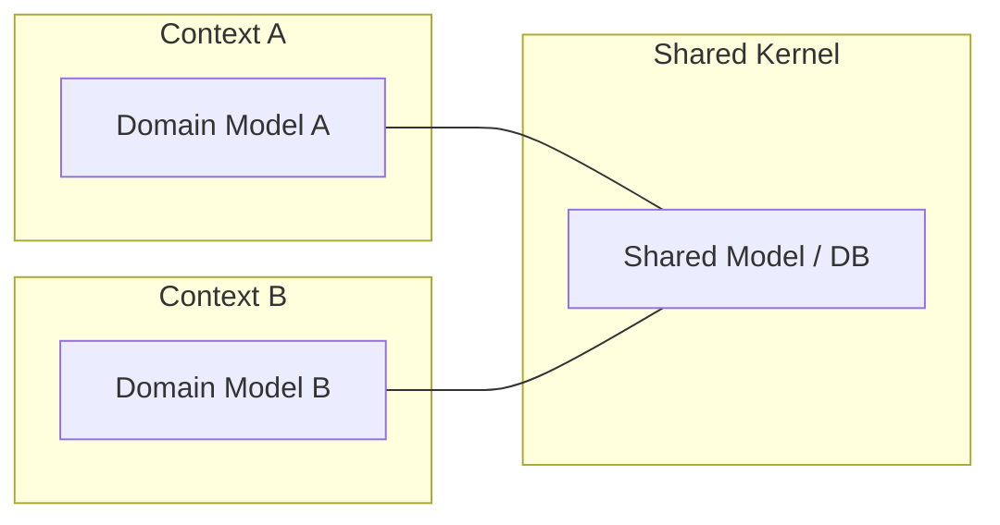
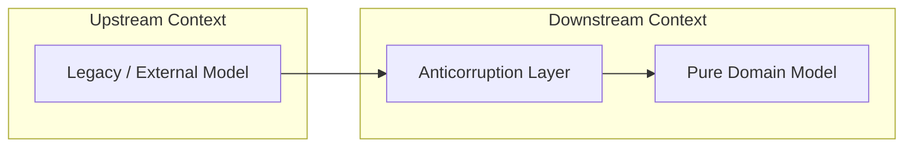

바운디드 컨텍스트는 독립적으로 모델링되지만, 실제 시스템에서는 서로 데이터를 주고받거나 협력해야 하기 때문에 이러한 경계 간의 관계와 통합 방식을 명시적으로 정의하는 컨텍스트 매핑이 필요하다.

## 컨텍스트 간의 협력 패턴

비즈니스 요구사항과 팀 간의 관계에 따라 적절한 협력 패턴을 선택해야 한다.

### Shared Kernel (공유 커널)

두 컨텍스트가 모델의 일부나 데이터베이스 설계를 공유하는 방식이다.



- 강한 결합: 공유 영역의 모델 변경이 두 컨텍스트 모두에게 영향
- 관리 비용: 변경 시 두 팀 간의 긴밀한 협의와 동기화 필수
- 권장 상황: 소규모 팀이 밀접하게 협업하며 공통 핵심 로직을 공유할 때 사용

### Customer-Supplier (고객-공급자)

상위(Upstream) 팀과 하위(Downstream) 팀의 관계가 명확하며, 상위 팀이 하위 팀의 요구를 어느 정도 수용하는 방식이다.

- Upstream (U): 기능을 제공하거나 데이터를 공급하는 쪽
- Downstream (D): 제공된 기능을 소비하거나 데이터를 사용하는 쪽
- 협력 구조: 공급자는 고객의 피드백을 우선순위에 반영하여 인터페이스 개선

### Conformist (준수자)

하위 팀이 상위 팀의 모델을 그대로 수용하여 자신의 도메인 모델로 사용하는 방식이다.

- 발생 배경: 상위 시스템이 매우 거대하거나, 하위 팀의 요구사항을 반영할 의사가 없을 때 발생
- 영향: 상위 시스템의 변화에 하위 시스템이 종속되며, 모델의 유연성 저하

## 격리 및 방어 패턴

상위의 변경이 하위 도메인의 순수성을 해치지 않도록 방어막을 구축하는 전략이다.

### ACL (Anticorruption Layer, 완충 계층)

하위 팀이 상위 팀의 모델에 오염되지 않도록 중간에 변환 계층을 두어 자신의 도메인 모델을 보호하는 가장 권장되는 방식이다.



- 역할: 외부 모델의 인터페이스를 하위 팀의 도메인 언어로 번역
- 구현 방식: 어댑터(Adapter)와 번역기(Translator)를 조합하여 외부 데이터 구조를 내부 엔티티로 변환

#### ACL 구현 사례 (Java)

외부 결제 시스템(Upstream)의 데이터를 내부 주문 시스템(Downstream) 모델로 변환하는 예시다.

```java
// Downstream Domain Model
public record PaymentStatus(String transactionId, boolean isSuccess) {

}

// ACL - Client Interface
public interface ExternalPaymentClient {

    PaymentResponse getPaymentInfo(String orderId);
}

// ACL - Implementation (Translator)
@Service
public class PaymentACLService {

    private final ExternalPaymentClient paymentClient;

    public PaymentStatus getTranslatedStatus(String orderId) {
        // 외부 모델(Upstream) 호출
        PaymentResponse response = paymentClient.getPaymentInfo(orderId);

        // 내부 도메인 모델(Downstream)로 변환 (Anticorruption)
        return new PaymentStatus(
                response.getRemoteId(),
                "COMPLETED".equals(response.getStatusCode())
        );
    }
}
```

### Open Host Service (공개 호스트 서비스)

상위 팀이 다수의 하위 팀을 위해 표준화된 프로토콜이나 공용 API를 제공하는 방식이다.

- 특징: 개별 고객의 요구를 일일이 대응하는 대신, 범용적인 인터페이스 정의
- 기술적 구현: RESTful API, gRPC, 공용 메시지 스키마 정의

## 컨텍스트 매핑 패턴 비교

|        패턴         |  결합도  |    핵심 특징     |        권장 상황         |
|:-----------------:|:-----:|:------------:|:--------------------:|
|   Shared Kernel   | 매우 높음 | 모델/DB 직접 공유  |    소수 정예 팀의 빠른 개발    |
| Customer-Supplier |  중간   | 상위가 하위 요구 반영 |      사내 팀 간 협업       |
|    Conformist     |  높음   | 상위 모델 무조건 수용 |  외부 패키지나 거대 시스템 연동   |
|        ACL        |  낮음   | 중간 변환 계층 존재  | 레거시 연동 및 도메인 보호 필요 시 |
| Open Host Service |  낮음   |  표준 프로토콜 제공  |  공용 플랫폼이나 라이브러리 개발   |
