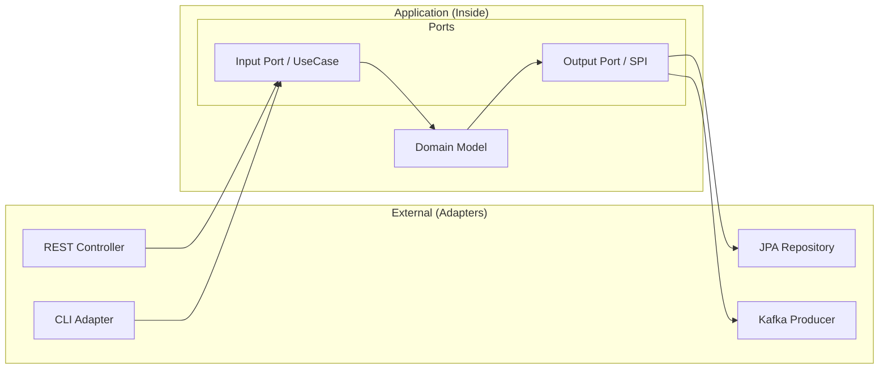
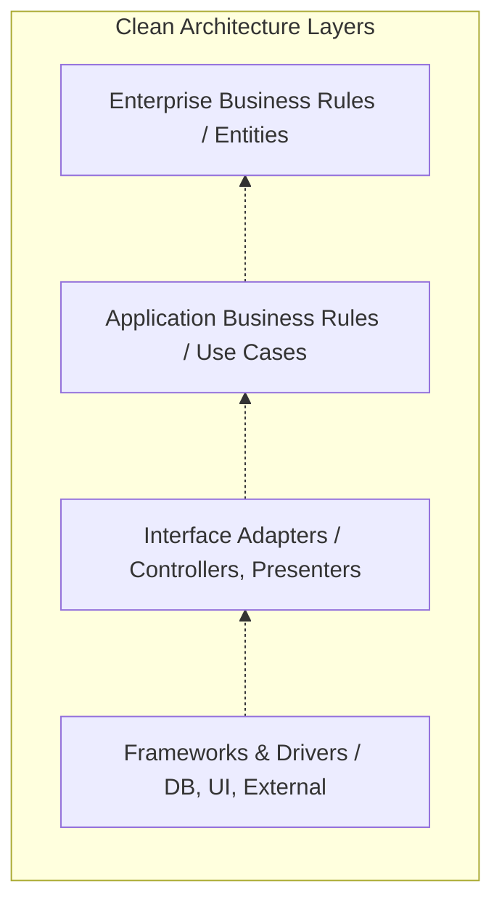

도메인 모델의 순수성을 유지하고 기술적 세부 사항으로부터 비즈니스 로직을 격리하기 위해서는 적절한 아키텍처 선택이 필수적이다.

## 계층형 아키텍처와 의존성 역전

전통적인 계층형 아키텍처는 상위 계층이 하위 계층에 의존하는 구조를 가진다.

- 데이터베이스 중심 설계의 한계: 비즈니스 로직이 영속성 계층에 종속되어 도메인 모델이 데이터베이스 구조에 얽매이는 현상 발생
- 의존성 역전 원칙(DIP) 적용: 도메인 계층이 인프라스트럭처 계층의 구체적인 구현이 아닌 추상화된 인터페이스에 의존하도록 설계
- 도메인 중심 의존성: 모든 의존성이 도메인 모델을 향하도록 하여 핵심 비즈니스 로직의 독립성 확보

## 헥사고날 아키텍처 (Ports and Adapters)

Alistair Cockburn이 제안한 헥사고날 아키텍처는 시스템의 내부(애플리케이션)와 외부(인프라스트럭처)를 명확히 분리하고, 그 경계를 포트와 어댑터로 정의하는 데 집중한다.

- 대칭성 강조: 외부 사용자(Driving)와 외부 시스템(Driven)을 동일한 위상의 어댑터로 취급하여 애플리케이션 코어와 연결
- 포트(Port): 애플리케이션 코어가 외부와 소통하기 위해 정의한 기술 독립적인 인터페이스
- 어댑터(Adapter): 특정 기술(REST, JPA, Kafka)을 사용하여 포트를 구현하거나 호출하는 구체적인 모듈
- 테스트 용이성: 포트를 통해 외부 환경을 모킹하기 쉬워 비즈니스 로직의 독립적인 검증이 가능함

## 클린 아키텍처 (Clean Architecture)

Robert C. Martin이 제안한 클린 아키텍처는 헥사고날, 양파(Onion) 아키텍처 등을 통합하여 더 정교한 계층 구조와 엄격한 의존성 규칙을 제시한다.

- 의존성 규칙(The Dependency Rule): 모든 소스 코드 의존성은 반드시 안쪽(고수준 정책)을 향해야 함
- 계층적 추상화: 내부로 갈수록 비즈니스 규칙의 추상화 수준이 높아지며 외부 변화에 영향을 받지 않음

## 클린 아키텍처와 헥사고날의 관계

클린 아키텍처는 헥사고날 아키텍처의 아이디어를 확장하고 구체화한 슈퍼셋(Superset) 개념에 가깝다.

- 관심사의 차이: 헥사고날이 내부와 외부의 경계(Boundary) 관리에 집중한다면, 클린 아키텍처는 내부 영역의 계층적 구조화에 더 집중함
- 내부 구조의 명시성: 헥사고날은 내부 구성을 구체적으로 강제하지 않지만, 클린 아키텍처는 엔티티와 유스케이스를 명확히 분리함
- 포트와 어댑터의 위치: 클린 아키텍처의 인터페이스 어댑터 계층이 헥사고날의 포트와 어댑터 개념을 포함하는 구조임
- 보완적 활용: 실무에서는 외부와의 연결은 헥사고날의 포트와 어댑터 구조를 따르고, 내부 로직은 클린 아키텍처의 유스케이스와 엔티티로 나누어 설계하는 방식이 일반적임

|   구분   |      헥사고날 아키텍처      |         클린 아키텍처          |
|:------:|:-------------------:|:------------------------:|
| 핵심 은유  |    포트와 어댑터 (연결성)    |       동심원 계층 (추상화)       |
| 주요 목표  |    외부 기술로부터의 독립     |     비즈니스 규칙의 계층적 보호      |
| 내부 규정  | 낮음 (Inside 영역의 자유도) |    높음 (엔티티, 유스케이스 명시)    |
| 의존성 방향 |       내부를 향함        | 내부를 향함 (Dependency Rule) |

## 도메인 모델 보호와 매핑 전략

아키텍처의 핵심 목적은 도메인 모델을 기술적 오염으로부터 보호하는 것이다. 이를 위해 계층 간 데이터를 이동시킬 때의 매핑 전략을 선택해야 한다.

- 매핑하지 않기(No Sharing): 모든 계층에서 동일한 도메인 객체를 공유하며 구현이 간단하지만 외부 요구사항에 도메인이 오염될 위험이 큼
- 양방향 매핑(Two-Way Mapping): 각 계층이 전용 모델(DTO, Domain, Entity)을 유지하며 서로 변환하여 도메인 순수성을 보호함
- 전방향 매핑(Full Mapping): 유스케이스별로 전용 입력/출력 모델을 사용하여 결합도를 최소화하며 복잡도가 높은 도메인에 적합함

## 아키텍처 선택의 트레이드오프

모든 프로젝트에 복잡한 아키텍처가 필요한 것은 아니며, 도메인의 복잡도와 프로젝트의 규모에 따라 적절한 수준을 선택해야 한다.

- 단순 서비스: 전통적인 3계층 아키텍처로도 충분하며 과도한 추상화는 오히려 개발 생산성을 저하시킬 수 있음
- 복잡한 비즈니스 로직: 규칙이 빈번하게 변경되거나 외부 연동 시스템이 많은 경우 헥사고날이나 클린 아키텍처가 유리함
- 장기 유지보수: 기술 스택 교체 가능성이 있거나 독립적인 도메인 테스트가 중요한 경우 높은 설계 비용을 감수할 가치가 있음
