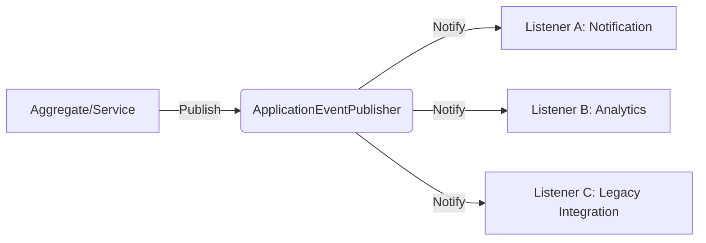

도메인 이벤트(Domain Event)는 도메인 모델 내에서 발생한 비즈니스적으로 의미 있는 사건을 표현하며, 시스템의 여러 구성 요소 간에 느슨한 결합(Loose Coupling)을 유지하며 협력할 수 있는
메커니즘을 제공한다.

## 도메인 이벤트의 정의와 발생 시점

도메인 이벤트는 "과거에 발생한 일"을 나타내며, 대개 과거 시점의 동사형으로 명명한다.

- 핵심 개념: 도메인 전문가가 중요하게 여기는 상태의 변화나 사건을 추상화한 객체
- 명명 규칙: `OrderCreated`, `PaymentCompleted`, `ShippingStarted` 등과 같이 발생한 사실을 명확히 표현
- 구성 요소: 이벤트가 발생한 시간, 관련 엔티티의 식별자, 변경된 속성 등 최소한의 컨텍스트를 포함

### 이벤트 발생 시점 결정

이벤트는 도메인 객체의 상태가 완전히 변경되어 비즈니스 규칙이 충족된 직후에 발행한다.

```java
public class Order {

    public void cancel() {
        verifyCanCancel();
        this.status = OrderStatus.CANCELED;
        // 도메인 로직 완료 후 이벤트 생성
        registerEvent(new OrderCanceledEvent(this.id, LocalDateTime.now()));
    }
}
```

## 이벤트 기반 협력의 이점

이벤트를 활용하면 직접적인 메서드 호출로 얽혀 있던 시스템을 기능적으로 분리할 수 있다.

- 결합도 낮추기: 주문 시스템이 알림 시스템의 존재를 몰라도 알림 발송 유스케이스 수행 가능
- 확장성 향상: 새로운 후속 조치(예: 통계 수집, 로그 저장)가 필요할 때 기존 코드 수정 없이 리스너만 추가
- 성능 개선: 즉각적인 응답이 필요 없는 부가 기능을 비동기로 처리하여 사용자 응답 속도 향상

## 이벤트 발행과 구독 메커니즘 - Spring Framework

Spring 프레임워크 환경에서는 `ApplicationEventPublisher`와 `@EventListener`를 활용하여 내부 이벤트를 간편하게 처리한다.

### 이벤트 발행 및 처리 흐름



- `@EventListener`: 동일한 트랜잭션 내에서 동기적으로 이벤트를 처리
- `@TransactionalEventListener`: 발행 주체의 트랜잭션 상태(성공/실패)에 맞춰 실행 시점을 제어 (기본값은 `AFTER_COMMIT`)
- 비동기 처리: `@Async`를 조합하여 주 로직의 성능 영향 없이 병렬로 후속 작업 수행

## 최종 일관성 보장 전략

분산 시스템이나 마이크로서비스 환경에서는 여러 서비스에 걸친 데이터 무결성을 보장하기 위해 강력한 일관성(Strong Consistency) 대신 최종 일관성(Eventual Consistency) 모델을 채택한다.

- 트랜잭션과 2PC: 여러 노드에 걸쳐 원자성을 보장하지만 성능과 가용성 면에서 한계 존재
- 최종 일관성: 도메인 이벤트를 비동기로 전파하여 시스템 간의 격리를 유지하고 결과적으로 일관된 상태 달성
- 신뢰성 있는 이벤트 발행: 2PC 없이도 이벤트 발행의 원자성을 보장하기
  위해 [Transactional Outbox 패턴](/docs/large-scale-system/transactional-outbox-pattern/)을 활용

도메인 이벤트를 통해 각 애그리거트는 자신의 책임에만 집중하며, 시스템 전체는 유연하고 견고한 협력 구조를 유지하게 된다.
