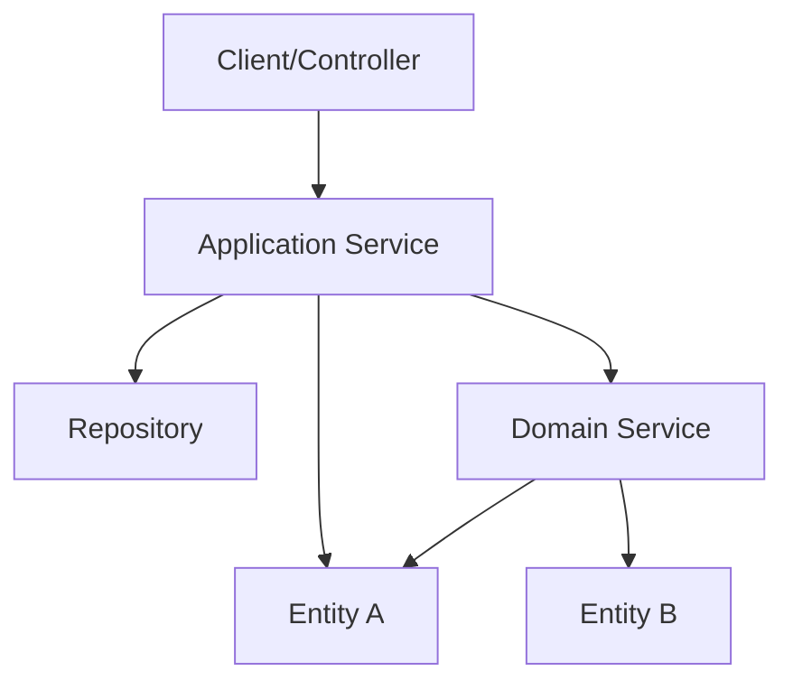

## 도메인 서비스 (Domain Service)

도메인 서비스는 상태를 가지지 않고(Stateless), 특정 엔티티나 밸류 오브젝트에 자연스럽게 포함될 수 없는 도메인 로직을 처리하는 객체다.

- 행위 중심의 모델링: 상태가 아닌 도메인 고유의 행위를 표현하는 데 집중
- 독립적 존재: 엔티티의 일부가 아닌 별도의 서비스 객체로 정의
- 복합 로직 처리: 여러 도메인 객체를 조작하거나 외부 시스템과의 연동이 필요한 경우 활용

비즈니스 로직이 여러 애그리거트나 엔티티를 가로지르는 경우, 이를 특정 엔티티에 억지로 넣으면 객체의 책임이 모호해지고 응집도가 떨어진다.

### 잘못된 설계 - 엔티티에 로직 강제 결합

계좌 이체 로직을 어느 한 계좌 엔티티(Account)에 구현하는 경우를 가정한다.

```java
public class Account {

    private Long id;
    private Money balance;

    // 잘못된 예: 출금 계좌가 입금 계좌의 내부 상태 변경 주도
    public void transfer(Account target, Money amount) {
        if (this.balance.isLessThan(amount)) {
            throw new InsufficientBalanceException();
        }
        this.balance = this.balance.minus(amount);
        target.deposit(amount); // 다른 애그리거트의 상태를 직접 조작
    }
}
```

- 책임의 모호성: 출금 계좌가 입금 계좌의 입금 로직까지 관리하는 과도한 책임을 가짐
- 낮은 응집도: 계좌 엔티티가 자신의 데이터 관리 외에 '이체'라는 도메인 프로세스 전체를 알아야 함
- 결합도 증가: 두 계좌 객체가 서로 강하게 결합되어 독립적인 변경이 어려움

### 올바른 설계 - 도메인 서비스 활용

이체라는 행위 자체를 독립적인 도메인 서비스로 분리하여 각 엔티티는 자신의 책임에만 집중하게 한다.

```java
public class TransferService {

    public void transfer(Account from, Account to, Money amount) {
        // 도메인 서비스가 두 애그리거트 간의 협력 조율
        from.withdraw(amount);
        to.deposit(amount);
    }
}
```

- Account: 자신의 잔액을 증감시키는 원자적 기능에만 집중 (높은 응집도)
- TransferService: '이체'라는 비즈니스 규칙과 프로세스를 담당 (명확한 책임 분리)

### 도메인 서비스의 특징

- 행위 중심의 모델링: 상태가 아닌 도메인 고유의 행위를 표현하는 데 집중
- 독립적 존재: 엔티티의 일부가 아닌 별도의 서비스 객체로 정의
- 복합 로직 처리: 여러 도메인 객체를 조작하거나 외부 시스템과의 연동이 필요한 경우 활용

## 도메인 서비스 vs 애플리케이션 서비스

도메인 서비스와 애플리케이션 서비스는 모두 서비스라는 명칭을 사용하지만, 담당하는 책임과 계층이 다르다.

|   구분   |        도메인 서비스        |          애플리케이션 서비스           |
|:------:|:---------------------:|:-----------------------------:|
| 소속 계층  | 도메인 계층 (Domain Layer) | 애플리케이션 계층 (Application Layer) |
| 주요 책임  |     비즈니스 핵심 로직 처리     |   유스케이스 구현, 흐름 제어, 트랜잭션 관리    |
| 도메인 지식 |     핵심 비즈니스 규칙 포함     |      도메인 로직을 직접 포함하지 않음       |
| 외부 연동  |   인프라스트럭처 인터페이스 활용    |     리포지토리, 도메인 서비스 등을 조합      |



도메인 서비스는 '어떻게 비즈니스 문제를 해결하는가'에 집중하며, 애플리케이션 서비스는 '어떻게 시스템이 사용자의 요청을 처리하는가'라는 오케스트레이션에 집중한다.

## 팩토리 (Factory)

애그리거트나 엔티티의 생성 로직이 복잡해지면, 이를 생성자(Constructor)만으로 해결하기 어려워진다.

- 생성 로직의 캡슐화: 복잡한 초기화 과정이나 유효성 검사 로직을 숨김
- 애그리거트 루트의 보호: 생성 과정에서 모든 필수 데이터가 올바르게 설정되었는지 확인
- 결합도 감소: 객체 생성 방식의 변경이 이를 사용하는 코드에 영향을 주지 않도록 격리

팩토리는 복잡한 객체 생성 로직을 캡슐화하여 도메인 모델의 무결성을 보장하고 클라이언트 코드의 부담을 줄인다.

```java
public class OrderFactory {

    public static Order createOrder(Long memberId, List<OrderItemRequest> items, Address address) {
        validateOrderItems(items);
        List<OrderItem> orderItems = items.stream()
                .map(item -> new OrderItem(item.getProductId(), item.getQuantity()))
                .collect(Collectors.toList());

        return new Order(memberId, orderItems, address, LocalDateTime.now());
    }
}
```

## 도메인 서비스 남용 주의

도메인 서비스를 무분별하게 사용하면 비즈니스 로직이 엔티티가 아닌 서비스로 쏠리는 현상이 발생한다.

- 엔티티 우선 원칙: 로직을 엔티티에 넣을 수 있는지 먼저 검토
- 서비스 최소화: 상태를 직접 변경하는 로직은 최대한 엔티티 내부에서 수행
- 책임 분리: 서비스는 엔티티들이 스스로 할 수 없는 일을 돕는 조정자 역할에 충실

도메인 서비스는 최후의 수단으로 활용하며, 핵심 비즈니스 로직은 가능한 한 엔티티와 밸류 오브젝트 내부에 응집시키는 것이 바람직하다.
