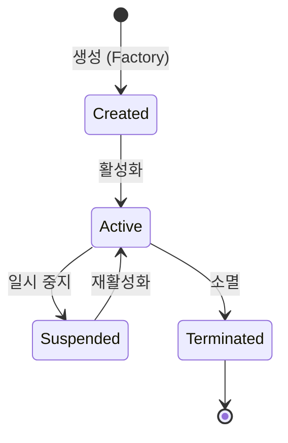

엔티티(Entity)는 도메인 모델에서 고유한 식별자를 가지며, 시간에 따라 상태가 변하더라도 그 정체성을 유지하는 객체를 의미한다.

## 엔티티의 핵심 속성 - 식별자와 연속성

도메인 모델에서 엔티티를 정의하는 가장 중요한 요소는 식별자와 생명주기다.

- 고유 식별자(Identity): 속성 값이 동일하더라도 식별자가 다르면 서로 다른 객체로 취급
- 연속성(Continuity): 생성부터 소멸까지 상태가 변해도 동일한 존재로 추적 가능
- 생명주기(Lifecycle): 도메인 내에서 명확한 시작과 끝을 가지며 영속성 저장소와 연동

### 식별자 생성 전략 비교

식별자는 도메인의 성격과 기술적 제약 사항을 고려하여 적절한 방식을 선택한다.

|    전략     |              설명              |         장점         |         단점         |
|:---------:|:----------------------------:|:------------------:|:------------------:|
| DB 자동 생성  | `AUTO_INCREMENT`, `SEQUENCE` |  구현이 단순하고 관리가 용이함  | DB 저장 전까지 식별자 미확정  |
|   직접 할당   |    비즈니스 의미가 있는 키 (이메일 등)     |    도메인 의미가 명확함     |  변경 시 식별자 정체성 흔들림  |
|   UUID    |       전역적으로 유효한 고유값 생성       | DB 의존성 없이 즉시 확정 가능 | 인덱싱 성능 저하 및 가독성 부족 |
| Snowflake |        시간 기반 분산 ID 생성        |  정렬 가능하며 성능이 우수함   | 별도의 생성 로직 및 인프라 필요 |

## 풍부한 도메인 모델 (Rich Domain Model)

엔티티는 자신의 상태를 기반으로 도메인 규칙을 검증하고 비즈니스 로직을 수행해야 한다.

### 행동 중심 설계 예시

```java
public class Order {

    private OrderId id;
    private OrderStatus status;
    private List<OrderLine> orderLines;
    private Money totalAmount;

    // 비즈니스 의미가 담긴 행위
    public void cancel() {
        verifyCanCancel();
        this.status = OrderStatus.CANCELED;
        publishEvent(new OrderCanceledEvent(this.id));
    }

    private void verifyCanCancel() {
        if (status != OrderStatus.PENDING) {
            throw new IllegalStateException("준비 중인 주문만 취소할 수 있습니다.");
        }
    }
}
```

- 캡슐화와 무결성: 내부 상태 변경을 외부에 노출하지 않고 메서드를 통해서만 허용
- 규칙 자가 검증: 유효하지 않은 상태 전이를 객체 스스로 차단
- 도메인 언어 사용: `setStatus` 대신 `cancel`과 같이 비즈니스 용어로 의도를 표현

## 엔티티의 생명주기와 상태 전이

엔티티는 시간에 따라 여러 상태를 거치며, 각 단계마다 도메인 규칙이 적용된다.



- 생성 시점: 필수 속성 누락 여부와 초기 도메인 규칙 검증 수행
- 영속화: 영속성 컨텍스트를 통해 메모리상의 엔티티와 DB 레코드 동기화
- 상태 변경: 변경 전후의 비즈니스 일관성 보장 및 도메인 이벤트 발행

## 설계 시 주의 사항

### 엔티티의 크기 제어

엔티티가 너무 많은 책임을 가지면 유지보수가 어려워진다.

- SRP 준수: 하나의 엔티티는 하나의 핵심 도메인 개념만 표현
- VO 활용: 식별자가 필요 없는 속성들은 밸류 오브젝트로 분리하여 응집도 향상
- 경계 설정: 애그리거트 루트를 통해 엔티티 간의 결합도 관리

### 영속성 계층과의 분리 전략

기술적 제약이 도메인 모델에 침투하는 것을 방지하기 위해 분리 전략을 고려할 수 있다.

- 순수 도메인 엔티티: 프레임워크 의존성 없이 비즈니스 로직에만 집중하는 객체
- JPA 엔티티: 데이터베이스 매핑 설정을 위한 기술적 구현체
- 실용적 접근: 복잡도가 낮다면 JPA 엔티티에 도메인 로직을 직접 포함하는 방식도 유효함

영속성 기술이 바뀌더라도 도메인 로직은 변하지 않아야 한다는 원칙을 기억하며, 적절한 추상화 수준을 결정한다.
