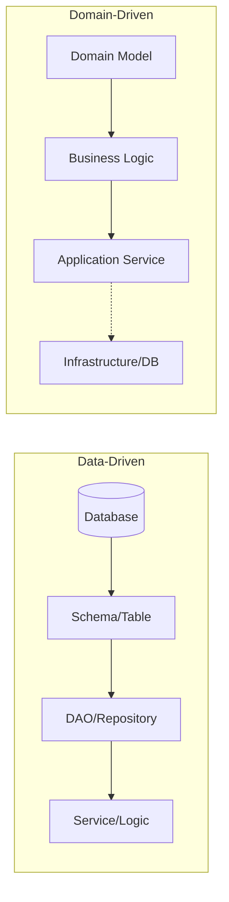
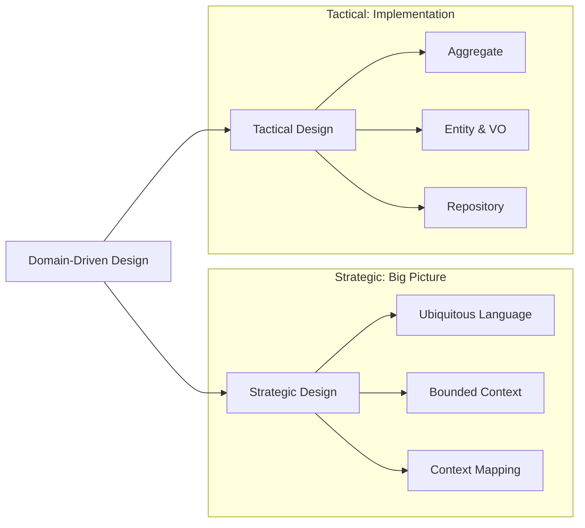

소프트웨어 개발 과정에서 직면하는 가장 큰 어려움 중 하나는 비즈니스 로직의 복잡성이다.

- 시스템의 비대화: 성장에 따라 코드가 커지고 복잡해지는 현상
- 설계 의도의 소실: 시간이 흐름에 따라 초기 설계 의도가 흐릿해지는 문제
- 부수 효과의 발생: 작은 변경 하나가 예상치 못한 오류를 유발하는 위험

이러한 복잡성을 근본적으로 해결하기 위해 도메인 주도 설계(Domain-Driven Design, DDD) 방법론을 활용한다.

## 소프트웨어의 복잡성과 도메인의 이해

사용자의 비즈니스 문제를 해결하기 위해 다루는 핵심 영역을 도메인(Domain)이라 부른다.

- 도메인 중심 모델링: 기술적인 구현보다 비즈니스 규칙 자체의 구조화에 집중
- 전문가 협업: 개발자가 기술적 레이어에 매몰되기 전 도메인 전문가와 함께 문제를 정의
- 코드 반영: 정의된 도메인 모델을 가감 없이 코드로 옮기는 과정이 DDD의 출발점

## 데이터 중심 설계 vs 도메인 중심 설계

전통적인 방식과 DDD의 가장 큰 차이는 설계의 출발점과 중심축에 있다.

### 데이터 중심 설계 (Data-Driven Design)

데이터베이스 스키마를 먼저 정의하고 그 위에 CRUD 로직을 얹는 구조를 가진다.

- 빈약한 도메인 모델: 객체가 데이터를 담는 구조체 역할에 국한되어 비즈니스 로직이 부재함
- 로직의 파편화: 중요한 비즈니스 규칙이 여러 서비스 레이어에 절차지향적으로 분산됨
- 높은 결합도: 데이터베이스 구조 변경이 애플리케이션 전반에 직접적인 영향을 미침

### 도메인 중심 설계 (Domain-Driven Design)

데이터베이스 제약 조건보다 비즈니스 제약 조건을 우선하여 객체가 데이터와 행위를 모두 가지도록 설계한다.

- 풍부한 도메인 모델: 객체가 스스로 비즈니스 규칙을 검증하고 수행하는 능동적인 구조
- 유연한 변경 대응: 요구사항 변경 시 도메인 모델 수정을 통해 비즈니스 의도를 명확히 반영
- 관심사 분리: 영속성 메커니즘과 도메인 로직을 분리하여 핵심 코드의 순수성 유지

## DDD의 핵심 구성 요소

DDD는 전략적 설계로 큰 방향을 잡고 전술적 설계로 세부 내용을 구현한다.

### 전략적 설계 (Strategic Design)

비즈니스 도메인의 복잡성을 관리하기 위해 전체적인 큰 그림을 그리는 단계다.

- 보편적 언어: 도메인 전문가와 개발자가 공통으로 사용하는 용어 체계 구축
- 바운디드 컨텍스트: 모델이 유효한 경계를 설정하여 용어의 혼선과 모델의 비대를 방지
- 컨텍스트 매핑: 서로 다른 컨텍스트 간의 관계와 데이터 흐름, 협력 방식 정의

### 전술적 설계 (Tactical Design)

바운디드 컨텍스트 내부에서 도메인 모델을 구현하기 위한 구체적인 패턴이다.

- 엔티티 및 밸류 오브젝트: 식별자를 가진 객체와 값을 표현하는 불변 객체의 명확한 구분
- 애그리거트: 데이터 변경의 일관성을 유지해야 하는 최소한의 단위로 객체를 그룹화
- 리포지토리: 애그리거트 단위의 영속성을 관리하고 저장소 구현을 추상화

## DDD 도입이 필요한 프로젝트

DDD는 만능 해결책이 아니므로 프로젝트의 성격에 따라 도입 여부를 신중히 결정해야 한다.

- 비즈니스 복잡도: 단순 CRUD 위주의 서비스보다 도메인 로직이 복잡하고 정교한 경우
- 협업의 중요성: 비즈니스 용어와 코드 간의 일치도가 시스템의 성공에 직결되는 경우
- 장기 유지보수: 시스템의 규모가 크고 지속적인 기능 확장이 필요한 대규모 프로젝트
- MSA 아키텍처: 바운디드 컨텍스트를 기반으로 마이크로서비스의 독립적인 경계를 설정하려는 경우

DDD는 소프트웨어를 바라보는 사고방식의 전환이며, 다음 포스팅부터 전략적 설계의 핵심인 보편적 언어를 다룬다.
