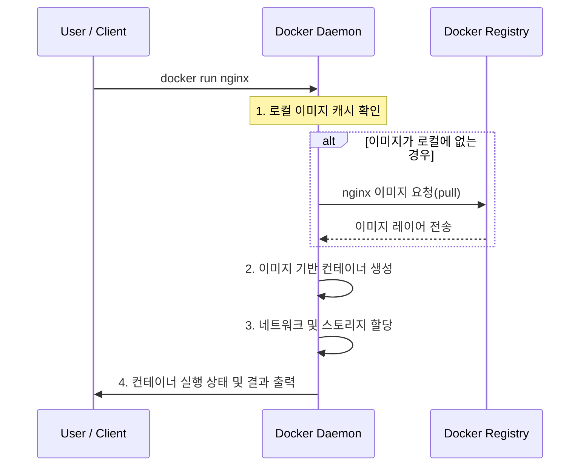

도커는 클라이언트-서버(C/S) 아키텍처를 기반으로 설계되었으며, 각 구성 요소가 REST API를 통해 상호작용하며 컨테이너의 생명주기를 관리한다.

## 도커의 클라이언트-서버 구조

도커 엔진은 사용자의 요청을 처리하는 서버와 요청을 보내는 클라이언트로 분리되어 동작하며, 사용자는 `docker` CLI(클라이언트)를 통해 명령을 입력하고, 이는 도커 데몬(서버)에 전달되어 처리된다.

- 도커 클라이언트(Docker Client): 사용자가 명령어를 입력하는 창구이며, 모든 명령은 내부적으로 REST API 요청으로 변환되어 데몬에게 전달
- 도커 데몬(Docker Daemon, `dockerd`): 실제 로직을 수행하는 주체로, 이미지 빌드 / 컨테이너 생성 및 실행 / 네트워크 관리 등 무거운 로직 수행

통신은 기본적으로 유닉스 도메인 소켓(`/var/run/docker.sock`)을 통해 이루어지며, 네트워크를 통한 원격 제어 시에는 TCP 소켓 활용하게 된다.

## 주요 구성 요소

도커는 세 가지 핵심 요소로 구성된다.

### Docker Client(CLI)

사용자가 도커와 통신하기 위해 사용하는 가장 기본적인 도구로, `docker run`, `docker build`와 같은 명령어를 입력하면 클라이언트는 이를 도커 데몬으로 전달한다.

- 사용자가 도커와 상호작용하기 위한 주 인터페이스(`docker` 명령어)
- 사용자의 입력을 받아 Docker Daemon에게 API 요청을 전송

### Docker Daemon(dockerd)

도커 호스트에서 백그라운드 프로세스로 실행되며, 이미지 구축, 컨테이너 실행, 네트워크 및 볼륨 관리 등 핵심 기능을 수행한다.

- 도커 엔진의 핵심 백그라운드 프로세스
- 이미지, 컨테이너, 네트워크, 볼륨과 같은 모든 도커 객체(Object)를 생성하고 관리하는 실질적인 주체

### Docker Registry

도커 이미지를 저장하고 배포하는 보관소다.

- Registry: Docker Hub와 같이 이미지가 저장되는 서비스 전체
- Repository: 동일한 이름의 이미지들이 태그(Tag)별로 모여 있는 집합(예: `nginx` 리포지토리에는 `1.21`, `latest` 등 다양한 버전의 이미지 존재)
- Public / Private: 전 세계 누구나 접근 가능한 Docker Hub 외에도 보안이 중요한 기업 환경에서는 AWS ECR 등을 사용하여 비공개 저장소 사용

## 도커 명령어 실행 흐름(`docker run` 예시)

1. 명령어 전달: 클라이언트가 요청을 파싱하여 `/var/run/docker.sock`을 통해 데몬에게 API 호출 수행
2. 이미지 확인: 데몬은 호스트의 로컬 저장소에 해당 이미지가 있는지 검사
3. 이미지 풀(Pull): 로컬에 이미지가 없을 경우 기본 설정된 레지스트리(Docker Hub 등)에서 이미지를 다운로드
4. 컨테이너 구동: 이미지를 읽기 전용 레이어로 배치하고 그 위에 쓰기 가능한 컨테이너 레이어를 생성한 후, 정의된 프로세스 실행
5. 상태 반환: 컨테이너의 표준 입출력(Standard Streams)을 클라이언트에 연결하여 사용자에게 실시간 로그 및 결과 전달
