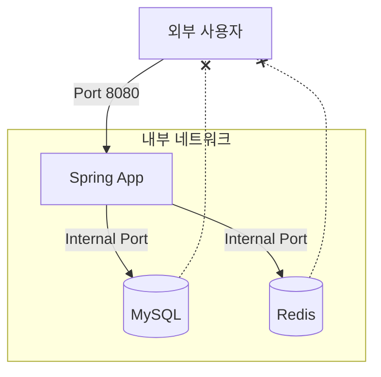

도커 컴포즈는 개별 컨테이너를 일일이 제어하는 대신 하나의 설정 파일을 통해 전체 시스템의 생명주기를 통합 관리할 수 있게 한다.

- 복잡한 서비스 환경을 코드로 관리(IaC)하기 위해 `docker-compose.yml` 파일을 사용
- 애플리케이션의 구성 요소인 서비스, 네트워크, 볼륨 등을 선언적으로 정의하여 실행 환경의 일관성 유지
- 단일 명령어로 여러 컨테이너의 생성, 실행, 중지, 삭제를 수행하여 개발 및 운영 생산성 향상

## docker-compose.yml 기본 구조

설정 파일은 크게 서비스, 네트워크, 볼륨 섹션으로 구분되어 전체 시스템의 아키텍처를 명시한다.

- services: 애플리케이션을 구성하는 각각의 컨테이너를 정의하며 가장 핵심적인 역할을 수행
- networks: 서비스 간 통신을 위한 가상 네트워크를 설정하며 외부 접근 차단 등 보안 정책 적용 가능
- volumes: 데이터 영속화를 위한 스토리지 설정으로 컨테이너 삭제 후에도 데이터 보존 가능

## 실무형 서비스 구성 예시 (Spring Boot, MySQL, Redis)

```yaml
services:
  # MySQL 데이터베이스 서비스
  database:
    image: mysql:8.0
    environment:
      MYSQL_DATABASE: myapp
      MYSQL_USER: myuser
      MYSQL_PASSWORD: mypassword
      MYSQL_ROOT_PASSWORD: rootpassword
    volumes:
      - db_data:/var/lib/mysql
    networks:
      # 내부 서비스용 네트워크만 할당하여 외부 접근 차단
      - backend_net
    healthcheck:
      # mysqladmin 도구를 사용하여 DB 서버가 응답 가능한 상태인지 주기적으로 점검
      test: [ "CMD", "mysqladmin", "ping", "-h", "localhost", "-u", "myuser", "-pmypassword" ]
      interval: 10s
      timeout: 5s
      retries: 5

  # Redis 캐시 서비스
  redis:
    image: redis:7-alpine
    networks:
      - backend_net

  # 스프링 부트 애플리케이션 서비스
  app:
    build:
      context: .
      dockerfile: Dockerfile
    ports:
      # 외부 브라우저나 클라이언트가 접근할 포트 매핑
      - "8080:8080"
    environment:
      # 컨테이너 서비스 이름을 호스트 주소로 사용
      SPRING_DATASOURCE_URL: jdbc:mysql://database:3306/myapp?allowPublicKeyRetrieval=true&useSSL=false
      SPRING_DATASOURCE_USERNAME: myuser
      SPRING_DATASOURCE_PASSWORD: mypassword
      SPRING_REDIS_HOST: redis
    depends_on:
      # 데이터베이스가 단순 시작이 아닌 헬스체크 결과 'healthy' 상태일 때 애플리케이션 시작
      database:
        condition: service_healthy
    networks:
      # 외부 통신(frontend)과 내부 통신(backend)을 모두 수행하도록 두 네트워크에 연결
      - frontend_net
      - backend_net

# 네트워크 정의 섹션
networks:
  # 외부와 연결되는 네트워크
  frontend_net:
    driver: bridge
  # 내부 서비스 전용 네트워크
  backend_net:
    driver: bridge
    # internal 옵션을 통해 이 네트워크에 연결된 컨테이너들의 외부 인터넷 통신 제한
    internal: true

# 볼륨 정의 섹션
volumes:
  db_data:
```

## 서비스 상세 설정

각 서비스 섹션에서는 컨테이너의 세부 스펙과 동작 방식을 정의한다.

- image vs build: 이미 구축된 이미지를 가져올지 혹은 특정 경로의 Dockerfile을 읽어 직접 빌드할지 결정
- ports: 호스트 머신의 포트와 컨테이너 내부 포트를 연결하여 외부 접근 허용
- depends_on: 서비스 간의 시작 순서를 정의하지만, 애플리케이션의 완전한 준비 상태까지 보장하지는 않음
    - 프로세스 시작뿐만 아니라 내부 로직 가동 여부까지 확인하려면 healthcheck와 연동 필수
- environment: DB 접속 정보나 API 키와 같은 동적인 설정값을 컨테이너 내부로 주입

## 네트워크 격리 및 데이터 관리

보안 강화를 위해 서비스별 접근 범위를 분리하고 중요 데이터의 영속성을 확보해야 한다.



- 네트워크 분리: 외부 인터넷과 연결되는 `frontend_net`과 내부 통신용 `backend_net`을 구분하여 설계
- internal 옵션: 데이터베이스와 캐시 서버를 내부 전용 네트워크에 배치하여 호스트 외부에서의 직접 접근을 원천 차단
- 명명된 볼륨(Named Volume): 도커가 관리하는 볼륨을 사용하여 호스트 경로 의존성을 낮추고 데이터 이식성 확보

### 네트워크 설계의 핵심 원리

신뢰할 수 없는 외부 망으로부터 핵심 데이터를 논리적으로 분리하는 것이 중요하다.

- 계층형 네트워크: 사용자 요청을 받는 애플리케이션 계층과 데이터를 처리하는 인프라 계층을 물리적으로 격리
- 접근 제어: 외부 사용자는 오직 한정된 진입로를 통해서만 시스템에 진입 가능
- 직접 연결 차단: `DB -.-x User`와 같이 외부에서 데이터베이스나 캐시로 직접 접근하는 경로는 차단하는 것이 보안상으로 권장

### 데이터 영속화 전략

컨테이너의 비영속적 특성을 극복하기 위해 볼륨 기술을 적절히 배분하여 사용한다.

- 데이터베이스 데이터: MySQL의 데이터 폴더(`/var/lib/mysql`)는 반드시 명명된 볼륨에 마운트하여 컨테이너 삭제 시에도 보호
- 설정 파일: 수정이 잦은 환경 설정 파일은 바인드 마운트를 사용하여 호스트에서 직접 관리하는 방식이 효율적
- 로그 데이터: 애플리케이션 로그는 볼륨에 저장하거나, 별도의 로그 드라이버를 통해 외부 로그 수집 시스템으로 전송
