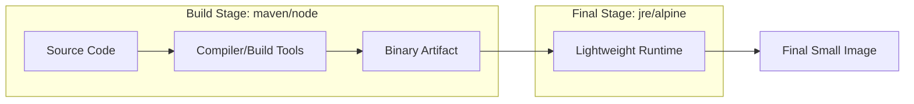

Dockerfile은 도커 이미지를 빌드하기 위한 일련의 명령어를 기록한 텍스트 기반의 설계도다.

- 코드 형태로 인프라를 정의함으로써 이미지 생성 과정을 자동화하고 동일한 환경 재현 가능
- `docker build` 명령어를 통해 Dockerfile을 실행하여 이미지를 생성

## 주요 명령어(Instruction) 상세

Dockerfile의 각 명령어는 이미지의 레이어를 형성하며, 효율적인 빌드를 위해 각 명령어의 특성을 정확히 이해해야 한다.

- FROM: 베이스 이미지를 지정하며 Dockerfile의 첫 줄은 반드시 이 명령어로 시작 필요
- WORKDIR: 명령어가 실행될 컨테이너 내의 작업 디렉터리를 설정하며, 해당 경로가 없으면 자동으로 생성
- COPY vs ADD
    - `COPY`: 호스트 컴퓨터의 파일을 컨테이너 내부로 단순 복사
    - `ADD`: 파일 복사 외에 원격 URL 다운로드 및 압축 파일(`.tar`, `.gz` 등) 자동 해제 기능을 포함하나, 의도치 않은 동작 방지를 위해 일반적인 복사는 `COPY` 사용이 권장
- RUN: 이미지를 빌드하는 동안 실행될 명령어로, 주로 패키지 설치나 환경 구축에 사용
- ENV vs ARG
    - `ENV`: 빌드 시점과 실행 중인 컨테이너 모두에서 유지되는 환경 변수
    - `ARG`: 오직 이미지 빌드 시점에만 유효한 변수로, `--build-arg` 옵션을 통해 외부에서 값을 주입 가능
- CMD vs ENTRYPOINT
    - `CMD`: 컨테이너가 시작될 때 실행될 기본 명령어 및 인자를 지정하며, `docker run` 시 전달된 인자에 의해 완전히 대체 가능
    - `ENTRYPOINT`: 컨테이너를 실행 파일처럼 동작하게 하며, `docker run` 시 전달된 인자가 뒤에 추가되는 형태로 동작

### 스프링 부트 애플리케이션 Dockerfile 예시

```dockerfile
# 1. 빌드 아규먼트 정의 (빌드 시 버전을 바꿀 수 있음)
ARG VERSION=17-jdk-slim

# 2. 베이스 이미지 설정
FROM openjdk:${VERSION}

# 3. 환경 변수 설정 (컨테이너 내부 런타임에 사용)
ENV APP_HOME=/app
ENV JAVA_OPTS="-Xms512m -Xmx512m"

# 4. 작업 디렉터리 설정
WORKDIR $APP_HOME

# 5. 빌드 시 필요한 변수 재정의
ARG JAR_FILE=build/libs/*.jar

# 6. 파일 복사 (빌드된 jar 파일을 컨테이너로 복사)
COPY ${JAR_FILE} app.jar

# 7. 컨테이너 실행 명령어 (ENTRYPOINT와 CMD의 조합)
# ENTRYPOINT는 고정 실행 명령, CMD는 기본 파라미터 역할을 수행
ENTRYPOINT ["java", "-jar", "app.jar"]
CMD ["--server.port=8080"]
```

## 빌드 컨텍스트와 .dockerignore

도커 빌드 성능과 이미지 크기는 빌드 컨텍스트 관리에 크게 의존한다.

- Build Context: `docker build` 명령어의 경로 인자로 지정된 디렉터리로, 이 내부의 모든 파일이 도커 데몬으로 전송
- `.dockerignore`: 빌드와 무관한 파일(`.git`, 로그, 로컬 의존성 폴더 등)을 전송 대상에서 제외하여 빌드 속도 향상 및 보안 강화

## 멀티 스테이지 빌드(Multi-stage Builds)

최종 배포 이미지에서 불필요한 빌드 도구를 제거하여 이미지 크기를 최적화하는 핵심 기법이다.



- 하나의 Dockerfile 내에서 여러 `FROM` 구문을 사용하여 단계를 분리
- 이전 단계(build stage)에서 생성된 결과물만 `COPY --from`으로 다음 단계에 전달
- 최종 이미지에는 컴파일러나 소스 코드가 포함되지 않아 보안성이 높아지고 이미지 전송 비용 감소
