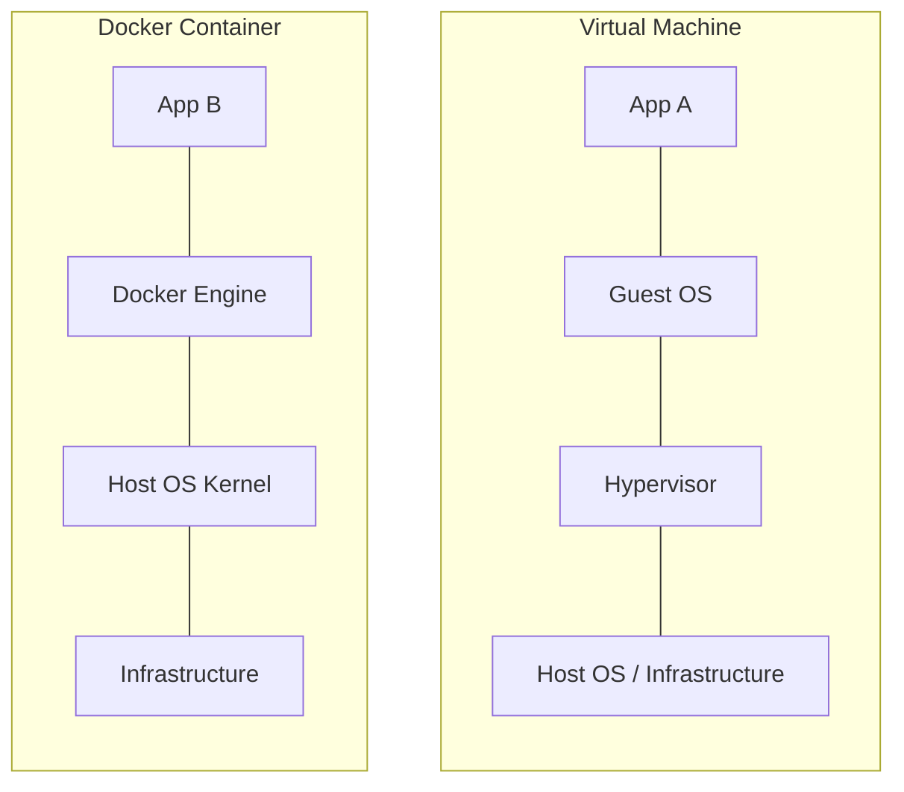

도커는 인프라 환경에 구애받지 않고 일관된 실행 환경을 보장하는 것을 목적으로, 애플리케이션을 컨테이너라는 표준화된 유닛으로 패키징하여 개발, 배포, 실행을 자동화하는 오픈소스 플랫폼이다.

## 도커가 해결하는 핵심 문제

소프트웨어 배포 과정에서 발생하는 다양한 환경적 제약 사항을 해결하고 있다.

- 개발, 테스트, 운영 서버 간의 라이브러리 버전 및 OS 설정 차이로 발생하는 환경 불일치 문제를 통합 패키징을 통해 해소
- 애플리케이션과 그 실행 환경을 이미지화하여 인프라 구축 시간을 단축하고 서비스의 신속한 스케일 아웃 지원
- 각 서비스를 독립적인 컨테이너로 분리하여 마이크로서비스 아키텍처(MSA)를 구현하고 관리하는 데 최적화된 구조 제공

## 컨테이너와 가상 머신의 비교

가상화의 주체가 무엇인지에 따라 컨테이너와 가상 머신(VM)은 구조적 차이를 보인다.

### 기술적 차이 및 영향

가상 머신과 컨테이너의 기술적 차이는 인프라의 효율성과 운영 방식에 직접적인 영향을 미친다.

| 비교 항목  |     가상 머신(VM)     |  도커 컨테이너(Container)   |
|:------:|:-----------------:|:---------------------:|
| 가상화 수준 |  하드웨어 수준(HW 가상화)  |    운영체제 수준(OS 가상화)    |
| 커널 공유  | 독립적인 게스트 OS 커널 사용 |     호스트 OS 커널 공유      |
| 자원 효율  | OS 실행을 위한 오버헤드 큼  | 필요한 프로세스만 실행하여 매우 효율적 |
| 시작 속도  |    OS 부팅 시간 필요    |      프로세스 시작 시간       |
|  보안 성  |  하드웨어 격리로 보안성 높음  |  커널 공유로 인해 보안 설정 필요   |

- 아키텍처 구조적 차이
    - 가상 머신은 각 VM마다 커널을 포함한 전체 OS를 실행해야 하므로 시스템 오버헤드가 크고 부팅 속도가 느림
    - 컨테이너는 커널을 공유하기 때문에 별도의 OS 부팅 과정이 없으며 실행 속도가 수 초 내외로 매우 빠름
    - 컨테이너는 게스트 OS 라이브러리가 제외되어 용량이 작고 리소스 할당이 유연하여 고밀도 배포에 유리
- 격리 수준 및 보안 성능
    - 가상 머신은 하드웨어 수준에서 격리되므로 하나의 VM이 침해당해도 다른 VM이나 호스트에 미치는 영향이 적어 보안성이 상대적으로 높음
    - 컨테이너는 OS 커널을 공유하기 때문에 커널 취약점을 통한 권한 탈취 발생 시 호스트 전체에 위협이 될 수 있어 보안 설정 필요
